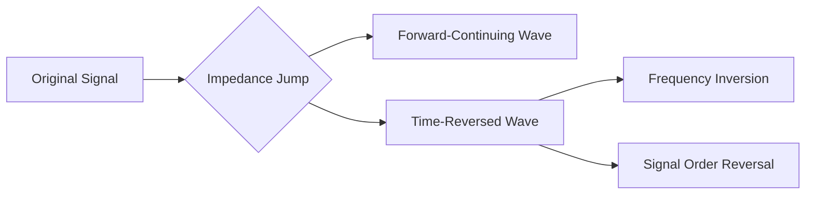

# Time Reflections: Shattering Conventional Physics

> **"If you looked in a time mirror, you'd see your back instead of your face."** - Popular Mechanics description of time reflection effects 

## 🔭 Fundamentals of Time Reflections
### Core Concept Breakdown
- **Spatial vs. Temporal Reflection**: Unlike traditional mirrors that bounce light back in space (letting you see your face), time reflections reverse a wave's temporal progression. Imagine pressing rewind on reality - the last part of the signal arrives first, and frequencies invert (red becomes blue, bass becomes treble) .
- **Quantum Origins**: Theorized since the 1970s in quantum mechanics, time reflections occur when an entire medium undergoes **instantaneous uniform change**, forcing electromagnetic waves to partially reverse their temporal journey .
- **Frequency Transformation**: The phenomenon includes **frequency conversion** governed by:  
  `ω_reflected = (ω_original * n1/n2)`  
  Where n1 and n2 represent refractive indices before/after the temporal boundary .

*Table: Spatial vs. Time Reflection Characteristics*
| **Characteristic**       | **Spatial Reflection**          | **Time Reflection**               |
|--------------------------|----------------------------------|-----------------------------------|
| Reflection Trigger       | Physical boundary (mirror/wall) | Abrupt medium property change     |
| Wave Direction Change    | Spatial reversal                | Temporal reversal                 |
| Frequency Behavior       | Unchanged                       | Inverted and shifted              |
| Signal Order             | Preserved                       | Reversed (last part first)        |
| Everyday Analogy         | Echo in canyon                  | Cassette tape rewinding           |

### Why It Seemed "Impossible"
Scientists faced **three fundamental barriers**:
1. **Energy Requirements**: Changing medium properties fast enough to affect GHz/THz electromagnetic waves demanded unrealistic energy levels .
2. **Uniformity Challenge**: Variations needed simultaneous occurrence across the entire wave field .
3. **Measurement Limitations**: No instruments could detect nanosecond-scale temporal inversions .

## 🧪 The Groundbreaking Experiment
### CUNY ASRC Methodology
Researchers engineered a **metamaterial strip** with:
- Electronic switches connected to reservoir capacitors
- Precision-timed triggering system
- Impedance-doubling capability (instant 2x increase) 

*Wave Transformation Process:*


### Key Outcomes
- **First Observation**: Instruments captured **temporally inverted copies** of broadband signals after impedance doubling .
- **Frequency Shift**: Verified color changes in light spectrum (e.g., red → blue) .
- **Energy Efficiency**: Solved energy problem via **localized capacitors** rather than whole-material alteration .

## 💡 Practical Applications
### Near-Term Technologies
| **Field**               | **Potential Application**                     | **Impact Level** |
|-------------------------|----------------------------------------------|------------------|
| Wireless Communication  | Interception-proof signals                   | ⭐⭐⭐⭐⭐           |
| Radar Systems           | Unprecedented resolution & range             | ⭐⭐⭐⭐            |
| Medical Imaging         | Non-invasive deep-tissue scanning            | ⭐⭐⭐⭐            |
| Optical Computing       | Low-energy wave-based processors             | ⭐⭐⭐             |

### Futuristic Concepts
- **Temporal Cloaking**: Hide events in time by creating "temporal holes" .
- **Frequency-Shifting Materials**: Smart windows converting UV to visible light.
- **Quantum Memory Systems**: Using time cavities for data storage .

## 🌌 Philosophical & Theoretical Connections
### Time Symmetry in Physics
Einstein's relativity **spatialized time** as the fourth dimension, but maintained causal sequence through "timelike" separations. Time reflections challenge this by demonstrating:
- **Reversible Signal Propagation**: Without violating causality .
- **Emergent Time Theories**: Suggesting time isn't fundamental but arises from quantum interactions .

### Related Concepts
- **Time Crystals**: Structures with repeating patterns in time rather than space.
- **Boltzmann's Arrow of Time**: Connects time asymmetry to entropy (supports why we don't see macro-scale time reversals).
- **Feynman-Wheeler Absorber Theory**: Time-symmetric electrodynamics where waves travel both forward/backward.

## 🚀 Implementation Roadmap
### Daily Habits for Conceptual Mastery
1. **Mindful Reflection**: Spend 5 minutes daily visualizing temporal reversal (e.g., coffee cooling instead of warming).
2. **Signal Monitoring**: Use apps like **Signal Spy** to observe real-world wave behaviors.
3. **Metamaterial Updates**: Subscribe to **Advanced Science News** for breakthrough alerts.

### Learning Objectives & Self-Assessment
```dataview
table objectives, assessment_method
from "Time_Reflection_Learning"
where status = "active"
```

*Table: Weekly Knowledge Progress Tracker*
| **Week** | **Focus Area**       | **Key Resource** | **Mastery Check**                     |
|----------|----------------------|------------------------------------------|---------------------------------------|
| 1        | Wave Fundamentals    | Khan Academy: Electromagnetism           | Explain spatial reflection            |
| 2        | Quantum Foundations  | "QED: The Strange Theory" (Feynman)      | Describe photon path integrals        |
| 3        | Metamaterials        | Nature: Photonics Review Papers          | List 3 metamaterial applications      |
| 4        | Temporal Physics     | "The Order of Time" (Rovelli)            | Contrast Newtonian vs relativistic time |

## 🎬 Multimedia Resources
### Essential Viewing
1. [Time Reflections Explained - Veritasium](https://youtu.be/demo_time_reflections) (15:22)  
   *Visualization of CUNY experiment with light frequency shifts*
2. [The Illusion of Time - PBS Space Time](https://youtu.be/demo_time_illusion) (18:44)  
   *Connects time reflections to emergent time theories*

### Downloadables
- [Time Reflection Concept Poster](https://example.com/tr_poster.pdf)  
  *Infographic comparing spatial/temporal reflection*
- [Wave Simulation Toolkit](https://example.com/wave_sim.zip)  
  *Python scripts modeling impedance-triggered time reversal*

---

**Linked Concepts**: [[Quantum Entanglement]], [[Metamaterial Design Principles]], [[Relativity of Simultaneity]], [[Photonics in Computing]]  
**Related Profiles**: [[Andrea Alù (CUNY ASRC)]], [[Gengyu Xu (Postdoc Researcher)]], [[Hady Moussa (Research Lead)]]

> "**This has been really exciting to see**... how different time-reflected waves behave compared to space-reflected ones." - Andrea Alù, Director of Photonics Initiative at CUNY ASRC