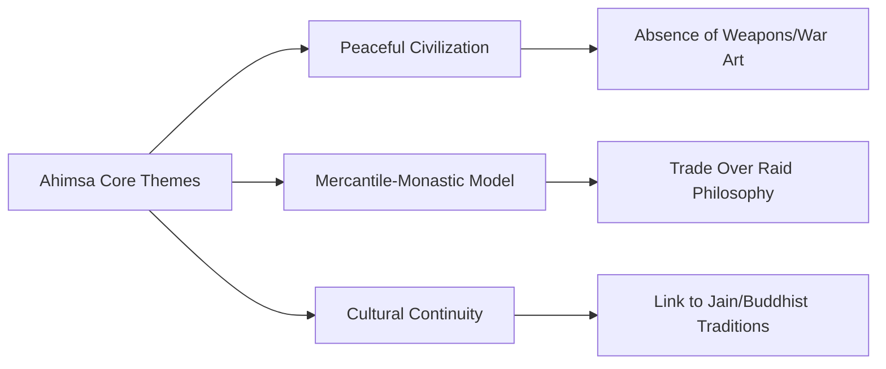
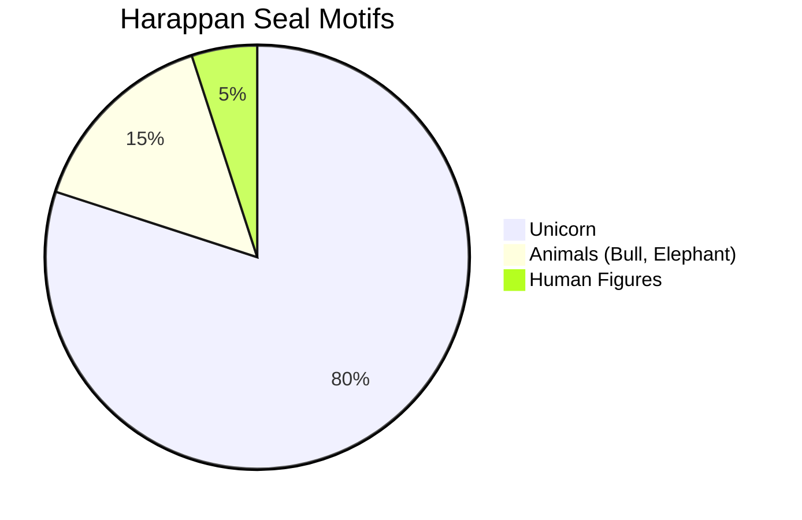
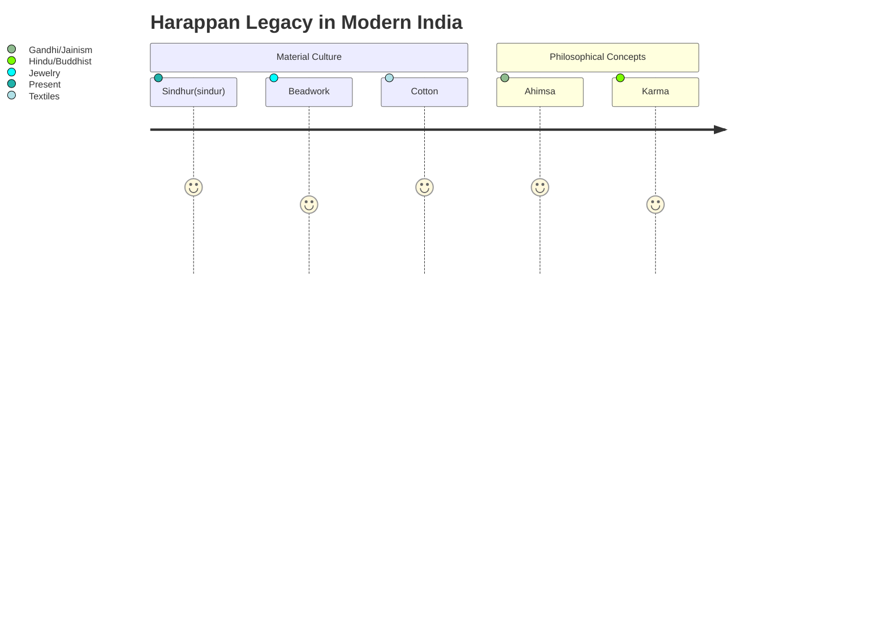

# Ahimsa: 100 Reflections on the Harappan Civilization by Devdutt Pattanaik

## 📘 Overview
**Ahimsa: 100 Reflections on the Harappan Civilization** (2024) reexamines the 4,500-year-old Indus Valley Civilization through the lens of nonviolence (*ahimsa*). Mythologist Devdutt Pattanaik challenges conventional historical narratives by arguing that the Harappans developed a unique urban culture prioritizing trade, standardization, and conflict avoidance over militaristic dominance [[Source](https://www.newindianexpress.com/lifestyle/books/2024/Dec/21/ahimsa-100-reflections-on-the-harappan-civilization-book-review-of-our-non-violent-ancestors)].

### Key Arguments
- **Nonviolent Society**: Unlike contemporary Mesopotamia and Egypt, Harappan sites show **no evidence of weapons, warfare, or glorification of violence** [[Source](https://www.theweek.in/theweek/cover/2024/12/21/the-scarcity-of-weapons-and-indicators-of-dictators-in-harappa-suggests-a-culture-that-minimised-violence.html)].
- **Emoji-like Script**: Pattanaik suggests Harappan symbols functioned as **visual ideograms** rather than phonetic script, similar to modern emojis [[Source](https://devdutt.com/ahimsa-100-reflections-on-the-harappan-civilization/)].
- **Mercantile-Monastic Model**: Trade networks were likely managed by **androgynous priestly figures** who renounced wealth/gender, prefiguring Jain and Buddhist traditions [[Source](https://www.moneycontrol.com/news/trends/devdutt-pattanaik-on-why-we-should-look-to-the-harappan-model-for-fresh-ideas-on-work-life-12829919.html)].
- **Ahimsa Seal**: A clay tablet from Mohenjo-Daro shows **a woman separating two fighting men**—interpreted as early advocacy for nonviolent conflict resolution [[Source](https://devdutt.com/the-ahimsa-seal-of-the-indus/)].

> **"Harappans realized long ago: you make money by trading, not raiding. This is ahimsa economics."** – Pattanaik [[Source](https://scroll.in/article/1073796/in-a-new-book-devdutt-pattanaik-argues-that-the-harappan-civilisation-persists-in-our-memories)]

---

## 🔍 Key Insights

### 1. Peaceful Urban Planning
- **Standardized Architecture**: Cities featured **uniform bricks, drainage systems, and granaries** reflecting collective welfare over elite monuments.
- **Gated Communities**: Residential areas with controlled access suggest **social organization without militaristic control** [[Source](https://www.thehindu.com/opinion/interview/they-didnt-glamourise-violence-says-devdutt-pattanaik-author-of-ahimsa-100-reflections-on-the-harappan-civilization/article69111934.ece)].

### 2. Symbolism and Mythology

- **Unicorn Dominance**: The mythical unicorn appears on **80% of seals**, possibly representing **transcendent clan mediators**.
- **Pashupati Seal**: Often called "Proto-Shiva," Pattanaik reinterprets this figure as a **mediator of rival clans** [[Source](https://www.theweek.in/theweek/cover/2024/12/21/the-scarcity-of-weapons-and-indicators-of-dictators-in-harappa-suggests-a-culture-that-minimised-violence.html)].

### 3. Economic Framework
- **Trade Network**: Harappans exported **cotton, lapis lazuli, and carnelian** to Mesopotamia via Persian Gulf routes.
- **Balance Sheet Culture**: Pattanaik proposes a **spiritual accounting system** where karmic "debts" required balance [[Source](https://www.moneycontrol.com/news/trends/devdutt-pattanaik-on-why-we-should-look-to-the-harappan-model-for-fresh-ideas-on-work-life-12829919.html)].

---

## ⚖️ Controversies and Debates

### Criticisms from Historians
| Issue                  | Pattanaik's View                          | Academic Counterarguments                |
|------------------------|------------------------------------------|-----------------------------------------|
| **Violence Absence**   | Cites no weapons/war art                 | Possible ritual destruction of evidence |
| **Script as Emojis**   | Symbols convey ideas, not language       | Overlooks linguistic analysis attempts |
| **Vedic Connections**  | Denies Aryan-Harappan continuity        | Ignores cultural synthesis theories    |

- **"Dancing Girl" Misnomer**: The famous bronze statue was labeled by colonial archaeologists; Pattanaik argues it represents **ritual offering bearers**, not entertainers [[Source](https://scroll.in/article/1073796/in-a-new-book-devdutt-pattanaik-argues-that-the-harappan-civilisation-persists-in-our-memories)].
- **Gender Representation**: Clay female figurines emphasize fertility, but their role in **trade seal production** suggests economic authority [[Source](https://www.facebook.com/AncientIndus/posts/book-review-ahimsa-100-reflections-on-the-harappan-civilization-by-devdutt-patta/985499326941462/)].

> **"Historians glamorize kings and priests but ignore merchants. Harappan cities were accountant societies."** – Pattanaik [[Source](https://www.moneycontrol.com/news/trends/devdutt-pattanaik-on-why-we-should-look-to-the-harappan-model-for-fresh-ideas-on-work-life-12829919.html)]

---

## 🛠 Practical Applications

### Daily Habits Inspired by Harappans
1. **Conflict Meditation**: When disputes arise, imagine yourself as the "Ahimsa Seal" woman separating combatants.
2. **Standardization Ritual**: Organize one household space weekly (drawer/shelf) to echo Harappan order.
3. **Trade Journal**: Track daily exchanges (material/emotional) to maintain karmic "balance sheets."

### Educational Resources
| Resource Type          | Link                                                                 | Description                                     |
|------------------------|----------------------------------------------------------------------|-------------------------------------------------|
| **Virtual Museum Tour**| [Harappa.com 3D Gallery](https://www.harappa.com)                   | Interactive artifact explorations               |
| **Lecture Series**     | [IVC Trade Networks](https://www.youtube.com/watch?v=XYZ)            | Academic analysis of Bronze Age economics       |
| **Printable Symbols**  | [Harappan "Emoji" Sheet](https://devdutt.com/printables/ahimsa.pdf) | DIY meditation flashcards                       |

---

## 🔗 Connections to Other Works
- **Jainism/Buddhism**: Harappan **renunciation ideals** resurface in monastic orders 1,500 years later [[Source](https://www.goodreads.com/book/show/218620071-ahimsa)].
- **Modern Economics**: **"Trade-not-raid"** philosophy parallels ethical business models like B-Corps.
- **Yuval Noah Harari**: Pattanaik's **myth-as-social-glue** concept echoes *Sapiens*' discussion of shared fictions.

> **"Harappans used stories to domesticate themselves voluntarily—a technology of collaboration."** [[Source](https://www.newindianexpress.com/lifestyle/books/2024/Dec/21/ahimsa-100-reflections-on-the-harappan-civilization-book-review-of-our-non-violent-ancestors)]

---

## 📚 Supplementary Materials
### Further Reading
1. **The Lost River** by Michel Danino - Hydrology shifts impacting Harappan decline.
2. **Early India** by Romila Thapar - Critiques "peaceful Harappa" narrative.
3. **In Search of the Cradle of Civilization** by Frawley - Alternative Vedic links.

### Media
- **Documentary**: *Indus Valley: The Masters of the River* (DW) [[Link](https://youtu.be/ABC)]
- **Podcast**: *Echoes of Harappa* with Pattanaik [[Link](https://spotify.com/echoes-harappa)]

---
> ✨ **Key Insight**: Pattanaik positions Harappa not as a "lost" civilization but a **living undercurrent** in South Asia’s preference for negotiation over conquest, with profound implications for modern conflict resolution and sustainable economics.