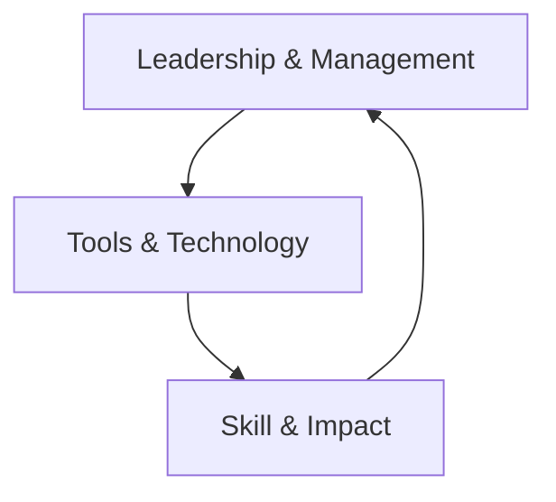

# The Long-Distance Leader: Rules for Remarkable Remote Leadership

> **Leadership Principle**  
> *"Think leadership first, location second."* 

## 🔍 Core Frameworks and Models
### 🧩 The Three-O Leadership Model


1.  **Outcomes**  
    - Focus on **goals and results** rather than activity monitoring
    - Set clear expectations using SMART criteria
    - Implement "Results-Only Work Environment" principles 

2.  **Others**  
    - Build trust through the **Trust Triangle**:  
      ```mermaid
      graph LR
      A[Common Purpose] --> B[Competence]
      B --> C[Motives]
      C --> A
      ```
    - Practice "conscious and intentional" communication
    - Adapt to individual work styles using behavioral assessments

3.  **Ourselves**  
    - Establish boundaries using the **Power Hour Framework**:
    
| Time Block | Focus Area | Example Activities |
|------------|------------|---------------------|
| First 20m | Planning | Prioritize daily outcomes |
| Next 20m | People | Check-ins, recognition |
| Last 20m | Personal Growth | Skill development |

### ⚙️ Remote Leadership Model
*Technology integration framework:*


- **Key Principle**: "Technology as tool, not distraction" 
- **Tool Selection Matrix**: 

| Communication Purpose | Recommended Tools |
|------------------------|-------------------|
| Complex discussions | Video conferencing |
| Quick updates | Instant messaging |
| Document collaboration | Cloud platforms |

## 💡 Key Rules and Applications
### 🎯 Essential Leadership Rules
1.  **Rule 19**: "Seek feedback deliberately" through:
    - Structured 360° assessments
    - "Feedback Fridays" ritual
    - Anonymous pulse surveys 

2.  **Rule 7**: "Coach effectively across distance":
    - Virtual GROW model (Goals, Reality, Options, Will)
    - 5:1 positive-to-corrective feedback ratio
    - Asynchronous video coaching

3.  **Hybrid Meeting Protocol**:
    - "Camera-on-first" policy
    - Dedicated chat moderator
    - Post-meeting action log 

### 🔧 Practical Implementation Tools
- **Virtual Water Cooler Template**: [Download PDF Guide](https://remoteworkmatters.com/wp-content/uploads/2021/03/Virtual-Connection-Calendar.pdf)
- **Trust-Building Checklist**: 
    1.  Public delegation of meaningful tasks
    2.  "No-surprise" feedback policy
    3.  Virtual show-and-tell sessions
- **Remote Productivity Assessment**: [Self-Assessment Tool](https://kevineikenberry.com/wp-content/uploads/2021/08/LDL_Assessment.pdf)

## 🌐 Hybrid Work Strategies
### 🐴 The "Mule Principle"
> "Hybrid isn't just smushing office/remote together but creating a *third distinct entity*"

- **Strategic Hybrid Design**:  
  ```mermaid
  graph LR
  D[Defined Synchronous Time] --> E[Intentional Async Work]
  E --> F[Tool-Specific Protocols]
  F --> D
  ```

- **Hybrid Meeting Balance**:  

| Office-Centric | True Hybrid |  
|----------------|-------------|
| In-person prioritized | Equal participation |
| "Zoom on wheels" setup | Virtual facilitator |  

## 🔗 Connected Concepts
### 📚 Complementary Leadership Frameworks
1.  **Radical Candor**:  
    - Combines with "Others" component
    - Virtual implementation strategies

2.  **Dare to Lead**:  
    - Trust-building exercises for remote teams
    - Vulnerability in virtual settings

3.  **Deep Work**:  
    - Protects "Ourselves" through focused time blocks
    - Async communication protocols

### 🧠 Cognitive Connection Points
- **Proximity Bias Mitigation**:  
  "Remote-first" decision making 
- **Digital Body Language**:  
  - Response time as engagement signal
  - Emoji as tone indicators
- **Construal Level Theory**:  
  Abstract vs concrete communication balance

## 📅 Implementation Roadmap
### 🔁 30-Day Remote Leadership Challenge
| Week | Focus | Daily Habit | Measurement |
|------|-------|-------------|-------------|
| 1 | Outcomes | Morning outcome broadcast | Clarity rating |
| 2 | Others | Relationship calls | Trust metrics |
| 3 | Ourselves | No-email power hour | Focus time |
| 4 | Integration | Tech audit | Efficiency gains | 

### 🔍 Assessment Tools
1.  **Remote Leadership Scorecard**: [Download Template](https://remoteworkmatters.com/tools/scorecard)
    - 12 leadership dimensions
    - Team comparison analysis
2.  **Communication Audit Process**:  
    ```mermaid
    graph TB
    A[Map Current Tools] --> B[Identify Overlaps]
    B --> C[Survey Pain Points]
    C --> D[Create Protocol Matrix]
    ```

## 🎥 Multimedia Resources
### 📹 Essential Video Series
- [The Long-Distance Leader Workshop](https://www.youtube.com/watch?v=Gg6_yIeaA2c)
- [Hybrid Meeting Masterclass](https://remoteworkmatters.com/masterclass)
- [Trust-Building Activities](https://www.youtube.com/playlist?list=PLkZ2u7U7VvcqQQF3kKdCkYbqj)

### 📚 Supplementary Readings
- **Free Chapter**: [The Three-O Model](https://longdistanceleader.com/chapter-download/)
- **Toolkit**: [Remote Leadership Field Guide](https://kevineikenberry.com/wp-content/uploads/2022/08/Remote-Leadership-Field-Guide.pdf)

## 💎 Conclusion: Leadership Beyond Location
> "The principles of leadership don't change with distance, but the techniques must" 

Enduring framework elements:
1.  **Intentional Hybrid Design**
2.  **Technology Fluency**
3.  **Connection Rituals**
4.  **Outcome Focus**

**Related Notes**: [[Remote Team Rituals]], [[Hybrid Meeting Protocols]], [[Virtual Feedback Models]]