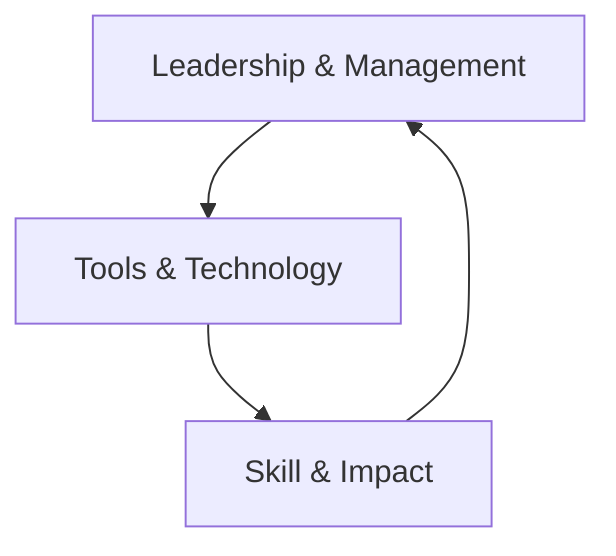

---
tags:  
- leadership/remote  
- leadership/hybrid  
- management/remote-work  
- book-summary  
aliases: Long-Distance Leadership Principles, Remote Leadership Framework  
created: [2025-07-08](tel:20250708)  
modified: [2025-07-08](tel:20250708)  
author: Kevin Eikenberry, Wayne Turmel  
publisher: Berrett-Koehler Publishers  
year: 2018 (2nd ed. 2024)  
url: [https://kevineikenberry.com/products/the-long-distance-leader](https://kevineikenberry.com/products/the-long-distance-leader)/  
---  

# The Long-Distance Leader: Rules for Remarkable Remote Leadership  
> **Leadership Principle**   
> "Think leadership first, location second."  
## 🔍 Core Frameworks and Models  
### 🧩 The Three-O Leadership Model  
)  
1.  **Outcomes**   
    - Focus on **goals and results** rather than activity monitoring  
    - Set clear expectations using SMART criteria  
    - Implement "Results-Only Work Environment" (ROWE) principles  
2.  **Others**   
    - Build trust through the **Trust Triangle**:   
      ```mermaid  
      graph LR  
      A[Common Purpose] --> B[Competence]  
      B --> C[Motives]  
      C --> A  
      ```  
    - Practice "conscious and intentional" communication  
    - Adapt to individual work styles using assessments (DISC, Myers-Briggs)  
3.  **Ourselves**   
    - Establish boundaries using the **Power Hour Framework**:   
Time Block  
Focus Area  
Example Activities  
      |------------|------------|---------------------  

First 20m  
Planning  
Prioritize daily outcomes  
Next 20m  
People  
Check-ins, recognition  
Last 20m  
Personal Growth  
Skill development  
### ⚙️ Remote Leadership Model  
Technology integration framework:  

- **Key Principle**: "Technology as tool, not distraction"  
- **Tool Selection Matrix**:  
Communication Purpose  
Recommended Tools  
Avoid When  
|------------------------|-------------------|------------  

Complex discussions  
Video conferencing (Zoom, Teams)  
Text-based only  
Quick updates  
Instant messaging (Slack)  
Multistep processes  
Document collaboration  
Cloud platforms (Google Docs)  
Version control issues  
## 💡 Key Rules and Applications  
### 🎯 Essential Leadership Rules  
1.  **Rule 19**: "Seek feedback deliberately" through:  
    - Structured 360° assessments  
    - "Feedback Fridays" ritual  
    - Anonymous pulse surveys  
2.  **Rule 7**: "Coach effectively across distance":  
    - Virtual GROW model (Goals, Reality, Options, Will)  
    - 5:1 positive-to-corrective feedback ratio  
    - Asynchronous video coaching via Loom  
3.  **Hybrid Meeting Protocol**:  
    - "Camera-on-first" policy for all participants  
    - Dedicated chat moderator  
    - Post-meeting action log in shared drive  
### 🔧 Practical Implementation Tools  
- **Virtual Water Cooler Template**: [Download PDF Guide]([https://remoteworkmatters.com/wp-content/uploads/2021/03/Virtual-Connection-Calendar.pdf](https://remoteworkmatters.com/wp-content/uploads/2021/03/Virtual-Connection-Calendar.pdf))  
- **Trust-Building Checklist**:  
    1.  Public delegation of meaningful tasks  
    2.  "No-surprise" feedback policy  
    3.  Virtual show-and-tell sessions  
- **Remote Productivity Assessment**: [Take Free Self-Assessment]([https://kevineikenberry.com/wp-content/uploads/2021/08/LDL_Assessment.pdf](https://kevineikenberry.com/wp-content/uploads/2021/08/LDL_Assessment.pdf))  
## 🌐 Hybrid Work Strategies  
### 🐴 The "Mule Principle"  
> "Hybrid isn't just smushing office/remote together but creating a third distinct entity with unique characteristics"  
- **Strategic Hybrid Design Elements**:   
  ```mermaid  
  graph LR  
  D[Defined Synchronous Time] --> E[Intentional Async Work]  
  E --> F[Tool-Specific Protocols]  
  F --> D  
  ```  
- **Hybrid Meeting Balance Sheet**:   
Office-Centric Approach  
True Hybrid Approach

|-------------------------|-----------------------  

In-person prioritized  
Equal participation tech (Owl Labs)

"Zoom on wheels" setup  
Dedicated virtual facilitator

Side conversations  
Structured input rounds

## 🔗 Connected Concepts  
### 📚 Complementary Leadership Frameworks  
1.  **Radical Candor** (Kim Scott):   
    - Combines with "Others" component through caring/challenging balance  
    - Virtual implementation guide: [YouTube Workshop]([https://www.youtube.com/watch?v=4yODalLQ2l4](https://www.youtube.com/watch?v=4yODalLQ2l4))  
2.  **Dare to Lead** (Brené Brown):   
    - Trust-building exercises applicable to remote teams  
    - Vulnerability in virtual settings ("Camera-on" = psychological safety)  
3.  **Deep Work** (Cal Newport):   
    - Protects "Ourselves" through focused time blocks  
    - Async communication protocols  
### 🧠 Cognitive Connection Points  
- **Proximity Bias Mitigation**:   
  Use "remote-first" decision making even in hybrid settings  
- **Digital Body Language** (Erica Dhawan):   
  - Email response time = engagement signal  
  - Emoji as tone indicators  
- **Construal Level Theory**:   
  Abstract thinking (vision) vs concrete tasks - balance through communication rhythm  
## 📅 Implementation Roadmap  
### 🔁 30-Day Remote Leadership Challenge  
Week  
Focus Area  
Daily Habit  
Measurement  
|------|------------|-------------|-------------  
  

1  
Outcomes  
Morning outcome broadcast via Teams  
Clarity rating (1-5)  
2  
Others  
1 intentional relationship call  
Trust metric tracking  
3  
Ourselves  
No-email power hour  
Focus time report  
4  
Integration  
Tech audit + 1 new skill  
Efficiency gain tracking  
### 🔍 Assessment Tools  
1.  **Remote Leadership Scorecard**: [Download Excel Template]([https://remoteworkmatters.com/tools/scorecard](https://remoteworkmatters.com/tools/scorecard))  
    - 12 dimensions scored 1-10  
    - Team comparison analysis  
2.  **Communication Audit Process**:   
    ```mermaid  
    graph TB  
    A[Map Current Tools] --> B[Identify Overlaps]  
    B --> C[Survey Pain Points]  
    C --> D[Create Protocol Matrix]  
    ```  
3.  **Virtual Presence Index**: Measures visibility/accessibility balance  
## 🎥 Multimedia Resources  
### 📹 Essential Video Series  
- [The Long-Distance Leader Workshop]([https://www.youtube.com/watch?v=Gg6_yIeaA2c](https://www.youtube.com/watch?v=Gg6_yIeaA2c)) (Official Book Companion)  
- [Hybrid Meeting Masterclass]([https://remoteworkmatters.com/masterclass](https://remoteworkmatters.com/masterclass)) (Remote Leadership Institute)  
- [Trust-Building Virtual Activities]([https://www.youtube.com/playlist?list=PLkZ2u7U7VvcqQQF3kKdCkYbqj](https://www.youtube.com/playlist?list=PLkZ2u7U7VvcqQQF3kKdCkYbqj)) (Gallup)  
### 📚 Supplementary Readings  
- **Free Chapter Download**: [Chapter 5: The Three-O Model]([https://longdistanceleader.com/chapter-download](https://longdistanceleader.com/chapter-download)/)  
- **Harvard Business Review**: [Virtual Teams That Work]([https://hbr.org/2023/09/virtual-teams-that-work](https://hbr.org/2023/09/virtual-teams-that-work))  
- **Toolkit**: [Remote Leadership Field Guide]([https://kevineikenberry.com/wp-content/uploads/2022/08/Remote-Leadership-Field-Guide.pdf](https://kevineikenberry.com/wp-content/uploads/2022/08/Remote-Leadership-Field-Guide.pdf))  
## 💎 Conclusion: Leadership Beyond Location  
> "The principles of leadership don't change with distance, but the techniques must"  
The enduring framework adapts to evolving workplaces through:  
1.  **Intentional Hybrid Design** (beyond negotiated settlements)  
2.  **Technology Fluency** as core leadership competency  
3.  **Connection Rituals** that combat proximity bias  
4.  **Outcome Focus** as trust-building mechanism  
**Related Notes**: [[Remote Team Rituals]], [[Hybrid Meeting Protocols]], [[Virtual Feedback Models]]  
```  
> **Key Insight**   
> Remarkable remote leadership emerges when we stop trying to replicate office dynamics digitally and instead redesign work around human needs and technological possibilities.