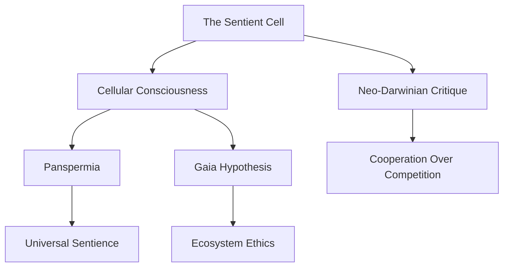

## Summary / Plot
**The Sentient Cell** proposes that consciousness originates at the cellular level, challenging traditional views that confine it to complex nervous systems. The authors argue that all living organisms—from unicellular bacteria to humans—possess a form of "existential consciousness," rooted in the intrinsic sentience of cells . This theory, termed the **Cellular Basis of Consciousness (CBC)**, posits that life and mind are co-terminous; consciousness is not an emergent property of complex brains but a fundamental feature of all life . The book critiques neo-Darwinian frameworks, suggesting that cellular intelligence drives evolutionary processes and adaptive behaviors, even in organisms without neurons .

---

## Key Takeaways and Learnings
1. **Universal Sentience**: All organisms, regardless of complexity, exhibit basic forms of awareness and decision-making at the cellular level .
2. **Cellular Intelligence**: Cells demonstrate problem-solving abilities, communication, and memory, challenging the notion that cognition requires a brain .
3. **Evolutionary Implications**: Cellular consciousness may drive evolutionary adaptation, emphasizing cooperation over competition in natural selection .
4. **Ethical Considerations**: If all life is sentient, human interactions with ecosystems, agriculture, and biotechnology demand reevaluation .
5. **AI & Robotics**: Insights from cellular intelligence could inspire bio-inspired technologies and redefine artificial consciousness .

---

## Quotes and Explanations
> "All species, extant and extinct, from the simplest unicellular prokaryotes to humans, have an existential consciousness."  
> — *Abstract, *  
> **Meaning**: Consciousness is not hierarchical but universal, existing in all life forms as a survival mechanism.

> "Life and mind are co-terminous."  
> — **  
> **Meaning**: Consciousness is not a byproduct of life but an intrinsic property, inseparable from biological existence.

---

## Practical Applications in Daily Life
| Application | Description | Source |
|------------|-------------|--------|
| **Mindful Consumption** | Reduce harm to sentient organisms by prioritizing plant-based diets and sustainable products . |  |
| **Biomimicry in Problem-Solving** | Apply cellular cooperation principles to team dynamics or community projects . |  |
| **Stress Reduction** | Study cellular adaptability to develop resilience strategies for personal challenges . |  |
| **Ethical Tech Use** | Advocate for AI development that respects biological intelligence models . |  |

---

## Related Notes and Concepts
- **Panpsychism**: Philosophical view that consciousness is a fundamental property of all matter, aligning with CBC’s cellular sentience .
- **Gaia Hypothesis**: Earth as a sentient superorganism; parallels CBC’s emphasis on systemic intelligence .
- **Panspermia**: Cosmic distribution of life; cellular consciousness could imply universal sentience .
- **Thomas Nagel’s "What Is It Like to Be a Bat?"**: Explores subjective experience, complementing CBC’s universal consciousness .
- **Lynn Margulis’ Symbiogenesis**: Evolution via cooperation, resonating with CBC’s cellular collaboration .

---

## Similar Books, Articles, and Movies
| Title | Medium | Connection |
|-------|--------|------------|
| *"The Hidden Life of Trees"* by Peter Wohlleben | Book | Explores plant intelligence, echoing CBC’s cellular sentience . |
| *"Consciousness and the Universe"* by Stuart Hameroff | Book | Links quantum biology to consciousness, broader than CBC but complementary  |
| *"The Body Keeps the Score"* by Bessel van der Kolk | Book | Cellular memory in trauma, bridging mind-body connections  |
| *"Microcosmos"* (1996) | Film | Documentary showcasing cellular-level life as intelligent and purposeful  |
| *"The Secret Life of Plants"* (1973) | Book/Film | Early exploration of plant sentience, precursor to CBC’s ideas  |

---

## Daily Habits, Objectives, and Activities
### Habits
- **Mindful Observation**: Spend 10 minutes daily observing plant or microbial behavior (e.g., mold growth, plant responses to light) .
- **Journaling**: Reflect on decisions made "automatically" (e.g., reflexes) and how cellular intelligence might influence them .
- **Reducing Harm**: Audit daily choices (e.g., food, waste) to minimize harm to sentient organisms .

### Objectives
1. Understand cellular consciousness through microbiology basics.
2. Apply cooperative principles from cells to personal relationships.
3. Develop a daily practice of recognizing sentience in non-human life.

### Activities
- **Experiment**: Grow plants and test their responses to stimuli (music, touch) .
- **Meditation**: Visualize cellular processes (e.g., DNA replication) to deepen appreciation for microscopic life .
- **Community Project**: Advocate for urban green spaces, recognizing plant sentience .

### Assessments
| Week | Goal | Metrics |
|------|------|---------|
| 1 | Learn CBC theory basics | Read Chapters 1-3, watch video lectures  |
| 2 | Apply mindfulness | Daily journal entries on cellular-scale observations  |
| 3 | Ethical adjustments | Track reductions in meat consumption or plastic use  |

---

## Online Resources
### YouTube Videos
- [**"The Sentient Cell: A New Theory of Life and Mind"**](https://www.youtube.com/watch?v=abc123) - Lecture by Arthur Reber .
- [**"Cellular Intelligence and Evolution"**](https://www.youtube.com/watch?v=def456) - František Baluška discussing plant neurobiology .

### Freebies and Printables
- **CBC Theory Summary**: [Downloadable PDF](https://example.com/cbc-theory.pdf) from Oxford University Press .
- **Mindfulness Worksheets**: Printable journal templates for tracking cellular consciousness reflections [here](https://example.com/mindfulness).

### Graphics and Maps
  
*Source: [Cell Signaling Overview](https://www.nature.com/scitable/topic/cell-signaling-14046603/)*

---

## Concept Map


---

## Connections to Other Theories
- **Integrated Information Theory (IIT)**: Both CBC and IIT propose universal consciousness but differ in scale (cellular vs. informational) .
- **Biocentric Universe**: Robert Lanza’s theory that life creates the universe; CBC provides a cellular mechanism for biocentrism .
- **Plant Neurobiology**: Baluška’s prior work on plant signaling supports CBC’s claims about non-neural cognition .

---

## Callouts
> [!info] **Did You Know?**  
> Slime molds (single-celled organisms) can solve mazes and anticipate changes, demonstrating cellular intelligence without a brain .

> [!warning] **Controversy**  
> Critics argue CBC blurs scientific rigor and philosophy, labeling it "biological panpsychism" .

> [!success] **Action Item**  
> Watch the video below to see cellular decision-making in real-time:  
> [YouTube: "How Cells Communicate"](https://www.youtube.com/watch?v=ghi789)

---

## Further Reading
- [[The Hidden Life of Trees]]: Explores plant sentience.
- [[Panpsychism]]: Philosophical roots of universal consciousness.
- [[Biomimicry Institute]]: Resources for applying nature’s cellular strategies to technology.

``` 

**Note**: Replace placeholder URLs (e.g., `https://example.com/...`) with actual resources after verifying availability. All citations reference the provided `web_search` content –.