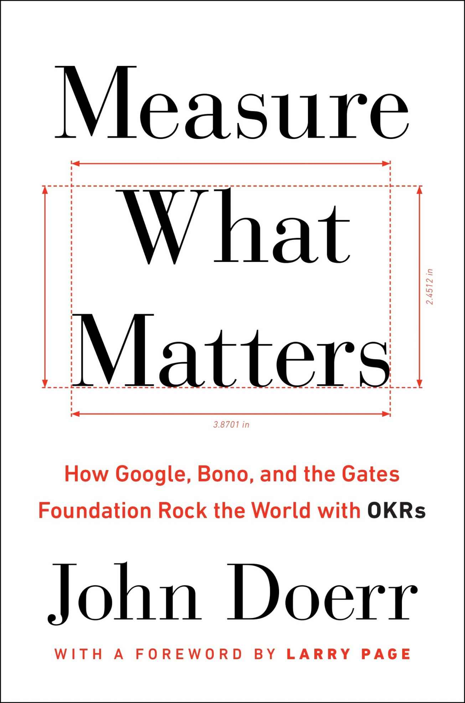

[]{#titlepage.xhtml}

<div>

```{=html}
<svg xmlns="http://www.w3.org/2000/svg" xmlns:xlink="http://www.w3.org/1999/xlink" version="1.1" width="100%" height="100%" viewbox="0 0 790 1194" preserveaspectratio="xMidYMid meet">
```
`<image width="790" height="1194" xlink:href="cover1.jpeg">`{=html}`</image>`{=html}
```{=html}
</svg>
```

</div>

[]{#text00000.html}

::: calibre2
[]{#text00000.html#_idParaDest-1 .calibre} []{#text00000.html#page_i
.calibre title="i"}

"*Measure What Matters* takes you behind the scenes for the creation of
Intel's powerful OKR system---one of Andy Grove's finest legacies."

---Gordon Moore, cofounder and former chairman of Intel

"*Measure What Matters* will transform your approach to setting goals
for yourself and your organization. Whether you are in a small start-up,
or large global company, John Doerr pushes every leader to think deeply
about creating a focused, purpose-driven business environment."

---Mellody Hobson, president of Ariel Investments

"John Doerr is a Silicon Valley legend. He explains how transparently
setting objectives and defining key results can align organizations and
motivate high performance."

---Jonathan Levin, dean of Stanford Graduate School of Business

"*Measure What Matters* is a gift to every leader or entrepreneur who
wants a more transparent, accountable, and effective team. It encourages
the kind of big, bold bets that can transform an organization."

---John Chambers, executive chairman of Cisco

"In addition to being a terrific personal history of tech in Silicon
Valley, *Measure What Matters* is an essential handbook for both small
and large organizations; the methods described will definitely drive
great execution."

---Diane Greene, founder and CEO of VMware, Alphabet board member, and
CEO of Google []{#text00000.html#page_ii .calibre title="ii"} Cloud
:::

[]{#text00001.html}

::: calibre2
[]{#text00001.html#_idParaDest-2 .calibre}

::: h
[]{#text00001.html#page_iii .calibre title="iii"} {.h1}
:::
:::

[]{#text00002.html}

::: calibre2
[]{#text00002.html#_idParaDest-3 .calibre} []{#text00002.html#page_iv
.calibre title="iv"}

{#image_page_iv .h2em}

Portfolio/Penguin

An imprint of Penguin Random House LLC

375 Hudson Street

New York, New York 10014

{#image_page_iv_1 .h2em}

Copyright © 2018 by Bennett Group, LLC

Penguin supports copyright. Copyright fuels creativity, encourages
diverse voices, promotes free speech, and creates a vibrant culture.
Thank you for buying an authorized edition of this book and for
complying with copyright laws by not reproducing, scanning, or
distributing any part of it in any form without permission. You are
supporting writers and allowing Penguin to continue to publish books for
every reader.

Library of Congress Cataloging-in-Publication Data

Names: Doerr, John E., author.

Title: Measure what matters : how Google, Bono, and the Gates Foundation
rock the world with OKRs / John Doerr.

Description: New York : Portfolio/Penguin, \[2018\] \| Includes
bibliographical references.

Identifiers: LCCN 2018002727\| ISBN 9780525536222 (hardcover) \| ISBN
9780525536239 (epub)

Subjects: LCSH: Business planning. \| Performance. \| Goal (Psychology)
\| Organizational effectiveness.

Classification: LCC HD30.28 .D634 2018 \| DDC 658.4/012---dc23

LC record available at https://lccn.loc.gov/2018002727

While the author has made every effort to provide accurate telephone
numbers, Internet addresses, and other contact information at the time
of publication, neither the publisher nor the author assumes any
responsibility for errors, or for changes that occur after publication.
Further, the publisher does not have any control over and does not
assume any responsibility for author or third-party websites or their
content.
:::

Version_2

[]{#text00003.html}

::: calibre2
[]{#text00003.html#_idParaDest-4 .calibre} []{#text00003.html#page_v
.calibre title="v"}

For Ann, Mary, and Esther and the wonder of their unconditional
[]{#text00003.html#page_vi .calibre title="vi"} love
:::

[]{#text00004.html}

::: calibre2
# []{#text00004.html#page_vii .calibre title="vii"} CONTENTS {#text00004.html#_idParaDest-5 .x01-fm-head}

[[PRAISE FOR *MEASURE WHAT MATTERS*
]{.bbold}](#text00000.html#_idParaDest-1){.calibre}

[[TITLE PAGE]{.bbold}](#text00001.html#_idParaDest-2){.calibre}

[[COPYRIGHT]{.bbold}](#text00002.html#_idParaDest-3){.calibre}

[[DEDICATION]{.bbold}](#text00003.html#_idParaDest-4){.calibre}

[[FOREWORD ]{.bbold} Larry Page, Alphabet CEO and Google
Cofounder](#text00005.html#_idParaDest-6){.calibre}

[[PART ONE:]{.toc-pn} OKRs in
Action](#text00006.html#_idParaDest-7){.calibre}

[[1 ]{._1-fm-contents-cn-number} Google, Meet
OKRs](#text00007.html#_idParaDest-9){.calibre}

[How OKRs came to Google, and the superpowers they
convey.](#text00007.html#_idParaDest-9){.calibre6}

[[2 ]{._1-fm-contents-cn-number} The Father of
OKRs](#text00008.html#_idParaDest-11){.calibre}

[Andy Grove creates and inculcates a new way of structured goal
setting.](#text00008.html#_idParaDest-11){.calibre6}

[[3 ]{._1-fm-contents-cn-number} Operation Crush: An Intel
Story](#text00009.html#_idParaDest-13){.calibre}

[How OKRs won the microprocessor
wars.](#text00009.html#_idParaDest-13){.calibre6}

[[4 ]{._1-fm-contents-cn-number} Superpower #1: Focus and Commit to
Priorities](#text00010.html#_idParaDest-15){.calibre}

[OKRs help us choose what matters
most.](#text00010.html#_idParaDest-15){.calibre6}

[[5 ]{._1-fm-contents-cn-number} Focus: The Remind
Story](#text00011.html#_idParaDest-17){.calibre}

[Brett Kopf used OKRs to overcome attention deficit
disorder.](#text00011.html#_idParaDest-17){.calibre6}

[[6 ]{._1-fm-contents-cn-number} Commit: The Nuna
Story](#text00012.html#_idParaDest-19){.calibre}

[Jini Kim's personal commitment to transform health
care.](#text00012.html#_idParaDest-19){.calibre6}

[[[]{#text00004.html#page_viii .calibre title="viii"} 7
]{._1-fm-contents-cn-number} Superpower #2: Align and Connect for
Teamwork](#text00013.html#_idParaDest-21){.calibre}

[Public, transparent OKRs spark and strengthen
collaboration.](#text00013.html#_idParaDest-21){.calibre6}

[[8 ]{._1-fm-contents-cn-number} Align: The MyFitnessPal
Story](#text00014.html#_idParaDest-23){.calibre}

[Alignment via OKRs is more challenging---and rewarding---than Mike Lee
anticipated.](#text00014.html#_idParaDest-23){.calibre6}

[[9 ]{._1-fm-contents-cn-number} Connect: The Intuit
Story](#text00015.html#_idParaDest-25){.calibre}

[Atticus Tysen uses OKR transparency to fortify a software pioneer's
open culture.](#text00015.html#_idParaDest-25){.calibre6}

[[10]{._1-fm-contents-cn-number} Superpower #3: Track for
Accountability](#text00016.html#_idParaDest-27){.calibre}

[OKRs help us monitor progress and
course-correct.](#text00016.html#_idParaDest-27){.calibre6}

[[11]{._1-fm-contents-cn-number} Track: The Gates Foundation
Story](#text00017.html#_idParaDest-29){.calibre}

[A \$20 billion start-up wields OKRs to fight devastating
diseases.](#text00017.html#_idParaDest-29){.calibre6}

[[12]{._1-fm-contents-cn-number} Superpower #4: Stretch for
Amazing](#text00018.html#_idParaDest-31){.calibre}

[OKRs empower us to achieve the seemingly
impossible.](#text00018.html#_idParaDest-31){.calibre6}

[[13]{._1-fm-contents-cn-number} Stretch: The Google Chrome
Story](#text00019.html#_idParaDest-33){.calibre}

[CEO Sundar Pichai uses OKRs to build the world's leading web
browser.](#text00019.html#_idParaDest-33){.calibre6}

[[14]{._1-fm-contents-cn-number} Stretch: The YouTube
Story](#text00020.html#_idParaDest-35){.calibre}

[CEO Susan Wojcicki and an audacious billion-hour
goal.](#text00020.html#_idParaDest-35){.calibre6}

[[PART TWO:]{.toc-pn} The New World of
Work](#text00021.html#_idParaDest-37){.calibre}

[[15]{._1-fm-contents-cn-number} Continuous Performance Management: OKRs
and CFRs](#text00022.html#_idParaDest-39){.calibre}

[How conversations, feedback, and recognition help to achieve
excellence.](#text00022.html#_idParaDest-39){.calibre6}

[[[]{#text00004.html#page_ix .calibre title="ix"}
16]{._1-fm-contents-cn-number} Ditching Annual Performance Reviews: The
Adobe Story](#text00023.html#_idParaDest-41){.calibre}

[Adobe affirms core values with conversations and
feedback.](#text00023.html#_idParaDest-41){.calibre6}

[[17]{._1-fm-contents-cn-number} Baking Better Every Day: The Zume Pizza
Story](#text00024.html#_idParaDest-43){.calibre}

[A robotics pioneer leverages OKRs for teamwork and leadership---and to
create the perfect pizza.](#text00024.html#_idParaDest-43){.calibre6}

[[18]{._1-fm-contents-cn-number}
Culture](#text00025.html#_idParaDest-45){.calibre}

[OKRs catalyze culture; CFRs nourish
it.](#text00025.html#_idParaDest-45){.calibre6}

[[19]{._1-fm-contents-cn-number} Culture Change: The Lumeris
Story](#text00026.html#_idParaDest-47){.calibre}

[Overcoming OKR resistance with a culture
makeover.](#text00026.html#_idParaDest-47){.calibre6}

[[20]{._1-fm-contents-cn-number} Culture Change: Bono's ONE Campaign
Story](#text00027.html#_idParaDest-49){.calibre}

[The world's greatest rock star deploys OKRs to save lives in
Africa.](#text00027.html#_idParaDest-49){.calibre6}

[[21]{._1-fm-contents-cn-number} The Goals to
Come](#text00028.html#_idParaDest-51){.calibre}

[[DEDICATION]{.bbold}](#text00029.html#_idParaDest-53){.calibre}

[[RESOURCE 1:]{.bbold} Google's OKR
Playbook](#text00030.html#_idParaDest-54){.calibre}

[[RESOURCE 2:]{.bbold} A Typical OKR
Cycle](#text00031.html#_idParaDest-56){.calibre}

[[RESOURCE 3:]{.bbold} All Talk: Performance
Conversations](#text00032.html#_idParaDest-58){.calibre}

[[RESOURCE 4:]{.bbold} In Sum](#text00033.html#_idParaDest-60){.calibre}

[[RESOURCE 5:]{.bbold} For Further
Reading](#text00034.html#_idParaDest-62){.calibre}

[[ACKNOWLEDGMENTS]{.bbold}](#text00035.html#_idParaDest-64){.calibre}

[[NOTES]{.bbold}](#text00036.html#_idParaDest-65){.calibre}

[[INDEX]{.bbold}](#text00037.html#_idParaDest-66){.calibre}
:::

[]{#text00005.html}

::: calibre2
# []{#text00005.html#page_x .calibre title="x"} []{#text00005.html#page_xi .calibre title="xi"} FOREWORD {#text00005.html#_idParaDest-6 .x01-fm-head}

Larry Page

Alphabet CEO and Google Cofounder

I wish I had had this book nineteen years ago, when we founded Google.
Or even before that, when I was only managing myself! As much as I hate
process, good ideas with great execution are how you make magic. And
that's where OKRs come in.

John Doerr showed up one day in 1999 and delivered a lecture to us on
objectives and key results, and how we should run the company based on
his experience at Intel. We knew Intel was run well, and John's talk
made a lot of intuitive sense, so we decided we'd give it a try. I think
it's worked out pretty well for us.

OKRs are a simple process that helps drive varied organizations forward.
We have adapted how we use it over the years. Take it as a blueprint and
make it yours, based on what you want to see happen!

For leaders, OKRs give a lot of visibility into an organization. They
also provide a productive way to push back. For example, you might ask:
"Why can't users load a video on YouTube almost instantly? Isn't that
more important than this other goal you're planning to do next quarter?"

[]{#text00005.html#page_xii .calibre title="xii"} I'm glad to join in
celebrating the memory of Bill Campbell, which John has done very nicely
at the conclusion of the book. Bill was a fantastically warm human being
who had the gift of almost always being right---especially about people.
He was not afraid to tell anyone about how "full of shit" they were, and
somehow they would still like him even after that. I miss Bill's weekly
haranguing very much. May everyone have a Bill Campbell in their
lives---or even strive to make themselves be a bit more like the Coach!

I don't write a lot of forewords. But I agreed to do this one because
John gave Google a tremendous gift all those years ago. OKRs have helped
lead us to 10x growth, many times over. They've helped make our crazily
bold mission of "organizing []{#text00005.html#page_xiii .calibre
title="xiii"} the world's information" perhaps even achievable. They've
kept me and the rest of the company on time and on track when it
mattered the most. And I wanted to make sure people heard
[]{#text00005.html#page_xiv .calibre title="xiv"} that.

::: image-space
::: calibre2
::: w
{#image_page_xii .w1}
:::

Larry Page and John Doerr, 2014.
:::
:::
:::

[]{#text00006.html}

::: calibre2
# []{#text00006.html#page_1 .calibre title="1"} PART ONE {#text00006.html#_idParaDest-7 .x02-part-number}

# OKRs in []{#text00006.html#page_2 .calibre title="2"} Action {#text00006.html#_idParaDest-8 .x02-part-title}
:::

[]{#text00007.html}

::: calibre2
## []{#text00007.html#page_3 .calibre title="3"} 1 {#text00007.html#_idParaDest-9 .x03-chapter-number}

## Google, Meet OKRs {#text00007.html#_idParaDest-10 .x03-chapter-title}

If you don't know where you're going, you might not get there.

---Yogi Berra

On a fall day in 1999, in the heart of Silicon Valley, I arrived at a
two-story, L-shaped structure off the 101 freeway. It was young Google's
headquarters, and I'd come with a gift.

The company had leased the building two months earlier, outgrowing a
space above an ice-cream parlor in downtown Palo Alto. Two months before
that, I'd placed my biggest bet in nineteen years as a venture
capitalist, an \$11.8 million wager for 12 percent of a start-up founded
by a pair of Stanford grad school dropouts. I joined Google's board. I
was committed, financially and emotionally, to do all I could to help it
succeed.

Barely a year after incorporating, Google had planted its flag: to
"organize the world's information and make it universally accessible and
useful." That might have sounded grandiose, but I had confidence in
Larry Page and Sergey Brin. They were self-assured, even brash, but also
curious and thoughtful. They listened---and they delivered.

[]{#text00007.html#page_4 .calibre title="4"} Sergey was exuberant,
mercurial, strongly opinionated, and able to leap intellectual chasms in
a single bound. A Soviet-born immigrant, he was a canny, creative
negotiator and a principled leader. Sergey was restless, always pushing
for more; he might drop to the floor in the middle of a meeting for a
set of push-ups.

Larry was an engineer's engineer, the son of a computer science pioneer.
He was a soft-spoken nonconformist, a rebel with a 10x cause: to make
the internet exponentially more relevant. While Sergey crafted the
commerce of technology, Larry toiled on the product and imagined the
impossible. He was a blue-sky thinker with his feet on the ground.

Earlier that year, when the two of them came to my office to pitch me,
their PowerPoint deck had just seventeen slides---and only two with
numbers. (They added three cartoons just to flesh out the deck.) Though
they'd made a small deal with the *Washington Post* , Google had yet to
unlock the value of keyword-targeted ads. As the eighteenth search
engine to arrive on the web, the company was way late to the party.
Ceding the competition such a long head start was normally fatal,
especially in technology.[ [\*](#text00038.html#footnote_1){.calibre
role="doc-noteref"} ]{#text00007.html#footnote-005-backlink .calibre}

But none of that stopped Larry from lecturing me on the poor quality of
search in the market, and how much it could be improved, and how much
bigger it would be tomorrow. He and Sergey had no doubt they would break
through, never mind their lack of a business plan. Their PageRank
algorithm was that much better than the competition, even in beta.

I asked them, "How big do you think this could be?" I'd already made my
private calculation: If everything broke right,
[]{#text00007.html#page_5 .calibre title="5"} Google might reach a
market cap of \$1 billion. But I wanted to gauge their dreams.

::: image-space
::: calibre2
::: w
{#image_page_5 .w1}
:::

Larry Page and Sergey Brin at Google's birthplace, the garage at 232
Santa Margarita, Menlo Park, 1999.
:::
:::

And Larry responded, "Ten billion dollars."

Just to be sure, I said, "You mean market cap, right?"

And Larry shot back, "No, I don't mean market cap. I mean revenue."

I was floored. Assuming a normal growth rate for a profitable tech firm,
\$10 billion in revenue would imply a \$100 billion market
capitalization. That was the province of Microsoft and IBM and Intel.
That was a creature rarer than a unicorn. There was no braggadocio to
Larry, only calm, considered judgment. I didn't debate him; I was
genuinely impressed. He and Sergey were determined to change the world,
and I believed they had a shot.

Long before Gmail or Android or Chrome, Google brimmed
[]{#text00007.html#page_6 .calibre title="6"} with big ideas. The
founders were quintessential visionaries, with extreme entrepreneurial
energy. What they lacked was management experience.[
[\*](#text00039.html#footnote_2){.calibre role="doc-noteref"}
]{#text00007.html#footnote-004-backlink .calibre} For Google to have
real impact, or even to reach liftoff, they would have to learn to make
tough choices and keep their team on track. Given their healthy appetite
for risk, they'd need to pull the plug on losers---to fail fast.[
[\*](#text00040.html#footnote_3){.calibre role="doc-noteref"}
]{#text00007.html#footnote-003-backlink .calibre}

Not least, they would need timely, relevant data. To track their
progress. To measure what mattered.

And so: On that balmy day in Mountain View, I came with my present for
Google, a sharp-edged tool for world-class execution. I'd first used it
in the 1970s as an engineer at Intel, where Andy Grove, the greatest
manager of his or any era, ran the best-run company I had ever seen.
Since joining Kleiner Perkins, the Menlo Park VC firm, I had
proselytized Grove's gospel far and wide, to fifty companies or more.

To be clear, I have the utmost reverence for entrepreneurs. I'm an
inveterate techie who worships at the altar of innovation. But I'd also
watched too many start-ups struggle with growth and scale and getting
the right things done. So I'd come to a philosophy, my mantra:

*Ideas are easy. Execution is everything.*

In the early 1980s, I took a fourteen-month sabbatical from Kleiner to
lead the desktop division at Sun Microsystems. Suddenly I found myself
in charge of hundreds of people. I was terrified. But Andy Grove's
system was my bastion in a storm, a source of clarity in every meeting I
led. It empowered my executive team and rallied the whole operation.
Yes, we made our share of []{#text00007.html#page_7 .calibre title="7"}
mistakes. But we also achieved amazing things, including a new RISC
microprocessor architecture, which secured Sun's lead in the workstation
market. That was my personal proof point for what I was bringing, all
these years later, to Google.

The practice that molded me at Intel and saved me at Sun---that still
inspires me today---is called OKRs. Short for *O* bjectives and *K* ey
*R* esults. It is a collaborative goal-setting protocol for companies,
teams, and individuals. Now, OKRs are not a silver bullet. They cannot
substitute for sound judgment, strong leadership, or a creative
workplace culture. But if those fundamentals are in place, OKRs can
guide you to the mountaintop.

Larry and Sergey---with Marissa Mayer, Susan Wojcicki, Salar Kamangar,
and thirty or so others, pretty much the whole company at the
time---gathered to hear me out. They stood around the ping-pong table
(which doubled as their boardroom table), or sprawled in beanbag chairs,
dormitory style. My first PowerPoint slide defined OKRs: "A management
methodology that helps to ensure that the company focuses efforts on the
same important issues throughout the organization."

An *OBJECTIVE* , I explained, is simply *WHAT* is to be achieved, no
more and no less. By definition, objectives are significant, concrete,
action oriented, and (ideally) inspirational. When properly designed and
deployed, they're a vaccine against fuzzy thinking---and fuzzy
execution.

*KEY RESULTS* benchmark and monitor *HOW* we get to the objective.
Effective KRs are specific and time-bound, aggressive yet realistic.
Most of all, they are measurable and verifiable.
([]{#text00007.html#EndnotePhraseInText0 .calibre} As prize pupil
Marissa Mayer would say, "It's not a key result unless it has a
number.") You either meet a key result's requirements or you don't;
there is no gray area, no room for doubt. At the end of the designated
period, typically a quarter, we declare the key
[]{#text00007.html#page_8 .calibre title="8"} result fulfilled or not.
Where an objective can be long-lived, rolled over for a year or longer,
key results evolve as the work progresses. Once they are all completed,
the objective is necessarily achieved. (And if it isn't, the OKR was
poorly designed in the first place.)

My objective that day, I told the band of young Googlers, was to build a
planning model for their company, as measured by three key results:

::: {.calibre2 role="list"}
KR #1: I would finish my presentation on time.

KR #2: We'd create a sample set of quarterly Google OKRs.

KR #3: I'd gain management agreement for a three-month OKR trial.
:::

By way of illustration, I sketched two OKR scenarios. The first involved
a fictional football team whose general manager cascades a top-level
objective down through the franchise org chart. The second was a
real-life drama to which I'd had a ringside seat: Operation Crush, the
campaign to restore Intel's dominance in the microprocessor market.
(We'll delve into both in detail later on.)

I closed by recapping a value proposition that is no less compelling
today. OKRs surface your primary goals. They channel efforts and
coordination. They link diverse operations, lending purpose and unity to
the entire organization.

I stopped talking at the ninety-minute mark, right on time. Now it was
up to Google.

------------------------------------------------------------------------

::: {.x04-space-break-orn aria-hidden="true"}
---
:::

In 2009, the Harvard Business School published a paper titled
"[]{#text00007.html#EndnotePhraseInText1 .calibre} Goals Gone Wild." It
led with a catalog of examples of "destructive goal pursuit": exploding
Ford Pinto fuel tanks, wholesale gouging by Sears auto repair centers,
Enron's recklessly inflated sales targets, the 1996 Mount Everest
disaster that left eight climbers dead. Goals, the authors cautioned,
were "a prescription-strength medication that requires careful dosing
... and close supervision." They even posted a warning label:
"[]{#text00007.html#EndnotePhraseInText2 .calibre} Goals may cause
systematic problems in organizations due to narrowed focus, unethical
behavior, increased risk taking, decreased cooperation, and decreased
motivation." The dark side of goal setting could swamp any benefits, or
so their argument went.

::: calibre2
::: split-color-box-rounded
::: split-color-box-rounded-inside
{.h1em} WARNING!
:::

Goals may cause systematic problems in organizations due to narrowed
focus, unethical behavior, increased risk taking, decreased cooperation,
and decreased motivation.

Use care when applying goals in your organization.
:::
:::

[]{#text00007.html#page_9 .calibre title="9"} The paper struck a chord
and is still widely cited. Its caveat is not without merit. Like any
management system, OKRs may be executed well or badly; the aim of this
book is to help you use them well. But make no mistake. For anyone
striving for high performance in the workplace, goals are very necessary
things.

In 1968, the year Intel opened shop, a psychology professor at the
University of Maryland cast a theory that surely influenced Andy Grove.
First, []{#text00007.html#EndnotePhraseInText3 .calibre} said Edwin
Locke, "hard goals" drive performance more effectively than easy goals.
Second, *specific* hard goals "produce a higher level of output" than
vaguely worded ones.

In the intervening half century, more than a thousand studies have
confirmed Locke's discovery as "[]{#text00007.html#EndnotePhraseInText4
.calibre} one of the most tested, and []{#text00007.html#page_10
.calibre title="10"} proven, ideas in the whole of management theory."
Among experiments in the field, 90 percent confirm that productivity is
enhanced by well-defined, challenging goals.

Year after year, Gallup surveys attest to a "worldwide employee
engagement crisis." Less than a third of U.S. workers are
"[]{#text00007.html#EndnotePhraseInText5 .calibre} involved in,
enthusiastic about and committed to their work and workplace." Of those
disengaged millions, more than half would leave their company for a
raise of 20 percent or less. []{#text00007.html#EndnotePhraseInText6
.calibre} In the technology sector, two out of three employees think
they could find a better job inside of two months.

In business, alienation isn't an abstract, philosophical problem; it
saps the bottom line. []{#text00007.html#EndnotePhraseInText7 .calibre}
More highly engaged work groups generate more profit and less attrition.
According to Deloitte, the management and leadership consulting firm,
issues of "[]{#text00007.html#EndnotePhraseInText8 .calibre} retention
and engagement have risen to No. 2 in the minds of business leaders,
second only to the challenge of building global leadership."

But exactly *how* do you build engagement? A two-year Deloitte study
found that no single factor has more impact than
"[]{#text00007.html#EndnotePhraseInText9 .calibre} clearly defined goals
that are written down and shared freely... . Goals create alignment,
clarity, and job satisfaction."

Goal setting isn't bulletproof:
"[]{#text00007.html#EndnotePhraseInText10 .calibre} When people have
conflicting priorities or unclear, meaningless, or arbitrarily shifting
goals, they become frustrated, cynical, and demotivated." An effective
goal management system---an OKR system---links goals to a team's broader
mission. It respects targets and deadlines while adapting to
circumstances. It promotes feedback and celebrates wins, large and
small. Most important, it expands our limits. It moves us to strive for
what might seem beyond our reach.

As even the "Goals Gone Wild" crowd conceded,
[]{#text00007.html#EndnotePhraseInText11 .calibre} goals "can inspire
employees and improve performance." That, in a nutshell, was my message
for Larry and Sergey and company.

------------------------------------------------------------------------

::: {.x04-space-break-orn aria-hidden="true"}
---
:::

[]{#text00007.html#page_11 .calibre title="11"} As I opened the floor
for questions, my audience seemed intrigued. I guessed they might give
OKRs a try, though I couldn't have foreseen the depth of their resolve.
Sergey said, "Well, we need to have *some* organizing principle. We
don't have one, and this might as well be it." But the marriage of
Google and OKRs was anything but random. It was a great impedance match,
a seamless gene transcription into Google's messenger RNA. OKRs were an
elastic, data-driven apparatus for a freewheeling, data-worshipping
enterprise.[ [\*](#text00041.html#footnote_4){.calibre
role="doc-noteref"} ]{#text00007.html#footnote-002-backlink .calibre}
They promised transparency for a team that defaulted to open---open
source, open systems, open web. They rewarded "good fails" and daring
for two of the boldest thinkers of their time.

Google, meet OKRs: a perfect fit.

------------------------------------------------------------------------

::: {.x04-space-break-orn aria-hidden="true"}
---
:::

While Larry and Sergey had few preconceptions about running a business,
they knew that writing goals down would make them real.[
[\*](#text00042.html#footnote_5){.calibre role="doc-noteref"}
]{#text00007.html#footnote-001-backlink .calibre} They loved the notion
of laying out what mattered most to them---on one or two succinct
pages---and making it public to everyone at Google. They intuitively
grasped how OKRs could keep an organization on course through the gales
of competition or the tumult of a hockey-stick growth curve.

Along with Eric Schmidt, who two years later became Google's CEO, Larry
and Sergey would be tenacious, insistent, even confrontational in their
use of OKRs. []{#text00007.html#EndnotePhraseInText12 .calibre} As Eric
told author Steven Levy, "Google's objective is to be the systematic
innovator of scale. Innovator means new stuff. And scale means big,
systematic ways of looking at things done in a way that's reproducible."
Together, the []{#text00007.html#page_12 .calibre title="12"}
triumvirate brought a decisive ingredient for OKR success: conviction
and buy-in at the top.

------------------------------------------------------------------------

::: {.x04-space-break-orn aria-hidden="true"}
---
:::

As an investor, I am long on OKRs. As Google and Intel alumni continue
to migrate and spread the good word, hundreds of companies of all types
and sizes are committing to structured goal setting. OKRs are Swiss Army
knives, suited to any environment. We've seen their broadest adoption in
tech, where agility and teamwork are absolute imperatives. (In addition
to the firms you will hear from in this book, OKR adherents include AOL,
Dropbox, LinkedIn, Oracle, Slack, Spotify, and Twitter.) But the system
has also been adopted by household names far beyond Silicon Valley:
Anheuser-Busch, BMW, Disney, Exxon, Samsung. In today's economy, change
is a fact of life. We cannot cling to what's worked and hope for the
best. We need a trusty scythe to carve a path ahead of the curve.

At smaller start-ups, where people absolutely need to be pulling in the
same direction, OKRs are a survival tool. In the tech sector, in
particular, young companies must grow quickly to get funding before
their capital runs dry. Structured goals give backers a yardstick for
success: *We're going to build this product, and we've proven the market
by talking to twenty-five customers, and here's how much they're willing
to pay.* At medium-size, rapidly scaling organizations, OKRs are a
shared language for execution. They clarify expectations: *What do we
need to get done (and fast), and who's working on it?* They keep
employees aligned, vertically and horizontally.

In larger enterprises, OKRs are neon-lit road signs. They demolish silos
and cultivate connections among far-flung contributors. By enabling
frontline autonomy, they give rise to fresh solutions.
[]{#text00007.html#page_13 .calibre title="13"} And they keep even the
most successful organizations stretching for more.

Similar benefits accrue in the not-for-profit world. At the Bill &
Melinda Gates Foundation, a \$20 billion start-up, OKRs deliver the
real-time data that Bill Gates needs to wage war against malaria, polio,
and HIV. Sylvia Mathews Burwell, a Gates alumna, ported the process to
the federal Office of Management and Budget and later to the Department
of Health and Human Services, where it helped the U.S. government fight
Ebola.

But perhaps no organization, not even Intel, has scaled OKRs more
effectively than Google. While conceptually simple, Andy Grove's regimen
demands rigor, commitment, clear thinking, and intentional
communication. We're not just making some list and checking it twice.
We're building our capacity, our goal muscle, and there is always some
pain for meaningful gain. Yet Google's leaders have never faltered.
Their hunger for learning and improving remains insatiable.

As Eric Schmidt and Jonathan Rosenberg observed in their book *How
Google Works* , []{#text00007.html#EndnotePhraseInText13 .calibre} OKRs
became the "simple tool that institutionalized the founders' 'think big'
ethos." In Google's early years, Larry Page set aside two days per
quarter to personally scrutinize the OKRs for each and every software
engineer. (I'd sit in on some of those reviews, and Larry's analytical
legerdemain---his preternatural ability to find coherence in so many
moving parts---was unforgettable.) As the company expanded, Larry
continued to kick off each quarter with a marathon debate on his
leadership team's objectives.

Today, nearly two decades after my slide show at the ping-pong table,
OKRs remain a part of Google's daily life. With growth and its attendant
complexity, the company's leaders might have []{#text00007.html#page_14
.calibre title="14"} settled into more bureaucratic methods or scrapped
OKRs for the latest management fad. Instead, they have stayed the
course. The system is alive and well. OKRs are the scaffolding for
Google's signature home runs, including seven products with a billion or
more users apiece: Search, Chrome, Android, Maps, YouTube, Google Play,
and Gmail. []{#text00007.html#EndnotePhraseInText14 .calibre} In 2008, a
company-wide OKR rallied all hands around the Code Yellow battle against
latency---Google's bête noire, the lag in retrieving data from the
cloud. Bottom-up OKRs work hand in glove with "20 percent time," which
frees grassroots engineers to dive into promising side projects.

Many companies have a "rule of seven," limiting managers to a maximum of
seven direct reports. In some cases, Google has flipped the rule to a
*minimum* of seven. ([]{#text00007.html#EndnotePhraseInText15 .calibre}
When Jonathan Rosenberg headed Google's product team, he had as many as
twenty.) The higher the ratio of reports, the flatter the org
chart---which means less top-down oversight, greater frontline autonomy,
and more fertile soil for the next breakthrough. OKRs help make all of
these good things possible.

In October 2018, for the seventy-fifth consecutive quarter, Google's CEO
will lead the entire company to evaluate its progress against top-level
objectives and key results. In November and December, each team and
product area will develop its own plans for the coming year and distill
them into OKRs. The following January, as CEO Sundar Pichai told me,
"We'll go back in front of the company and articulate, 'This is our
high-level strategy, and here are the OKRs we have written for the
year.'"[ [\*](#text00043.html#footnote_6){.calibre role="doc-noteref"}
]{#text00007.html#footnote-000-backlink .calibre} (In accordance with
company tradition, the executive team will also grade
[]{#text00007.html#page_15 .calibre title="15"} Google's OKRs from the
prior year, with failures unblinkingly dissected.)

Over the following weeks and months, thousands of Googlers will
formulate, discuss, revise, and grade their team and individual OKRs. As
always, they'll have carte blanche to browse their intranet and see how
other teams are measuring success. They'll be able to trace how their
work connects up, down, and sideways---how it fits into Google's big
picture.

Not quite twenty years later, Larry's jaw-dropping projection now looks
conservative. As we go to press, parent company Alphabet's market cap
exceeds \$700 billion, making it the second-most valuable company in the
world. []{#text00007.html#EndnotePhraseInText16 .calibre} In 2017, for
the sixth year in a row, Google ranked number one on *Fortune*
magazine's list of "Best Companies to Work For." This runaway success is
rooted in strong and stable leadership, a wealth of technical resources,
and a values-based culture of transparency, teamwork, and relentless
innovation. But OKRs have also played a vital role. I cannot imagine the
Googleplex running without them, and neither can Larry or Sergey.

As you will see in the pages to come, objectives and key results drive
clarity, accountability, and the uninhibited pursuit of greatness. Take
it from Eric Schmidt, who credits OKRs with "changing the course of the
company forever."

------------------------------------------------------------------------

::: {.x04-space-break-orn aria-hidden="true"}
---
:::

For decades I've been the Johnny Appleseed of OKRs, doing my best to
disseminate Andy Grove's genius with my twenty slides and earnest
proposition. But I always felt I was skating on the surface, not really
getting the job done. A few years ago, I decided it would be worth
trying again---in print this time, and in enough depth to do the subject
justice. This book---with its companion website, whatmatters.com---is my
chance to bring a long-held []{#text00007.html#page_16 .calibre
title="16"} passion to you, my reader. I hope you find it useful. I can
tell you it has changed my life.

I've introduced the OKR system to the world's most ambitious nonprofit
and to an iconic Irish rock star. (And you'll hear from them directly.)
I've witnessed countless individuals use objectives and key results to
grow more disciplined in their thinking, clearer in communication, more
purposeful in action. If this book were an OKR, I'd call its objective
aspirational: to make people's lives, *your* life, more fulfilling.

Grove was ahead of his time. Acute focus, open sharing, exacting
measurement, a license to shoot for the moon---these are the hallmarks
of modern goal science. Where OKRs take root, merit trumps seniority.
Managers become coaches, mentors, and architects. Actions---and
data---speak louder than words.

In sum, objectives and key results are a potent, proven force for
operating excellence---for Google, so why not for you?

------------------------------------------------------------------------

::: {.x04-space-break-orn aria-hidden="true"}
---
:::

Like OKRs themselves, this book comes in two complementary sections.
Part One considers the system's cardinal features and how it turns good
ideas into superior execution and workplace satisfaction. We begin with
OKRs' origin story at Andy Grove's Intel, where I became a zealous
convert. Then come the four OKR "superpowers": focus, align, track, and
stretch.

Superpower #1---Focus and Commit to Priorities [(chapters 4, 5, and
6):]{._7-list-unnumbered-chapter-range}

::: {.calibre2 role="list"}
High-performance organizations home in on work that's important, and are
equally clear on what *doesn't* matter. OKRs impel leaders to make hard
choices. They're a precision communication tool for departments, teams,
and []{#text00007.html#page_17 .calibre title="17"} individual
contributors. By dispelling confusion, OKRs give us the focus needed to
win.
:::

Superpower #2---Align and Connect for Teamwork [(chapters 7, 8, and
9):]{._7-list-unnumbered-chapter-range}

::: {.calibre2 role="list"}
With OKR transparency, everyone's goals---from the CEO down---are openly
shared. Individuals link their objectives to the company's game plan,
identify cross-dependencies, and coordinate with other teams. By
connecting each contributor to the organization's success, top-down
alignment brings meaning to work. By deepening people's sense of
ownership, bottom-up OKRs foster engagement and innovation.
:::

Superpower #3---Track for Accountability [(chapters 10 and
11):]{._7-list-unnumbered-chapter-range}

::: {.calibre2 role="list"}
OKRs are driven by data. They are animated by periodic check-ins,
objective grading, and continuous reassessment---all in a spirit of
no-judgment accountability. An endangered key result triggers action to
get it back on track, or to revise or replace it if warranted.
:::

Superpower #4---Stretch for Amazing [(chapters 12, 13, and
14):]{._7-list-unnumbered-chapter-range}

::: {.calibre2 role="list"}
OKRs motivate us to excel by doing more than we'd thought possible. By
testing our limits and affording the freedom to fail, they release our
most creative, ambitious selves.
:::

Part Two covers OKRs' applications and implications for the new world of
work:

::: {.calibre2 role="list"}
[CFRs]{.bbold} [(chapters 15 and
16):]{._7-list-unnumbered-chapter-range1} The failings of annual
performance reviews have sparked a robust alternative---continuous
[]{#text00007.html#page_18 .calibre title="18"} performance management.
I will introduce OKRs' younger sibling, CFRs (*C* onversation, *F*
eedback, *R* ecognition), and show how OKRs and CFRs can team up to lift
leaders, contributors, and organizations to a whole new level.

[Continuous Improvement]{.bbold} [(chapter
17):]{._7-list-unnumbered-chapter-range1} As a case study for structured
goal setting and continuous performance management, we see a
robotics-powered pizza company deploys OKRs in every aspect of its
operations, from the kitchen to marketing and sales.

[The Importance of Culture]{.bbold} [(chapters 18, 19, and
20):]{._7-list-unnumbered-chapter-range1} Here we'll explore the impact
of OKRs on the workplace, and how they ease and expedite culture change.
:::

Along our journey, we'll rove behind the scenes to observe OKRs and CFRs
in a dozen very different organizations, from Bono's ONE Campaign in
Africa to YouTube and its quest for 10x growth. Collectively these
stories demonstrate the range and potential of structured goal setting
and continuous performance management, and how they are transforming the
way we work.
:::

[]{#text00008.html}

::: calibre2
## []{#text00008.html#page_19 .calibre title="19"} 2 {#text00008.html#_idParaDest-11 .x03-chapter-number}

## The Father of OKRs {#text00008.html#_idParaDest-12 .x03-chapter-title}

There are so many people working so hard and achieving so little.

---Andy Grove

This all began with an ex-girlfriend I was trying to win back. Ann had
dumped me and was working in Silicon Valley, but I didn't know where. It
was the summer of 1975, between terms at Harvard Business School. I
drove through Yosemite and arrived in the Valley with no job and no
place to live. Though my future was unsettled, I could program
computers.[ [\*](#text00044.html#footnote_1){.calibre
role="doc-noteref"} ]{#text00008.html#footnote-012-backlink .calibre}
While earning my master's in electrical engineering at Rice University,
I'd cofounded a company to write graphics software for Burroughs, one of
the "Seven Dwarfs" battling IBM for market share. I loved every minute
of it.

I'd hoped to land an internship at one of the Valley's venture capital
firms, but they all turned me down. One suggested I try a chip company
they'd funded in Santa Clara, a place called Intel. I cold-called the
highest-ranking Intel person I could get on the phone, Bill Davidow, who
headed the microcomputer division. When Bill heard
[]{#text00008.html#page_20 .calibre title="20"} I could write
benchmarks, he invited me to come down and meet him.

The Santa Clara headquarters was an open expanse of low-walled cubicles,
not yet a design cliché. After a brief chat, Bill referred me to his
marketing manager, Jim Lally, who referred me on down the line. By five
o'clock I'd scored a summer internship at the rising paragon of tech
firms. As luck would have it, I found my ex-girlfriend there, too,
working just down the corridor. She was not amused when I showed up.
(But by Labor Day, Ann and I would be back together.)

Midway through orientation, Bill took me aside and said, "John, let's be
clear about something. There's one guy running operations here, and
that's Andy Grove." Grove's title was executive vice president; he would
wait twelve more years to succeed Gordon Moore as CEO. But Andy was
Intel's communicator, its operator par excellence, its
taskmaster-in-chief. Everybody knew he was in charge.

By pedigree, Grove was the least likely member of the Intel Trinity that
ran the company for three decades. Gordon Moore was the shy and revered
deep thinker, author of the eponymous law that underpins the exponential
scaling of technology: Computer processing power doubles every two
years. Robert Noyce, co-inventor of the integrated circuit (aka the
microchip), was the charismatic Mr. Outside, the industry's ambassador,
equally at home at a congressional hearing or buying a round of drinks
at the Wagon Wheel. (The semiconductor crowd was a hard-partying crowd.)

And then there was András István Gróf, a Hungarian refugee who'd
narrowly escaped the Nazis and reached the U.S. at age twenty with no
money, little English, and severe hearing loss. He was a coiled and
compact man with curly hair and a maniacal drive. By dint of sheer will
and brainpower, he rose to the top of []{#text00008.html#page_21
.calibre title="21"} the most admired organization in Silicon Valley and
led it to phenomenal success. During Grove's eleven-year tenure as CEO,
Intel would return more than 40 percent per annum to its shareholders,
on a par with the arc of Moore's law.

::: image-space
::: w50c
{#image_page_21 .w1}
:::

Andy Grove, 1983.
:::

Intel was Grove's laboratory for management innovation. He loved to
teach, and the company reaped the benefits.[
[\*](#text00045.html#footnote_2){.calibre role="doc-noteref"}
]{#text00008.html#footnote-011-backlink .calibre} A few days
[]{#text00008.html#page_22 .calibre title="22"} after getting hired, I
received a coveted invitation to Intel's Organization, Philosophy, and
Economics course, known as iOPEC, a seminar on Intel strategy and
operations. Resident professor: Dr. Andy Grove.

[]{#text00008.html#EndnotePhraseInText17 .calibre} In the space of an
hour, Grove traced the company's history, year by year. He summarized
Intel's core pursuits: a profit margin twice the industry norm, market
leadership in any product line it entered, the creation of "challenging
jobs" and "growth opportunities" for employees.[
[\*](#text00046.html#footnote_3){.calibre role="doc-noteref"}
]{#text00008.html#footnote-010-backlink .calibre} Fair enough, I
thought, though I'd heard similar things at business school.

Then he said something that left a lasting impression on me. He
referenced his previous company, Fairchild, where he'd first met Noyce
and Moore and went on to blaze a trail in silicon wafer research.
Fairchild was the industry's gold standard, but it had one great flaw: a
lack of "achievement orientation."

"Expertise was very much valued there," Andy explained. "That is why
people got hired. That's why people got promoted. Their effectiveness at
translating that knowledge into actual results was kind of shrugged
off." At Intel, he went on, "we tend to be exactly the opposite. It
almost doesn't matter what you know. It's what you can do with whatever
you know or can acquire and actually accomplish \[that\] tends to be
valued here." Hence the company's slogan: "Intel delivers."

*It almost doesn't matter what you know... .* To claim that knowledge
was secondary and execution all-important---well, I wouldn't learn
*that* at Harvard. I found the proposition thrilling, a real-world
affirmation of accomplishment over credentials. But Grove wasn't
finished, and he had saved the best for last. Over a few closing
minutes, he outlined a system he'd begun to install in
[]{#text00008.html#page_23 .calibre title="23"} 1971, when Intel was
three years old. It was my first exposure to the art of formal goal
setting. I was mesmerized.

A few unvarnished excerpts, straight from the father of OKRs:[
[\*](#text00047.html#footnote_4){.calibre role="doc-noteref"}
]{#text00008.html#footnote-009-backlink .calibre}

Now, the two key phrases ... are objectives and the key result. And they
match the two purposes. The objective is the direction: "We want to
dominate the mid-range microcomputer component business." That's an
objective. That's where we're going to go. Key results for this quarter:
"Win ten new designs for the 8085" is one key result. It's a milestone.
The two are not the same... .

The key result has to be measurable. But at the end you can look, and
without any arguments: Did I do that or did I not do it? Yes? No?
Simple. No judgments in it.

Now, did we dominate the mid-range microcomputer business? That's for us
to argue in the years to come, but over the next quarter we'll know
whether we've won ten new designs or not.

It was a "very, very simple system," Grove said, knowing simplicity was
catnip to an audience of engineers. On its face, the conception seemed
logical, commonsensical---and inspiring. Against the stale management
orthodoxy of the period, Grove had created something fresh and original.
Strictly speaking, however, his "objectives and key results" did not
spring from the void. The process had a precursor. In finding his way,
Grove had followed the trail of a legendary, Vienna-born gadfly, the
first great "modern" business management thinker: Peter Drucker.

### []{#text00008.html#OURMBOANCESTORS .calibre} []{#text00008.html#page_24 .calibre title="24"} Our MBO Ancestors {.x05-head-a}

The early-twentieth-century forefathers of management theory, notably
Frederick Winslow Taylor and Henry Ford, were the first to measure
output systematically and analyze how to get more of it. They held that
the most efficient and profitable organization was authoritarian.[
[\*](#text00048.html#footnote_5){.calibre role="doc-noteref"}
]{#text00008.html#footnote-008-backlink .calibre}
[]{#text00008.html#EndnotePhraseInText18 .calibre} Scientific
management, Taylor wrote, consists of "knowing exactly what you want men
to do and then see that they do it in the best and cheapest way." The
results, as Grove noted, were "[]{#text00008.html#EndnotePhraseInText19
.calibre} crisp and hierarchical: there were those who gave orders and
those who took orders and executed them without question."

Half a century later, Peter Drucker---professor, journalist,
historian---took a wrecking ball to the Taylor-Ford model. He conceived
a new management ideal, results-driven yet humanistic. A corporation, he
wrote, should be a community "built on trust and respect for the
workers---not just a profit machine." Further, he urged that
subordinates be consulted on company goals. Instead of traditional
crisis management, he proposed a balance of long- and short-range
planning, informed by data and enriched by regular conversations among
colleagues.

Drucker aimed to map out "[]{#text00008.html#EndnotePhraseInText20
.calibre} a principle of management that will give full scope to
individual strength and responsibility and at the same time give common
direction of vision and effort, establish team work and harmonize the
goals of the individual with []{#text00008.html#page_25 .calibre
title="25"} the common weal." He discerned a basic truth of human
nature: When people help choose a course of action, they are more likely
to see it through. In 1954, in his landmark book *The Practice of
Management* , Drucker codified this principle as "management by
objectives and self-control." It became Andy Grove's foundation and the
genesis of what we now call the OKR.

By the 1960s, management by objectives---or MBOs, as the process was
known---had been adopted by a number of forward-thinking companies. The
most prominent was Hewlett-Packard, where it was a part of the
celebrated "H-P Way." As these businesses trained their attention on a
handful of top priorities, the results were impressive.
[]{#text00008.html#EndnotePhraseInText21 .calibre} In a meta-analysis of
seventy studies, high commitment to MBOs led to productivity gains of 56
percent, versus 6 percent where commitment was low.

Eventually, though, the limitations of MBOs caught up with them. At many
companies, goals were centrally planned and sluggishly trickled down the
hierarchy. At others, they became stagnant for lack of frequent
updating; or trapped and obscured in silos; or reduced to key
performance indicators (KPIs), numbers without soul or context. Most
deadly of all, MBOs were commonly tied to salaries and bonuses. If risk
taking might be penalized, why chance it? By the 1990s, the system was
falling from vogue. Even Drucker soured on it. MBOs, he said, were
"[]{#text00008.html#EndnotePhraseInText22 .calibre} just another tool"
and "not the great cure for management inefficiency."

### []{#text00008.html#MEASURINGOUTPUT .calibre} Measuring Output {.x05-head-a}

Andy Grove's quantum leap was to apply manufacturing production
principles to the "soft professions," the administrative,
[]{#text00008.html#page_26 .calibre title="26"} professional, and
managerial ranks. []{#text00008.html#EndnotePhraseInText23 .calibre} He
sought to "create an environment that values and emphasizes output" and
to avoid what Drucker termed the "activity trap": "\[S\]tressing output
is the key to increasing productivity, while looking to increase
activity can result in just the opposite." On an assembly line, it's
easy enough to distinguish output from activity. It gets trickier when
employees are paid to think. Grove wrestled with two riddles: How can we
define and measure output by knowledge workers? And what can be done to
increase it?

Grove was a scientific manager. He read everything in the budding fields
of behavioral science and cognitive psychology. While the latest
theories offered "a nicer way to get people to work" than in Henry
Ford's heyday, controlled university experiments "simply would not show
that one style of leadership was better than another. It was hard to
escape the conclusion that no optimal management style existed." At
Intel, []{#text00008.html#EndnotePhraseInText24 .calibre} Andy recruited
"aggressive introverts" in his own image, people who solved problems
quickly, objectively, systematically, and permanently. Following his
lead, they were skilled at confronting a problem without attacking the
person. They set politics aside to make faster, sounder, more collective
decisions.

Intel relied on systems in every facet of its operations. Marking his
debt to Drucker, Grove named his goal-setting system "iMBOs," for Intel
Management by Objectives. In practice, however, it was very different
from the classical MBO. Grove rarely mentioned objectives without tying
them to "key results," a term he seems to have coined himself. To avoid
confusion, I'll refer to his approach as "OKRs," the acronym I assembled
from the master's lexicon. In nearly every respect, the new method
negated the old:

[MBOs vs. OKRs]{.bbold}

  ---------------------- -----------------------------------
  MBOs                   Intel OKRs
  "What"                 "What" and "How"
  Annual                 Quarterly or Monthly
  Private and Siloed     Public and Transparent
  Top-down               Bottom-up or Sideways (\~50%)
  Tied to Compensation   Mostly Divorced from Compensation
  Risk Averse            Aggressive and Aspirational
  ---------------------- -----------------------------------

[]{#text00008.html#page_27 .calibre title="27"} By 1975, when I arrived
at Intel, Grove's OKR system was in full swing. Every knowledge worker
in the company formulated monthly individual objectives and key results.
Within days of the iOPEC seminar, my supervisor directed me to do the
same. I'd been put to work writing benchmarks for the 8080, Intel's
latest entry in the 8-bit microprocessor marketplace, where it reigned
supreme. My goal was to show how our chip was faster and generally beat
the competition.

My Intel OKRs are mostly lost to the pre-cloud sands of time, but I'll
never forget the gist of my first one:

::: split-color-box
::: split-color-box-top
OBJECTIVE

Demonstrate the 8080's superior performance as compared to the Motorola
6800.
:::

::: split-color-box-bottom
KEY RESULTS

(AS MEASURED BY ...)

1.  Deliver five benchmarks.

2.  Develop a demo.

3.  Develop sales training materials for the field force.

4.  Call on three customers to prove the material works.
:::
:::

### []{#text00008.html#INTELSLIFEBLOOD .calibre} []{#text00008.html#page_28 .calibre title="28"} Intel's Lifeblood {.x05-head-a}

I remember typing out that OKR on an IBM Selectric. (The first
commercial laser printer was a year away.) Then I posted a hard copy on
my carrel for people to scan as they walked by. I'd never worked at a
place where you wrote down your goals, much less where you could see
everybody else's, on up to the CEO. I found it illuminating, a beacon of
focus. And it was liberating, too. When people came to me mid-quarter
with requests to draft new data sheets, I felt I could say no without
fear of repercussion. My OKRs backed me. They spelled out my priorities
for all to see.

Through the Andy Grove era, OKRs were Intel's lifeblood. They stood
front and center at weekly one-on-ones, biweekly staff meetings, monthly
and quarterly divisional reviews. That was how Intel managed tens of
thousands of people to etch a million lines of silicon or copper to
within a millionth of a meter in accuracy. Fabricating semiconductors is
a tough business. Without rigor, nothing works; yields plummet, chips
fail. OKRs were constant reminders of what our teams needed to be doing.
They told us precisely what we were achieving---or not.

Along with writing my benchmarks, I trained Intel's domestic sales team.
Weeks passed. Grove got wind that the most knowledgeable person on the
8080 was a twenty-four-year-old intern. One day he grabbed me and said,
"Doerr, come to Europe with me." For a summer kid, it was a heady
invitation. I joined Grove and his wife, Eva, on a trip to Paris,
London, and Munich. We trained the European sales force, called on three
big prospects, and won two accounts. I contributed what I could. We
dined at Michelin-starred restaurants, where Grove knew his way around
[]{#text00008.html#page_29 .calibre title="29"} a wine list. He took a
liking to me; I felt awed in his presence. He was a man who lived life
large.

Back in California, Andy had Bill Davidow write a letter to confirm I'd
have a job waiting the following year. That summer was an eye-opening,
mind-blowing education, to the point where I almost dropped out of
Harvard. I figured I could learn more about business by remaining at
Intel. I compromised by returning to Massachusetts and working part time
on the company's account with Digital Equipment Corporation, helping to
drag them kicking and screaming into the microprocessor era. I finished
my last semester, raced back to Santa Clara, and stayed at Intel for the
next four years.

### []{#text00008.html#ANDYGROVEOKRINCARNATE .calibre} Andy Grove, OKR Incarnate {.x05-head-a}

The mid-1970s marked the birth of the personal computer industry, a
yeasty time for fresh ideas and upstart entrepreneurs. I was low on the
totem pole, a first-year product manager, but Grove and I had a
relationship. One spring day I grabbed him and drove up to the first
West Coast Computer Faire at the San Francisco Civic Auditorium. We
found a former Intel executive demonstrating the Apple II, the state of
the art for graphical display. I said, "Andy, we've already got the
operating system. We make the microchip. We've got the compilers; we've
licensed BASIC. Intel should make a personal computer." But as we hiked
down the aisles, past vendors hawking plastic bags of chips and parts,
Grove took a long look and said, "Eh, these are hobbyists. We're not
going into that business." My big dream was dashed. Intel never did
enter the PC market.

[]{#text00008.html#page_30 .calibre title="30"} Though he wasn't
demonstrative, Grove could be a compassionate leader. When he saw a
manager failing, he would try to find another role---perhaps at a lower
level---where the person might succeed and regain some standing and
respect. Andy was a problem solver at heart.
[]{#text00008.html#EndnotePhraseInText25 .calibre} As one Intel
historian observed, he "seemed to know exactly *what* he wanted and
*how* he was going to achieve it."[
[\*](#text00049.html#footnote_6){.calibre role="doc-noteref"}
]{#text00008.html#footnote-007-backlink .calibre} He was sort of a
walking OKR.

Intel was born in the era of the Free Speech Movement at Berkeley and
the flower children of Haight-Ashbury. Punctuality was out of fashion
among the young, even young engineers, and the company found it
challenging to get new hires into work on time. Grove's solution was to
post a sign-in sheet at the front desk, to log anyone dragging in after
8:05---we called it Andy's Late List. Grove collected the sheet each
morning at 9:00 sharp. (On those mornings when I was tardy, I'd try to
beat the system by sitting in the parking lot until five minutes after
nine.) Nobody knew of anyone who'd been docked. Even so, the list
signified the importance of self*-* discipline in a business with no
margin for error.

Grove was hard on everybody, most of all himself. A proudly self-made
man, he could be arrogant. He did not suffer fools, or meandering
meetings, or ill-formed proposals. (He kept a set of rubber stamps on
his desk, including one engraved [BULLSHIT]{.scap} .) The best way to
solve a management problem, he believed, was through "creative
confrontation"---by facing people "bluntly, directly, and
unapologetically."[ [\*](#text00050.html#footnote_7){.calibre
role="doc-noteref"} ]{#text00008.html#footnote-006-backlink .calibre}

Despite Andy's hot temper, he was down-to-earth and approachable, open
to any good idea. []{#text00008.html#EndnotePhraseInText26 .calibre} As
he once told *The New York []{#text00008.html#page_31 .calibre
title="31"} Times,* Intel managers "leave our stripes outside when we go
into a meeting." Every big decision, he believed, should begin with a
"free discussion stage ... an inherently egalitarian process." The way
to get his respect was to disagree and stand your ground and, ideally,
be shown to be right in the end.

After I'd logged eighteen months as a product manager, Jim Lally---by
then the head of systems marketing, and a great mentor and hero of
mine---said to me, "Doerr, if you want to be a really good general
manager someday, you need to get out in the field, sell, get rejected,
and learn to meet a quota. You can have all the technical expertise in
the world, but you'll succeed or fail in this business based on whether
your team makes their numbers."

I chose Chicago. In 1978, after Ann and I got married, I became a
technical sales rep in the Midwest region. It was the best job I've ever
had. I loved helping our customers make a better dialysis machine or
traffic-light controller. I loved selling Intel microprocessors, the
brains of the computer, and I was pretty good at it. (I came by this
talent honestly; my father, Lou Doerr, was a mechanical engineer who
loved people and loved selling to them.) Since I'd written all the
benchmarks, I knew the programming cold. My sales quota that first year
was an intimidating \$1 million, but I beat it.

After Chicago, I returned to Santa Clara as a marketing manager.
Suddenly I had to hire a small team, guide my people's work, and measure
it against expectations. My skill set was stretched, and that's when I
came to more fully appreciate Grove's goal-setting system. With an Intel
manager coaching me through the process, I developed more discipline,
more constancy. I relied on OKRs to communicate more clearly and help my
team get our most important work done. None of this came naturally. It
was a second, deeper level of learning objectives and key results.

[]{#text00008.html#page_32 .calibre title="32"} In 1980, an opportunity
surfaced at Kleiner Perkins to leverage my technical background in
working with new companies. Andy could not fathom why I would want to
leave Intel. (He himself put the company ahead of everything, with the
possible exception of his grandchildren.) He had an amazing ability to
reach into your chest and grab your heart, pull it out, and hold it in
his hands in front of you. By then he was the company's president, and
he said, "Come on, Doerr, don't you want to be a general manager and own
a real P&L? I'll let you run Intel's software division." It was a
nonexistent business, but could have been built into one. Then he added
a zinger: "John, venture capital, that's not a real job. It's like being
a real estate agent."

### []{#text00008.html#ANDYGROVESLEGACY .calibre} Andy Grove's Legacy {.x05-head-a}

When Grove died at seventy-nine after years of stoic suffering with
Parkinson's disease, *The New York Times* called him
"[]{#text00008.html#EndnotePhraseInText27 .calibre} one of the most
acclaimed and influential personalities of the computer and Internet
era." He wasn't an immortal theorist like Gordon Moore or an iconic
public figure like Bob Noyce. Nor did he publish enough to rest beside
Peter Drucker in the pantheon of management philosophy. Yet Grove
changed the way we live. In 1997, three decades after his experiments at
Fairchild, he was named *Time* magazine's Man of the Year,
"[]{#text00008.html#EndnotePhraseInText28 .calibre} the person most
responsible for the amazing growth in the power and the innovative
potential of microchips." Andy Grove was a rare hybrid, a supreme
technologist and the greatest chief executive of his day. We sorely miss
him.

::: gray-background-10-no-border
[]{#text00008.html#page_33 .calibre title="33"} Dr. Grove's Basic OKR
Hygiene

The essence of a healthy OKR culture---ruthless intellectual honesty, a
disregard for self-interest, deep allegiance to the team---flowed from
the fiber of Andy Grove's being. But it was Grove's nuts-and-bolts
approach, his engineer's mentality, that made the system work. OKRs are
his legacy, his most valuable and lasting management practice. Here are
some lessons I learned at Intel from the master and from Jim Lally,
Andy's OKR disciple and my mentor:

[Less is more.]{.calibre5} "A few extremely well-chosen objectives,"
Grove wrote, "impart a clear message about what we say 'yes' to and what
we say 'no' to." A limit of three to five OKRs per cycle leads
companies, teams, and individuals to choose what matters most. In
general, each objective should be tied to five or fewer key results.
(See chapter 4, "Superpower #1: Focus and Commit to Priorities.")

[Set goals from the bottom up.]{.calibre5} To promote engagement, teams
and individuals should be encouraged to create roughly half of their own
OKRs, in consultation with managers. When all goals are set top-down,
motivation is corroded. (See chapter 7, "Superpower #2: Align and
Connect for Teamwork.")

[No dictating.]{.calibre5} OKRs are a cooperative social contract to
establish priorities and define how progress will be measured. Even
after company objectives are closed to debate, their key results
continue to be negotiated. Collective agreement is essential to maximum
goal achievement. (See chapter 7, "Superpower #2: Align and Connect for
Teamwork.")

[Stay flexible.]{.calibre5} If the climate has changed and an objective
no longer seems practical or relevant as written, key results can be
modified or even discarded mid-cycle. (See chapter 10, "Superpower #3:
Track for Accountability.")

[Dare to fail.]{.calibre5} "Output will tend to be greater," Grove
wrote, "when everybody strives for a level of achievement beyond
\[their\] []{#text00008.html#page_34 .calibre6 title="34"} immediate
grasp... . Such goal-setting is extremely important if what you want is
peak performance from yourself and your subordinates." While certain
operational objectives must be met in full, aspirational OKRs should be
uncomfortable and possibly unattainable. "Stretched goals," as Grove
called them, push organizations to new heights. (See chapter 12,
"Superpower #4: Stretch for Amazing.")

[A tool, not a weapon.]{.calibre5} The OKR system, Grove wrote, "is
meant to pace a person---to put a stopwatch in his own hand so he can
gauge his own performance. It is not a legal document upon which to base
a performance review." To encourage risk taking and prevent sandbagging,
OKRs and bonuses are best kept separate. (See chapter 15, "Continuous
Performance Management: OKRs and CFRs.")

[Be patient; be resolute.]{.calibre5} Every process requires trial and
error. As Grove told his iOPEC students, Intel "stumbled a lot of times"
after adopting OKRs: "We didn't fully understand the principal purpose
of it. And we are kind of doing better with it as time goes on." An
organization may need up to four or five quarterly cycles to fully
embrace the system, and even more than that to build mature goal muscle.
:::
:::

[]{#text00009.html}

::: calibre2
## []{#text00009.html#page_35 .calibre title="35"} 3 {#text00009.html#_idParaDest-13 .x03-chapter-number}

## Operation Crush: An Intel Story {#text00009.html#_idParaDest-14 .x03-chapter-title}

Bill Davidow

*Former Vice President, Microcomputer Systems Division*

Operation Crush---the fight for survival by a young Intel
Corporation---is the subject of our first extended story on OKRs. Crush
illustrates all four OKR superpowers: focus, alignment, tracking, and
stretching. Most of all, it shows how this goal-setting system can move
multiple departments and thousands of individuals toward a common
objective.

Near the end of my time at Intel, the company faced an existential
threat. Led by Andy Grove, top management rebooted the company's
priorities in four weeks. OKRs allowed Intel to execute its battle plan
with clarity, precision, and lightning speed. The entire workforce
shifted gears to focus together on one prodigious goal.

Back in 1971, the Intel engineer Ted Hoff invented the original
microprocessor, the multipurpose "computer-on-a-chip." In 1975, Bill
Gates and Paul Allen programmed the third-generation Intel 8080 and
launched the personal computer revolution. By 1978,
[]{#text00009.html#page_36 .calibre title="36"} Intel had developed the
first high-performance, 16-bit microprocessor, the 8086, which found a
ready market. But soon it was getting beaten to a pulp by two chips that
were faster and easier to program, Motorola's 68000 and upstart Zilog's
Z8000.

In late November 1979, a district sales manager named Don Buckout shot
off a desperate eight-page telex. Buckout's boss, Casey Powell, sent it
on to Andy Grove, then Intel's president and chief operating officer.
The communiqué set off a five-alarm fire---and a corporate crusade.
Within a week, the executive staff had met to confront the bad news. One
week after that, a blue-ribbon task force convened to map out Intel's
counteroffensive. Zilog, all agreed, wasn't a serious threat. But
Motorola, an industry Goliath and international brand, posed a clear and
present danger. Jim Lally set the tone for the war to come:

[]{#text00009.html#EndnotePhraseInText29 .calibre} There's only one
company competing with us, and that's Motorola. The 68000 is the
competition. We have to kill Motorola, that's the name of the game. We
have to crush the f---king bastards. We're gonna roll over Motorola and
make sure they don't come back again.

That became the rallying cry for Operation Crush,[
[\*](#text00051.html#footnote_1){.calibre role="doc-noteref"}
]{#text00009.html#footnote-014-backlink .calibre} the campaign to
restore Intel to its rightful place as market leader. By January 1980,
armed with Andy Grove videos to exhort the troops, Crush teams were
dispatched to field offices around the globe. By the second quarter,
Intel's salespeople had fully deployed the new strategy. By the third
quarter, they were on their way toward meeting one of the most daring
objectives in the history of tech: two thousand "design wins," the
crucial agreements for clients to []{#text00009.html#page_37 .calibre
title="37"} put the 8086 in their appliances and devices. By the end of
that calendar year, they'd routed the enemy and won a resounding
victory.

Not one Intel product was modified for Crush. But Grove and his
executive team altered the terms of engagement. They revamped their
marketing to play to the company's strengths. They steered their
customers to see the value of long-term systems and services versus
short-term ease of use. They stopped selling to programmers and started
selling to CEOs.

Grove "volunteered" Bill Davidow, head of Intel's microcomputer systems
division, to lead the operation. Over his long career as an engineer,
industry executive, marketing maven, venture investor, thinker, and
author, Bill has made many lasting contributions. But one is especially
dear to my heart. Bill grafted the critical connective tissue---the
phrase "as measured by," or a.m.b.---into Intel's company OKRs. For
example, "We will achieve a certain OBJECTIVE *as measured by* the
following KEY RESULTS... ." Bill's a.m.b made the implicit explicit to
all.

At a 2013 panel discussion hosted by the Computer History Museum,
[]{#text00009.html#EndnotePhraseInText30 .calibre} Crush veterans
recalled the importance of structured goal setting at Intel---and how
objectives and key results were used "down into the trenches." The OKRs
for Operation Crush, which are sampled
[here](#text00009.html#page_42){.calibre} , were classics of the genre:
time bound and unambiguous, with every *what* and *how* in place. Best
of all, they worked.

As Jim Lally told me: "I was a skeptic on objectives and key results
until Grove sat down with me and explained why they mattered. If you
tell everybody to go to the center of Europe, and some start marching
off to France, and some to Germany, and some to Italy, that's no
good---not if you want them all going to Switzerland. If the vectors
point in different directions, they add []{#text00009.html#page_38
.calibre title="38"} up to zero. But if you get everybody pointing in
the same direction, you maximize the results. That was the pitch Grove
gave me---and then he told me I had to teach it."

As Bill Davidow recounts here, OKRs were Grove's secret weapon in
Operation Crush. They turbocharged a large and multifaceted
organization, then propelled it with surprising agility. Up against a
unified, goal-driven Intel, Motorola never stood a chance.

------------------------------------------------------------------------

::: {.x04-space-break-orn aria-hidden="true"}
---
:::

[Bill Davidow:]{._1-fm-contents-cn-number} The key result system was
Andy Grove's way to mold behavior. Andy had a single-minded commitment
to making Intel great. He discouraged people from serving on outside
boards; Intel was supposed to be your life. Your objectives and key
results consolidated that commitment.

When you're really high up in management, you're teaching---that's what
Andy did. Objectives and key results were embedded in the management
system at Intel, but they were also a philosophy, a seminal teaching
system. We were all taught that if you measured it, things got better.

We wrote our top-level goals with Andy in our executive staff meetings.
We sat around the table and decided: "This is it." As a division
manager, I adopted any relevant company key results as my objectives. I
brought them to my executive team, and we'd spend the next week talking
about what we would do that quarter.

What made the system so strong is that Andy would say, "This is what the
corporation is going to do," and everybody would go all out to support
the effort. We were part of a winning team, and we wanted to keep
winning.

At lower levels, people's objectives and key results might encompass
close to a hundred percent of their work output. But
[]{#text00009.html#page_39 .calibre title="39"} managers had additional
day-to-day responsibilities. If my objective is to grow a beautiful rose
bush, I know without asking that you also want me to keep the lawn
green. I doubt I ever had a key result that said, "Walk around to stay
on top of employees' morale." We wrote down the things that needed
special emphasis.

::: image-space
::: w
{#image_page_39 .w1}
:::

Andy Grove and Bill Davidow, Intel headquarters, 1980.
:::

### []{#text00009.html#INTELSURGENCY .calibre} Intel's Urgency {.x05-head-a}

In December 1979, I went into Andy Grove's executive staff meeting full
of complaints. I thought the microprocessor people could do a better job
of racking up design wins for the 8086. I wanted to goad
[]{#text00009.html#page_40 .calibre title="40"} them into fighting back
and believing in themselves again. And then Andy tagged me and told me
to "solve the problem." Operation Crush became my job.

The 8086 didn't bring in so much revenue in and of itself, but it had a
broad ripple effect. My division sold design aids---software development
systems---for systems using Intel microprocessors. Though we were
growing like crazy, we were still dependent on customers' choosing
Intel's microchip for their products. Once Intel got its foot in the
door with the 8086, we'd get EPROM \[the programmable, read-only-memory
chip invented at Intel in 1971\] and peripheral and controller chip
contracts as well. In total, they might be worth ten times the original
sale. But if the 8086 went away, my systems business went away, too.

So the stakes were high. After making its reputation as a supplier of
memory chips, Intel was under siege. Recently we'd lost the lead on DRAM
\[the most widely used and economical type of computer memory\] to a
start-up, and couldn't seem to regain our momentum. Japanese companies
were spoiling to invade our beachhead in the lucrative market for EPROM.
Microprocessors were Intel's best hope for the future, and we had to get
back on top. I can still remember the first slide of one early
presentation:

[Crush, the purpose: To establish a sense of urgency and set in motion
critical, corporate-wide decisions and action plans to address a
life-threatening competitive challenge.]{.calibre3}

Our task force convened on Tuesday, December 4. We met for three days
running, many hours a day. It was an intellectual challenge, like
solving an enormous puzzle. There was no time to rebuild the 8086, so we
spent most of our time figuring out just what we had to sell and how to
regain a competitive advantage over Motorola.

[]{#text00009.html#page_41 .calibre title="41"} I thought we could win
by creating a new narrative. We needed to convince our customers that
the microprocessor they chose today would be their most important
decision for the next decade. Sure, Motorola could come in and say,
"We've got a cleaner instruction set." But they couldn't match our broad
product family or system-level performance. They couldn't compete with
our superb technical support or low cost of ownership. With Intel
peripherals, we'd remind people, your products get to market faster and
cheaper. With Intel design aids, your engineers work more efficiently.

Motorola was a big, diverse company that made everything from two-way
radios to pocket televisions. Intel was a technology leader that stuck
to memory chips and microprocessors and systems that supported them. Who
would you rather call when something went wrong? Who would you count on
to stay in the vanguard?

We had a lot of good ideas that needed to be woven together. Jim Lally
wrote them on the whiteboard: "Publish a future products catalog";
"Develop a sales pitch for fifty seminars---and attendees get a
catalog." By Friday, we had a plan to mobilize the company. By the
following Tuesday, we had approval for a nine-part program---including a
multimillion-dollar ad spend, something Intel had never done before.
Within a week after that, the strategy went out to the sales force,
which was eager to sign on. They'd alerted us to the crisis in the first
place, after all.

All that happened before Christmas.

Motorola was extremely well run, but it had a different sense of
urgency. When Casey Powell smacked us between the eyes, we responded
within two weeks. When we smacked Motorola between the eyes, they
couldn't move nearly so fast. A manager there told me, "I couldn't get a
plane ticket from Chicago to Arizona approved in the time you took to
launch your campaign."

Intel excelled at declaring great generalizations and translating them
into actionable, coordinated programs. Each of our nine projects became
a company key result. Here's an Intel Crush corporate OKR and a related
engineering OKR from the second quarter of 1980:

::: calibre2
::: split-color-box
::: split-color-box-top
[]{#text00009.html#page_42 .calibre6 title="42"} INTEL CORPORATE
OBJECTIVE

Establish the 8086 as the highest performance 16-bit microprocessor
family, as measured by:
:::

::: split-color-box-bottom
KEY RESULTS (Q2 1980)

1.  Develop and publish five benchmarks showing superior 8086 family
    performance (Applications).

2.  Repackage the entire 8086 family of products (Marketing).

3.  Get the 8MHz part into production (Engineering, Manufacturing).

4.  Sample the arithmetic coprocessor no later than June 15
    (Engineering).
:::
:::
:::

::: split-color-box
::: split-color-box-top
ENGINEERING DEPARTMENT OBJECTIVE (Q2 1980)

Deliver 500 8MHz 8086 parts to CGW by May 30.
:::

::: split-color-box-bottom
KEY RESULTS

1.  Develop final art to photo plot by April 5.

2.  Deliver Rev 2.3 masks to fab on April 9.

3.  Test tapes completed by May 15.

4.  Fab red tag start no later than May 1.
:::
:::

### []{#text00009.html#TURNINGONADIME .calibre} []{#text00009.html#page_43 .calibre title="43"} Turning on a Dime {.x05-head-a}

Early on, just after the first of the year, Bob Noyce and Andy Grove
staged a Crush kickoff at the San Jose Hyatt House. Their directive to
Intel's management corps was simple and clear: "We're going to win in
16-bit microprocessors. We're committed to this." Andy told us what we
had to do and why we had to do it, and that we should consider it a
priority until it was done.

There were close to one hundred people at the meeting. The message
penetrated two levels of management off the bat, and to a third level
within twenty-four hours. Word spread awfully fast. Intel was close to a
billion-dollar company at the time, and it turned on a dime. To this
day, I have never seen anything like it.

And it couldn't have happened without the key result system. If Andy had
run the San Jose meeting without it, how could he have simultaneously
kicked off all those Crush activities? I can't tell you how many times
I've seen people walk out of meetings saying, "I'm going to conquer the
world" ... and three months later, nothing has happened. You get people
whipped up with enthusiasm, but they don't know what to do with it. In a
crisis, you need a system that can drive transformation---quickly.
That's what the key result system did for Intel. It gave management a
tool for rapid implementation. And when people reported on what they'd
gotten done, we had black-and-white criteria for assessment.

::: image-space
::: w50c
[]{#text00009.html#page_44 .calibre title="44"}
{#image_page_44 .w1}
:::

Andy Grove marshals the troops for Operation Crush, January 1980.
:::

Crush was a thoroughly cascaded set of OKRs, heavily driven from the
top, but with input from below. At Andy Grove's level, or even my level,
you couldn't know all the mechanics of [how]{.calibre3} the battle
should be won. A lot of this stuff has to flow uphill. You can tell
people to clean up a mess, but should you be telling them which broom to
use? When top management was saying "We've got to
[]{#text00009.html#page_45 .calibre title="45"} crush Motorola!"
somebody at the bottom might have said "Our benchmarks are lousy; I
think I'll write some better benchmarks." That was how we worked.

### []{#text00009.html#THEGREATERGOOD .calibre} The Greater Good {.x05-head-a}

Intel stayed on a war footing for six months. I was in a staff position,
with no line authority, but I got whatever I needed because the whole
company knew how much it mattered to Andy. When the key results came
back from Intel's divisions, there was virtually no dissent. Everybody
was on board. We redirected resources on the fly; I don't think I even
had a budget.

Operation Crush ultimately included top management, the entire sales
force, four different marketing departments, and three geographic
locations---all pulling together as one.[
[\*](#text00052.html#footnote_2){.calibre role="doc-noteref"}
]{#text00009.html#footnote-013-backlink .calibre} What made Intel
different was that it was so apolitical. Managers sacrificed their
little fiefdoms for the greater good. Say the microprocessors division
was putting out the futures catalog. Somebody might notice, "Oh my God,
we've got a peripheral missing"---and that would ripple out to the
peripherals division and the allocation of engineering resources. The
sales force organized the seminars, but they leaned on application
engineers and marketing, and on my division, too. Corporate
communications wrangled articles for the trade press from all over the
company. It was a total organizational effort.

When I think about Crush, I still can't believe we pulled it off. I
guess the lesson is that culture counts. Andy always wanted people to
bring problems to management's attention. A field engineer tells his
general manager, "You turkeys don't understand what's
[]{#text00009.html#page_46 .calibre title="46"} happening in the
market," and within two weeks, the whole company is realigned, top to
bottom. Everyone's agreed: "The whistleblower is right. We've got to act
differently." It was terribly important that Don Buckout and Casey
Powell felt they could speak their minds without retribution. Without
that, there's no Operation Crush.

------------------------------------------------------------------------

::: {.x04-space-break-orn aria-hidden="true"}
---
:::

Andy Grove was accustomed to having the last word, so let's give it to
him here. "Bad companies," Andy wrote, "are destroyed by crisis. Good
companies survive them. Great companies are improved by them." So it was
for Operation Crush. By 1986, when Intel dumped its formative
memory-chip business to go all-in on microprocessors, the 8086 had
recaptured 85 percent of the 16-bit market. A bargain-priced variant,
the 8088, found fame and fortune inside the first IBM PC, which would
standardize the personal computer platform. Today, tens of billions of
microcontrollers---in computers and cars, smart thermostats and
blood-bank centrifuges---all run on Intel architecture.

And as we've seen, none of this would have happened without OKRs.
:::

[]{#text00010.html}

::: calibre2
## []{#text00010.html#page_47 .calibre title="47"} 4 {#text00010.html#_idParaDest-15 .x03-chapter-number}

## Superpower #1: Focus and Commit to Priorities {#text00010.html#_idParaDest-16 .x03-chapter-title}

It is our choices ... that show what we truly are, far more than our
abilities.

---J. K. Rowling

Measuring what matters begins with the question: *What is most important
for the next three (or six, or twelve) months?* Successful organizations
*focus* on the handful of initiatives that can make a real difference,
deferring less urgent ones. Their leaders *commit* to those choices in
word and deed. By standing firmly behind a few top-line OKRs, they give
their teams a compass and a baseline for assessment. (Wrong decisions
can be corrected once results begin to roll in. Nondecisions---or
hastily abandoned ones---teach us nothing.) *What are our main
priorities for the coming period? Where should people concentrate their
efforts?* An effective goal-setting system starts with disciplined
thinking at the top, with leaders who invest the time and energy to
choose what counts.

While paring back a list of goals is invariably a challenge, it is
[]{#text00010.html#page_48 .calibre title="48"} well worth the effort.
As any seasoned leader will tell you, no one individual---or
company---can "do it all." With a select set of OKRs, we can highlight a
few things---the vital things---that must get done, as planned and on
time.

### []{#text00010.html#INTHEBEGINNING .calibre} In the Beginning ... {.x05-head-a}

For organization-level OKRs, the buck stops with senior leadership. They
must personally commit to the process.

Where do they begin? How do they decide what truly matters most? Google
turned to its mission statement: *Organize the world's information and
make it universally* *accessible and useful.* Android, Google Earth,
Chrome, the new-and-improved YouTube search engine---these products and
dozens more share a common lineage. In each case, the impetus for
development came from the founders and executive team, who made plain
their focus and commitment through objectives and key results.

But good ideas aren't bound by hierarchy. The most powerful and
energizing OKRs often originate with frontline contributors. As a
YouTube product manager, Rick Klau was responsible for the site's
homepage, the third most visited in the world. The hitch: Only a small
fraction of users logged in to the site. They were missing out on
important features, from saving videos to channel subscriptions. Much of
YouTube's value was effectively hidden to hundreds of millions of people
around the world. Meanwhile, the company was forfeiting priceless data.
To solve the problem, Rick's team devised a six-month OKR to improve the
site's login experience. They made their case to YouTube CEO Salar
Kamangar, who consulted with Google CEO Larry Page. Larry opted to
elevate the login objective to a Google []{#text00010.html#page_49
.calibre title="49"} company-wide OKR, but with a caveat: The deadline
would be three months, not six.

When an OKR rises to the top line, "all eyes in the company are on your
team," Rick says. "That's a lot of eyes! We had no idea how we'd do it
in three months, but we understood that owning a company-level OKR
showed that our work took priority." By adding so much emphasis to a
product manager's goal, Larry clarified things for other teams, too. As
in Operation Crush, everyone rallied to help Rick's group succeed. The
YouTube cadre finished on time, though they shipped one week late.

Regardless of how leaders choose a company's top-line goals, they also
need goals of their own. Just as
[]{#text00010.html#EndnotePhraseInText31 .calibre} values cannot be
transmitted by memo,[ [\*](#text00053.html#footnote_1){.calibre
role="doc-noteref"} ]{#text00010.html#footnote-017-backlink .calibre}
structured goal setting won't take root by fiat. As you'll see in
chapter 6, Nuna's Jini Kim discovered the hard way that OKRs require a
public commitment by leadership, in word and deed. When I hear CEOs say
"All my goals are team goals," it's a red flag. Talking a good OKR game
is not enough. To quote the late, great Bill Campbell, the Intuit CEO
who later coached the Google executive team:
"[]{#text00010.html#EndnotePhraseInText32 .calibre} When you're the CEO
or the founder of a company ... you've got to say 'This is what we're
doing,' and then you have to model it. Because if you don't model it, no
one's going to do it."

### []{#text00010.html#COMMUNICATEWITHCLARITY .calibre} Communicate with Clarity {.x05-head-a}

For sound decision making, esprit de corps, and superior performance,
top-line goals must be clearly understood throughout the organization.
Yet by their own admission, []{#text00010.html#EndnotePhraseInText33
.calibre} two of three companies []{#text00010.html#page_50 .calibre
title="50"} fail to communicate these goals consistently.
[]{#text00010.html#EndnotePhraseInText34 .calibre} In a survey of eleven
thousand senior executives and managers, a majority couldn't name their
company's top priorities. Only half could name even one.

Leaders must get across the *why* as well as the *what.* Their people
need more than milestones for motivation. They are thirsting for
meaning, to understand how their goals relate to the mission. And the
process can't stop with unveiling top-line OKRs at a quarterly all-hands
meeting. As LinkedIn CEO Jeff Weiner likes to say, "When you are tired
of saying it, people are starting to hear it."

### []{#text00010.html#KEYRESULTSCAREANDFEEDING .calibre} Key Results: Care and Feeding {.x05-head-a}

Objectives and key results are the yin and yang of goal
setting---principle and practice, vision and execution. Objectives are
the stuff of inspiration and far horizons. Key results are more
earthbound and metric-driven. They typically include hard numbers for
one or more gauges: revenue, growth, active users, quality, safety,
market share, customer engagement. To make reliable progress, as Peter
Drucker noted, a manager "[]{#text00010.html#EndnotePhraseInText35
.calibre} must be able to measure ... performance and results against
the goal."

In other words: Key results are the levers you pull, the marks you hit
to achieve the goal. If an objective is well framed, three to five KRs
will usually be adequate to reach it. Too many can dilute focus and
obscure progress. Besides, each key result should be a challenge in its
own right. If you're certain you're going to nail it, you're probably
not pushing hard enough.

### []{#text00010.html#WHATHOWWHEN .calibre} []{#text00010.html#page_51 .calibre title="51"} What, How, When {.x05-head-a}

Since OKRs are a shock to the established order, it may make sense to
ease into them. Some companies begin with an annual cycle as they
transition from private to public goal setting, or from a top-down
process to a more collaborative one. The best practice may be a
parallel, dual cadence, with short-horizon OKRs (for the here and now)
supporting annual OKRs and longer-term strategies. Keep in mind, though,
that it's the shorter-term goals that drive the actual work. They keep
annual plans honest---and executed.

Clear-cut time frames intensify our focus and commitment; nothing moves
us forward like a deadline. To win in the global marketplace,
organizations need to be more nimble than ever before. In my experience,
a quarterly OKR cadence is best suited to keep pace with today's
fast-changing markets. A three-month horizon curbs procrastination and
leads to real performance gains. In *High Output Management* , his
leadership bible, Andy Grove notes:

[]{#text00010.html#EndnotePhraseInText36 .calibre} For the feedback to
be effective, it must be received very soon after the activity it is
measuring occurs. Accordingly, an \[OKR\] system should set objectives
for a relatively short period. For example, if we plan on a yearly
basis, the corresponding \[OKR\] time should be at least as often as
quarterly or perhaps even monthly.

There is no religion to this protocol, no one-size-fits-all. An
engineering team might opt for six-week OKR cycles to stay in
[]{#text00010.html#page_52 .calibre title="52"} sync with development
sprints. A monthly cycle could do the trick for an early-stage company
still finding its product-market fit. The best OKR cadence is the one
that fits the context and culture of your business.

### []{#text00010.html#PAIRINGKEYRESULTS .calibre} Pairing Key Results {.x05-head-a}

The history of the infamous Ford Pinto shows the hazards of
one-dimensional OKRs. In 1971, after bleeding market share to more
fuel-efficient models from Japan and Germany, Ford countered with the
Pinto, a budget-priced subcompact. To meet CEO Lee Iacocca's aggressive
demands, product managers skipped over safety checks in planning and
development. For example: The new model's gas tank was placed six inches
in front of a flimsy rear bumper.

The Pinto was a firetrap, and Ford's engineers knew it. But the
company's heavily marketed, metric-driven goals---"under 2,000 pounds
and under \$2,000"---were enforced by Iacocca
"[]{#text00010.html#EndnotePhraseInText37 .calibre} with an iron hand...
. \[W\]hen a crash test found that \[a\] one-pound, one-dollar piece of
plastic stopped the puncture of the gas tank, it was thrown out as extra
cost and extra weight." The Pinto's in-house green book cited three
product objectives: "True Subcompact" (size, weight); "Low Cost of
Ownership" (initial price, fuel consumption, reliability,
serviceability); and "Clear Product Superiority" (appearance, comfort,
features, ride and handling, performance).
[]{#text00010.html#EndnotePhraseInText38 .calibre} Safety was nowhere on
the list.

Hundreds of people died after Pintos were rear-ended, and thousands more
were severely injured. In 1978, Ford paid the price with a recall of 1.5
million Pintos and sister model Mercury []{#text00010.html#page_53
.calibre title="53"} Bobcats, the largest in automotive history. The
company's balance sheet and reputation took a justified beating.

Looking back, Ford didn't lack for objectives or key results. But its
goal-setting process was fatally flawed:
"[]{#text00010.html#EndnotePhraseInText39 .calibre} The specific,
challenging goals were met (speed to market, fuel efficiency, and cost)
at the expense of other important features that were not specified
(safety, ethical behavior, and company reputation)."

For a more recent cautionary tale, consider Wells Fargo, still reeling
from a consumer banking scandal that stemmed from ruthless,
one-dimensional sales targets. Branch managers felt pressured to open
millions of fraudulent accounts that customers neither wanted nor
needed. In one case, []{#text00010.html#EndnotePhraseInText40 .calibre}
a manager's teenage daughter had twenty-four accounts, her husband
twenty-one. In the fallout, more than five thousand bankers were fired;
the company's credit card and checking account businesses plunged by
half or more. The Wells Fargo brand may be damaged beyond repair.

The more ambitious the OKR, the greater the risk of overlooking a vital
criterion. To safeguard quality while pushing for quantitative
deliverables, one solution is to pair key results---to measure "both
effect and counter-effect," as Grove wrote in *High Output Management.*
When key results focus on output, Grove noted:

\[[]{#text00010.html#EndnotePhraseInText41 .calibre} T\]heir paired
counterparts should stress the quality of \[the\] work. Thus, in
accounts payable, the number of vouchers processed should be paired with
the number of errors found either by auditing or by our suppliers. For
another example, the number of square feet cleaned by a custodial group
should be []{#text00010.html#page_54 .calibre title="54"} paired with a
... rating of the quality of work as assessed by a senior manager with
an office in that building.

[Table 4.1:]{.bbold} Key Results Paired for Quantity and Quality

  -------------------- --------------------------------------------------------------- ---------------------------------------------------------------------------------------------------
  Quantity Goal        Quality Goal                                                    Result
  Three new features   Fewer than five bugs per feature in quality assurance testing   Developers will write cleaner code.
  \$50M in Q1 sales    \$10M in Q1 maintenance contracts                               Sustained attention by sales professionals will increase customer success and satisfaction rates.
  Ten sales calls      Two new orders                                                  Lead quality will improve to meet the new order threshold requirement.
  -------------------- --------------------------------------------------------------- ---------------------------------------------------------------------------------------------------

### []{#text00010.html#THEPERFECTANDTHEGOOD .calibre} The Perfect and the Good {.x05-head-a}

Google CEO Sundar Pichai once told me that his team often "agonized"
over their goal-setting process: "There are single OKR lines on which
you can spend an hour and a half thinking, to make sure we are focused
on doing something better for the user." That's part of the territory.
But to paraphrase Voltaire: Don't allow the perfect to be the enemy of
the good.[ [\*](#text00054.html#footnote_2){.calibre role="doc-noteref"}
]{#text00010.html#footnote-016-backlink .calibre} Remember that an OKR
can be modified or even scrapped at any point in its cycle. Sometimes
the "right" key results surface weeks or months after a goal is put into
play. OKRs are inherently works in progress, not commandments chiseled
in stone.

A few goal-setting ground rules: Key results should be succinct,
specific, and measurable. A mix of outputs and inputs is
[]{#text00010.html#page_55 .calibre title="55"} helpful. Finally,
completion of all key results *must* result in attainment of the
objective. If not, it's not an OKR.[
[\*](#text00055.html#footnote_3){.calibre role="doc-noteref"}
]{#text00010.html#footnote-015-backlink .calibre}

[Table 4.2:]{.bbold} An OKR Quality Continuum

+----------------------+----------------------+----------------------+
| Weak                 | Average              | Strong               |
+----------------------+----------------------+----------------------+
| **Objective:** Win   | **Objective:** Win   | **Objective:** Win   |
| the Indy 500.        | the Indy 500.        | the Indy 500.        |
|                      |                      |                      |
| **Key result:**      | **Key result:**      | **Key result:**      |
| Increase lap speed.  | Increase average lap | Increase average lap |
|                      | speed by 2 percent.  | speed by 2 percent.  |
| **Key result:**      |                      |                      |
| Reduce pit stop      | **Key result:**      | **Key result:** Test |
| time..               | Reduce average pit   | at wind tunnel ten   |
|                      | stop time by one     | times.               |
|                      | second.              |                      |
|                      |                      | **Key result:**      |
|                      |                      | Reduce average pit   |
|                      |                      | stop time by one     |
|                      |                      | second.              |
|                      |                      |                      |
|                      |                      | **Key result:**      |
|                      |                      | Reduce pit stop      |
|                      |                      | errors by 50         |
|                      |                      | percent.             |
|                      |                      |                      |
|                      |                      | **Key result:**      |
|                      |                      | Practice pit stops   |
|                      |                      | one hour per day.    |
+----------------------+----------------------+----------------------+

### []{#text00010.html#LESSISMORE .calibre} Less Is More {.x05-head-a}

As Steve Jobs understood, "Innovation means saying no to one thousand
things." In most cases, the ideal number of quarterly OKRs will range
between three and five. It may be tempting to usher more objectives
inside the velvet rope, but it's generally a mistake. Too many
objectives can blur our focus on what counts, or distract us into
chasing the next shiny thing. At MyFitnessPal, the health and fitness
app, "We were putting too much down," []{#text00010.html#page_56
.calibre title="56"} says CEO Mike Lee. "There were too many things we
were trying to get done, and then the prioritization wasn't clear
enough. So we decided to try to set fewer OKRs, and to make sure that
the ones that really matter are the ones that we set."

For individuals, as I found out for myself at Intel, selective goal
setting is the first line of defense against getting overextended. Once
contributors have consulted with their managers and committed to their
OKRs for the quarter, any add-on objectives or key results must fit into
the established agenda. *How does the new goal stack up against my
existing ones? Should something be dropped to make room for the new
commitment?* In a high-functioning OKR system, top-down mandates to
"just do more" are obsolete. Orders give way to questions, and to one
question in particular: What matters most?

When it came to goal setting, Andy Grove felt strongly that less is
more:

[]{#text00010.html#EndnotePhraseInText42 .calibre} The one thing an
\[OKR\] system should provide par excellence is focus. This can only
happen if we keep the number of objectives small... . Each time you make
a commitment, you forfeit your chance to commit to something else. This,
of course, is an inevitable, inescapable consequence of allocating any
finite resource. People who plan have to have the guts, honesty, and
discipline to drop projects as well as to initiate them, to shake their
heads "no" as well as to smile "yes." ... We must realize---and act on
the realization---that if we try to focus on everything, we focus on
nothing.

Above all, top-line objectives must be *significant* . OKRs are neither
a catchall wish list nor the sum of a team's mundane tasks. They're a
set of stringently curated goals that merit special
[]{#text00010.html#page_57 .calibre title="57"} attention and will move
people forward in the here and now. They link to the larger purpose
we're expected to deliver around.
"[]{#text00010.html#EndnotePhraseInText43 .calibre} The *art* of
management," Grove wrote, "lies in the capacity to select from the many
activities of seemingly comparable significance the one or two or three
that provide leverage well beyond the others and concentrate on them."

Or as Larry Page would say, winning organizations need to "put more wood
behind fewer arrows." That, in very few and focused words, is the
essence of our first superpower.
:::

[]{#text00011.html}

::: calibre2
## []{#text00011.html#page_58 .calibre title="58"} 5 {#text00011.html#_idParaDest-17 .x03-chapter-number}

## Focus: The Remind Story {#text00011.html#_idParaDest-18 .x03-chapter-title}

Brett Kopf

*Cofounder*

It's no news that the U.S. education system needs help. A Brown
University study pointed to one possible solution: better communication
between teachers and families. When summer school teachers made daily
phone calls and sent texts or written messages home, their sixth-graders
completed 42 percent more homework.
[]{#text00011.html#EndnotePhraseInText44 .calibre} Class participation
rose by nearly half.

For decades, companies have tried to boost student achievement by
injecting technology into schools. It hasn't worked. But suddenly, while
nobody was looking, tens of millions of American kids walked into the
classroom with a transformational piece of tech in their pockets. Thanks
to the pervasive smartphone, text messaging became the leading mode of
teenage communication. Remind found a market opportunity: to make
texting a secure and practical communication system for principals,
teachers, students, and parents.

Focus is essential for choosing the right goals---for winnowing
[]{#text00011.html#page_59 .calibre title="59"} OKR wheat from chaff.
Brett Kopf discovered the urgency of focus while building Remind,
enabling teachers, students, and parents to text in a safe and secure
environment. By using OKRs to zero in on its top priorities, the company
is serving millions of people who matter for the future of this country.

When Brett and I first met, I was struck by his passion for serving his
customers. His start-up was exquisitely focused on teachers. I'll never
forget stepping into the bathroom of his tiny loft office and seeing a
list of company objectives taped to the mirror, over the commode. Now
*there* was a sign of serious goal orientation.

I found Brett highly skilled at identifying priorities and enlisting
others to buy in. In 2012, he and his brother David made the *Forbes*
honor roll of "30 Under 30 Education." But with accelerating scale,
their company needed more focus. OKRs guaranteed a process that they'd
already begun.

------------------------------------------------------------------------

::: {.x04-space-break-orn aria-hidden="true"}
---
:::

[Brett Kopf:]{._1-fm-contents-cn-number} Growing up in Skokie, Illinois,
I struggled to focus at school. I was fine if I could move around, but
sitting at a desk for me was torture. A forty-minute math lesson felt
like eternity. I was the kid who was always messing with my neighbor or
blowing spitballs. I just wasn't engaged.

I was tested in fifth grade, and then came the diagnosis: attention
deficit hyperactivity disorder and dyslexia. Organizing words and
letters was tough for me. Numbers were tougher still.

Both my parents were entrepreneurs, and I'd see them up and working at
five in the morning. I was working my butt off, too, but my grades kept
sinking and my confidence with them. It only got worse in high school,
on the North Side of Chicago. When other kids called me stupid, I
believed them.

Then, junior year, a teacher named Denise Whitefield began
[]{#text00011.html#page_60 .calibre title="60"} working with me
one-on-one---and changed my life. Each day she'd begin by asking, "What
do you have to do today?" I'd run down my list: a history worksheet, an
English essay, an upcoming math test. Then she'd say something really
smart: "Okay, let's just pick one and talk about it." We focused on one
thing at a time, and I'd get it done. "Just keep trying," she encouraged
me. "You'll get it. I have all day." The panicked beating in my chest
subsided. School would never be easy for me, but I began to believe I
could handle it.

My mother spoke to Mrs. Whitefield every week, came into school at least
once a month. They were a force in lockstep, Team Brett, and they would
not let me fail. I'm sure I didn't fully get the importance of their
connection, but it planted a seed.

Even after my grades improved, the college-prep ACT exam---[answer six
hundred questions and don't move for four hours---]{.calibre3} was a
horror movie for a person with ADHD. But somehow I made it into Michigan
State, my first big win.

When people try to crack the country's massive problems in education,
they usually start with curriculum or "accountability," which is code
for test scores. What gets lost are the human connections. That's what
Remind is all about.

### []{#text00011.html#TWITTERFOREDUCATION .calibre} Twitter for Education {.x05-head-a}

Like many ventures, Remind began with one person's problem. As a college
freshman, I was hopeless with academic deadlines and schedules, which my
professors seemed to change on a whim. Cut off from my support system, I
failed at three majors before settling on agricultural economics, the
easiest one I could find. But I still had five syllabi per semester, and
each syllabus might contain []{#text00011.html#page_61 .calibre
title="61"} thirty-five assignments and quizzes and tests. Success in
college is a matter of time management. When to start writing that
ten-page poli-sci essay? How to prep for the chem final? It's all about
dynamic goal setting, and I kept dropping the ball.

Things came to a head junior year, after I slaved over an essay and got
a mediocre grade. Adding insult, I had to hunt for that lousy grade on a
clunky web-based system on my laptop. My friends and I texted on our
BlackBerrys in real time---why couldn't our school data be at our
fingertips, too? Why couldn't teachers connect with students on their
smartphones anytime, anywhere? I felt driven to build something to help
kids like me. I called my older brother, David, who was working in web
services security for a big Chicago insurance firm. I said, "You have
twenty-four hours to decide if you want to start that company with me."
Five minutes later he called back and said, "Okay, I'm in."

For two years, David and I fumbled in the dark. We knew nothing about
technology and less about product development or operations. (My total
real-world experience was an internship at Kraft Foods, where I'd mostly
stocked cookies.) Random students shared their syllabi, and I plugged
them into David's Excel macros to send alerts to their phones: "Brett
Kopf, you have a quiz at eight a.m. tomorrow in History 101, don't
forget to study." The system was archaic and absolutely unscalable. But
for a few hundred active users, including me, it worked. I graduated
from Michigan State.

In early 2011, I moved to Chicago to work on our app full time. With
\$30,000 from friends and family, David and I did the full-monty
entrepreneur thing, pasta dinners every night. And we failed because I
was arrogant. We spent lots of time meeting potential investors and
working up intricate website schematics, and no time learning about
teachers' problems. We weren't yet focused on what counted.

[]{#text00011.html#page_62 .calibre title="62"} Down to a few hundred
dollars, our company cheated death by getting into Imagine K12, the
Silicon Valley start-up accelerator for the education market. Our
mission statement went something like: "Remind101: A safe way for
teachers to message students and parents. We're building the most
powerful communication platform in education and using SMS as the
'hook.' Think Twitter, for education." There were millions of children
with learning issues like mine, and countless teachers struggling to
help them. I was bold or naive enough to think we could do something
about it.

With our Demo Day opportunity ninety days out, David quit his job and we
moved to the Valley. We learned the three watchwords for entrepreneurs:

-   Solve a problem

-   Build a simple product

-   Talk to your users

While David locked himself in a room to teach himself how to code, I
focused on a single ten-week goal: to interview 200 teachers across the
United States and Canada. (I guess you could say that was my first OKR.)
After contacting 500 teachers on Twitter, I wound up with 250
one-on-ones, exceeding my objective. When you listen to enough educators
in the trenches, you learn pretty quickly that off-site communication
ranks high among their pain points. At final bell, teachers were
plastering sticky notes---[Homework's due tomorrow---]{.calibre3} on
students' shoulders. Couldn't we do better than that?

Traditional phone trees and permission slips were labor intensive and
unreliable. On the other hand, texting between thirty-year-old teachers
and twelve-year-old children was loaded with liability. Teachers needed
a secure platform with no personal data []{#text00011.html#page_63
.calibre title="63"} attached, something accessible yet private. And
they needed [less]{.calibre3} work, not more.

By Day 15, we had a crude beta version of Remind. On a sheet of printer
paper, over hand-drawn symbols for mobile phones and email, I scrawled,
"Your students can receive your messages... ." Below were three options:
"Invite," "Print," "Share." After reaching a teacher on Skype, I'd hold
the paper to the screen and say, "You can type any message you want to
your students, hit the button, and they'll never see your phone number
or social networking profile." I did this countless times, and the
teachers just about fell out of their chairs---every time. "My God,"
they'd say, "that would solve such a big problem for me!"

That's when David and I knew we were on the right track.

### []{#text00011.html#SCALINGONASHOESTRING .calibre} Scaling on a Shoestring {.x05-head-a}

By Day 70, our software was in place. Teachers could sign up on the web,
form a virtual "class," and provide a dedicated number to students and
parents for text messaging. We scaled quickly, a good sign---130,000
messages within three weeks of launch. We had what every new company
wanted, a hockey-stick growth chart. On Demo Day, I entered a big,
buzzing room with eleven other start-ups and a hundred investors. I had
two minutes to make my pitch, followed by two hours of frantic mingling.
I handed out my card to at least forty people.

Growth costs money. By early 2012, my brother and I were \$10,000 in
debt. But then Miriam Rivera and Clint Korver's Ulu Ventures seeded us
with a save-the-day \$30,000. Another infusion followed from Maneesh
Arora, the Google product manager who later founded MightyText and
became my mentor. Remind kept scaling []{#text00011.html#page_64
.calibre title="64"} like crazy on our seed-capital shoestring.
Sometimes---most of the time---it felt like the sorcerer's apprentice,
moving really fast and out of control. At one point we were adding
eighty thousand users a day when we had five people, and only two of us
were engineers. We'd yet to spend a dime on marketing. I spoke to
teachers for feedback, and they'd put out the word to fifty colleagues.
Since our service was free, we didn't need school district approval.

Our goals stayed strictly qualitative until the fall of 2013, when we
hit six million users and raised Series A funding from Chamath
Palihapitiya and the Social+Capital Partnership. Maneesh had already
been nudging us to back our decisions with more data, and Chamath showed
us how to paint a picture with one page of it. Plus he taught us to
discern what was [inessential]{.calibre3} , like our number of
registered users. Nobody cared how many teachers registered on Remind if
they never came back to use it.

By the time John Doerr saw our goals posted above our office toilet,
they were more concrete. We listed three metrics: Weekly Active Teachers
(WAT), Monthly Active Teachers (MAT), and retention.

Then I'd squeeze in a few quarterly initiatives: migrate the databases,
build the app, hire four people. I wanted everyone in the company to see
just what we were doing.

Working out of a one-bedroom loft, still plagued by a chronic shortage
of engineers, we'd barely gotten our mobile app up and running. But John
could tell we were homed in on what mattered. Our objectives were clear
and quantified, and we were teacher-obsessed from the start.

In February 2014, just before we closed our Series B funding (led by
Kleiner Perkins), John pitched us on OKRs. He told us about some
companies using them: Intel, Google, LinkedIn, Twitter. Here
[]{#text00011.html#page_65 .calibre title="65"} was a method to keep us
focused, to guide and track and support us at every step. And I thought:
Why not try it?

### []{#text00011.html#GOALSFORGROWTH .calibre} Goals for Growth {.x05-head-a}

That August, the heart of our busy back-to-school season, the Remind app
exploded: more than 300,000 student and parent downloads per day. We
were number three in the Apple App Store! By the end of the fall
semester, we'd passed the billion-message mark. Our operation had to
ramp up in a hurry, in each and every department.
[]{#text00011.html#page_66 .calibre title="66"} None of our goal setting
was glamorous, but all of it was very necessary.

::: image-space
::: w
{#image_page_65 .w1}
:::

Remind cofounder Brett Kopf, Clintondale Community Schools coprincipals
Meloney Cargill and Dawn Sanchez, Remind cofounder David Kopf, 2012.
:::

We started OKRs when our company had fourteen people. Within two years,
we'd grown to sixty. We couldn't all meet around a table anymore to hash
out the next quarter's priorities. OKRs helped enormously by helping
people to focus on what could move the company to the next level. To
meet our objective for teacher engagement, with its time-bound key
result, we had to defer many other things. In my view, you can only do
one big thing at a time really well, and so you better know what that
one thing is.

::: split-color-box
::: split-color-box-top
OBJECTIVE

Support company hiring.
:::

::: split-color-box-bottom
KEY RESULTS

1.  Hire 1 director of finance and operations (talk to at least 3
    candidates).

2.  Source 1 product marketing manager (meet with 5 candidates this
    quarter).

3.  Source 1 product manager (meet with 5 candidates this quarter).
:::
:::

For example: To this day, one of our most requested features is a
repeated message. Say a teacher wants to remind a fifth-grade class to
bring the novel they're reading to school---and keep reminding them
every Monday morning without resending. That's a classic "delight"
feature, but was it worth the engineering time to make it a top-line
priority? Would it move the needle for user engagement? When our answer
was [no]{.calibre3} , we decided to shelve it---a
[]{#text00011.html#page_67 .calibre title="67"} tough call for a
teacher-centric organization. Without our new goal-setting discipline
and focus, we might not have held our ground.

OKRs gave us a way to move forward that wasn't all top-down. After
voting on the quarter's top objectives, the leadership team would go to
our contributors and say, "Here's what we think is important and why."
And the contributors would say, "Okay, how do we get there?" Since it
was all written down, everybody knew what everyone else was doing. There
was no confusion or Monday-morning quarterbacking. OKRs took politics
out of play.

The system helped my personal focus, too. I tried to limit myself to
three or four individual objectives, tops. I printed them out and kept
them close on my notepad and next to my computer, everywhere I went.
Each morning, I'd say to myself, "These are my three buckets, and what
am I doing today to move the company forward?" That's a great question
for any leader, with or without a learning issue.

I was wide open about my progress or lack of it. I'd tell my people,
"Here are the three things I'm working on, and I'm failing at this one
miserably." As companies scale, people need to see the CEO's priorities
and how they can align for maximum impact. And they need to see it's
okay to make a mistake, to correct it and move on. You can't fear
screwing up. That squelches innovation.

At a fast-growing start-up, effective leaders keep firing themselves
from jobs they did at the beginning. Like many founders, I handled
accounting and payroll, which drained a lot of time. One of my first
OKRs was to offload the financial tasks and focus on product and
strategy, our big-picture objectives. Meanwhile, I had to adjust to
working through a layer of executives. My OKRs smoothed the transition
and made it stick. They kept me from backsliding or micromanaging.

### []{#text00011.html#ANOKRLEGACY .calibre} []{#text00011.html#page_68 .calibre title="68"} An OKR Legacy {.x05-head-a}

OKRs are basically simple, but you don't master the process off the bat.
Early on, we'd be off by miles in our company-level objectives, mostly
on the way-too-ambitious side. We might set seven or eight of them when
we had the capacity for two, at best.

When John entered our lives, I was new to strategic planning. We
probably should have eased into OKRs more slowly and not installed the
whole system at once. But whatever our mistakes, I'd do it again in a
heartbeat. OKRs helped Remind become a better-managed company, a company
that executes. Three quarters after our first implementation, we secured
\$40 million in Series C funding. Our future was assured.

------------------------------------------------------------------------

::: {.x04-space-break-orn aria-hidden="true"}
---
:::

The sky's the limit for Remind. Through all its growth and changes, it
has never lost sight of its core constituency, those hardworking
teachers. Brett and David Kopf are unwavering in their vision "to give
every student an opportunity to succeed." As Brett says: We live in a
time when you can click a button and get a cab within five minutes. But
when a child lags in school, it can take weeks or months for a parent to
find out about it. Remind is on its way to solving that problem---by
focusing on what matters.
:::

[]{#text00012.html}

::: calibre2
## []{#text00012.html#page_69 .calibre title="69"} 6 {#text00012.html#_idParaDest-19 .x03-chapter-number}

## Commit: The Nuna Story {#text00012.html#_idParaDest-20 .x03-chapter-title}

Jini Kim

*Cofounder and CEO*

Nuna is the story of the passionate Jini Kim, propelled by family
tragedy to deliver better health care to huge numbers of Americans. Of
how she bootstrapped Nuna through years of rejection. And of how she
recruited engineers and data scientists to commit to a wildly audacious
goal: building a new Medicaid data platform, from scratch.

Alongside focus, commitment is a core element of our first superpower.
In implementing OKRs, leaders must publicly commit to their objectives
and stay steadfast. At Nuna, a health care data platform and analytics
company, the cofounders overcame a false start with OKRs. They went on
to clarify priorities for the entire organization. They realized that
they needed to show a sustained commitment to reach their own individual
OKRs, and to help their team do the same.

Nuna took off in 2014. Four years and one enormous Medicaid contract
later, the company is leveraging data to make the health care system
work better for millions of people who need it most.
[]{#text00012.html#page_70 .calibre title="70"} Applying the technology
and lessons learned from its Medicaid work, Nuna is helping large
companies improve the efficiency and quality of care in their private
plans. All of this work is supported by the goal-setting prowess of
OKRs, which Jini first encountered as a Google product manager.

This story reflects two aspects of our commitment superpower. Once
Nuna's team got the hang of them, OKRs locked in their commitment to
their highest-impact goals. At the same time, both leaders and
contributors learned to commit to the OKR process itself.

------------------------------------------------------------------------

::: {.x04-space-break-orn aria-hidden="true"}
---
:::

[Jini Kim:]{._1-fm-contents-cn-number} The story of Nuna is very
personal. When my brother Kimong was two years old, he was diagnosed
with severe autism. A few years later, he had his first grand mal
seizure at Disneyland. One second he was fine, and the next he was on
the floor, barely able to breathe. As Korean immigrants with limited
resources and little English, my parents felt helpless. Without a safety
net, my family would surely have gone bankrupt. The task of signing us
up for Medicaid fell to me, at age nine.

When I joined Google in 2004, my first job out of college, I'd never
heard of OKRs. But over time, they became an indispensable compass to
help me and my teams navigate through Google and get the most important
work done. One of the first products I worked on, Google Health, taught
me the importance of data for improving health care. I also learned just
how difficult it can be to gain access to health care data, even one's
own. In 2010, that experience led me to found Nuna.

We didn't use OKRs in the beginning. Nuna had no money and no customers.
I was working full time and five others part time (including my grad
student cofounder, David Chen), but no one was getting paid. We stitched
together a prototype and talked to some large
self-[]{#text00012.html#page_71 .calibre title="71"} insured employers.
That first year we got zero orders, and rightfully so. We thought we
knew what the market needed, but we didn't yet understand our customers
well enough to effectively advocate for the product.

::: image-space
::: w
{#image_page_71 .w1}
:::

Nuna CEO Jini Kim with brother Kimong.
:::

When we still had no orders in year two, I knew it was time to get an
education. What did benefits directors actually care about? What did
meaningful innovation look like in the health care market? I put on a
suit and crashed some human resources conferences to find out.

In 2012, the things I'd learned helped us sign some Fortune 500
companies as clients. More than two years of rejection, frustration, and
more ramen dinners than I could count had finally led Nuna to a
product-market fit. But at a start-up, the only constant is change, and
Nuna was about to undergo a dramatic one. After I returned to the Bay
Area from a six-month stint with Healthcare.gov, we closed
[]{#text00012.html#page_72 .calibre title="72"} \$30 million of funding.
We'd finally be able to pay our team, and for many years to come.

By that point, I'd learned of a government request-for-proposals to
build the first-ever database for all Medicaid members: 74.5 million
lives in fifty states, five territories, and the District of Columbia.
The effort had already failed multiple times. After seventy-two hours
fueled by adrenaline and Red Bull, we submitted our bid just on time to
the Centers for Medicare & Medicaid Services (CMS). Two months after
that, we found out we had won the contract.

Scaling Nuna was an enormous undertaking, in three dimensions. The first
was the business itself, to upgrade compliance, security, and privacy.
The second was our data platform infrastructure. The third was our
employee base, from fifteen people to seventy-five. We'd have to
construct a historic database while still running our existing employer
business---and to finish within a year. To deliver, we'd need more focus
and commitment than ever before.

In 2015, we made an initial try to implement OKRs. As an ex-Googler, I
was sold on the power of objectives and key results. But I
underestimated what it took to introduce them, much less to execute them
effectively. You need to build your goal muscle gradually,
incrementally. As I know too well from my own private wellness OKR to
run a marathon: Doing too much too soon will definitely end in pain.

We created quarterly OKRs and annual OKRs, and rolled them out to
everybody at Nuna from day one. We were tiny then, around twenty
people---not such a big lift, you might think. But the process didn't
take. Some people never set their individual OKRs; others set them, but
stuck them in a drawer.

With hindsight, I would have started with our leadership team of five.
For structured goal setting to prosper, as our company
[]{#text00012.html#page_73 .calibre title="73"} learned the hard way,
executives need to commit to the process. It may take a quarter or two
to overcome your managers' resistance and get them acclimated to
OKRs---to view them not as a necessary evil, or some perfunctory
exercise, but as a practical tool to fulfill your organization's top
priorities.

Until your executives are fully on board, you can't expect contributors
to follow suit---especially when a company's OKRs are aspirational. The
more challenging an objective, the more tempting it may be to abandon
it. People naturally look to their bosses in setting goals and following
through. If the officers jump ship in the middle of a stormy voyage, you
can't expect the sailors to bring it into port.

In mid-2016, we tried again, with a renewed level of OKR commitment. But
even as I saw our executive team buy in, I knew I couldn't be
complacent. As the leader, it was my job to keep after people. I would
email our contributors to commit to creating individual OKRs. If they
didn't respond, I would reach out to them via Slack, the team messaging
app. If they still didn't hear me, I would text them. And if they
[still]{.calibre3} didn't listen, I would grab them and say,
"[Please]{.calibre3} do your OKRs!"

To inspire true commitment, leaders must practice what they teach. They
must model the behavior they expect of others. After sharing my
individual OKRs at an all-hands meeting, I was surprised by just how
much it helped the company rally around the process. It showed everyone
that I, too, was accountable. Our contributors feel free to evaluate my
OKRs and tell me how to improve them, which has made all the difference.
Here's one example, with my grades (on the Google scale of 0.0 to 1.0)
in brackets. I can tell you that I received a lot of constructive input
in formulating this deceptively simple and make-or-break hiring OKR:

::: split-color-box
::: split-color-box-top
OBJECTIVE

Continue to build a world-class team.
:::

::: split-color-box-bottom
KEY RESULTS

1.  Recruit 10 engineers \[0.8\].

2.  Hire commercial sales leader \[1.0\].

3.  One hundred percent of candidates feel they had a well-organized,
    professional experience even if Nuna does not extend an offer
    \[0.5\].
:::
:::

[]{#text00012.html#page_74 .calibre title="74"} We also added two key
results to measure our commitment to professional development:

::: split-color-box
::: split-color-box-top
OBJECTIVE

Create a healthy and productive work environment as we scale to more
than 150 employees.
:::

::: split-color-box-bottom
KEY RESULTS

1.  One hundred percent of Nunas have gone through performance
    review/feedback cycle \[1.0\].

2.  One hundred percent of Nunas score their individual Q3 OKRs within
    the first week of Q4 \[0.4\].
:::
:::

At Nuna, our commitment to OKRs is very public and visible. But there
are times when the system is more useful in a private mode. In the
fourth quarter of 2016, I set my sights on hiring a VP for our employer
business, a critical step to accelerate the growth of that business
unit. It was a new position for the company, and I was unsure how it
would be perceived internally. Establishing a private OKR, for
[]{#text00012.html#page_75 .calibre title="75"} which only David and I
were accountable, deepened my commitment to get the hiring process
moving. It pushed me to speak one-on-one to key stakeholders in the
company, find potential recruits, and finally set into motion a more
formal recruitment process.

By definition, start-ups wrestle with ambiguity. As Nuna's terrain has
expanded, from self-insured employers to the massive Medicaid database
to a suite of new health plan products, we've come to rely on OKRs more
than ever. Our whole team needs sharper focus and clearer priorities,
the prerequisites for deeper commitment. OKRs have forced a bunch of
conversations in the company that otherwise would not have happened.
We're getting more alignment. Instead of reacting to external events on
the fly, we're acting purposefully on our plans for each quarter. Our
deadlines are stricter, yet they also feel more attainable. We're
[committed]{.calibre3} to doing what we've said we will do.

What's the moral of our OKR story? As David says, "You're not going to
get the system just right the first time around. It's not going to be
perfect the second or third time, either. But don't get discouraged.
Persevere. You need to adapt it and make it your own." Commitment feeds
on itself. Stay the course with OKRs, as I know firsthand, and you will
reap amazing benefits.

Today, with the invaluable support of our CMS partners, Nuna has built a
secure, flexible data platform to store private health information for
more than 74 million Americans. But we aspire to do so much more. We
want our platform to inform policy makers as they grapple with governing
a costly and complex health care system. We want it to drive analytics,
to help predict and prevent future ailments. Most of all, we want it to
play a big role in improving the nation's health care. It's a daunting
commitment. But as I learned at Google: The hairier the mission, the
more important your OKRs.

[]{#text00012.html#page_76 .calibre title="76"} All these years later,
my little brother Kimong speaks only three words: [uhma]{.calibre3} ,
[appa]{.calibre3} , and [nuna---]{.calibre3} Korean for mom, dad, and
big sister. Kimong gave our company both its name and its mission. Now
it's up to us, backed by our commitment to OKRs, to help improve health
care for everyone.

------------------------------------------------------------------------

::: {.x04-space-break-orn aria-hidden="true"}
---
:::

In January 2017, Nuna peeled back the curtain on its Medicaid work.
Interviewed by *The New York Times* ,
[]{#text00012.html#EndnotePhraseInText45 .calibre} Andrew M. Slavitt,
acting director of the Centers for Medicare & Medicaid Services,
described Nuna's cloud database as "near historic," a leap from
state-level computing silos to the first "systemwide view across the
program."

In just a few short years, Nuna's team has made a lasting impact on the
U.S. health care system. But anyone who knows Jini and David---and the
strength of their commitment to OKRs---will tell you they are just
getting started.
:::

[]{#text00013.html}

::: calibre2
## []{#text00013.html#page_77 .calibre title="77"} 7 {#text00013.html#_idParaDest-21 .x03-chapter-number}

## Superpower #2: Align and Connect for Teamwork {#text00013.html#_idParaDest-22 .x03-chapter-title}

We don't hire smart people to tell them what to do.

We hire smart people so they can tell us what to do.

---Steve Jobs

With the eruption of social media, transparency is the default setting
for our daily lives. It's the express lane to operating excellence. Yet
at most companies today, goals remain secrets. Too many CEOs share the
frustration of Aaron Levie, founder and CEO of Box, the enterprise cloud
company. "At any given time," Aaron said, "some significant percentage
of people are working on the wrong things. The challenge is knowing
which ones."

[]{#text00013.html#EndnotePhraseInText46 .calibre} Research shows that
public goals are more likely to be attained than goals held in private.
Simply flipping the switch to "open" lifts achievement across the board.
[]{#text00013.html#EndnotePhraseInText47 .calibre} In a recent survey of
one thousand working U.S. adults, 92 percent said they'd be
[]{#text00013.html#page_78 .calibre title="78"} more motivated to reach
their goals if colleagues could see their progress.

In an OKR system, the most junior staff can look at everyone's goals, on
up to the CEO. Critiques and corrections are out in public view.
Contributors have carte blanche to weigh in, even on flaws in the
goal-setting process itself. Meritocracy flourishes in sunlight. When
people write down "This is what I'm working on," it's easier to see
where the best ideas are coming from. Soon it's apparent that the
individuals moving up are the ones doing what the company most values.
Organizational poisons---suspicion, sandbagging, politicking---lose
their toxic power. If sales hates the latest marketing plan, they won't
be simmering inside their silo; their differences will be aired out in
the open. OKRs make objectives *objective* , in black and white.

Transparency seeds collaboration. Say Employee A is struggling to reach
a quarterly objective. Because she has publicly tracked her progress,
colleagues can see she needs help. They jump in, posting comments and
offering support. The work improves. Equally important, work
relationships are deepened, even transformed.

In larger organizations, it's common to find several people unwittingly
working on the same thing. By clearing a line of sight to everyone's
objectives, OKRs expose redundant efforts and save time and money.

### []{#text00013.html#THESAMEPAGE .calibre} The Same Page {.x05-head-a}

Once top-line objectives are set, the real work begins. As they shift
from planning to execution, managers and contributors
[]{#text00013.html#page_79 .calibre title="79"} alike tie their
day-to-day activities to the organization's vision.
[]{#text00013.html#EndnotePhraseInText48 .calibre} The term for this
linkage is *alignment,* and its value cannot be overstated. According to
the *Harvard Business Review* , companies with highly aligned employees
are more than twice as likely to be top performers.

Unfortunately, alignment is rare.
[]{#text00013.html#EndnotePhraseInText49 .calibre} Studies suggest that
only 7 percent of employees "fully understand their company's business
strategies and what's expected of them in order to help achieve the
common goals." A lack of alignment, according to
[]{#text00013.html#EndnotePhraseInText50 .calibre} a poll of global
CEOs, is the number-one obstacle between strategy and execution.

"[]{#text00013.html#EndnotePhraseInText51 .calibre} We've got a lot of
stuff going on," says Amelia Merrill, an HR leader at RMS, a California
risk modeling agency. "We've got people in multiple offices in multiple
time zones---some doing parallel work, some doing work together. And
it's really hard for employees to see what they should work on first.
Everything seems important; everything seems urgent. But what *really*
needs to get done?"

The answer lies in focused, transparent OKRs. They knit each
individual's work to team efforts, departmental projects, and the
overall mission. As a species, we crave connection. In the workplace,
we're naturally curious about what our leaders are doing and how our
work weaves into theirs. OKRs are the vehicle of choice for vertical
alignment.

### []{#text00013.html#THEGRANDCASCADE .calibre} The Grand Cascade {.x05-head-a}

In the bygone business world, work was strictly driven from the top.
Goals were handed down the org chart like tablets from Mount
[]{#text00013.html#page_80 .calibre title="80"} Sinai. Senior executives
set top-line objectives for their department heads, who passed them to
the next tier of management, and so on down the line.

While this approach to goal-setting is no longer universal, it remains
prevalent at most larger organizations. The appeal is obvious. Cascaded
goals corral lower-level employees and guarantee that they're working on
the company's chief concerns. In the best case, cascading forges unity;
it makes plain that we're all in this together.

In my pitch to Google and many other organizations, I've used an
imaginary football team to show how the OKR system works
effectively---or not---when used in this fashion.

::: gray-background
Follow along as we cascade a set of OKRs from top to bottom.
:::

### []{#text00013.html#THESANDHILLUNICORNSFANTASYFOOTBALL .calibre} []{#text00013.html#page_81 .calibre title="81"} The Sand Hill Unicorns: Fantasy Football {.x05-head-a}

Let's say I'm the general manager of the Sand Hill Unicorns. I have one
objective, the *WHAT:* Make money for the owner.

::: image-space
::: w50c
{.w1}
:::

OKR Chart 1 --- General Manager
:::

My objective has two key results: win the Super Bowl and fill the stands
to at least 90 percent capacity, which is *HOW* I will make money for
the owner. If I fulfill both of those *HOWs* , there is no way we can
fail to show a profit. So it's a well-constructed OKR.

::: calibre2
::: gray-background
With our top-level OKRs set, we work our way down the organization.
:::
:::

::: image-space
::: w50c
[]{#text00013.html#page_82 .calibre title="82"}
{.w1}
:::

OKR Chart 2 --- Coaches
:::

[]{#text00013.html#page_83 .calibre title="83"} As general manager, I
cascade my goal down to the next level of management, the head coach and
the senior vice president of marketing. My key results become their
objectives. (See OKR Chart 2.) The head coach's objective is to win the
Super Bowl, with three key results to get him there: a passing attack of
at least 300 yards per game, a defense surrendering fewer than seventeen
points per game, and a top three ranking in punt return coverage. He
cascades those KRs as objectives for his top three executives, the
offensive and defensive coordinators and special teams coach. They in
turn devise their own, lower-level key results. To achieve a
300-yards-per-game passing attack, for example, the offensive
coordinator might aim for a 65 percent pass completion rate and less
than one interception per game---after hiring a new quarterbacks coach.

::: calibre2
::: gray-background
These OKRs are aligned to the general manager's aim to win the Super
Bowl.
:::
:::

::: calibre2
::: gray-background
We are not done yet. We need to define how we'll fill up our home
stands.
:::
:::

::: image-space
::: w80c
[]{#text00013.html#page_84 .calibre title="84"}
{.w1}
:::

OKR Chart 3---OKRs for the Organization
:::

[]{#text00013.html#page_85 .calibre title="85"} Meanwhile, my SVP of
marketing has derived *her* objective from my other key result, to fill
the stands to 90 percent capacity. (See OKR Chart 3.) She's crafted
three key results: Upgrade the team's branding, improve our media
coverage, and revitalize the in-stadium promotion program. These KRs are
cascaded as objectives for the marketing director, team publicist, and
merchandise manager, respectively.

Now, what's wrong with this picture? Here's a clue: The SVP's key
results are a mess. Unlike the head coach's KRs, they're unmeasurable.
They're not specific or time bound. How do we define "improvement," for
example, in the team's media coverage? (Five special features on ESPN?
One cover spread in *Sports Illustrated* ? Fifty percent more followers
on social media?)

But even if the SVP came up with stronger key results, the
organization's goal-setting approach would remain deeply flawed. The
top-line objective---to make a wealthy person wealthier---lacks
intrinsic motivation for the general manager, much less for the team's
East Coast scout or the PR intern slaving away at the copy machine.

In moderation, cascading makes an operation more coherent. But when
*all* objectives are cascaded, the process can degrade into a
mechanical, color-by-numbers exercise, with four adverse effects:

-   *A loss of agility.* Even medium-size companies can have six or
    seven reporting levels. As everyone waits for the waterfall to
    trickle down from above, and meetings and reviews sprout like weeds,
    each goal cycle can take weeks or even months to administer. Tightly
    cascading organizations tend to resist fast and frequent goal
    setting. Implementation is so cumbersome that quarterly OKRs may
    prove impractical.

-   *[]{#text00013.html#page_86 .calibre title="86"} A lack of
    flexibility.* Since it takes so much effort to formulate cascaded
    goals, people are reluctant to revise them mid-cycle. Even minor
    updates can burden those downstream, who are scrambling to keep
    their goals aligned. Over time, the system grows onerous to
    maintain.

-   *Marginalized contributors.* Rigidly cascaded systems tend to shut
    out input from frontline employees. In a top-down ecosystem,
    contributors will hesitate to share goal-related concerns or
    promising ideas.

-   *One-dimensional linkages.* While cascading locks in vertical
    alignment, it's less effective in connecting peers horizontally,
    across departmental lines.

### []{#text00013.html#BOTTOMSUP .calibre} Bottoms Up! {.x05-head-a}

Fortunately, we have an alternative. Precisely because OKRs are
transparent, they can be shared without cascading them in lockstep. If
it serves the larger purpose, multiple levels of hierarchy can be
skipped over. Rather than laddering down from the CEO to a VP to a
director to a manager (and then to the manager's reports), an objective
might jump from the CEO straight to a manager, or from a director to an
individual contributor. Or the company's leadership might present its
OKRs to everyone at once and trust people to say, "Okay, now I see where
we're going, and I'll adapt my goals to that."

Considering that Google has tens of thousands of employees, its
innovative culture would be hamstrung by OKRs cascaded by rote. As
Laszlo Bock, a former head of the company's People Operations, observes
in *Work Rules!* :

[]{#text00013.html#page_87 .calibre title="87"}
[]{#text00013.html#EndnotePhraseInText52 .calibre} Having goals improves
performance. Spending hours cascading goals up and down the company,
however, does not... . We have a market-based approach, where over time
our goals all converge because the top OKRs are known and everyone
else's OKRs are visible. Teams that are grossly out of alignment stand
out, and the few major initiatives that touch everyone are easy enough
to manage directly.

The antithesis of cascading might be Google's "20 percent time," which
frees engineers to work on side projects for the equivalent of one day
per week. By liberating some of the sharpest minds in captivity, Google
has changed the world as we know it. In 2001, the young Paul Buchheit
initiated a 20 percent project with the code name *Caribou* . It's now
known as Gmail, the world's leading web-based email service.

To avoid compulsive, soul-killing overalignment, healthy organizations
encourage some goals to emerge from the bottom up. Say the Sand Hill
Unicorns' physical therapist attends a sports medicine conference and
learns of a new regimen for injury prevention. Of her own volition, she
coins an off-season OKR to implement the therapy. Her objective may not
align with her direct manager's OKRs, but it aligns with the general
manager's overarching objective. If the Unicorns' top players stay
healthy through the season, the team's chances of winning the Super Bowl
will soar.

Innovation tends to dwell less at the center of an organization than at
its edges. The most powerful OKRs typically stem from insights outside
the C-suite. As Andy Grove observed,
"[]{#text00013.html#EndnotePhraseInText53 .calibre} People in the
trenches are usually in touch with impending changes early. Salespeople
understand shifting customer demands before management does; financial
analysts are the earliest to know when the fundamentals of a business
change."

[]{#text00013.html#page_88 .calibre title="88"} Micromanagement is
mismanagement. A healthy OKR environment strikes a balance between
alignment and autonomy, common purpose and creative latitude.
[]{#text00013.html#EndnotePhraseInText54 .calibre} The "professional
employee," Peter Drucker wrote, "needs rigorous performance standards
and high goals... . But how he does his work should always be his
responsibility and his decision." At Intel, Grove took a
[]{#text00013.html#EndnotePhraseInText55 .calibre} dim view of
"managerial meddling": "\[T\]he subordinate will begin to take a much
more restricted view of what is expected of him, showing less initiative
in solving his own problems and referring them instead to his \[or her\]
supervisor... . \[T\]he output of the organization will consequently be
reduced... ."

An optimal OKR system frees contributors to set at least some of their
own objectives and most or all of their key results. People are led to
stretch above and beyond, to set more ambitious targets and achieve more
of those they set: "[]{#text00013.html#EndnotePhraseInText56 .calibre}
The higher the goals, the higher the performance." People who choose
their destination will own a deeper awareness of what it takes to get
there.

When our *how* is defined by others, the goal won't engage us to the
same degree. If my doctor orders me to lower my blood pressure by
training for the San Francisco Marathon, I might grudgingly take it
under advisement. But if I decide of my own free will to run the race,
I'm far more likely to reach the finish line---especially if I'm running
with friends.

In business, I have found, there is rarely a single right answer. By
loosening the reins and backing people to find *their* right answers, we
help everybody win. High-functioning teams thrive on a creative tension
between top-down and bottom-up goal setting, a mix of aligned and
unaligned OKRs. In times of operational urgency, when simple *doing*
takes precedence, organizations may choose to be more directive. But
when the numbers are strong and a company has grown too cautious and
buttoned-up, a lighter []{#text00013.html#page_89 .calibre title="89"}
touch may be just right. When leaders are attuned to the fluctuating
needs of both the business and their employees, the mix of top-down and
bottom-up goals generally settles at around half-and-half. Which sounds
about right to me.

### []{#text00013.html#CROSSFUNCTIONALCOORDINATION .calibre} Cross-functional Coordination {.x05-head-a}

Even as modern goal setting successfully transcends the org chart,
unacknowledged dependencies remain the number one cause of project
slippage. The cure is lateral, cross-functional connectivity,
peer-to-peer and team-to-team. For innovation and advanced problem
solving, isolated individuals cannot match a connected group. Product
relies on engineering, marketing on sales. As business becomes more
intricate and initiatives more complex, interdependent divisions need a
tool to help them reach the finish line together.

Connected companies are quicker companies. To grab a competitive
advantage, both leaders and contributors need to link up horizontally,
breaking through barriers. A transparent OKR system, as Laszlo Bock
points out, promotes this sort of freewheeling collaboration:
"[]{#text00013.html#EndnotePhraseInText57 .calibre} People across the
whole organization can see what's going on. Suddenly you have people who
are designing a handset reaching out to another team doing software,
because they saw an interesting thing you could do with the user
interface."

When goals are public and visible to all, a "team of teams" can attack
trouble spots wherever they surface. Adds Bock: "You can see immediately
if somebody's hitting the ball out of the park---you investigate. If
somebody's missing all the time, you investigate. Transparency creates
very clear signals for everyone. You kick off virtuous cycles that
reinforce your ability to actually get your work done. And the
management tax is zero---it's amazing."
:::

[]{#text00014.html}

::: calibre2
## []{#text00014.html#page_90 .calibre title="90"} 8 {#text00014.html#_idParaDest-23 .x03-chapter-number}

## Align: The MyFitnessPal Story {#text00014.html#_idParaDest-24 .x03-chapter-title}

Mike Lee

*Cofounder and CEO*

It all started with a beach wedding. Heading into their nuptials, Mike
and Amy Lee wanted to lose some weight. A fitness trainer gave them a
list of the nutritional values of three thousand foods---and a pad of
paper for tracking calories. Mike, who'd programmed computers since the
age of ten, knew there had to be a better way. So he conceived a
solution, which became MyFitnessPal. For eight years, Mike and Albert
self-funded the app from savings and credit cards.

Today, the brothers Lee are at the center of an epic movement for
quantitative, self-digital health and personal well-being. Their mission
is to create a healthy planet. In 2013, when Kleiner Perkins invested in
MyFitnessPal, the app had 45 million registered users. Today it has more
than 120 million, and they've lost a collective 300 million pounds. With
a database of 14 million foods plus real-time links to Fitbit and dozens
of other apps, MyFitnessPal makes it easier than ever to track what you
eat and how effectively you exercise. By revealing what used to be
hidden---[]{#text00014.html#page_91 .calibre title="91"} the calories
you burn on your morning run, for example---MyFitnessPal helps users set
and achieve ambitious personal goals. Members make daily choices that
change their lives. As a bonus, the app comes with a network of friends
who cheer you on each day.

OKRs are not islands. To the contrary, they create networks---vertical,
horizontal, diagonal---to connect an organization's most vital work.
When employees align with a company's top-line goals, their impact is
amplified. They stop duplicating efforts or working counterproductively
against the grain. As brothers Mike and Albert Lee discovered while
building MyFitnessPal, the world's leading health and fitness app,
strong alignment is critical to the day-to-day progress that kindles the
next big leap.

If this story sounds like a perfect setting for OKRs, you're not
mistaken. Goal setting came organically for Mike and Albert---though not
always easily, as you will see. In February 2015, their company was
acquired by Under Armour for \$475 million. The merger married
MyFitnessPal's strength in technology to one of the industry's great
brands. Suddenly the Lees had access to world-class professional
athletes, the next frontier for digital fitness. As Mike says, "We want
to skate to where the puck is going."

The new business structure brought new challenges for goal setting,
around alignment in particular. Mike and Albert would rely on OKRs to
navigate a labyrinth of internal relationships. As MyFitnessPal dove
into a much larger pond, objectives and key results would align its
growing team and their goals.

------------------------------------------------------------------------

::: {.x04-space-break-orn aria-hidden="true"}
---
:::

[Mike Lee:]{._1-fm-contents-cn-number} You have a device in your pocket
that's incredibly powerful. The data it collects---on yourself and the
world around you---is exploding. For a nominal cost or none at all, you
can have a coach or a nutritionist or even a medical consultant on hand
at all []{#text00014.html#page_92 .calibre title="92"} times. Thanks to
our smartphones, we can make healthier decisions and lead healthier
lifestyles.

MyFitnessPal provides insights---we call them "moments of
clarity"---that stick with our users all their lives. I know firsthand
that it works. When I first began tracking what I ate, I learned that
mayonnaise has ninety calories per tablespoon, and mustard only five. I
haven't touched a drop of mayo since. Make enough of those small
changes, and you'll find they add up.

I worked for a number of companies before cofounding MyFitnessPal. None
of them used formal goal-setting systems. They had annual financial
plans, revenue numbers to hit, and broad strategies around them, but
nothing structured or continuous. Not coincidentally, those
organizations shared something else in common: a glaring lack of
alignment. I'd have no clue as to what other teams were doing, or how we
might work together toward a common objective. We'd try to compensate
with more meetings, which only wasted time. If you put two people in a
boat and have one row east and the other row west, they'll use up lots
of energy going nowhere.

In our early days at MyFitnessPal, we'd joke that we had a thousand-item
to-do list, and we'd cross off the top three items and say, "Okay,
[that]{.calibre3} was a good year." We left a lot below the line, but
that was okay. We worked within our limits: launch the Android app, or
the BlackBerry app, or the iPhone or iPad version. We tackled one goal
at a time and worked until it was done, and then we moved to the next
item on the list. Rarely was there overlap.

Our process wasn't sophisticated, but it was focused and highly
measurable. When you're defining a company's strategy on your own, with
just one other person working on products, alignment is simple. My
brother and I would declare a keystone goal---[launch on the iPad by
such-and-such a date]{.calibre3} ---and communicate each day
[]{#text00014.html#page_93 .calibre title="93"} on our progress. Small
organizations can get by with less process. Though now I wish we'd had
our OKRs in gear earlier on, even before we got funded. We'd have been
better prepared to make sounder choices when opportunity came our way.

::: image-space
::: image-space
::: w
{#image_page_93 .w1}
:::

MyFitnessPal cofounders Mike and Albert Lee, 2012.
:::
:::

Once MyFitnessPal got up and running on the iPhone and Android, our
growth shot off the charts. One day we woke up and had 35 million
registered users. We were scaling too fast to do one thing at a time
anymore. I found that entropy begins when you have two great people
directly under you. You want to give each of them something big and
purposeful to work on, and they both naturally want to move their piece
of the project, and soon they're pulling out of alignment and charging
in different directions. Before you []{#text00014.html#page_94 .calibre
title="94"} know it, they're working on two different things. It doesn't
help to push them harder. If two nails are even slightly misaligned, a
good hammer will splay them sideways.

Though Albert and I knew we needed more structure in our goal setting,
we weren't certain how to proceed. In 2013, not long after Kleiner
Perkins first invested in our company, John Doerr came by to pitch us on
OKRs. His football team analogy resonated with me; I just
[got]{.calibre3} it. I loved the simplicity of the main objective, and
the way it was distilled and stretched and cascaded through the
organization. And I thought to myself: [That]{.calibre3} was how we'd
get our company aligned.

### []{#text00014.html#CROSSTEAMINTEGRATION .calibre} Cross-team Integration {.x05-head-a}

When we began to implement OKRs, it was harder than anticipated. We
didn't appreciate how much thought it took to create the right company
objectives, and then to cascade them down to drive contributors'
behavior. We found it challenging to strike a balance between
high-level, strategic thinking and more granular, directive
communication. Once we had our Series A funding and scaled up our
leadership team, our realm of the possible expanded. In a push for
accountability, we set one big dedicated goal for each leader. We
created company OKRs for people instead of matching people to our
OKRs---we had it backward. Some objectives were too narrow, others too
nebulous. If an HR manager got stuck trying to connect to the high-level
goals for product or revenue, we'd add a top-line objective just for
that person. Soon we had a cornucopia of company OKRs, but what really
[mattered]{.calibre3} at MyFitnessPal? We'd lost the forest for the
trees.

[]{#text00014.html#page_95 .calibre title="95"} In 2013, as we jumped
from ten to thirty people, I assumed we'd become 200 percent more
productive. I'd underestimated how much scaling slows you down. New
engineers need extensive training before they can be as proficient as
your holdovers. And with multiple engineers developing the same project,
we had to build new processes to keep them from overriding one another.
In the transition, productivity took a hit.

When you come down to it, alignment is about helping people understand
what you want them to do. Most contributors will be motivated to ladder
up to the top-line OKRs---assuming they know where to set the ladder. As
our team got larger and more layered, we confronted new issues. One
product manager was working on Premium, the enhanced subscription
version of our app. Another focused on our API platform, to enable third
parties like Fitbit to connect to MyFitnessPal and write data to it or
applications on top of it. The third addressed our core login
experience. All three had individual OKRs for what they hoped to
accomplish---so far, so good.

The problem was our shared engineering team, which got caught in the
middle. The engineers weren't aligned with the product managers'
objectives. They had their own infrastructure OKRs, to keep the plumbing
going and the lights on. We assumed they could do it all---a big
mistake. They got confused about what they should be working on, which
could change without notice. (Sometimes it boiled down to which product
manager yelled loudest.) As the engineers switched between projects from
week to week, their efficiency dragged. When returning to a product
after an interruption, they'd have to ask themselves: How does this go
again? The Premium work was especially urgent for revenue, yet it went
in fits and starts.

[]{#text00014.html#page_96 .calibre title="96"} I felt super-frustrated.
We'd hired all these talented people and were spending tons of money,
but we weren't going any faster. Things came to a head over a
top-priority marketing OKR for personalized emails with targeted
content. The objective was well constructed: We wanted to drive a
certain minimum number of monthly active users to our blog. One
important key result was to increase our click-through rate from emails.
The catch was that no one in marketing had thought to inform
engineering, which had already set its own priorities that quarter.
Without buy-in from the engineers, the OKR was doomed before it started.
Even worse, Albert and I didn't find out it was doomed until our
quarterly postmortem. (The project got done a quarter late.)

That was our wake-up call, when we saw the need for more alignment
between teams. Our OKRs were well crafted, but implementation fell
short. When departments counted on one another for crucial support, we
failed to make the dependency explicit. Coordination was hit-and-miss,
with deadlines blown on a regular basis. We had no shortage of
objectives, but our teams kept wandering away from one another.

The following year, we tried to fix the problem with periodic
integration meetings for the executive team. Each quarter our department
heads presented their goals and identified dependencies. No one left the
room until we'd answered some basic questions: Are we meeting everyone's
needs for buy-in? Is a team overstretched? If so, how can we make their
objectives more realistic?

Alignment doesn't mean redundancy. At MyFitnessPal, every OKR has a
single owner, with other teams linking up as needed. As I see it,
co-ownership weakens accountability. If an OKR fails, I don't want two
people blaming each other. Even when two or more teams have parallel
objectives, their key results should be distinct.

Each time we went through the OKR process, we did a little
[]{#text00014.html#page_97 .calibre title="97"} better. Our objectives
got more precise, our key results more measurable, our achievement rate
higher. It took us two or three quarters to really get the hang of it,
particularly for product features keyed to a broad objective. It's not
easy to predict the market for the conceptually new; we'd wildly beat
our metric or wildly miss. So we switched it up. We began pinning our
key results to deadlines instead of revenue or projected users.
(Example: "Launch MFP Premium by 5/1/15.") After a feature launched and
some real data came back, we'd be in a stronger position to assess its
impact and potential. Then our next round of OKRs could be more
realistically keyed (or stretched) to projected outputs.

At times we'd see our team choosing lower-risk key results, like sending
emails here or push notifications there. The more ambitious the stretch
in the objective, the more conservatively people made their KRs---a
classic unintended consequence. So we learned to design our goals to fit
the context. Where appropriate, we went for the incremental. But there
were times when we told the team, "Don't worry about monthly active user
impact on this one. Just build the best feature you can. We want you to
swing for the fences."

### []{#text00014.html#UNACKNOWLEDGEDDEPENDENCIESWRITLARGER .calibre} Unacknowledged Dependencies, Writ Larger {.x05-head-a}

Going with Under Armour meant adapting to a company with a whole
different mode of goal setting. Suddenly I had a boss to align with and
a newly formed division to run: UA Connected Fitness--North America. Our
mandate was to leverage emerging digital technologies to improve fitness
and performance. I had three additional apps to coordinate, each with a
different culture and working style.

[]{#text00014.html#page_98 .calibre title="98"} At scale, alignment
grows exponentially more complex. How would we show four hundred people
what we were trying to achieve, to help them align with us and with one
another? How could we get everybody rowing in the same direction? In the
beginning, I found it really hard to do; I can hardly imagine how Amazon
or Apple manages. When we introduced OKRs throughout our division, it
made a big difference.

A few weeks after our acquisition, my boss called an off-site leadership
meeting for twenty people, including Connected Fitness stakeholders
across the company. Since Under Armour followed an annual cadence,
department heads were to present what they aimed to achieve that year.
At MyFitnessPal, we were accustomed to investing the time to frame our
objectives correctly. Our group was ready.

As the meeting unfolded, Albert and I were surprised to discover that
the ecommerce team was counting on us to drive significant traffic from
our apps. The data team assumed we'd deliver a mass of data. The media
sales team had marked us down for a set dollar amount in new ad
revenues. All three had preconceived notions of what they could expect
from us, with no visibility into what other teams were asking. Nor could
anyone see how their targets might align with our own growth objectives,
much less the bigger company picture. There were unacknowledged
dependencies wherever we looked. It was our old problem at MyFitnessPal,
on steroids. There was simply no way we could get all these things done.

It took eighteen months to straighten out our division's alignment, and
we couldn't have done it without OKRs. First, we had to define our
capacity constraints for developing new software. Then we had to clarify
our core priorities. By sharing our high-level OKRs for Connected
Fitness, I could explain why certain projects required the allocated
time, and where we should be doubling down on the company's top goals.
"This is the process we use," I []{#text00014.html#page_99 .calibre
title="99"} said, "and I'm showing you our objectives and key results.
You need to let me know if you see anything missing, or if you think
we're working on the wrong things."

It was one-way transparency, and I felt a little nervous going in, but
it worked. People began to recognize our limits and adjust their
expectations accordingly. For our part, we worked to align with them by
finding projects that met cross-departmental objectives.

When Albert took hold of our MapMyFitness product team, first he
examined the road map and said, "We need to cut half of this, right? We
need to strip it down to the things that really matter." Now we evaluate
product features the MyFitnessPal way: "If we take this one off the road
map this quarter, what happens? Would it really affect the user
experience?" More often than not, the feature in question wouldn't make
a big difference. These calls are not subjective; we have metrics to
measure impact. We're making tougher, sharper choices about where to
place our bets these days, and they all stem from the OKR process.

Focus and alignment are binary stars. In May 2015, three months after
Under Armour acquired us, our Premium subscription version finally
launched. It couldn't happen until we openly admitted, "Look, we can't
get all of these things done. We have to choose." We had to make it
clear to the company that Premium was our number-one objective, above
all else.

We're still a work in progress. Shortly after the merger, two of our
four apps simultaneously implemented maps inside their run-tracking
functions. Because they'd failed to collaborate in development, they
built their maps in different ways with different providers. Beyond the
obvious inefficiency, our customers' experience would be inconsistent.
To their credit, the two teams devised a monthly check-in to avoid
similar problems in the future. Shortly thereafter, we implemented OKRs
throughout the division. Now []{#text00014.html#page_100 .calibre
title="100"} we're all on the same page. Everyone knows our group's top
priorities, which gives them freedom to say no to other things.

### []{#text00014.html#NORTHSTARALIGNMENT .calibre} North Star Alignment {.x05-head-a}

Though our start-up days are behind us, we're still ambitious goal
setters. We still stand by our OKR values of transparency and
accountability. We publish our objectives on a wiki that anybody in the
company can see. We discuss them at weekly all-hands meetings. At a
recent off-site retreat, I demonstrated our OKR process to the larger
leadership group---and they just ate it up. "Best off-site we've ever
had," one executive said. With OKRs entrenched as the operational
foundation for Connected Fitness, my hope is to spread them by example
throughout Under Armour. The larger the organization, the more value the
system offers.

Beyond making objectives more consistent within a company, alignment
contains a deeper meaning. It's about keeping your goals true to your
North Star values. Connected Fitness is deliberately aligned with Under
Armour's mission "to make all athletes better." At the same time, we
still live by the old MyFitnessPal mantra: [When our customers succeed
at reaching their health and fitness goals, we succeed as a
company.]{.calibre3} As a team, we're still posing the question that
Albert and I asked each other at the beginning: Will this feature---or
this partnership---help our customers succeed?

After all, it's our users who do the hard work to change their lives.
Like the woman who rose from her chair without using her hands, for the
first time in twenty years---a poignant moment of clarity. To the extent
we've succeeded as a company, it's in helping to provide those moments.
Whenever possible, we spell this out in our high-level objectives, as
you can see in the following OKR from a few years back:

::: split-color-box
::: split-color-box-top
OBJECTIVE

Help more people around the world.
:::

::: split-color-box-bottom
KEY RESULTS

1.  Add 27M new users in 2014.

2.  Reach 80M total registered users.
:::
:::

[]{#text00014.html#page_101 .calibre title="101"} Every decision we make
needs to square with our vision. When we face a trade-off between our
customers and a business goal, we align with the customer. When an
objective seems out of line with our mantra, it gets extra scrutiny.
Before moving forward, we make sure it lines up with our North Star.
That's what keeps us walking the walk and connected with the people we
serve. That's what makes us who we are.
:::

[]{#text00015.html}

::: calibre2
## []{#text00015.html#page_102 .calibre title="102"} 9 {#text00015.html#_idParaDest-25 .x03-chapter-number}

## Connect: The Intuit Story {#text00015.html#_idParaDest-26 .x03-chapter-title}

Atticus Tysen

*Chief Information Officer*

Intuit has made *Fortune* 's prestigious list of the "World's Most
Admired Companies" []{#text00015.html#EndnotePhraseInText58 .calibre}
for fourteen years running. The firm made its first splash in the 1980s
with Quicken, which brought personal finance to the desktop computer and
became a household name. Then came tax preparation software (TurboTax)
and a desktop accounting program (QuickBooks), which eventually moved
online. Over its long history, by tech standards, Intuit has survived
one competitive threat after the next by staying a step ahead. Most
recently, it sold Quicken and reconstructed QuickBooks Online as an open
platform. Subscriptions soared by 49 percent.
"[]{#text00015.html#EndnotePhraseInText59 .calibre} Whenever Intuit
makes a wrong turn," UBS analyst Brent Thill told *The New York Times* ,
"they quickly get off the gravel and back onto the blacktop. That's why
the company has done so well for such a long time."

People can't connect with what they cannot see; networks
[]{#text00015.html#page_103 .calibre title="103"} cannot blossom in
silos. By definition, OKRs are open and visible to all parts of an
organization, to each level of every department. As a result, companies
that stick with them become more coherent.

::: image-space
::: w80c
{#image_page_103 .w1}
:::

Intuit CIO Atticus Tysen at Goal Summit, 2017.
:::

Adaptable organizations tend to be more openly connected ones. Intuit's
culture of transparency was ingrained by cofounder
[]{#text00015.html#page_104 .calibre title="104"} Scott Cook and
strengthened by "Coach" Bill Campbell, who served as Intuit's CEO and
longtime chairman. "Bill was one of the most open guys I've ever met,"
says Atticus Tysen, Intuit's senior vice president and chief information
officer. "He could read people and he invested in them. You always knew
what he was thinking and that he was in your corner."

The Coach's legacy lives on. A few years ago, to help the IT department
adapt as Intuit moved to the cloud, Atticus introduced OKRs to his
direct reports. The following quarter, he rolled the system down to the
director level; the quarter after that, to all six hundred IT employees.
He was determined not to force the new process. "We didn't want
bureaucratic compliance," Atticus says. "We wanted enthusiastic
compliance. I wanted to see if the OKR system would succeed on its
own---and it really did."

Each quarter, Intuit's IT group tackles about 2,500 active objectives.
As they've built their goal-setting muscle with real-time, automated
data and routine check-ins, users align roughly half of their OKRs with
the goals of higher-ups or their department. Collectively, they view
their managers' OKRs more than four thousand times per quarter, or seven
views per employee---a strong marker of frontline engagement. After the
Lasik surgery of OKRs, contributors see clearer links between their own
day-to-day work, their colleagues' priorities, their team's quarterly
objectives, and the company's "True North" mission.

Intuit's story demonstrates the benefits of an OKR pilot project before
(or even without) a full-company rollout. A few hundred users may
suffice for an OKR laboratory, to iron out any kinks before deployment
at scale. At Intuit, says CEO Brad Smith, who posts his own goals in his
office for anyone to see, connected []{#text00015.html#page_105 .calibre
title="105"} goal setting "is critical to enabling employees to do the
best work of their lives."

------------------------------------------------------------------------

::: {.x04-space-break-orn aria-hidden="true"}
---
:::

[Atticus Tysen:]{._1-fm-contents-cn-number} I'd been working at Intuit
for eleven years on the product side before moving to the IT department.
Then, in 2013, I became CIO. I made the switch because I loved the
company, and I knew IT needed to evolve to help Intuit on its new
mission. It was a stressful, exciting time. The organization was
pivoting in several directions at once: from desktop software to
cloud-based software, from a closed platform to one that was open to
thousands of third-party apps, from a North American company to a global
company. As we leaned into our long-term strategy to become an
integrated ecosystem, we gradually changed from a house of brands
(TurboTax, Quicken, QuickBooks) to the branded house of Intuit.

In the storm of any disruption, IT will bear the brunt of in-house
frustrations. Partly it's because the operation tends to be opaque. Any
thirty-plus-year-old company accumulates layers of complex
technology---especially a technology company. In IT, we're always
juggling the needs of internal partners with the demands of our end
users. We bridge technology and business outcomes. Maybe toughest of
all, we must balance the task of making systems work perfectly today (as
our people expect) with our mandate to invest in the future. For
example: Intuit used to have nine different billing systems to serve our
array of products, and each of them had special challenges. When you're
putting out fires every day, it's hard to build a next-generation
billing technology.

How could we signal to our workforce what mattered most while keeping
them all up and running? And how could we assure
[]{#text00015.html#page_106 .calibre title="106"} all hands that we had
their concerns covered? In a conventionally siloed organization,
activity is opaque. People might try to look into what's going on
outside their own department, but they often don't know where to start
or have the time to follow up.

At Intuit, change started at the top. To jump-start our transformation,
our chairman and CEO, Brad Smith, installed a company-wide goal-setting
system. Brad is very conscious and intentional about this. Once each
month, managers meet with their reports to discuss individual goals. The
system has built-in, 360-degree feedback, with both parties comparing
notes on a regular basis.

Our company has a long cultural history around learning and
experimentation. We try a lot of things, keep the elements that work
best, and adapt them to make them our own. I agreed to partner with HR
to try OKRs in Enterprise Business Solutions, or EBS (our moniker for
IT). Back in 2014, I first discovered objectives and key results while
Googling "goal setting." My research suggested that OKRs might help us
change the way we operate, even how we perceive ourselves.

Modern IT goes way beyond checking off boxes to process help tickets or
change requests. It's about adding [value]{.calibre3} to the
business---shedding redundant clone systems, creating new functionality,
finding future-oriented solutions. To become the team Intuit needed, our
EBS would need to change root and branch. Our leaders had to give people
air cover to back-burner some day-to-day tasks and focus on more
valuable, longer-term initiatives.

Today, every employee in my department owns three to five business
objectives per quarter, along with one or two personal ones. The system
is powerful precisely because it is so simple---and so transparent. For
our OKRs to be effective, I knew they'd have to be visible through all
of Intuit, even if no one outside EBS []{#text00015.html#page_107
.calibre title="107"} used them. I wanted everyone in the company to
know exactly what we were doing, and how, and why. When people
understand your priorities and constraints, they're more apt to trust
you when something goes sideways.

Early on, I found it challenging to separate my individual goals from
the department's OKRs. As IT's leader, I thought they should logically
coincide. But it wasn't a good optic. Most of our top-level objectives
endured from quarter to quarter, typically for eighteen months. Down the
line, teams and individuals would modify their own OKRs as the
environment shifted and we kept making progress. And they were asking,
quite reasonably, "What is the CIO doing if his goals never change?" I
got the message. Now I have my own objectives, and I ladder up to our
top-level OKRs like everyone else.

Beyond our base in the Bay Area, we made it a point to implement the
system worldwide. EBS has formal teams in four U.S. regions and in
Bangalore, the high-tech center of southern India, plus support teams in
every Intuit location around the globe. When people work outside the
center, they're left to wonder what gets done at headquarters. (And
headquarters may wonder about them, too.) OKRs ended the mystery. They
made us more cohesive; they brought us together.

One of our top-level EBS objectives is to "rationalize, modernize, and
secure all technology used to run Intuit." (See
[here](#text00015.html#OKR1){.calibre} .) Lately, whenever I travel to
see a team in Texas or Arizona, I hear our people saying, "This project
is rationalizing our portfolio." Or: "How can we modernize that system?"
No matter where they happen to be stationed, they're using the same
three verbs. When a new project comes up for discussion, they'll ask one
another how it fits into our OKR template. If it doesn't, they'll
rightly raise a red flag: "Why are we doing this?"

::: split-color-box
::: split-color-box-top
OBJECTIVE

Modernize, rationalize, and secure the technology used to run the
business of Intuit.
:::

::: split-color-box-bottom
KEY RESULTS

1.  Complete migration of Oracle eBusiness Suite to R12 and retire
    11.5.9 this quarter.

2.  Deliver wholesale billing as a platform capability by end FY16.

3.  Complete onboarding of agents in small business unit to Salesforce.

4.  Create a retirement plan for all legacy technology.

5.  Draft and get alignment on new Workforce Technology strategies, road
    maps, and principles.
:::
:::

------------------------------------------------------------------------

::: {.x04-space-break-orn aria-hidden="true"}
---
:::

[]{#text00015.html#page_108 .calibre title="108"}

### []{#text00015.html#LIVEDATAFROMTHECLOUD .calibre} Live Data from the Cloud {.x05-head-a}

Intuit views itself as a thirty-four-year-old start-up. Beginning with
the personal computer in the 1980s, our history reflects a series of
tech disruptions, with each new platform upending its predecessor. Our
first product was on DOS. Then we moved to Windows and Macintosh on the
desktop, then to mobile devices, and most recently to the cloud.

OKRs can be deployed to even greater effect in the cloud era. Horizontal
alignment comes naturally. With open, public goal setting, the data and
analytics team could see from the start what our financial systems team
had in mind. It was immediately obvious that they should be working
together, in parallel. The teams linked []{#text00015.html#page_109
.calibre title="109"} up their objectives in real time, rather than
after the fact---a sea change from our historical way of doing things.

At a desktop software company, leaders look at operations through a
twentieth-century retail lens. They postmortem sales reports and channel
flow. While they do their best to predict where the business might be
headed, their line of sight is largely limited to the rearview mirror.
By contrast, a cloud-based business wants to know what is happening
[now]{.calibre3} . How many subscriptions came in this week? How many
trials are ongoing? What's our conversion rate? A customer can Google an
online product, skim the marketing page, take it for a spin, and make a
purchase---all in ten minutes or less. For leaders to keep pace, they
should be checking their funnel on a daily basis. At EBS, we need to be
thinking about real-time reporting, data, and analytics, even as we
build out features like wholesale billing. We've captured this necessity
in a top-level objective:

::: {#text00015.html#OKR1 .split-color-box}
::: split-color-box-top
OBJECTIVE

Enable every Intuit worker to make decisions based on "live" data.
:::

::: split-color-box-bottom
KEY RESULTS

1.  Deliver functional data marts for HR and Sales.

2.  Complete migration to new Enterprise Data Warehouse built for
    real-time access.

3.  Create single team operating all data visualization tools across
    Intuit to drive a unified strategy.

4.  Create teaching module to help people in other teams use data
    visualization tools.
:::
:::

### []{#text00015.html#ATOOLFORGLOBALCOLLABORATION .calibre} []{#text00015.html#page_110 .calibre title="110"} A Tool for Global Collaboration {.x05-head-a}

As Intuit becomes more global, asynchronous collaboration is
increasingly a way of life. When we're working from headquarters with
our team in Bangalore, live video has limited utility. Given the
thirteen-hour time difference, our associates in India will be sleeping
when we're working, and vice versa. Three years ago, there were few
practical options. Intuit invested in the latest workplace tools, but we
lacked solutions for persistent chat, collaborative authoring, and
videoconferencing. People were forced to improvise, with uneven results.
Productivity slipped.

To attack the problem in a more connected way, we upgraded a key result
for workforce technology to its own top-level OKR. In the space of six
months, our new strategic emphasis led us to add several new tools, all
integrated into a single authentication system: Slack for persistent
chat, Google Docs for collaborative editing, Box for content management,
BlueJeans for next-wave video technology. Our open OKR platform helped
teams across EBS to make the transition and align with our new top-line
objective. Now our people can focus on their work instead of wasting
time to figure out which tool to use.

There's an art to goal setting, and more than a few judgment calls. If
you choose to temporarily elevate a key result, it helps to be candid
about it. Leaders need to explain, "Yes, I want us to focus on that one
right now as a top-level objective. When it no longer needs the extra
attention, we'll let it drift back down into a KR." It's a dynamic
system. You're always adjusting the altitude.

------------------------------------------------------------------------

::: {.x04-space-break-orn aria-hidden="true"}
---
:::

::: split-color-box
::: split-color-box-top
OBJECTIVE

Deliver awesome end-to-end workforce technology solutions and
strategies.
:::

::: split-color-box-bottom
KEY RESULTS

1.  Implement Box pilot for first 100 users by mid-quarter.

2.  Complete BlueJeans rollout to final users by end of the quarter.

3.  Transfer first 50 individual account Google users to enterprise
    account by end of the quarter.

4.  Finalize Slack contract by end of month 1 and complete rollout play
    by end of the quarter.
:::
:::

------------------------------------------------------------------------

::: {.x04-space-break-orn aria-hidden="true"}
---
:::

[]{#text00015.html#page_111 .calibre title="111"}

Studies have told us forever that frontline employees thrive when they
can see how their work aligns to the company's overall goals. I've found
this especially true at our remote sites. I've heard it from people in
Bangalore: "My objective is directly a key result of my manager's OKR,
which ties directly to the top-level EBS objective, which ties to the
company's shift to the cloud. Now I understand how what I'm doing in
India connects to the company mission." That's a powerful realization.
OKRs have consolidated our far-flung department. Thanks to structured,
visible goal setting, our boundaries have melted away.

### []{#text00015.html#HORIZONTALCONNECTIONS .calibre} Horizontal Connections {.x05-head-a}

Intuit was a flat organization from the start, with just a handful of
tiers between the CEO and frontline employees. Our founder, Scott
[]{#text00015.html#page_112 .calibre title="112"} Cook, believed the
best idea should win, not the biggest title, and that still holds true
today. From the day I came in as a group manager, I was impressed by the
collaborative culture. Even when we ran things in silos, we were
vertically open. You could always speak freely to your manager, or your
manager's manager, and get a respectful hearing.

OKRs have opened our department [horizontally]{.calibre3} , across
teams. At first it was awkward. Everybody in IT instinctively wanted to
align with their managers' goals---or with mine. I went into the
platform one day and found literally hundreds of key results linked to
one of my top-level objectives. I told people, "Your manager is still
your manager. You'll continue to collaborate---none of that's going to
change. But you need to disconnect from us and connect to each other."

Our ecommerce and billing teams work under separate vice presidents who
roll up to me. If ecommerce is building a shopping cart, billing needs
to bring related features to market. In the old way, the two engineering
teams ran independently and reported to their respective program
managers, who tried (with variable success) to connect from above. The
people doing the actual work had no direct contact.

Now, with horizontally transparent OKRs, our engineers intentionally
connect as they link to each other's objectives. Quarter by quarter,
they iterate against the department's objectives while devising how best
to coordinate with their peers. We're trending away from senior
committee mandates and toward real autonomy. Our EBS leaders still set
the context, ask the big questions, and furnish relevant data. But it's
our interconnected groups whose insights are propelling us
forward---together.
:::

[]{#text00016.html}

::: calibre2
## []{#text00016.html#page_113 .calibre title="113"} 10 {#text00016.html#_idParaDest-27 .x03-chapter-number}

## Superpower #3: Track for Accountability {#text00016.html#_idParaDest-28 .x03-chapter-title}

In God we trust; all others must bring data.

---W. Edwards Deming

One underrated virtue of OKRs is that they can be *tracked* ---and then
revised or *adapted* as circumstances dictate. Unlike traditional,
frozen, "set them and forget them" business goals, OKRs are living,
breathing organisms. Their life cycle unfolds in three phases, which
I'll consider in turn.

### []{#text00016.html#THESETUP .calibre} The Setup {.x05-head-a}

While general-purpose software can get an OKR process up and running,
there's a catch: It doesn't scale. When one Fortune 500 company recently
tried to ramp up its goal-setting cadence, it hit a wall. All of its
82,000 contributors had dutifully recorded their annual objectives in
Microsoft Word files! A move to quarterly OKRs would have generated
328,000 files per year. They'd all be public, in
[]{#text00016.html#page_114 .calibre title="114"} theory, but who would
have the patience to search out connections or alignment? If you share a
goal that nobody sees, is the system truly transparent?

In 2014, when Bill Pence came to AOL as global chief technology officer,
top-line company and division goals were presented on a spreadsheet and
rolled down from there. "But they never really had a home, where they
connected on a daily basis with people," Pence says. Without frequent
status updates, goals slide into irrelevance; the gap between plan and
reality widens by the day. At quarter's end (or worse, year's end),
we're left with zombie OKRs, on-paper *what* s and *how* s devoid of
life or meaning.

Contributors are most engaged when they can actually see how their work
contributes to the company's success. Quarter to quarter, day to day,
they look for tangible measures of their achievement. Extrinsic
rewards---the year-end bonus check---merely validate what they already
know. OKRs speak to something more powerful, the intrinsic value of the
work itself.

As the bar for structured goal setting rises, more organizations are
adopting robust, dedicated, cloud-based OKR management software. The
best-in-class platforms feature mobile apps, automatic updating,
analytics reporting tools, real-time alerts, and integration with
Salesforce, JIRA, and Zendesk. With three or four clicks, users can
navigate a digital dashboard to create, track, edit, and score their
OKRs. These platforms deliver transformative OKR values:

-   *They make everyone's goals more visible.* Users gain seamless
    access to OKRs for their boss, their direct reports, and the
    organization at large.

-   *They drive engagement.* When you know you're working on the right
    things, it's easier to stay motivated.

-   *[]{#text00016.html#page_115 .calibre title="115"} They promote
    internal networking.* A transparent platform steers individuals to
    colleagues with shared professional interests.

-   *They save time, money, and frustration.* In conventional goal
    setting, hours are wasted digging for documentation in meeting
    notes, emails, Word documents, and PowerPoint slides. With an OKR
    management platform, all relevant information is ready when you are.

At AOL, CEO Tim Armstrong felt the company's goals were "too
disconnected," Bill Pence recalls. "They weren't linked together; they
didn't cascade up and down. They just didn't stay tethered to the
employees and the work they were doing through the year." In 2016,
Armstrong brought in a dedicated platform and rolled out OKRs. The
upshot, Pence says, was radical transparency, real-time connection, and
a company that coordinated operations as a matter of course.

### []{#text00016.html#OKRSHEPHERD .calibre} OKR Shepherd {.x05-head-a}

For an OKR system to function effectively, the team deploying
it---whether a group of top executives or an entire organization---must
adopt it universally. No exceptions, no opt-outs. Yes, there will be
late adopters, resisters, and garden-variety procrastinators. To prod
them to join the flock, a best practice is to designate one or more OKR
shepherds. For years, that role in Google's products department was
filled by senior vice president Jonathan Rosenberg. Here is one of
Jonathan's classic communiqués, with the laggards' names deleted to
protect the guilty:

::: gray-background
[[]{#text00016.html#page_116 .calibre6 title="116"} From:]{.email-bold}
Jonathan Rosenberg

[Date:]{.email-bold} Thu, Aug 5, 2010 at 2:59 PM

[Subject:]{.email-bold} Amidst boundless opportunities, 13 PMs whiff on
OKRs (names included)

Product Gang,

As most of you know, I strongly believe that having a good set of
quarterly OKRs is an important part of being successful at Google.
That's why I regularly send you notes reminding you to get them done on
time, and why I ask managers to review them to make sure all of our OKRs
are good. I've tried notes that are nice and notes that are mean.
Personal favorites include threatening you with Jonathan's Pit of
Despair in October 07 and celebrating near perfection in July 08. Over
time I iterated this carrot/stick approach until we reached near 100%
compliance. Yay!

So then I stopped sending notes, and look what happened: this quarter,
SEVERAL of you didn't get your OKRs done on time, and several others
didn't grade your Q2 OKRs. It turns out it's not the type of note I send
that matters, but the fact that I send anything at all! Names of the
fallen are duly noted below (with a pass given to several AdMob
employees who are new to the ways of Google, and to many of you who
missed the deadline but still got them done in July).

We have so many great opportunities before us (search, ads, display,
YouTube, Android, enterprise, local, commerce, Chrome, TV, mobile,
social ...) that if you can't come up with OKRs that get you excited
about coming to work every day, then something must be wrong. In fact,
if that's really the case, come see me.

In the meantime, please do your OKRs on time, grade your previous
quarter's OKRs, do a good job at it, and post them so that the OKR link
from your moma \[intranet\] page works. This is not administrative
busywork, it's an important way to set your priorities for the quarter
and ensure that we're all working together.

Jonathan
:::

### []{#text00016.html#MIDLIFETRACKING .calibre} []{#text00016.html#page_117 .calibre title="117"} Midlife Tracking {.x05-head-a}

As the Fitbit craze attests, people crave to know how they're
progressing and see it visually represented, down to the percentage
point. []{#text00016.html#EndnotePhraseInText60 .calibre} Research
suggests that making measured headway can be more incentivizing than
public recognition, monetary inducements, or even achieving the goal
itself. Daniel Pink, the author of *Drive* , agrees:
"[]{#text00016.html#EndnotePhraseInText61 .calibre} The single greatest
motivator is 'making progress in one's work.' The days that people make
progress are the days they feel most motivated and engaged."

Most goal management platforms use visual aids to show progress toward
objectives and key results. Unlike steps on Fitbit, OKRs don't require
daily tracking. But regular check-ins---preferably weekly---are
essential to prevent slippage. As Peter Drucker observed,
"[]{#text00016.html#EndnotePhraseInText62 .calibre} Without an action
plan, the executive becomes a prisoner of events. And without check-ins
to reexamine the plan as events unfold, the executive has no way of
knowing which events really matter and which are only noise."

As noted in chapter 4, the simple act of writing down a goal increases
your chances of reaching it. Your odds are better still if you monitor
progress while sharing the goal with colleagues---two integral OKR
features. []{#text00016.html#EndnotePhraseInText63 .calibre} In one
California study, people who recorded their goals *and* sent weekly
progress reports to a friend attained 43 percent more of their
objectives than those who merely thought about goals without sharing
them.

------------------------------------------------------------------------

::: {.x04-space-break-orn aria-hidden="true"}
---
:::

OKRs are adaptable by nature. They're meant to be guardrails, not chains
or blinders. As we track and audit our OKRs, we have four options at any
point in the cycle:

-   *[]{#text00016.html#page_118 .calibre title="118"} Continue* : If a
    green zone ("on track") goal isn't broken, don't fix it.

-   *Update* : Modify a yellow zone ("needs attention") key result or
    objective to respond to changes in the workflow or external
    environment. What could be done differently to get the goal on
    track? Does it need a revised time line? Do we back-burner other
    initiatives to free up resources for this one?

-   *Start* : Launch a new OKR mid-cycle, whenever the need arises.

-   *Stop* : When a red zone ("at risk") goal has outlived its
    usefulness, the best solution may be to drop it.[
    [\*](#text00056.html#footnote_1){.calibre role="doc-noteref"}
    ]{#text00016.html#footnote-020-backlink .calibre}

The point of a real-time dashboard is to quantify progress against a
target and flag what needs attention. While OKRs are primarily a
positive force for *more* , they also stop us from persisting in the
wrong direction. As Stephen Covey noted,
"[]{#text00016.html#EndnotePhraseInText64 .calibre} If the ladder is not
leaning against the right wall, every step we take just gets us to the
wrong place faster." Late-in-game surprises are less likely when you
track your OKRs for continuous feedback. Good news or bad, reality
intrudes. In the process, "[]{#text00016.html#EndnotePhraseInText65
.calibre} people can learn from failure and move on, perhaps turning
some aspect of the setback into the seedling of a new success."

When Remind's school-messaging platform prototyped the company's first
revenue-yielding service, a peer-to-peer payment system, it was a total
flop. "No one used it," says Brett Kopf. "It didn't solve a clear
problem. We immediately altered the goal to []{#text00016.html#page_119
.calibre title="119"} build an event-driven system, where the teacher
could say, 'I've got a field trip next week. Are you coming, yes or no?
And do you want to pay?' That changed everything. It started driving and
growing like crazy."

Whenever a key result or objective becomes obsolete or impractical, feel
free to end it midstream. There's no need to hold stubbornly to an
outdated projection---strike it from your list and move on. Our goals
are servants to our purpose, not the other way around.

One proviso: When an objective gets dropped before the end of the OKR
interval, it's important to notify everyone depending on it. Then comes
reflection: *What did I learn that I didn't foresee at the beginning of
the quarter?* And: *How will I apply this lesson in the future?*

For best results, OKRs are scrutinized several times per quarter by
contributors and their managers. Progress is reported, obstacles
identified, key results refined. On top of these one-on-ones, teams and
departments hold regular meetings to evaluate progress toward shared
objectives. Whenever a committed OKR is failing, a rescue plan is
devised. At Google, the frequency of team check-ins varies with the
business needs of the moment, the gap between predicted outcomes and
execution, the quality of intragroup communication, and the group's size
and location(s). The more dispersed the team's members, the more
frequently they touch base. Google's benchmark check-in cycle is
monthly, at a minimum, though goal discussions there are so pervasive
that formal meetings sometimes go by the boards.

### []{#text00016.html#WRAPUPRINSEANDREPEAT .calibre} []{#text00016.html#page_120 .calibre title="120"} Wrap-up: Rinse and Repeat {.x05-head-a}

OKRs do not expire with completion of the work. As in any data-driven
system, tremendous value can be gained from post hoc evaluation and
analysis. In both one-on-ones and team meetings, these wrap-ups consist
of three parts: objective scoring, subjective self-assessment, and
reflection.

#### Scoring {.x05-head-b}

In scoring our OKRs, we mark what we've achieved and address how we
might do it differently next time. A low score forces reassessment: Is
the objective still worth pursuing? If so, what can we change to achieve
it?

On state-of-the-art goal management platforms, OKR scores are
system-generated; the numbers are objective, untouched by human hands.
(With less automated, homegrown platforms, users may need to perform
their own calculations.) The simplest, cleanest way to score an
objective is by averaging the percentage completion rates of its
associated key results. Google uses a scale of 0 to 1.0:

-   0.7 to 1.0 = green.[ [\*](#text00057.html#footnote_2){.calibre
    role="doc-noteref"} ]{#text00016.html#footnote-019-backlink
    .calibre} (We delivered.)

-   0.4 to 0.6 = yellow. (We made progress, but fell short of
    completion.)

-   0.0 to 0.3 = red. (We failed to make real progress.)

Intel followed a similar formula. You may recall the OKR for Operation
Crush, the company's push to reclaim the microprocessor market. Here are
Andy Grove's actual marching orders from Q2 1980, as endorsed by his
executive team (with end-of-quarter grades in brackets):

::: split-color-box
::: split-color-box-top
CORPORATE OBJECTIVE

[Establish the 8086 as the highest-performance 16-bit microprocessor
family, as measured by:]{.email-bold}
:::

::: split-color-box-bottom
KEY RESULTS (Q2 1980)

1.  [Develop and publish five benchmarks showing superior 8086 family
    performance \[0.6\].]{.calibre11}

2.  [Repackage the entire 8086 family of products \[1.0\].]{.calibre11}

3.  [Get the 8MHz part into production \[0\].]{.calibre11}

4.  Sample the arithmetic coprocessor no later than June 15 \[0.9\].
:::
:::

[]{#text00016.html#page_121 .calibre title="121"} And here is how these
scores were determined:

-   We completed three of five benchmarks for an 0.6, a borderline
    green.

-   We did indeed repackage the 8086 family, under a new product line
    called iAPX. So that's a perfect 1.0.

-   Production of the 8MHz part, set for early May, was a fiasco.[
    [\*](#text00058.html#footnote_3){.calibre role="doc-noteref"}
    ]{#text00016.html#footnote-018-backlink .calibre} Because of
    problems with the polysilicon, the target had to be pushed to
    October. That's a zero.

-   []{#text00016.html#page_122 .calibre title="122"} As for the
    arithmetic coprocessor, the goal was to ship 500 parts by June 15.
    We wound up shipping 470---which computes to 0.9, another green.

Altogether, we averaged 62.5 percent (or a raw score of 0.625) on our
KRs for this objective, a respectable grade. The Intel board judged it
below expectations but not too far below, because they knew how
aggressively management set our goals. As a rule, we'd enter a quarter
knowing we wouldn't achieve all of them. If a department so much as
approached 100 percent, it was presumed to be setting its sights too
low---and there would be hell to pay.

#### Self-assessment {.x05-head-b}

In evaluating OKR performance, objective data is enhanced by the goal
setter's thoughtful, subjective judgment. For any given goal in a given
quarter, there may be extenuating circumstances. A weak showing by the
numbers might hide a strong effort; a strong one could be artificially
inflated.

Say the team's objective is to recruit new customers, and your
individual key result is fifty phone calls. You wind up calling
thirty-five prospects, for a raw goal score of 70 percent. Did you
succeed or fail? By itself, the data doesn't afford us much insight. But
if a dozen of your calls lasted several hours apiece and resulted in
eight new customers, you might give yourself a perfect 1.0. Conversely:
If you procrastinated, rushed through all fifty calls, and signed only
one new customer, you might assess your performance at 0.25---because
you could have pushed harder. (And on reflection: Should the key result
have prioritized new customers, rather than calls?)

Or say you're a public relations manager, and your team's key
[]{#text00016.html#page_123 .calibre title="123"} result is to place
three national articles about your company. Though you get only two
pieces published, one is a cover story in *The Wall Street Journal* .
Your raw score is 67 percent, but you say, "I'm giving us a 9 out of 10,
because we hit that one out of the park."

Googlers are encouraged to use their OKRs in self-assessments---as
guides, not as grades. As Shona Brown, former SVP of business
operations, explained it to me, "It wasn't that they got a red or yellow
or green, but here was a list of what they'd delivered on that was above
business as usual and connected to the overall goals of the company."
The point of objectives and key results, after all, is to get everyone
working on the right things.

[Table 10.1:]{.bbold} Scoring and Assessment Variations

  ----------------------------- ---------- ------- ----------------------------------------------------------------------------------------------------------------------------------------------------------------------------
  OKR                           Progress   Score   Self-assessment
  Bring in ten new customers.   70%        0.9     Due to a slump in the market, the OKR was significantly tougher to achieve than I'd thought. Our seven new customers represented an exceptionally good effort and outcome.
  Bring in ten new customers.   100%       0.7     When I reached the objective only eight weeks into the quarter, I realized I'd set the OKR too low.
  Bring in ten new customers.   80%        0.6     While I signed eight new customers, it was more luck than hard work. One customer brought in five others behind her.
  Bring in ten new customers.   90%        0.5     Though I managed to land nine new customers, I discovered that seven would bring in little revenue.
  ----------------------------- ---------- ------- ----------------------------------------------------------------------------------------------------------------------------------------------------------------------------

[]{#text00016.html#page_124 .calibre title="124"} Invariably, some
people will grade themselves too harshly; others may need to be
challenged. In either case, an alert facilitator or team leader will
jump in and help recalibrate. In the end, the numbers are probably less
important than contextual feedback and a broader discussion within the
team.

Where OKR scores pinpoint what went right or wrong in the work, and how
the team might improve, self-assessments drive a superior goal-setting
*process* for the next quarter. There are no judgments, only learnings.

#### Reflection {.x05-head-b}

OKRs are inherently action oriented. But when action is relentless and
unceasing, it can be a hamster wheel of grim striving. In my view, the
key to satisfaction is to set aggressive goals, achieve most of them,
pause to reflect on the achievement, and *then* repeat the cycle.
[]{#text00016.html#EndnotePhraseInText66 .calibre} Learning "from direct
experience," a Harvard Business School study found, "can be more
effective if coupled with reflection---that is, the intentional attempt
to synthesize, abstract, and articulate the key lessons taught by
experience." The philosopher and educator John Dewey went a step
further: "[]{#text00016.html#EndnotePhraseInText67 .calibre} We do not
learn from experience ... we learn from reflecting on experience."

Here are some reflections for closing out an OKR cycle:

-   Did I accomplish all of my objectives? If so, what contributed to my
    success?

-   If not, what obstacles did I encounter?

-   []{#text00016.html#page_125 .calibre title="125"} If I were to
    rewrite a goal achieved in full, what would I change?

-   What have I learned that might alter my approach to the next cycle's
    OKRs?

OKR wrap-ups are retrospective and forward-looking at the same time. An
unfinished objective might be rolled over to the next quarter, with a
fresh set of key results---or perhaps its moment has passed, and it is
appropriately dropped. Either way, sound management judgment comes
first.

And one more thing. After thoroughly appraising your work and owning up
to any shortfalls, take a breath to savor your progress. Throw a party
with the team to celebrate your growing OKR superpowers. You've earned
it.
:::

[]{#text00017.html}

::: calibre2
## []{#text00017.html#page_126 .calibre title="126"} 11 {#text00017.html#_idParaDest-29 .x03-chapter-number}

## Track: The Gates Foundation Story {#text00017.html#_idParaDest-30 .x03-chapter-title}

Bill Gates

*Cochairman*

Patty Stonesifer

*Former CEO*

In 2000, the newly hatched Bill & Melinda Gates Foundation became
something the world had never seen: a \$20 billion start-up. Though Bill
Gates had recently stepped down as CEO of Microsoft, he was still the
company's chairman and chief product strategist. He had to find a way to
channel the foundation's vast ambition, adapt to fluid conditions in the
field, and allow himself---the extremely busy, famously fast-moving
founder---to make the best possible choices. The higher the stakes, the
more important it is to track progress---to flag looming problems,
double back from dead ends, and modify goals on the run.

The newborn institution had signed on for the most audacious mission
imaginable: "Everyone deserves a healthy and productive life." So its
leaders enlisted scores of brilliant people who'd devoted their lives to
global health and told them, "Quit thinking []{#text00017.html#page_127
.calibre title="127"} about incremental progress. What would you do if
you had unlimited resources?"

By 2002, the foundation had scaled to the point where it urgently
required a more structured form of goal setting. After CEO Patty
Stonesifer heard my OKR pitch at an Amazon board meeting, she asked me
to present it to the foundation. The rest is OKR history.

------------------------------------------------------------------------

::: {.x04-space-break-orn aria-hidden="true"}
---
:::

[Patty Stonesifer:]{._1-fm-contents-cn-number} We had the beautiful gift
of a blank sheet of paper: "How do you want to change the world?" But
the gift also had a huge weight to it. Because when you have that big of
a goal, how can you know you're making progress?

::: calibre2
::: image-space
::: w
{#image_page_127 .w1}
:::

Melinda Gates, Patty Stonesifer, and Bill Gates reviewing OKRs, 2005.
:::
:::

[]{#text00017.html#page_128 .calibre title="128"} We felt driven to be
responsible with the capital. Bill and Melinda wanted to know that a
disciplined system was in place to direct our hard choices. We borrowed
from Jim Collins: "What can you be the best at in the world?" Once we
figured that out, we laid the OKR system on top of it. We believed that
everyone should have a healthy and productive life, and Bill and Melinda
were passionate about the role of technology in creating change. That
was in our DNA.

For a time we used a global health metric called Disability-Adjusted
Life Years, or DALY. It gave us a data-driven framework for key
results---say, to measure the impact of an investment in micronutrients
against one to fight river blindness. DALY led us to focus on vaccines,
which make such an enormous difference in productive life years. Now we
had a credible metric, reinforced by our key results. OKRs made it all
so clear.

------------------------------------------------------------------------

::: {.x04-space-break-orn aria-hidden="true"}
---
:::

[Bill Gates:]{._1-fm-contents-cn-number} Ambitious, directional goals
were always super-important at Microsoft. It was natural, in a way,
because from a very young age I thought software was magic. In those
early days, the exponential increase in transistors actually mapped to
the performance of the device. We understood what the chips people were
going to give us and that there was no end in sight, and that the
storage and communication people likewise were writing exponential code.
The screen people weren't quite as exponential, but the graphical user
interface would be fast enough. There was only one missing element: the
magic software to make the device do something interesting. I gave up on
being a lawyer or a scientist, surefire things, because the idea of what
would happen with all that intelligence---what I called "information at
your fingertips"---was just so fascinating. It was mind-blowing to me.

Even before Paul Allen and I started the partnership, we were saying: [A
computer on every desk and in every home]{.calibre3} . IBM and
[]{#text00017.html#page_129 .calibre title="129"} other people---with
resources and skill sets way beyond ours---weren't aiming for that goal.
They didn't see it as a possibility, so they weren't pushing as hard to
make it a reality. But we could see that it would happen. Moore's law
would make things cheaper and get the software industry to critical
mass. Those were big, big goals, and they started early for us.

That was our biggest advantage: We aimed higher.

### []{#text00017.html#MAKINGGOALSCONCRETE .calibre} Making Goals Concrete {.x05-head-a}

In the year 2000, Melinda and I put \$20 billion into the Gates
Foundation. Suddenly it's both a start-up and the biggest foundation in
the world. And the way the payout rules work, it has to spend a minimum
of a billion dollars a year.

::: calibre2
::: image-space
::: w
{#image_page_129 .w1}
:::

Bill Gates administering an oral polio vaccine to a child in Mumbai,
India, 2000.
:::
:::

[]{#text00017.html#page_130 .calibre title="130"} I'd watched Andy Grove
manage people on subgoals \[key results\], and I watched the Japanese,
and I learned how you deal with things when people fall short. I don't
think I invented anything there, but I did watch and learn. Then Patty
Stonesifer brought in OKRs, the green-yellow-red approach, and it
worked. When we used OKRs with our grant reviews, I felt good about what
we were going after. I was still running Microsoft, and my time was
limited, and Patty had to make things very efficient between us, to make
sure we agreed. The goals process was a big part of that. There were two
cases where I turned down a grant in the end because the goals weren't
clear enough. The OKR system made me confident I was making the right
call.

I'm a huge fan of goals, but they need to be handled correctly. At one
point, the malaria team thought we'd eradicate the disease by 2015,
which wasn't realistic. When a goal is too aspirational, it's bad for
credibility. In philanthropy, I see people confusing
[objectives]{.calibre3} with [missions]{.calibre3} all the time. A
mission is directional. An objective has a set of concrete steps that
you're intentionally engaged in and actually trying to go for. It's fine
to have an ambitious objective, but how do you scale it? How do you
measure it?

I think it's getting better, though. Philanthropy is bringing in more
people from high-performance business environments, and they're tilting
the culture. Having a good mission is not enough. You need a concrete
objective, and you need to know how you're going to get there.

------------------------------------------------------------------------

::: {.x04-space-break-orn aria-hidden="true"}
---
:::

[Patti Stonesifer:]{._1-fm-contents-cn-number} OKRs allowed us to be
ambitious and disciplined at the same time. When measurable key results
revealed a lack of progress or showed that an objective was
unachievable, we reallocated the capital. If the goal was to eliminate
Guinea worm []{#text00017.html#page_131 .calibre title="131"} disease, a
very ambitious top-line goal, it was important to know whether the
dollars and resources were making progress against it. With OKRs, we
could set both quarterly and annual beats for substantial key results
against such a huge objective.[
[\*](#text00059.html#footnote_1){.calibre role="doc-noteref"}
]{#text00017.html#footnote-022-backlink .calibre}

Until you set a really big goal, like vaccinating every child
everywhere, you can't find out which lever or mix of levers is most
important. Our annual strategy reviews began with: "What is the
objective here? Is it eradication or is it expanding the reach of
vaccines?" Then we could get more practical with our key results---like
the 80/90 rule at the Global Alliance for Vaccines and Immunization,
where 80 percent of districts would have 90 percent or more coverage.
You need those key results to align your everyday activities, and over
time you keep moving them to be even more ambitious against that really
big goal.

Sometimes, to be honest, we were probably measuring the wrong thing. But
the effort was always there to hold ourselves accountable. At private
foundations, where you lack a market effect to gauge impact, you have to
pay close attention to whether your data is getting you to the ultimate
goal. We were learning so fast that sometimes we had to change data sets
midstream. Say you had a seed that would double production of yams, and
you were focused on that number. But then it turned out that nobody
would use the seed because the yams took four times longer to cook at
night... .

Setting the big goals wasn't as hard as breaking them down: What rocks
need to be moved to achieve them? That's one of the beauties of working
with Bill and Melinda. They want to see progress, but bold goals don't
faze them.

------------------------------------------------------------------------

::: {.x04-space-break-orn aria-hidden="true"}
---
:::

[]{#text00017.html#page_132 .calibre title="132"} Case in point: the
ongoing fight against the most lethal animal on the planet, the
mosquito.[ [\*](#text00060.html#footnote_2){.calibre role="doc-noteref"}
]{#text00017.html#footnote-021-backlink .calibre} In 2016, the Gates
Foundation teamed with the British government in a five-year, \$4.3
billion campaign to eradicate malaria, the deadliest of all tropical
diseases. Driven by empirical data, they have broadened their focus from
a transmission-blocking vaccine to a comprehensive eradication strategy.

::: split-color-box
::: split-color-box-top
OBJECTIVE

Global eradication of malaria by 2040.
:::

::: split-color-box-bottom
KEY RESULTS

1.  [Prove to the world that a radical cure-based approach can lead to
    regional elimination.]{.calibre11}

2.  [Prepare for scale-up by creating the necessary tools---SERCAP
    (Single Exposure Radical Cure and Prophylaxis)
    Diagnostic.]{.calibre11}

3.  [Sustain current global progress to ensure the environment is
    conducive to eradication push.]{.calibre11}
:::
:::

The top-line objective is to eliminate the *Plasmodium* parasite from
the human population, with a special emphasis on drug-resistant strains.
As Bill Gates himself has acknowledged, this effort won't be easy. But
it has a real chance to succeed because his team is tracking what
matters.
:::

[]{#text00018.html}

::: calibre2
## []{#text00018.html#page_133 .calibre title="133"} 12 {#text00018.html#_idParaDest-31 .x03-chapter-number}

## Superpower #4: Stretch for Amazing {#text00018.html#_idParaDest-32 .x03-chapter-title}

The biggest risk of all is not taking one.

---Mellody Hobson

OKRs push us far beyond our comfort zones. They lead us to achievements
on the border between abilities and dreams. They unearth fresh capacity,
hatch more creative solutions, revolutionize business models.
[]{#text00018.html#EndnotePhraseInText68 .calibre} For companies seeking
to live long and prosper, stretching to new heights is compulsory.
[]{#text00018.html#EndnotePhraseInText69 .calibre} As Bill Campbell
liked to say: If companies "don't continue to innovate, they're going to
die---and I didn't say *iterate* , I said *innovate* ." Conservative
goal setting stymies innovation. And innovation is like oxygen: You
cannot win without it.

When stretch goals are chosen wisely, the payoff merits the risk and
then some. "Big Hairy Audacious Goals"---Jim Collins's memorable phrase
in *Good to Great* ---spark leaps to new levels:

[]{#text00018.html#EndnotePhraseInText70 .calibre} A BHAG is a huge and
daunting goal---like a big mountain to climb. It is clear, compelling,
and people "get it" right away. A BHAG serves as a unifying focal point
of effort, galvanizing []{#text00018.html#page_134 .calibre title="134"}
people and creating team spirit as people strive toward a finish line.
Like the 1960s NASA moon mission, a BHAG captures the imagination and
grabs people in the gut.

Edwin Locke, the patriarch of structured goal setting, mined a dozen
studies for a quantitative correlation between goal difficulty and
achievement. The arenas ranged widely, but
[]{#text00018.html#EndnotePhraseInText71 .calibre} the results were
"unequivocal," Locke wrote. "\[T\]he harder the goal the higher the
level of performance... . Although subjects with very hard goals reached
their goals far less often than subjects with very easy goals, the
former consistently performed at a higher level than the latter." The
studies found that "stretched" workers were not only more productive,
but more motivated and engaged:
"[]{#text00018.html#EndnotePhraseInText72 .calibre} Setting specific
challenging goals is also a means of enhancing task interest and of
helping people to discover the pleasurable aspects of an activity."

In 2007, the National Academy of Engineering asked a panel of leading
thinkers---including Larry Page, futurist Ray Kurzweil, and geneticist
J. Craig Venter---to choose fourteen "Grand Engineering Challenges" for
the twenty-first century. After a year of debate, the panel settled on
an array of quintessential stretch goals: Generate energy from fusion.
Reverse-engineer the brain. Prevent nuclear terror. Secure cyberspace.
(You get the picture.)

Not all stretch goals are so rarefied. Sometimes they represent
"ordinary" work at an extraordinary level. But regardless of scope or
scale, they fit my favorite definition of entrepreneurs:

*Those who do more than anyone thinks possible ... with less than anyone
thinks possible.* [ [\*](#text00061.html#footnote_1){.calibre
role="doc-noteref"} ]{#text00018.html#footnote-023-backlink .calibre}

At fledgling start-ups and market leaders alike, stretch goals
[]{#text00018.html#page_135 .calibre title="135"} can sharpen an
entrepreneurial culture. By pushing people past old limits, they are
forces for operating excellence. As Philip Potloff, chief digital
officer at Edmunds.com, noted, "We're trying to change the way
automotive retailing is conducted, and that's a massive challenge and a
massive opportunity. The only way for us to boil down our crazy, big,
'change-the-industry' goals is through OKRs. It's why OKRs continue to
be at the center of what we do."

Aspirational goals draw on every OKR superpower. *Focus* and
*commitment* are a must for targeting goals that make a real difference.
Only a transparent, collaborative, *aligned* , and *connected*
organization can achieve so far beyond the norm. And without
quantifiable *tracking* , how can you know when you've reached that
amazing *stretch* objective?

::: gray-background-10-no-border
Two OKR Baskets

Google divides its OKRs into two categories, committed goals and
aspirational (or "stretch") goals. It's a distinction with a real
difference.

[Committed objectives]{.calibre5} are tied to Google's metrics: product
releases, bookings, hiring, customers. Management sets them at the
company level, employees at the departmental level. In general, these
committed objectives---such as sales and revenue goals---are to be
achieved in full (100 percent) within a set time frame.

[Aspirational objectives]{.calibre5} reflect bigger-picture,
higher-risk, more future-tilting ideas. They originate from any tier and
aim to mobilize the entire organization. By definition, they are
challenging to achieve. Failures---at an average rate of 40
percent---are part of Google's territory.

The relative weighting of these two baskets is a cultural question. It
will vary from one organization to the next, and from quarter to
quarter. Leaders must ask themselves: What type of company do
[]{#text00018.html#page_136 .calibre6 title="136"} we need to be in the
coming year? Agile and daring, to crack a new market---or more
conservative and operational, to firm up our existing position? Are we
in survival mode, or is there cash on hand to bet big for a big reward?
What does our business require, right now?
:::

### []{#text00018.html#OURNEEDTOSTRETCH .calibre} Our Need to Stretch {.x05-head-a}

Andy Grove was a fan of Abraham Maslow, the mid-twentieth-century
psychologist best known for his "hierarchy of needs." According to
Maslow, only after we satisfy more basic concerns---starting with food
and shelter, then safety, then "love" and "belongingness"---can we move
to higher-level motivations. At the top of Maslow's pyramid stands the
need for "self-actualization":

::: calibre2
::: image-space
::: w50c
{#image_page_136 .w1}
:::

Maslow's hierarchy of needs represented as a pyramid, with more basic
needs at the base.
:::
:::

[]{#text00018.html#page_137 .calibre title="137"} Grove was fascinated
to find that some people, with no prompting, were consistently driven to
"try to test the outer limits of their abilities" and achieve their
"personal best." These employees were a manager's dream; they were never
self-satisfied. But Grove also understood that not everyone was a
natural-born achiever. For the rest,
"[]{#text00018.html#EndnotePhraseInText73 .calibre} stretched" goals
could elicit maximum output: "Such goal-setting is extremely important
if you want peak performance from yourself and your subordinates."

Intel treasured calculated risk takers. It was the place I learned to
stretch and to dare to fail. In Operation Crush, the do-or-die campaign
to dominate the 16-bit chip microprocessor market, the company's
salespeople were measured by design wins, the number of products
designed around our 8086 microprocessor. Led by Bill Davidow, the Crush
task force set one of the bolder goals I've ever seen: one thousand
design wins in a single calendar year, 50 percent more than sales had
logged the year before. Here is what happened next, as recalled by Dave
House, general manager for microprocessors:

[]{#text00018.html#EndnotePhraseInText74 .calibre} This is Intel; you've
got to measure it. And I think it was \[Jim\] Lally who said, we need
1,000 design wins. It was a number; it was either Bill or Jim... . And
it seemed like an enormous number. And then as we were developing our
plans, somehow that number got changed to 2,000. And that wound up being
the number we would take to field sales.

Two thousand design wins equated to one win per salesperson per month.
Management was asking our field reps to *triple* their numbers for a
chip so unpopular that longtime customers were hanging up on them. The
sales force was beaten down and defeated, and now it stared up at Mount
Everest. When I recently []{#text00018.html#page_138 .calibre
title="138"} asked Bill Davidow about setting such a steep objective, he
replied, "I picked the two thousand because I thought we needed a
rallying point. And that was a rallying point."

The company incentivized the reps with a trip for two to Tahiti for all
who reached the mark. Then Jim Lally added an ingenious stipulation: If
a single individual failed to make the quota, the straggler's entire
district office would lose out on the trip. Early on, the numbers badly
trailed the target, until the task force began to think about relaxing
the design win criterion. But that summer, full-color Tahiti brochures
mysteriously found their way into every salesperson's home mailbox.
[]{#text00018.html#EndnotePhraseInText75 .calibre} By the third quarter,
peer pressure on the laggards was enormous.

At year's end, the design win tally exceeded 2,300. The 8086 reigned
supreme in the marketplace; Intel's future was assured. Virtually the
entire sales force went to Tahiti. And a stretch goal had made all the
difference.

### []{#text00018.html#THEGOSPELOF10X .calibre} []{#text00018.html#EndnotePhraseInText76 .calibre} The Gospel of 10x {.x05-head-a}

If Andy Grove is the patron saint of aspirational OKRs, Larry Page is
their latter-day high priest. In technology, Google stands for boundless
innovation and relentless growth. In the world of objectives and key
results, the company is synonymous with exponentially aggressive goals,
or what author Steven Levy calls "the gospel of 10x."

Consider Gmail. The main problem with earlier web-based email systems
was meager storage, typically 2 to 4 megabytes. Users were forced to
delete old emails to make room for new ones. Archives were a pipe dream.
During Gmail's development, Google's leaders []{#text00018.html#page_139
.calibre title="139"} considered offering 100MB of storage---an enormous
upgrade. But by 2004, when the product was released to the public, the
100MB goal was dead and forgotten. Instead, Gmail provided a full
*gigabyte* of storage, up to five hundred times more than the
competition. Users could keep emails in perpetuity. Digital
communication changed forever.

*That* , my friends, is a Big Hairy Audacious Goal. Gmail didn't merely
improve on existing systems. It reinvented the category and forced
competitors to raise their game by orders of magnitude. Such 10x
thinking is rare in any sector, on any stage. Most people, Larry Page
observes, "[]{#text00018.html#EndnotePhraseInText77 .calibre} tend to
assume that things are impossible, rather than starting from real-world
physics and figuring out what's actually possible."

In *Wired* , Steven Levy elaborated:

[]{#text00018.html#EndnotePhraseInText78 .calibre} The way Page sees it,
a ten percent improvement means that you're doing the same thing as
everybody else. You probably won't fail spectacularly, but you are
guaranteed not to succeed wildly.

That's why Page expects Googlers to create products and services that
are ten times better than the competition. That means he isn't satisfied
with discovering a couple of hidden efficiencies or tweaking code to
achieve modest gains. Thousand percent improvement requires rethinking
problems, exploring what's technically possible and having fun in the
process*.*

At Google, in line with Andy Grove's old standard, aspirational OKRs are
set at 60 to 70 percent attainment. In other words, performance is
expected to fall short at least 30 percent of the time. And that's
considered success!

::: calibre2
::: image-space
::: w
{#image_page_140 .w1}
:::

Eric Schmidt, Larry Page, and Sergey Brin with Google's first
self-driving car, 2011---10x thinking in action!
:::
:::

[]{#text00018.html#page_140 .calibre title="140"} Google has had its
share of colossal misfires, from Helpouts to Google Answers. Living in
the 70 percent zone entails a liberal sprinkling of moonshots and a
willingness to court failure. At the
[]{#text00018.html#EndnotePhraseInText79 .calibre} start of the period,
not a single goal may look possible. And so the Googlers are pushed to
ask harder questions: What radical, high-risk action needs to be
considered? What do they need to *stop* doing? Where can they move
resources or find new partners? By deadline, a healthy fraction of those
impossible goals are somehow attained in full.

### []{#text00018.html#STRETCHVARIABLES .calibre} []{#text00018.html#page_141 .calibre title="141"} Stretch Variables {.x05-head-a}

To succeed, a stretch goal cannot seem like a long march to nowhere. Nor
can it be imposed from on high without regard to realities on the
ground. Stretch your team too fast and too far, and it may snap.
[]{#text00018.html#EndnotePhraseInText80 .calibre} In pursuing
high-effort, high-risk goals, employee commitment is essential. Leaders
must convey two things: the importance of the outcome, and the belief
that it's attainable.

Few entities have Google's resources to fall back upon when a moonshot
crashes. Organizations have a range of risk tolerance, which may change
over time. The greater the margin for error, the more a company can
extend itself. For example, a 40 percent OKR failure rate might seem too
risky---and too discouraging, no matter what leadership says. For high
achievers, anything shy of perfection can sap morale. At Risk Management
Solutions in California, there are "more degrees than employees," says
Amelia Merrill, a former HR leader. "People here are used to getting
A's. They don't get B's. Not getting 100 percent---that's just really
hard, culturally, to make that transition."

At MyFitnessPal, Mike Lee considers *all* OKRs to be committed goals:
difficult and demanding, yes, but attainable in full. "I am trying to
set the bar right at where I think it should be," he says. "If we get
them all done, I'll feel good about our progress." That's a reasonable
approach, but not without pitfalls. Will Mike's people shy away from
objectives where they might top out at 90 percent? In my view, it's
better for leaders to set at least a modest stretch. Over time, as teams
and individuals gain experience with OKRs, their key results will become
more precise *and* more aggressive.

There is no one magic number for the "right" stretch. But
[]{#text00018.html#page_142 .calibre title="142"} consider this: How can
your team create maximum value? What would *amazing* look like? If you
seek to achieve greatness, stretching for amazing is a great place to
start. But by no means, as Andy Grove made clear, is it the place to
stop:

[]{#text00018.html#EndnotePhraseInText81 .calibre} You know, in our
business we have to set ourselves uncomfortably tough objectives, and
then we have to meet them. *And then after ten milliseconds of
celebration* we have to set ourselves another \[set of\] highly
difficult-to-reach objectives and we have to meet them. And the reward
of having met one of these challenging goals is that you get to play
again.
:::

[]{#text00019.html}

::: calibre2
## []{#text00019.html#page_143 .calibre title="143"} 13 {#text00019.html#_idParaDest-33 .x03-chapter-number}

## Stretch: The Google Chrome Story {#text00019.html#_idParaDest-34 .x03-chapter-title}

Sundar Pichai

*CEO*

Stretch goals were beautifully defined by the leader of the Google X
team that developed Project Loon and self-driving cars. Says Astro
Teller: "[]{#text00019.html#EndnotePhraseInText82 .calibre} If you want
your car to get fifty miles per gallon, fine. You can retool your car a
little bit. But if I tell you it has to run on a gallon of gas for five
hundred miles, you have to start over."

In 2008, Sundar Pichai was Google's vice president of product
development. When Sundar and his team took their Chrome browser to
market, they were most definitely starting over. Driven to succeed but
unafraid of failure, they used OKRs to catapult their product---and
their company---to amazing. Chrome is now the most popular web browser
by far on both the mobile and desktop platforms. As you will see, there
were bumps in the road. But as Larry Page says,
"[]{#text00019.html#EndnotePhraseInText83 .calibre} If you set a crazy,
ambitious goal and miss it, you'll still achieve something remarkable."
When you aim for the stars, you may come up short but still reach the
moon.

The career of Sundar Pichai is a stretch goal personified. In
[]{#text00019.html#page_144 .calibre title="144"} October 2015, at age
forty-three, Sundar became Google's third CEO. Today he presides over an
organization with more than sixty thousand employees and \$80 billion in
revenues.

------------------------------------------------------------------------

::: {.x04-space-break-orn aria-hidden="true"}
---
:::

[Sundar Pichai:]{._1-fm-contents-cn-number} Growing up in South India in
the 1980s, I had scant exposure to technology as we see it today. Yet
what we had made a profound impact on my life. My father was an
electrical engineer in Chennai, a great metropolis, but we lived
modestly. The waiting list for a telephone---a rotary dial model---was
three to four years. I was twelve years old when my family finally got
one. It was a big event. Neighbors would come and use it.

I remember my life as pre-phone and post-phone; that one device changed
so many things. Pre-phone, my mother would say, "Can you see if the
blood test is ready in the hospital?" I would catch a bus and ride to
the hospital, and wait in line, and often they would tell me, "No, it
isn't ready yet, come tomorrow." By the time I rode the bus home, it was
a three-hour trip. Post-phone, I could simply call the hospital and know
the results. Now we take technology for granted, and it gets better
every day. But for me there were these discrete moments, before and
after, that I will never forget.

I read every book about computers and semiconductors that I could lay my
hands on. I aspired to somehow make it to Silicon Valley, which meant
getting into Stanford---that was my goal, to be a part of all the change
happening there. In a way, I think I dreamt even more fervently because
so little technology was available to us. I was driven by the power of
imagining.

### []{#text00019.html#THENEWAPPLICATIONSPLATFORM .calibre} []{#text00019.html#page_145 .calibre title="145"} The New Applications Platform {.x05-head-a}

For five years, I worked at Applied Materials in Santa Clara, in process
engineering, R&D. Sometimes I would need to go to Intel, and I could
feel the Andy Grove culture as soon as I stepped inside the door. The
company was very disciplined, down to the smallest thing. (I vaguely
remember having paid for each cup of coffee.) In semiconductor process
engineering, you must be highly methodical in setting your goals and
working your way through them. So my work at Applied Materials helped me
think about goals in a more precise way.

As the internet continued to develop, I could see its tremendous
potential. I read about everything Google was doing---I was passionate
on the subject. I was especially excited when they launched a product
called Deskbar, where you could search the web from Windows without
opening the browser---it launched from a small window in the taskbar. It
was there when you needed it, but only then. Deskbar was an early tool
for growth, a way to bring Google to many more people.

I joined Google as a product manager in 2004, when the company still
revolved around search. But that was also the year of Web 2.0 and the
rise of user-generated content and AJAX.[
[\*](#text00062.html#footnote_1){.calibre role="doc-noteref"}
]{#text00019.html#footnote-026-backlink .calibre} The early web was a
content platform, but it was fast becoming an applications platform. We
were seeing the beginning of a paradigm shift on the internet, and I
sensed that Google would be at the heart of it.

My first assignment was to expand the use and distribution of Google
Toolbar, which could be added to any browser to get you to Google
Search. It was the right project for the right time. In just a
[]{#text00019.html#page_146 .calibre title="146"} few years, we scaled
up Toolbar users by more than 10x. That was when I first saw the power
of an ambitious, stretch OKR.

### []{#text00019.html#RETHINKINGTHEBROWSER .calibre} Rethinking the Browser {.x05-head-a}

By then we'd set up something new for Google, a team to build client
software. We had people working on Firefox to help improve Mozilla's
browser. By 2006, we were beginning to rethink the browser as a
computing platform, almost like an operating system, so that people
could write applications on the web itself. That fundamental insight
gave birth to Chrome. We knew we needed a multiprocess architecture to
make each tab its own process and protect a user's Gmail if another
application crashed. And we knew we had to get JavaScript working a lot
faster. But we were up for the task of building the best browser
possible.

Eric Schmidt, our CEO, knew how hard it was to construct a browser from
scratch: "If you're doing it, you had better be serious about it." If
Chrome wasn't going to be dramatically different and better and faster
than the traditional browsers already on the market, there was no point
in moving ahead.

In 2008, the year of Chrome's rollout, our product management team
formulated a top-level annual objective that would have an enduring
influence on Google's future: to "develop the next-generation client
platform for web applications." The main key result: "Chrome reaches 20
million seven-day active users."

### []{#text00019.html#UPPINGTHEGOAL .calibre} []{#text00019.html#page_147 .calibre title="147"} Upping the Goal {.x05-head-a}

In Google's OKR climate, it was understood that 70 percent achievement
(on average) was considered a success. You weren't supposed to strive
for greens on every OKR you wrote---that wouldn't stretch the team. But
there was an intrinsic tension because you didn't get hired at Google
unless you were driven to succeed. As a leader, you didn't want to find
yourself at the end of the quarter, standing in front of the company
with a big red on the screen, having to explain why and how you failed.
The pressure and discomfort of that experience made a lot of us do a lot
of heroic things to avoid it. But if you set your team's objectives
correctly, it was sometimes unavoidable.

Larry was always good about upping the goals for the company OKRs. He
used certain phrases that stuck with me. He wanted people at Google to
be "uncomfortably excited." He wanted us to have "a healthy disregard
for the impossible." I tried to do the same for the products team. It
took courage to write an OKR that might well fail, but there was no
other way if we wanted to be great. We deliberately set the bar for 20
million weekly active users by year's end, knowing it was a formidable
stretch---we were starting from zero, after all.

As a leader, you must try to challenge the team without making them feel
the goal is unachievable. I thought it unlikely we would reach our
target in time. (Candidly, I thought there was no way we would get
there.) But I also considered it important to keep pushing to the limit
of our ability and beyond. By putting the 20 million out there, I knew
good things would happen. Our stretch OKR gave the team direction and a
barometer to measure our progress. It made complacency impossible. And
it kept us all rethinking, every day, the framework for what we were
doing. All of these things were []{#text00019.html#page_148 .calibre
title="148"} more important than reaching a somewhat arbitrary target on
a designated day.

Early on, as Chrome struggled to reach 3 percent market share, we
received some unanticipated bad news. The Mac version of Chrome fell way
behind schedule. Only Windows users would count toward the 20 million.

But there was good news, too---people who used Chrome loved it, which
was starting to have a compounding effect on growth. Glitches
notwithstanding, we were driving awareness of a new way to engage the
web. We just needed to find more users, and sooner than later.

### []{#text00019.html#DIGGINGDEEPER .calibre} Digging Deeper {.x05-head-a}

Google stands for speed. The company has waged a constant battle against
latency, the delay in a data transfer that degrades the user experience.
In 2008, Larry and Sergey wrote a beautiful OKR that truly captured
people's attention: "We should make the web as fast as flipping through
a magazine." It inspired the whole company to think harder about how we
could make things better and faster.

For the Chrome project, we created a sub-OKR to turbocharge JavaScript.
The goal was to make applications on the web work as smoothly as
downloads on a desktop. We set a moonshot goal of 10x improvement and
named the project "V8," after the high-performance car engine. We were
fortunate to find a Danish programmer named Lars Bak, who'd built
virtual machines for Sun Microsystems and held more than a dozen
patents. Lars is one of the great artists in his field. He came to us
and said, without an ounce of bravado, "I can do something that is much,
much faster." Within four months, he had JavaScript running ten times as
fast as it ran on Firefox. Within two years, it was more than twenty
times []{#text00019.html#page_149 .calibre title="149"}
faster---incredible progress. (Sometimes a stretch goal is not as wildly
aspirational as it may seem. As Lars later told Steven Levy in [In the
Plex]{.calibre3} , "We sort of underestimated what we could do.")

Stretch OKRs are an intense exercise in problem solving. Having gone
through the Toolbar journey, I had a good sense of how to work my way
through the inevitable troughs. Sure, there were sleepless nights. But
no matter how much stress I was feeling, I stayed cautiously optimistic
with my team. If we were losing users, I would tell them, let's do an
experiment to understand why and fix it. If compatibility was an issue,
I'd assign a group to focus on that. I tried to be thoughtful and
systematic and not too emotional, and I think that helped.

Google is propelled by our moonshot culture. The very ambitious is very
hard to do. In a healthy way, our team realized that the success of
Chrome would ultimately mean hundreds of millions of users. Whenever we
invent something new at Google, we're always thinking: How can we scale
it to a billion? Early in the process, that number can seem very
abstract. But when you set a measurable objective for the year and chunk
the problem, quarter by quarter, moonshots become more doable. That's
one of the great benefits of OKRs. They give us clear, quantitative
targets on the road to those qualitative leaps.

After we failed against the 20 million in 2008, it made us dig deeper.
We never gave up on the objective, but we changed the way we framed it.
Here's what I tried to communicate: "No, we didn't reach the goal, but
we are laying the foundation to break through this barrier. Now, what
are we going to do differently?" In a culture of smart people, you had
better have good answers to that question; you can't tap-dance your way
through. In this case, we needed a solution to one very basic problem:
Why was it so difficult to get people to try a new browser?

That's how we became motivated to find new distribution deals
[]{#text00019.html#page_150 .calibre title="150"} for Chrome. Down the
road, when we found that people were unclear about just what a browser
did for them, we turned to television marketing to explain it. Our
Chrome ads represented the largest offline campaign in the company's
history. People still remember []{#text00019.html#EndnotePhraseInText84
.calibre} "Dear Sophie,"[ [\*](#text00063.html#footnote_2){.calibre
role="doc-noteref"} ]{#text00019.html#footnote-025-backlink .calibre} a
spot created around a father's digital scrapbook of his daughter as she
grew. It showed the easy entrée from our browser to such a rich stock of
web-based applications, from Gmail and YouTube to Google Maps. It led
people to the internet as an applications platform.

### []{#text00019.html#TRYFAILTRYSUCCEED .calibre} Try-Fail, Try-Succeed {.x05-head-a}

Success was not instantaneous. In 2009, we set another stretch OKR for
Chrome---50 million seven-day active users---and failed again, ending
the year at 38 million. For 2010, undeterred, I proposed a target of 100
million users. Larry believed we should be pushing even harder. My
target, he pointed out, touched only 10 percent of the world's one
billion internet users at the time. I countered that 100 million was in
fact very aggressive.

Larry and I eventually settled on an OKR of 111 million users, a classic
stretch goal. To reach it, we knew we'd need to reinvent the business of
Chrome and think about growth in new ways. Again, what could we do
differently? In February, we broadened our distribution deals with the
OEMs \[original equipment manufacturers\]. In March, we embarked on a
"Chrome Fast" marketing campaign to heighten product awareness in the
United States. In May, we expanded our demographic by launching Chrome
for OS X and Linux. At last, our browser was no longer a Windows-only
product.

[]{#text00019.html#page_151 .calibre title="151"} Well into the third
quarter, the outcome remained in doubt. Then we did a small thing that
became a big thing: a passive alert for former Chrome users who'd been
dormant. Weeks later, at the end of Q3, our user total had surged from
87 million to 107 million. And shortly after that, we reached 111
million seven-day actives. We had achieved our goal.

Today, on mobile alone, there are more than a billion active users of
Chrome. We couldn't have gotten there without objectives and key
results. OKRs are the way we think about everything at Google, the way
we've always done it.

::: calibre2
::: image-space
::: w
{#image_page_151 .w1}
:::

Sundar presents his Chrome keynote at Google's I/O developer conference,
2013.
:::
:::

### []{#text00019.html#THENEXTFRONTIER .calibre} []{#text00019.html#page_152 .calibre title="152"} The Next Frontier {.x05-head-a}

My father came of age in a time when computing meant huge teams and
mainframes and system administrators---when computers were both
inaccessible and very complicated. By the time I was working on Chrome,
I realized that all he wanted was an easy, straightforward way to use
the web. I've always been fascinated by simplicity. For all the complex
things Google Search could do, the user experience was phenomenally
uncomplicated. I wanted to emulate that quality in our browser---to the
point where you could be a kid in India or a professor at Stanford, and
it wouldn't matter. If you had access to a computer and adequate
connectivity, your experience with Chrome would be manifestly simple.[
[\*](#text00064.html#footnote_3){.calibre role="doc-noteref"}
]{#text00019.html#footnote-024-backlink .calibre}

In 2008, when my father was retired, I gave him a netbook and showed him
how to use Chrome. And then an amazing thing happened for him: The
technology just faded away. He could just do whatever he wanted on the
thriving applications platform on the web. Once he got into our browser,
he never opened another app. He never downloaded another piece of
software. He lived in Chrome. He surrendered into a new and wonderfully
simple world.

At Google, from very early on, I internalized the need to constantly
imagine the next frontier---from Toolbar to Chrome, for example. You can
never stop stretching. My father's experience got us thinking: What if
we could design an operating system with comparable simplicity and
security, with the Chrome browser as its user
[]{#text00019.html#page_153 .calibre title="153"} interface? And what if
we could invent a laptop around that operating system---a
Chromebook---to tap directly into all of those applications living in
the cloud?

But those would be stretch goals for another day.
:::

[]{#text00020.html}

::: calibre2
## []{#text00020.html#page_154 .calibre title="154"} 14 {#text00020.html#_idParaDest-35 .x03-chapter-number}

## Stretch: The YouTube Story {#text00020.html#_idParaDest-36 .x03-chapter-title}

Susan Wojcicki

*CEO*

Cristos Goodrow

*Vice President of Engineering*

Google is so teeming with stretch goals that it would feel incomplete to
chronicle only one of them. And so here is a second, the story of
YouTube and how it grew---exponentially---with the "stretch" OKR
superpower.

Susan Wojcicki, according to *Time* magazine, is
"[]{#text00020.html#EndnotePhraseInText85 .calibre} the most powerful
woman on the internet." She's played a central role at Google from the
start, even before becoming employee No. 16 and the company's first
marketing manager. In September 1998, days after Google was
incorporated, Susan rented out her Menlo Park garage for the company's
first office. Eight years later, as analysts doubted that YouTube would
survive, she was a leading voice in persuading Google's board to acquire
it. Susan had the vision to see that online video was about to disrupt
network television---forever.

::: calibre2
::: image-space
::: w
{#image_page_155 .w1}
:::

Susan Wojcicki and her Menlo Park garage, where it all began.
:::
:::

[]{#text00020.html#page_155 .calibre title="155"} By 2012, YouTube had
become a market leader and one of the biggest video platforms in the
world. But its furious pace of innovation had slowed---and once you
brake, it's not easy to reaccelerate. By that point, Susan had risen to
senior vice president of advertising and commerce, where she reimagined
AdWords and envisioned a new way to monetize the web with AdSense.
(Basically, she drove the success of Google's two main revenue streams.)
In 2014, as the new CEO of YouTube, she inherited one of the most
aggressive goals anytime, anywhere. Over a span of four years, the
mission was to reach a billion hours of people watching YouTube every
day---to grow by a factor of ten. But Susan didn't want to grow at any
cost---she wanted to do this responsibly. Susan and a veteran YouTube
engineering leader, Cristos Goodrow, had their work cut out for them.
They would rely on OKRs every step of the way.

[]{#text00020.html#page_156 .calibre title="156"} Stretch goals are
invigorating. By committing to radical, qualitative improvement, an
established organization can renew its sense of urgency and reap
tremendous dividends. YouTube's once struggling web video business has
scaled to more than a billion users, nearly a third of the total
population on the internet. Its site can be navigated in more than
seventy different languages in more than eighty countries. Its mobile
platform alone reaches more eighteen-to-forty-nine-year-olds than any
cable or broadcast network.

None of this happened by accident, or by the grace of a single insight.
It took years of rigorous execution, meticulous attention to detail, and
the structure and discipline of OKRs. And one more thing: Before YouTube
could begin to chase its monumentally audacious objective, first it had
to figure out how to measure what mattered.

------------------------------------------------------------------------

::: {.x04-space-break-orn aria-hidden="true"}
---
:::

[Susan Wojcicki:]{._1-fm-contents-cn-number} When I leased my garage to
Larry and Sergey, I had no interest in Google as a company. I just
wanted them to pay the rent. But then I got to know them and how they
thought about things. I had ideas for starting my own company, but it
dawned on me that Larry and Sergey were better positioned to execute
them. And then there was the day Google Search went down and I couldn't
get my work done. Google, I realized, had become an indispensable tool;
I couldn't live without it. And I thought, [This is going to be
important for everyone]{.calibre3} .

I was there when John Doerr came to talk to us about OKRs in the fall of
1999. By then we'd outgrown my garage and moved to 2400 Bayshore in
Mountain View, an old Sun Microsystems plant. The whole building might
have been 42,000 square feet, and we operated in less than half of it.
We had the OKR meeting in the other half, the part reserved for
all-hands. I can remember John []{#text00020.html#page_157 .calibre
title="157"} explaining the concept: "This is an objective. This is a
key result." And using the football analogy to demonstrate how OKRs were
implemented. The other day, sorting through some files, I came across
John's presentation---on plastic laminate sheets for an overhead
projector. That's how old it was.

Larry and Sergey were good at listening to people who knew what they
were talking about. I'm sure they argued with John, but they listened.
They had never run a company or even worked in a company before. John
came in and said, "This is a way you can run your business, and it's
measurable and trackable." Measurables were intuitive to Larry and
Sergey, and they had to be impressed by the fact that Intel used OKRs.
Intel was such a great company, and we were so small by comparison.

Judging from our experience at Google, I'd say that OKRs are especially
useful for young companies just starting to build their culture. When
you're little, with fewer resources, it's even more vital to be clear on
where you're going. It's like raising kids. If you bring them up with no
structure, and then you tell them as teenagers, "Okay, now here are the
rules"---well, that's going to be hard. If possible, it's better to have
rules from the start. At the same time, I've seen mature companies do
turnarounds and change people and processes. No company is too young to
adopt OKRs, and for no company is it too late.

OKRs require organization. You need a leader to embrace the process and
a lieutenant to ride herd over scoring and reviews. When I ran OKRs for
Larry, I sat in on four-hour meetings with his leadership team, where
he'd debate all the company objectives and people were expected to be
able to defend them and make sure they were clear. The guidance for OKRs
at Google was often top-down, but with lots of discussion with experts
on the team and significant give-and-take on key results: [This is the
direction we []{#text00020.html#page_158 .calibre title="158"} want to
go, now tell us how you're going to get there.]{.calibre3} Those long
meetings enabled Larry to emphasize things he cared about, and also to
vent frustrations, especially around service on our product OKRs. He'd
say, "Tell me your speed now." And then: "Why can't you cut that in
half?"

We still conduct our all-hands, top-level OKR meeting in a special
videocast each quarter, though Google is now so large and multifaceted
that it's hard to communicate everything we do to everyone. At one
memorable all-hands, Salar Kamangar, my predecessor as YouTube CEO, did
an amazing job running through the company's entire OKR roster. (Salar
can put anything into context.) But in general, the more detailed
discussions take place within our teams. And you'll still find OKRs
posted on the company and team pages on Google's intranet, updated in
real time, where any contributor can access and review them.

### []{#text00020.html#IFYOUCANTBEATEM .calibre} If You Can't Beat 'Em ... {.x05-head-a}

Google Videos, our free video-sharing website, launched in 2005, one
month before YouTube. When I ran it, the first clip we uploaded for
users was a purple Muppet singing a nonsense song from an Italian movie
about sex in Sweden. Sergey and I weren't sure what to make of it. But
then my kids shouted, "Play it again!" The light bulb went on. We saw a
next-generation opportunity, a new way for people to create video for
global distribution. We went about building an interface, and had our
surprising first hit: two kids singing Backstreet Boys in their dorm
room, with a roommate studying in the background. We carried some
professional videos, too, but the user-generated content did better.

The main flaw in Google Videos was a delay in our upload
[]{#text00020.html#page_159 .calibre title="159"} process. It broke a
company rule for product development: Make it fast. User-uploaded videos
weren't immediately available to watch, whereas on YouTube they were---a
big problem. By the time we fixed it, we'd lost significant market
share. YouTube was out-streaming us three to one, but financially they
were struggling. Swamped by demand, they urgently needed capital to
build infrastructure. It was clear they would have to sell.

I saw an opportunity to combine the two services. I worked up some
spreadsheets to justify the \$1.65 billion purchase price, to show that
Google could make its money back, and convinced Larry and Sergey. At the
last minute, the founders asked me to bring my spreadsheets to the board
meeting. There were lots of questions. The board gave us the green
light, though they weren't totally sold on my assumption for
year-on-year user growth. And it's funny, because rapid growth is the
one thing that YouTube has consistently delivered to this day.

### []{#text00020.html#BIGROCKS .calibre} Big Rocks {.x05-head-a}

[Cristos Goodrow:]{._1-fm-contents-cn-number} In February 2011, when I
came over from Google Product Search, three years before Susan joined
the team, YouTube's OKRs needed work. The company---around eight hundred
people at the time---was producing hundreds of them each quarter. A team
would open a Google doc and start typing in objectives, and they'd wind
up with thirty or forty for ten people, and less than half would
actually get done.

Engineers struggle with goal setting in two big ways. They hate crossing
off anything they think is a good idea, and they habitually
underestimate how long it takes to get things done. I'd lived through
this at Product Search, where they'd insist: "Come on, I'm a smart
[]{#text00020.html#page_160 .calibre title="160"} person. I can surely
get more done than [that]{.calibre3} ." It took discipline for people to
narrow their lists to three or four objectives for their team, but it
made a huge difference. Our OKRs became more rigorous. Everybody knew
what counted most. After I took responsibility for search and discovery
at YouTube, it only made sense to do the same thing there.

Then Salar Kamangar turned over day-to-day leadership for the tech side
of YouTube to Shishir Mehrotra, and Shishir helped bring focus to the
whole company. He used a metaphor called the Big Rocks Theory, which was
popularized by Stephen Covey. Say you have some rocks, and a bunch of
pebbles, and some sand, and your goal is to fit as much of everything as
you can into a wide-mouth, one-gallon jar. If you start with the sand,
and then the pebbles, the jar will run out of room for all the rocks.
But when you start with the rocks, add the pebbles, and save the sand
for last, the sand fills the spaces between the rocks---everything fits.
In other words, the most important things need to get done first or they
won't get done at all.

But what were YouTube's big rocks? People did their own things and let a
thousand flowers bloom, but no one could identify the top-level OKRs.
Now leadership was saying, "All of your ideas are wonderful. But could
we please identify a few of them as our big rocks for this quarter, and
for the year?" After that, everyone at YouTube knew our top priorities.
All of our big rocks would make it into the jar.

That was a giant step toward the goal that swallowed the next four years
of my life.

### []{#text00020.html#ABETTERMETRIC .calibre} []{#text00020.html#page_161 .calibre title="161"} A Better Metric {.x05-head-a}

YouTube had figured out how to make money, but they still weren't sure
how to grow viewership. Fortunately for the company and me, an engineer
in Google Research Group was out in front of us. On a dedicated team
named Sibyl, Jim McFadden was building a system for selecting "watch
next" recommendations, aka related videos or "suggestions." It had
tremendous potential to boost our overall views. But were views what we
really wanted to boost?

As Microsoft CEO Satya Nadella has pointed out: In a world where
computing power is nearly limitless,
"[]{#text00020.html#EndnotePhraseInText86 .calibre} the true scarce
commodity is increasingly human attention." When users spend more of
their valuable time watching YouTube videos, they must perforce be
happier with those videos. It's a virtuous circle: More satisfied
viewership (watch time) begets more advertising, which incentivizes more
content creators, which draws more viewership.

Our true currency wasn't views or clicks---it was watch time. The logic
was undeniable. YouTube needed a new core metric.

### []{#text00020.html#WATCHTIMEANDONLYWATCHTIME .calibre} Watch Time, and Only Watch Time {.x05-head-a}

In September 2011, I sent a provocative email to my boss and the YouTube
leadership team. Subject line: "Watch time, and only watch time." It was
a call to rethink how we measured success: "All other things being
equal, our goal is to increase \[video\] watch time." For many folks at
Google, it smacked of heresy. Google Search was designed as a
switchboard to route you off the site and out to your best destination
as quickly as possible. Maximizing watch time was antithetical to its
purpose in life. Moreover, watch []{#text00020.html#page_162 .calibre
title="162"} time would be negative for views, the critical metric for
both users and creators. Last (but not least), to optimize for watch
time would incur a significant money hit, at least at the start. Since
YouTube ads were shown exclusively before videos started, fewer starts
meant fewer ads. Fewer ads meant less revenue.[
[\*](#text00065.html#footnote_1){.calibre role="doc-noteref"}
]{#text00020.html#footnote-027-backlink .calibre}

My argument was that Google and YouTube were different animals. To make
the dichotomy as stark as possible, I made up a scenario: A user goes to
YouTube and types the query "How do I tie a bow tie?" And we have two
videos on the topic. The first is one minute long and teaches you very
quickly and precisely how to tie a bow tie. The second is ten minutes
long and is full of jokes and really entertaining, and at the end of it
you may or may not know how to tie a bow tie. I'd ask my colleagues:
Which video should be ranked as our first search result?

For those at Google Search, the answer was easy: "The first one, of
course. If people come to YouTube to tie a bow tie, we surely want to
help them tie a bow tie."

And I'd say, "I want to show them the second video."

And the Search cohort would protest, "Why would you do that? These poor
people just want to tie their bow ties and get to their event!" (They
were probably thinking: This guy's insane.) But my point was that
YouTube's mission was fundamentally divergent. It's fine for viewers to
learn to tie bow ties, and if that's [all]{.calibre3} they want, they'll
choose the one-minute manual. But that's not what YouTube was about, not
really. Our job was to keep people engaged and hanging out with us. By
definition, viewers are happier watching seven minutes of a ten-minute
video (or even two minutes of a ten-minute video) than [all]{.calibre3}
of a one-minute video. And when they're happier, we are, too.

[]{#text00020.html#page_163 .calibre title="163"} It took six months,
but I won the argument. On the Ides of March, 2012, we launched a
watch-time-optimized version of our recommendation algorithm aimed at
improving user engagement and satisfaction. Our new focus would make
YouTube a more user-friendly platform, particularly for music, how-to
videos, and entertainment and late-night comedy clips.

### []{#text00020.html#ABIGROUNDNUMBER .calibre} A Big Round Number {.x05-head-a}

In November 2012, at our annual YouTube Leadership Summit in Los
Angeles, Shishir gathered a few of us together. He said he was about to
announce a big stretch goal to kick off the coming year: one billion
hours in daily user watch time. (There is power in simplicity, and round
numbers are simple.) He asked us, "When can we get this done? What's the
time frame?" A billion hours represented a 10x increase, and we knew it
would take years, not months. We thought 2015 was too soon, and 2017
sounded weird. (Prime numbers, in general, sound weird.) Just before
Shishir took the stage, we settled on the end of 2016, a four-year OKR
with a set of rolling, annual objectives and quarterly, incremental key
results.

::: split-color-box
::: split-color-box-top
OBJECTIVE

Reach 1 billion hours of watch time per day \[by 2016\], with growth
driven by:
:::

::: split-color-box-bottom
KEY RESULTS

1.  Search team + Main App (+XX%), Living Room (+XX%).

2.  Grow kids' engagement and gaming watch time (X watch hours per day).

3.  Launch YouTube VR experience and grow VR catalog from X to Y videos.
:::
:::

### []{#text00020.html#PRINCIPLEDSTRETCHING .calibre} []{#text00020.html#page_164 .calibre title="164"} Principled Stretching {.x05-head-a}

Stretch goals can be crushing if people don't believe they're
achievable. That's where the art of framing comes in. Clever manager
that he is, Shishir cut our BHAG down to size. While one billion daily
hours sounded like an awful lot, it represented less than 20 percent of
the world's total television watch time. Introducing that context was
helpful and clarifying, at least for me. We weren't gunning to be
arbitrarily big. Rather: There was another thing out there way bigger
than us, and we were trying to scale up to it.

In pursuing our mission over the next four years, we weren't 10x
absolutists. In fact, we'd commit to some watch-time-negative decisions
for the benefit of our users. For example, we made it a policy to stop
recommending trashy, tabloid-style videos---like "World's Worst
Parents," where the thumbnail showed a baby in a pot on the stove. Three
weeks in, the move proved negative for watch time by half a percent. We
stood by our decision because it was better for the viewer experience,
cut down on click bait, and reflected our principle of growing
responsibly. Three months in, watch time in this group had bounced back
and actually [increased.]{.calibre3} Once the gruesome stuff became less
accessible, people sought out more satisfying content.

Once the billion-hour BHAG was set, however, we never did
[anything]{.calibre3} without measuring impact on watch time. If a
change might slow our progress, we'd be scrupulous about estimating just
how much. Then we'd build internal consensus before going through with
it.

### []{#text00020.html#GETTINGUPTOSPEED .calibre} []{#text00020.html#page_165 .calibre title="165"} Getting Up to Speed {.x05-head-a}

[Susan:]{._1-fm-contents-cn-number} Salar Kamangar most enjoys the
earlier stages of companies. He likes taking them to the next level;
he's really good at that. By 2012, YouTube had grown into a big
organization, and Salar decided to move on. The company had split into
two factions, business and technology, and needed someone to bring them
together. After leading AdWords for a decade, I was used to complex
ecosystems. I was eager to take on the challenge of unifying YouTube.

When YouTube leadership set the one-billion-hour daily watch time goal,
most of our people judged it impossible. They thought it would break the
internet! But it seemed to me that such a clear and measurable objective
would energize people, and I cheered them on.

By February 2014, when I came over, YouTube was nearly a third of the
way through the four-year, mega-stretch OKR. But while the objective was
well planted, it wasn't quite on pace. Watch-time growth had dropped
significantly below what we needed to make our deadline, a source of
stress for all involved. While Google aims for a grade of 0.7 (or 70
percent attainment) on stretch goals in aggregate, and there are times
people totally fail, no team goes into an OKR saying, "Let's settle for
70 percent and call it a success." Everyone tries to get to 100 percent,
especially once an objective seems within reach. It's safe to say that
no one at YouTube would have been satisfied to reach 700 million daily
watch-time hours.

In all honesty, though, I wasn't certain we'd reach the billion hours on
time. I thought it would be okay if we missed by a little bit, as long
as everyone stayed united and aligned. I'd seen us miss objectives at
Google, and we'd renew our focus and roll them forward. In 2007, when we
introduced AdSense to monetize the whole web,
[]{#text00020.html#page_166 .calibre title="166"} the launch was a
quarterly OKR. We worked really hard to release it to the actual day but
wound up two days late. No harm was done.

Maybe the best thing about OKRs is how they track your progress to a
target, especially when you're behind schedule. When I ran Google's
mid-quarter OKR updates, the point was to figure out how to fix things
and get back on track. The updates were opportunities to gather the
leadership team and say, "Okay, I want each of you to name five projects
you can implement to bring us closer to our goal." We'd extend the OKR
and promote positive behavior. So I wasn't super-worried about hitting
the billion hours before the clock struck twelve.

Cristos Goodrow, the OKR's guardian, had another perspective. The
billion daily hours had become his white whale. Not long after I joined
the company, at our "up-to-speed" meeting, Cristos presented me with a
deck of forty-six slides. By number five, he'd made his point loud and
clear: We needed to catch up.

[Cristos:]{._1-fm-contents-cn-number} I was very concerned. Each year we
announced our annual objectives and areas of focus. From 2013 through
2016, the billion-hour OKR headlined the presentation. We also had clear
interim milestones to stay on track. When I first met with Susan, I
thanked her for keeping our 10x goal. Then I said, "By the way, we're
way behind. I'm freaked out and I hope that you're at least a little
freaked out. And when you're making decisions about what to prioritize
and where to lean, please keep in mind that we are not going to meet
this watch-time OKR if we don't do something about it."

[Susan:]{._1-fm-contents-cn-number} I had some pressing concerns. One
was a rearguard action with Google's machine people, to make sure we had
the infrastructure to support our goal. It takes a flood of bytes to get
YouTube videos from our data centers to the user, way more than what's
required for email or social media. (The technical term is "egress
bandwidth.") We do everything we can to guarantee in
[]{#text00020.html#page_167 .calibre title="167"} advance that Google
will have enough servers to route all those bytes to deliver your cat
video to your phone or laptop.

After announcing the billion-hour OKR, YouTube's leadership team went on
a charm offensive to reserve the bandwidth we'd need through 2016. When
I took the reins, Google's server group asked to renegotiate what must
have seemed like an exorbitant spend. I was in a tough spot: I was new,
and we were lagging our projected usage. But if we cut back on our
machines, I knew it wouldn't be easy to recover. So I kicked the can
down the road. I said to those high-powered technical people, "Let's
just stay with the plan for now and meet again in three months." I
wanted to hang on to our reservations until we knew where things stood.
Three months later, we had more data and more growth and an easier case
to make.

The billion-hour OKR was a religion at YouTube, to the exclusion of
nearly all else. It's important to respect people's religion, and I
wanted to support that big stretch goal. But it was so black-and-white
that I feared it could be detrimental if not properly managed. My job
was to keep an eye on the gray, the nuances that might get overlooked.
Daily watch time is driven by two factors: the average number of daily
active viewers (or DAVs) and the average amount of time those viewers
spend watching. YouTube was doing a good job on the second
variable---but that was lower-hanging fruit. It's easier to expand a
relationship than to get a new one started. Our research showed a lot
more growth potential in enlarging our user base than in getting teenage
boys to watch twice as much YouTube. We wanted new users---and so did
our advertisers.

### []{#text00020.html#MUTUALSUPPORT .calibre} []{#text00020.html#page_168 .calibre title="168"} Mutual Support {.x05-head-a}

[Cristos:]{._1-fm-contents-cn-number} Whenever you get new leadership,
everything's up for review. When Susan took over YouTube, she wasn't
obligated to get behind the billion-hour OKR. That was the previous
administration's goal. She could have reverted to a views goal, or one
more oriented toward revenue. Or she could have kept the watch-time OKR
but added three others of equal or greater priority. Had she done any of
those things, we would never have reached the billion hours on time.
We'd have gotten distracted and never caught up.

After Susan arrived, we began putting people's names next to our YouTube
company goals, with colored bars denoting progress: green, yellow, or
red. "Cristos" was listed cheek by jowl with "one billion hours" at
every weekly staff meeting---quarter after quarter, year after year. I
felt personally responsible for that OKR.

I appreciated the Google creed of setting risky, aggressive goals, and
making it okay to fail against them. And I knew some good things had
already happened. Since declaring the BHAG, my team had significantly
improved video search and recommendations. We were the tip of an OKR
spear that had raised YouTube's profile and stature throughout Google.
The company's morale had never been higher. I'd hear marketing people
discussing watch time with real fervor, something I never would have
expected.

Even so, this OKR was different, for the company and for me. Early on I
told Shishir that if we failed to make our four-year deadline, I'd
resign from Google---and I meant it. I know that sounds melodramatic,
but it's how I felt. And maybe that intensity of commitment helped me
stick with it.

------------------------------------------------------------------------

::: {.x04-space-break-orn aria-hidden="true"}
---
:::

[]{#text00020.html#page_169 .calibre title="169"} By New Year's 2016,
the beginning of our gun lap, we were on schedule, but just barely. Then
the warm-weather doldrums kicked in, with people spending more time
outside and watching fewer videos. Would they ever come back? As late as
July, our growth rate was lagging our year's-end goal. I was nervous
enough to ask my team to think about reordering their projects to
reaccelerate watch time.

In September, folks returned from their summer travels. As old viewers
resumed their habits and new ones tuned in, all of our search and
recommendations improvements were amplified. Reaching one billion hours
was a game of inches; our engineers were hunting for changes that might
yield as little as 0.2 percent more watch time. In 2016 alone, they
would find around 150 of those tiny advances. We'd need nearly all of
them to reach our objective.

By early October, daily watch time was growing well beyond our target
rate. That's when I knew we were going to make it. Still, I kept
checking our watch time graph every day, seven days a week. When I was
on vacation. When I was sick. And then, one glorious Monday that fall, I
checked again---and saw that we'd hit a billion hours over the weekend.
We'd achieved the stretch OKR many thought was impossible, ahead of
schedule.

The next day, for the first time in more than three years, I did not
check the graph.

------------------------------------------------------------------------

::: {.x04-space-break-orn aria-hidden="true"}
---
:::

Our landmark OKR had some unanticipated consequences. Through the
four-year push to reach the billion hours of daily watch time, our daily
views soared in parallel. Stretch OKRs tend to set powerful forces into
motion, and you can never be sure where they'll lead. Another big
lesson, for me, was the importance of support from the top---from Susan,
of course, but also from Larry and Sergey.

[]{#text00020.html#page_170 .calibre title="170"} The founders weren't
personally enmeshed in YouTube's business. They had no way to be certain
we had chosen the best possible course, though I think they were happy
it was ambitious and clear. But when lots of people in Google Search
were openly skeptical about our OKR, both Larry and Sergey were willing
to say onstage, "YouTube has this billion-hour goal, and they're still
working toward it, and I support that." They gave us the autonomy we
needed to meet the objective we'd set.

::: calibre2
::: image-space
::: w
{#image_page_170 .w1}
:::

Susan Wojcicki celebrating YouTube's tenth birthday, 2015.
:::
:::

### []{#text00020.html#THINKINGBIGGER .calibre} Thinking Bigger {.x05-head-a}

[Susan:]{._1-fm-contents-cn-number} Aspirational goals can prompt a
reset for the entire organization. In our case, it inspired
infrastructure initiatives []{#text00020.html#page_171 .calibre
title="171"} throughout YouTube. People started saying, "If we're going
to be [that]{.calibre3} big, maybe we need to redesign our architecture.
Maybe we need to redesign our storage." It became a prod for the whole
company to better prepare for the future. Everybody started thinking
bigger.

Looking back, I doubt we could have reached the goal in four years
without the process, structure, and clarity of that stretch OKR. In a
fast-growing company, it's a challenge to get everybody to align and
focus around the same objective. People need a benchmark to know how
they're performing against it. The catch is to find the right one. The
billion hours of daily watch time gave our tech people a North Star.

But nothing stays the same. In 2013, the watch-time metric was the best
way to gauge the quality of the YouTube experience. Now we're looking at
other variables, from web-added videos and photos to viewer satisfaction
and a focus on social responsibility. If you watch two videos for ten
minutes apiece, the watch time is the same---but which one makes you
happier?

[]{#text00020.html#page_172 .calibre title="172"} So by the time this
book is published, we may have found a whole new metric to grow by. As
early as 2015, we began to advance beyond watch time by factoring user
satisfaction into our recommended videos. By asking users about the
content they found most satisfying, and measuring "likes" and
"dislikes," we could better ensure that they'd feel their time on
YouTube was well spent. In 2017, we introduced a breaking news shelf on
the homepage, which focused on surfacing the most prominent and relevant
content from authoritative news sources. To this day, we are working to
incorporate a broader array of new and meaningful signals into our
recommendations. As our business grows, and YouTube's role in society
evolves, we will continue to hunt for the right metrics for our
services---and with them, the right OKRs.
:::

[]{#text00021.html}

::: calibre2
# []{#text00021.html#page_173 .calibre title="173"} PART TWO {#text00021.html#_idParaDest-37 .x02-part-number}

# The New World of []{#text00021.html#page_174 .calibre title="174"} Work {#text00021.html#_idParaDest-38 .x02-part-title}
:::

[]{#text00022.html}

::: calibre2
## []{#text00022.html#page_175 .calibre title="175"} 15 {#text00022.html#_idParaDest-39 .x03-chapter-number}

## Continuous Performance Management: OKRs and CFRs {#text00022.html#_idParaDest-40 .x03-chapter-title}

Talking can transform minds, which can transform behaviors, which can
transform institutions.

---Sheryl Sandberg

Annual performance reviews are costly, exhausting, and mostly futile. On
average, they swallow 7.5 hours of manager time for each direct report.
[]{#text00022.html#EndnotePhraseInText87 .calibre} Yet only 12 percent
of HR leaders deem the process "highly effective" in driving business
value. []{#text00022.html#EndnotePhraseInText88 .calibre} Only 6 percent
think it's worth the time it takes. Distorted recency bias, burdened by
stack rankings and bell curves, these end-of-year evaluations can't
possibly be fair or well measured.

What business leaders have learned, very painfully, is that individuals
cannot be reduced to numbers. Even Peter Drucker, the champion of
well-measured goals, understood the limits of calibration.
[]{#text00022.html#EndnotePhraseInText89 .calibre} A manager's "first
role," Drucker said, "is the personal []{#text00022.html#page_176
.calibre title="176"} one. It's the relationship with people, the
development of mutual confidence ... the creation of a community." Or as
Albert Einstein observed, "Not everything that can be counted counts,
and not everything that counts can be counted."

To reach goals almost beyond imagining, people must be managed at a
higher level. Our systems for workplace communication cry out for an
upgrade. Just as quarterly OKRs have rendered pro forma annual goals
obsolete, we need an equivalent tool to revolutionize outdated
performance management systems. In short, we need a new HR model for the
new world of work. That transformational system, the contemporary
alternative to annual reviews, is *continuous performance management* .
It is implemented with an instrument called CFRs, for:

-   *Conversations* : an authentic, richly textured exchange between
    manager and contributor, aimed at driving performance

-   *Feedback* : bidirectional or networked communication among peers to
    evaluate progress and guide future improvement

-   *Recognition* : expressions of appreciation to deserving individuals
    for contributions of all sizes

Like OKRs, CFRs champion transparency, accountability, empowerment, and
teamwork, at all levels of the organization. As communication stimuli,
CFRs ignite OKRs and then boost them into orbit; they're a complete
delivery system for measuring what matters. They capture the full
richness and power of Andy Grove's innovative method. They give OKRs
their human voice.

[]{#text00022.html#page_177 .calibre title="177"} Best of all, OKRs and
CFRs are mutually reinforcing. Doug Dennerline is CEO of BetterWorks,
the pioneer in bringing both of these tools to the cloud and smartphones
and in helping hundreds of organizations make the processes their own.
"It's the marriage between the two---that's the real home run," Doug
says. "If a conversation is limited to whether you achieved the goal or
not, you lose context. You need continuous performance management to
surface the critical questions: Was the goal harder to achieve than
you'd thought when you set it? Was it the right goal in the first place?
Is it motivating? Should we double down on the two or three things that
really worked for us last quarter, or is it time to consider a pivot?
You need to elicit those insights from all over the organization.

"On the other hand, if you don't have goals, what the heck are you
talking about? What did you achieve, and how? In my experience, people
are more likely to feel fulfilled when they have clear and aligned
targets. They're not wandering and wondering about their work; they can
see how it connects and helps the organization."

To hazard another football analogy: Let's say objectives are the
goalposts, the targets you're aiming for, and key results the
incremental yard markers for getting there. To flourish as a group,
players and coaches need something more, something vital to any
collective endeavor. CFRs embody all the interactions that tie the team
together from one game to the next. They're the Monday videotape
postmortems, the midweek intrasquad meetings, the preplay huddles---and
the end-zone celebrations for jobs well done.

### []{#text00022.html#REINVENTINGHR .calibre} []{#text00022.html#page_178 .calibre title="178"} Reinventing HR {.x05-head-a}

The good news: A change is in the breeze. Ten percent of Fortune 500
companies have already ditched the old once-a-year performance review
system, and their numbers are growing. Countless smaller start-ups, less
tied to tradition, are doing the same. We're at the point where nearly
every HR custom needs to be reimagined. A mobile, agile workforce---and
a nonhierarchical workplace---demands no less.

When companies replace---or at least augment---the annual review with
ongoing conversations and real-time feedback, they're better able to
make improvements throughout the year. Alignment and transparency become
everyday imperatives. When employees are struggling, their managers
don't sit and wait for some scheduled day of reckoning. They jump into
tough discussions like firefighters, without hesitation.

It might sound almost too easy, but continuous performance management
will lift every individual's achievement. It elevates performance,
bottom to top. It works wonders for morale and personal development, for
leaders and contributors alike. And when leveraged with the quarterly
goals and built-in tracking of OKRs, it can be even more powerful.

In this transitional moment, more organizations are broadening their
evaluations with alternative criteria, like competencies and team play.
Many are now riding parallel tracks, with annual reviews set alongside
continuous performance management and ongoing conversations. This
balance of old and new thinking can work well for larger companies in
particular, some of whom may be happy to live there forever. Others will
cut the cord and drop []{#text00022.html#page_179 .calibre title="179"}
ratings and rankings for more transparent, collaboratively developed,
multidimensional review criteria.

[[]{#text00022.html#EndnotePhraseInText90 .calibre} Table 15.1:]{.bbold}
Annual Performance Management Versus Continuous Performance Management

  ------------------------------- -----------------------------------
  Annual Performance Management   Continuous Performance Management
  Annual feedback                 Continuous feedback
  Tied to compensation            Decoupled from compensation
  Directing/autocratic            Coaching/democratic
  Outcome focused                 Process focused
  Weakness based                  Strength based
  Prone to bias                   Fact driven
  ------------------------------- -----------------------------------

::: gray-background-10-no-border
Continuous Performance Management at Pact

Pact, the Washington, D.C.--based international trade and development
nonprofit, has seen firsthand the synergy between OKRs and continuous
performance management. Tim Staffa, a Pact director, says:

"We embraced OKRs because our performance management process was moving
to a more frequent cadence. When Pact adopted OKRs, we officially killed
our annual performance review. We replaced it with a set of more
frequent touch points between managers and employees. Internally, we've
dubbed this 'Propel.' It consists of four elements:

"The first is a set of monthly one-on-one conversations between
employees and their managers about how things are going.

"The second is a quarterly review of progress against our OKRs. We sit
down and say, 'What did you set out to accomplish this
[]{#text00022.html#page_180 .calibre6 title="180"} quarter? What were
you able to do---and what weren't you able to do? Why or why not? What
can we change?'

"Third, we have a semiannual professional development conversation.
Employees talk about their career trajectory---where they've been, where
they are, where they want to go. And how their managers and the
organization can support their new direction.

"The fourth bit is ongoing, self-driven insight. We're constantly
surrounded by positive reinforcement and feedback, but many of us
haven't been trained to seek it out. Say you give a presentation to your
team. After the fact, somebody comes up to you and says, 'Hey, nice
job.' Most of us would say, 'Oh great, thanks,' and move on. But we want
to probe a little deeper: 'Thank you. What one thing did you like about
it?' The idea is to capture more specific feedback in real time."
:::

### []{#text00022.html#ANAMICABLEDIVORCE .calibre} An Amicable Divorce {.x05-head-a}

For companies moving to continuous performance management, the first
step is blunt and straightforward: Divorce compensation (both raises and
bonuses) from OKRs. These should be two distinct conversations, with
their own cadences and calendars. The first is a backward-looking
assessment, typically held at year's end. The second is an ongoing,
forward-looking dialogue between leaders and contributors. It centers on
five questions:

-   What are you working on?

-   How are you doing; how are your OKRs coming along?

-   Is there anything impeding your work?

-   What do you need from me to be (more) successful?

-   How do you need to grow to achieve your career goals?

[]{#text00022.html#page_181 .calibre title="181"} Now, I'm not proposing
that performance reviews and goals can or should be completely severed.
A data-driven summary of *what* someone has achieved can be a welcome
antidote to ratings biases. And since OKRs reflect a person's most
meaningful work, they're a source of reliable feedback for the cycle to
come. But when goals are used and abused to set compensation, employees
can be counted on to sandbag. They start playing defense; they stop
stretching for amazing. They get bored for lack of challenge. And the
organization suffers most of all.

Let's say Contributor A set extreme stretch goals and somehow attained
75 percent of them. Does her outperformance merit 100 percent of her
bonus---or even 120 percent? Contributor B, by contrast, reaches 90
percent of his key results, but his manager knows he didn't push
himself---and, what's more, that he blew off several important team
meetings. Should he get a larger bonus than Contributor A?

The short answer is no, not if you want to preserve initiative and
morale.

At Google, according to Laszlo Bock, OKRs amount to a third or less of
performance ratings. They take a backseat to feedback from
cross-functional teams, and most of all to context. "It's always
possible---even with a goal-setting system---to get the goals wrong,"
Laszlo says. "Maybe the market does something crazy, or a client leaves
their job and suddenly you have to rebuild from scratch. You try to keep
all of that in consideration." Google is careful to segregate raw goal
scores from compensation decisions. Their OKR numbers are actually wiped
from the system after each cycle!

The formula has yet to be invented for complex human behavior, because
that's where human judgment comes in. In today's workplace, OKRs and
compensation can still be friends. They'll []{#text00022.html#page_182
.calibre title="182"} never totally lose touch. But they no longer live
together, and it's healthier that way.

::: calibre2
::: image-space
::: w
{.w1}
:::

As companies transition to continuous performance management, OKRs and
CFRs become mostly independent from compensation and formal evaluations.
:::
:::

### []{#text00022.html#CONVERSATIONS .calibre} Conversations {.x05-head-a}

Peter Drucker was one of the first to stress the value of regular
one-on-one meetings between managers and their direct reports.
[]{#text00022.html#EndnotePhraseInText91 .calibre} Andy Grove estimated
that ninety minutes of a manager's time "can enhance the quality of your
subordinate's work for two weeks." Ahead of the curve, as usual, Andy
made one-on-ones mandatory at Intel. The point of the meeting, he wrote,

is mutual teaching and exchange of information. By talking about
specific problems and situations, the supervisor teaches the subordinate
his skills and know-how, and suggests ways to approach things. At the
same time, the subordinate provides the supervisor with detailed
information about what he is doing and what he is concerned about... . A
key point about a []{#text00022.html#page_183 .calibre title="183"}
one-on-one: It should be regarded as the subordinate's meeting, with its
agenda and tone set by him... . The supervisor is there to learn and
coach.[ [\*](#text00066.html#footnote_1){.calibre role="doc-noteref"}
]{#text00022.html#footnote-030-backlink .calibre}

The supervisor should also encourage the discussion of heart-to-heart
issues during one-on-ones, because this is the perfect forum for getting
at subtle and deep work-related problems affecting his subordinate. Is
he satisfied with his own performance? Does some frustration or obstacle
gnaw at him? Does he have doubts about where he is going?

With contemporary tools to track and coordinate frequent conversations,
Grove's tenets are more timely than ever.[
[\*](#text00067.html#footnote_2){.calibre role="doc-noteref"}
]{#text00022.html#footnote-029-backlink .calibre} Effective one-on-ones
dig beneath the surface of day-to-day work. They have a set cadence,
from weekly to quarterly, depending on need. Based on BetterWorks'
experience with hundreds of enterprises, five critical areas have
emerged of conversation between manager and contributor:

::: {.calibre2 role="list"}
*Goal setting and reflection* , where the employee's OKR plan is set for
the coming cycle. The discussion focuses on how best to align individual
objectives and key results with organizational priorities.

*Ongoing progress updates* , the brief and data-driven check-ins on the
employee's real-time progress, with problem solving as needed.[
[\*](#text00068.html#footnote_3){.calibre role="doc-noteref"}
]{#text00022.html#footnote-028-backlink .calibre}

*[]{#text00022.html#page_184 .calibre title="184"} Two-way coaching* ,
to help contributors reach their potential and managers do a better job.

*Career growth* , to develop skills, identify growth opportunities, and
expand employees' vision of their future at the company.

*Lightweight performance reviews* , a feedback mechanism to gather
inputs and summarize what the employee has accomplished since the last
meeting, in the context of the organization's needs. *(As noted earlier,
this conversation is held apart from an employee's annual
compensation/bonus review.* )
:::

As workplace conversations become integral, managers are evolving from
taskmasters to teachers, coaches, and mentors. Say the head of product
has waffled over a design decision, putting a product release date in
jeopardy. Before the next executive team meeting, an effective CEO/coach
might say, "Can you think about how to be more decisive in this setting?
What if you laid out the two best options but made your own preference
clear? Do you think you could do that?" If the product head agrees,
there is a plan. Unlike negative criticism, coaching trains its sights
on future improvement.

### []{#text00022.html#FEEDBACK .calibre} Feedback {.x05-head-a}

In her instant classic, *Lean In: Women, Work, and the Will to Lead* ,
Sheryl Sandberg notes: "[]{#text00022.html#EndnotePhraseInText94
.calibre} Feedback is an opinion, grounded in observations and
experiences, which allows us to know what impression we make on others."
To reap the full benefits of OKRs, feedback must be integral to the
process. If you don't know how well you're performing, how can you
possibly get better?

[]{#text00022.html#page_185 .calibre title="185"} Today's workers
"[]{#text00022.html#EndnotePhraseInText95 .calibre} want to be
'empowered' and 'inspired,' not told what to do. They want to provide
feedback *to* their managers, not wait for a year to receive feedback
*from* their managers. They want to discuss their goals on a regular
basis, share them with others, and track progress from peers." Public,
transparent OKRs will trigger good questions from all directions: *Are
these the right things for me/you/us to be focused on? If I/you/we
complete them, will it be seen as a huge success? Do you have any
feedback on how I/we could stretch even more?*

Feedback can be highly constructive---but only if it is specific.

*Negative feedback* : "You started the meeting late last week, and it
came off as disorganized."

*Positive feedback* : "You did a great job with the presentation. You
really grabbed their attention with your opening anecdote, and I loved
how you closed with next action steps."

In developing organizations, feedback is generally led by HR and often
scheduled. In more mature organizations, feedback is ad hoc, real-time,
and multidirectional, an open dialogue between people anywhere in the
organization. If we can rate our Uber drivers (and vice versa), and even
rate the raters on Yelp, why can't a workplace support two-way feedback
between managers and employees? Here's the precious opportunity for
people to say to their leaders, *What do you need from me to be
successful? And now let me tell you what I need from you.*

Not so many years ago, employees made their voices heard by slipping
unsigned notes into the office suggestion box.
[]{#text00022.html#EndnotePhraseInText96 .calibre} Today, progressive
companies have replaced the box with always-on, anonymous feedback
tools, from quick-hitting employee surveys to anonymous social networks
and even rating apps for meetings and meeting organizers.

[]{#text00022.html#page_186 .calibre title="186"} Peer-to-peer (or
360-degree) feedback is an added lens for continuous performance
management. It can be anonymous or public or somewhere in between. Is
the feedback designed to help employees move forward in their careers?
(If so, it's channeled privately to the individuals.) Is it meant to
reveal an organization's problem areas? (Here it goes straight to HR.)
It's all a matter of context and purpose.

By fostering connections among teams, peer feedback is especially
valuable in cross-functional initiatives. When horizontal communication
blows open, interdepartmental teamwork becomes the new normal. As OKRs
are combined with 360-degree feedback, the silo will soon be a relic of
the past.

### []{#text00022.html#RECOGNITION .calibre} Recognition {.x05-head-a}

Here is the most underestimated component of CFRs, and the least well
understood. Gone are the days when gold watches were coveted awards for
simple longevity. Modern recognition is performance-based and
horizontal. It crowdsources meritocracy. When JetBlue installed a
value-driven, peer-to-peer recognition system, and leaders began
noticing people who'd flown under their radar, metrics for employee
satisfaction nearly doubled.

Continuous recognition is a powerful driver of engagement:
"[]{#text00022.html#EndnotePhraseInText97 .calibre} As soft as it seems,
saying 'thank you' is an extraordinary tool to building an engaged
team... . '\[H\]igh-recognition' companies have 31 percent lower
voluntary turnover than companies with poor recognition cultures." Here
are some ways to implement it:

-   *Institute peer-to-peer recognition.* When employee achievements are
    consistently recognized by peers, a []{#text00022.html#page_187
    .calibre title="187"} culture of gratitude is born. At Zume Pizza,
    the Friday all-hands "roundup" meeting concludes with a series of
    unsolicited, unedited shout-outs from anyone in the organization to
    anyone else who's done something remarkable.

-   *Establish clear criteria.* Recognize people for actions and
    results: completion of special projects, achievement of company
    goals, demonstrations of company values. Replace "Employee of the
    Month" with "Achievement of the Month."

-   *Share recognition stories* . Newsletters or company blogs can
    supply the narrative behind the accomplishment, giving recognition
    more meaning.

-   *Make recognition frequent and attainable.* Hail smaller
    accomplishments, too: that extra effort to meet a deadline, that
    special polish on a proposal, the little things a manager might take
    for granted.

-   *Tie recognition to company goals and strategies* . Customer
    service, innovation, teamwork, cost cutting---any organizational
    priority can be supported by a timely shout-out.

OKR platforms are custom-built for peer-to-peer recognition. Quarterly
goals establish and reestablish the areas where feedback and recognition
are most valued. Transparent OKRs make it natural for coworkers to
celebrate big wins and smaller triumphs alike. All deserve their share
of the limelight.

Once teams and departments start connecting in this fashion, more and
more people get on board, and a recognition engine
[]{#text00022.html#page_188 .calibre title="188"} revs up an entire
company. Anyone can cheer anyone else's goal, irrespective of title or
department. And mark this: Every cheer is a step toward operating
excellence, the crowning purpose of OKRs and CFRs.
:::

[]{#text00023.html}

::: calibre2
## []{#text00023.html#page_189 .calibre title="189"} 16 {#text00023.html#_idParaDest-41 .x03-chapter-number}

## Ditching Annual Performance Reviews: The Adobe Story {#text00023.html#_idParaDest-42 .x03-chapter-title}

Donna Morris

*Executive Vice President*

*Customer and Employee Experience*

Six years ago, like most businesses, the software company Adobe was
saddled with antiquated annual performance reviews. Managers invested
eight hours per employee and demoralized everyone involved. Voluntary
attrition spiked every February, as waves of contributors reacted to
disappointing reviews by taking their talent elsewhere. In all, the
company devoted a total of eighty thousand manager hours---the
equivalent of nearly forty full-time hires---to a mechanical process
that created no discernible value. Adobe was transitioning full speed
ahead to a cloud-based subscription business model, which it needed to
keep winning. But even as the company moved its products and customer
relations into a contemporary, real-time operation, its approach to HR
remained shackled to the past.

::: calibre2
::: image-space
::: w50c
{#image_page_190 .w1}
:::

Adobe's leap into the future, as reported in the [India Times]{.regular}
in 2012.
:::
:::

[]{#text00023.html#page_190 .calibre title="190"} In 2012, during a
business trip to India, an Adobe executive named Donna Morris vented her
frustrations over traditional performance management. Her guard lowered
by jet lag, she told []{#text00023.html#page_191 .calibre title="191"} a
reporter that the company planned to abolish annual reviews and stack
rankings in favor of more frequent, forward-facing feedback. It was a
great idea. The catch was that she hadn't yet discussed it with her HR
staff or with Adobe's CEO.

With characteristic energy and persuasiveness, Donna hustled to bring
the company around. As she wrote on Adobe's intranet, the challenge at
hand was to "review contributions, reward accomplishments, and give and
receive feedback. Do they need to be conflated into a cumbersome
process? I don't think so. It's time to think radically differently. If
we did away with our 'annual review,' what would you like to see in its
place? What would it look like to inspire, motivate, and value
contributions more effectively?" Her post sparked one of the most widely
engaged discussions in company history.

Donna's candor became the catalyst for "Check-in," Adobe's new mode of
continuous performance management. In a collective effort to move the
company forward, managers, employees, and peers join in multiple
Check-in conversations each year. Instead of falling back on the HR
team, leaders throughout the organization take proactive ownership of
the process.

Lightweight, flexible, and transparent, with minimal structure and no
tracking or paperwork, Check-in features three focus areas: quarterly
"goals and expectations" (Adobe's term for OKRs), regular feedback, and
career development and growth. Sessions are called by contributors and
decoupled from compensation. Forced-distribution stack rankings have
been replaced by an annual Rewards Check-in. Managers are trained to
scale compensation based on employees' performance, their impact on the
business, the relative scarcity of their skills, and market conditions.
There are no fixed guidelines.

Since the fall of 2012, when Check-in was installed, Adobe's
[]{#text00023.html#page_192 .calibre title="192"} voluntary attrition
has dropped sharply. By implementing continuous performance management
with CFRs, Adobe has invigorated its entire business operation.[
[\*](#text00069.html#footnote_1){.calibre role="doc-noteref"}
]{#text00023.html#footnote-031-backlink .calibre}

------------------------------------------------------------------------

::: {.x04-space-break-orn aria-hidden="true"}
---
:::

[Donna Morris:]{._1-fm-contents-cn-number} Adobe was founded on four
core values: [genuine, exceptional, innovative,]{.calibre3} and
[involved.]{.calibre3} Our old annual review process contradicted every
one of them. So I said to our people: What if there were no ratings and
no rankings and no forms? Instead, what if you all knew what was
expected of you and had the opportunity to grow your career at Adobe,
where each of you is so valued?

Check-in has helped us to live Adobe's values every day. To explain how
the new process worked, we kicked it off with the first of a series of
thirty-to-sixty-minute web training conferences. We rolled them out to
senior leaders, then managers, then employees. (We had a 90 percent
employee participation rate.) Each quarter we've addressed a different
phase of Check-in, from setting expectations to giving and receiving
feedback.

We've also invested in an employee resource center, which offers
templates and videos to help our people build their constructive
feedback skill set. Adobe has a lot of engineers who weren't necessarily
experienced with open dialogue. The center has helped them ease into the
process.

Our leaders role-modeled Check-in. They needed to show they were open to
feedback themselves, and comfortable being questioned on their vision.

Now we treat every manager as a business leader. They are allocated
budgets for base incentives and equity, a pool of money to be
distributed as they see fit. It's super-empowering for them to
[]{#text00023.html#page_193 .calibre title="193"} know they are truly
responsible for their reports. It's equally empowering for employees to
know they have input into the process. By scheduling regular Check-ins
through the year, they keep their manager apprised of their progress
against action items and goals from prior conversations, along with
development needs and ideas for how they might grow. And now that we've
done away with fixed pots of compensation, teammates are no longer
competitors.

::: calibre2
::: image-space
::: w
{#image_page_193 .w1}
:::

Donna Morris speaking at Goal Summit, 2017.
:::
:::

Individuals want to drive their own success. They don't want to wait
till the end of the year to be graded. They want to know how they're
doing while they're doing it, and also what they need to do differently.
Under our new system, our contributors get highly
[]{#text00023.html#page_194 .calibre title="194"} specific performance
feedback at least once every six weeks. But in practice it happens every
week. Everybody knows where they stand and how they're contributing
value to the company. Instead of lagging, the performance management
process is leading.

Our feedback under Check-in is often manager-to-employee, but it can be
flipped to employee-to-manager: "I felt like I was out on a limb with
project X and needed more support." And because Adobe is heavily
matrixed, feedback can also be peer-to-peer. In my department, for
example, I have a communication partner, a finance partner, and a legal
partner. While they report to other people, there are strong dotted
lines between us. We review our expectations and give one another
feedback on our performance.

From Adobe's experience, I'd say that a continuous performance
management system has three requirements. The first is executive
support. The second is clarity on company objectives and how they align
with individual priorities---as set out in our "goals and expectations,"
which equate to OKRs. The third is an investment in training to equip
managers and leaders to be more effective. We're not shipping people out
to courses. We're steering them to one-hour sessions online, with
role-played vignettes: "Do you need to give difficult feedback? Here are
the steps."

Corrective feedback is naturally difficult for people. But when done
well, it's also the greatest gift you can give to someone---because it
can change people's mindset and modify their behavior in the most
positive, valuable way. We're creating an environment where people say,
"You know what? It's okay to make a mistake, because that's how I'm
going to grow the most." That's a big part of our culture change.

As Check-in makes clear, HR leaders exist for the success of the
business. Our role is to consult with other leaders on how to make all
of our constituents successful in fulfilling the company's
[]{#text00023.html#page_195 .calibre title="195"} mission. Success isn't
built by forms and rankings and ratings. It's not driven by policies and
programs that bog people down and get in their way. The true mechanisms
for success are the ones that build capabilities and enable people to
deliver for the company.

[Adobe Performance Management, Then and Now]{.bbold}

+----------------------+----------------------+----------------------+
| **{.h2em1}** |                      | 00027.jpg){.h2em1}** |
|                      |                      |                      |
| **BEFORE: The annual |                      | **AFTER: Check-in**  |
| performance review** |                      |                      |
+======================+======================+======================+
| Setting priorities   | Employee priorities  | Priorities set and   |
|                      | set at the start of  | adjusted with        |
|                      | the year and often   | manager regularly.   |
|                      | not revisited.       |                      |
+----------------------+----------------------+----------------------+
| Feedback process     | Long process of      | Ongoing process of   |
|                      | submitting           | feedback and dialog  |
|                      | accomplishments,     | with no formal       |
|                      | soliciting feedback, | written review of    |
|                      | and writing reviews. | documentation.       |
+----------------------+----------------------+----------------------+
| Compensation         | Onerous process of   | No formal rating or  |
| decisions            | rating and ranking   | ranking: manager     |
|                      | each employee to     | determines salary    |
|                      | determine salary     | and equity annually  |
|                      | increase and equity. | based on             |
|                      |                      | performance.         |
+----------------------+----------------------+----------------------+
| Cadence of meetings  | Feedback sessions    | Feedback             |
|                      | inconsistent and not | conversations        |
|                      | monitored. Spike in  | expected quarterly,  |
|                      | employee             | with ongoing         |
|                      | productivity at the  | feedback becoming    |
|                      | end of the year,     | the norm. Consistent |
|                      | timed with           | employee             |
|                      | performance review   | productivity based   |
|                      | discussions.         | on ongoing           |
|                      |                      | discussions and      |
|                      |                      | feedback throughout  |
|                      |                      | the year.            |
+----------------------+----------------------+----------------------+
| HR team role         | HR team managed      | HR team equips       |
|                      | paperwork and        | employees and        |
|                      | processes to ensure  | managers to have     |
|                      | all steps were       | constructive         |
|                      | completed.           | conversations.       |
+----------------------+----------------------+----------------------+
| Training and         | Managed coaching and | A centralized        |
| Resources            | resources came from  | Employee Resource    |
|                      | HR partners who      | Center provides help |
|                      | couldn't always      | and answers whenever |
|                      | reach everyone.      | needed.              |
+----------------------+----------------------+----------------------+

Adobe Before-and-After Chart

For a service business, nothing is more valuable than engaged employees
who feel they can make a difference and want to stay
[]{#text00023.html#page_196 .calibre title="196"} with the organization.
Turnover is costly. The best turnover is internal turnover, where people
are growing their careers within your enterprise rather than moving
someplace else. People aren't wired to be nomads. They just need to find
a place where they feel they can make a real impact. At Adobe, Check-in
is making that happen.
:::

[]{#text00024.html}

::: calibre2
## []{#text00024.html#page_197 .calibre title="197"} 17 {#text00024.html#_idParaDest-43 .x03-chapter-number}

## Baking Better Every Day: The Zume Pizza Story {#text00024.html#_idParaDest-44 .x03-chapter-title}

Julia Collins and Alex Garden

*Cofounders and Co-CEOs*

As we've seen, OKRs and CFRs are proven vehicles for high performance
and exponential growth. They also have more subtle, internal, quotidian
effects---like grooming better executives, or giving less vocal
contributors an opportunity to shine. On the long and demanding road to
operating excellence, they help organizations improve each and every
day. Leaders become better communicators and motivators. Contributors
grow into more disciplined, rigorous thinkers. When imbued with
meaningful conversations and feedback, structured goal setting teaches
people how to work within constraints even as they push against
them---an especially critical lesson for smaller, scaling operations.

The Zume Pizza story vividly illustrates these internal dynamics. It's
about a start-up using OKRs and CFRs---plus a few robots---to take on
the giants of its industry.

For some time now, the \$10 billion U.S. pizza delivery market has been
controlled by three national chains: Domino's, Pizza
[]{#text00024.html#page_198 .calibre title="198"} Hut, and Papa John's.
They aren't life-altering pizzas, but their brands are well established
and own the great advantage of economy of scale. In the spring of 2016,
when Zume Pizza opened for business in an out-of-the-way concrete bunker
in Silicon Valley, the skeptics came out in droves. "Roboticized,
artisanal pizza" was derided as a Left Coast gimmick. The odds for
success seemed long.

Going on two years later, Zume is beating those odds by making
world-class pizza at a competitive price. The company assigns rote tasks
to machines, freeing its people for creative jobs that add more value.
Dollars saved on manual labor get plowed into higher-quality
ingredients: dough from non-GMO flours, organically grown tomatoes,
locally sourced vegetables, and healthfully cured meats. The result is a
tastier pie that's actually good for you---and that arrives, still hot,
as little as five minutes after you input your order.

As online or mobile app orders link into Zume's conveyor belt, robots
stretch and shape the dough, apply the sauce, and safely slide the
pizzas into an 800-degree oven. With robotics technology continuing to
mature, the company plans to automate the entire process, from adding
cheese and custom toppings to loading the partly baked pies into Zume's
fleet of algorithmically operated, baking-on-the-way trucks. (In the
future, there's a fair chance those trucks will be driverless.)

Within three months of launch, Zume had achieved 10 percent market share
in its local trade area. In 2018, it began disrupting the pizza
oligopoly across the Bay Area. Soon it will roll out across the West
Coast, and then nationally; by 2019, the founders hope to be overseas.
"We're going to be the Amazon of food," says cofounder Alex Garden, who
first met OKRs as president of Zynga Studios.

::: calibre2
::: image-space
::: w
{#image_page_199 .w1}
:::

Zume cofounders Julia Collins and Alex Garden with their
baking-on-the-way pizza truck.
:::
:::

[]{#text00024.html#page_199 .calibre title="199"} When you're David
taking on Goliath, time and opportunity are of the essence. There's no
margin for unfocused operations or misaligned staff. As Zume's leaders
will tell you, OKRs have helped their young company to thrive in ways
they could not have foreseen.

------------------------------------------------------------------------

::: {.x04-space-break-orn aria-hidden="true"}
---
:::

[Julia Collins:]{._1-fm-contents-cn-number} In the beginning, Zume lived
in our two heads. If you asked Alex and me any question, we would give
you the same answer; we spent so much time together that everything was
understood. That works fine with two people. After our CTO came on board
and we became "the three cheeses," it still worked really well. But once
we added Parmigiano-Reggiano to the mozzarella, Romano, and provolone,
something changed. By the time we had []{#text00024.html#page_200
.calibre title="200"} seven people, if you asked us, "What's the main
thing we need to accomplish today?"---well, you'd get eight different
answers.

::: calibre2
::: image-space
::: w
{#image_page_200 .w1}
:::

A Zume Pizza robot in action.
:::
:::

We started with the project management software called LiquidPlanner, a
"waterfall" methodology. It really helped build out our kitchen. First
you pour the concrete and let it dry; then you put on the epoxy and let
that dry; then you cover it and install the walk-in refrigerator box,
right? For a linear process, it's fantastic.

But by June 2016, as we prepared to launch, Zume was a more complex
operation. We were up to sixteen salaried employees, plus another three
dozen hourly kitchen workers and "pilots," the indispensable people who
deliver our pizza. We'd ventured into large-scale manufacturing, plus
integrating robots, plus developing software, plus creating a menu ...
and the waterfall stopped flowing so smoothly. Too many things were
happening at once, with []{#text00024.html#page_201 .calibre
title="201"} lots of layers of interdependencies. We knew we had to stay
agile, and our engineers checked in on JIRA's project management
software each morning for their two-week sprints. But neither JIRA nor
LiquidPlanner could answer one big question: [What's the most important
thing to do?]{.calibre3}

Zume's biggest asset is our talented and creative team. Left to their
own devices, our folks would jump into what they [thought]{.calibre3}
was most important. Their ideas were often good but not always in sync.
We implemented OKRs early in our life cycle, three weeks after the first
pizza went out the door, because we wanted to be sure that everyone knew
our top priorities. In the beginning, to make sure that mission-critical
things got done, Alex and I set a standard of 100 percent top-down
alignment. The two of us created Zume's objectives for our first two OKR
cycles. Going forward, as survival becomes less of an issue, we'll
loosen up a little bit.

### []{#text00024.html#ACHIEVINGWHATSREAL .calibre} Achieving What's Real {.x05-head-a}

[Alex Garden:]{._1-fm-contents-cn-number} It's hard to deny the explicit
value of OKRs, like how they help tie an organization to the
leadership's true ambitions. But for young companies like Zume,
especially, there's an equally important [implicit]{.calibre3} value
that gets overlooked. OKRs are a superb training tool for executives and
managers. They teach you how to manage your business within existing
limits. It's important to push the envelope, but the envelope is real.
[Everybody]{.calibre3} faces resource constraints: time, money, people.
And the bigger an organization, the more entropy---it's like
thermodynamics. During my stint as a general manager at Microsoft's Xbox
Live, I worked with some visionary executives. But we struggled from a
misalignment between the leaders' desires and the capabilities of the
[]{#text00024.html#page_202 .calibre title="202"} organization. The
"hows"---and most of the "whats," as well---were left to me and some
other divisional foot soldiers. It was our job to execute an
impractically framed mandate for an overscoped mission. If we'd had a
well-constructed goal-setting process from the start, it might have
saved everyone a lot of grief.

Old-school business models suggest that your role as an executive gets
more abstract as you rise in the ranks. Your middle managers buffer you
from the operational day-to-day, freeing you to focus on the big
picture. Maybe that worked in a slower-paced era. But in my experience,
OKRs can't be effective unless the people at the top are unconditionally
committed---like a religious calling. And proselytizing is hard and
thankless work. Your people may not like you very much through the
adoption curve, which can take up to a year. But it's worth it.

### []{#text00024.html#BETTERDISCIPLINE .calibre} Better Discipline {.x05-head-a}

[Julia:]{._1-fm-contents-cn-number} If we're talking about the intrinsic
value of OKRs, what comes before anything is the discipline that they
instill in us as co-CEOs.

[Alex:]{._1-fm-contents-cn-number} They train us to be thoughtful about
what we can actually achieve, and to instill the same outlook in our
executive team and their teams. Early on in your career, when you're an
individual contributor, you're graded on the volume and quality of your
work. Then one day, all of a sudden, you're a manager. Let's assume you
do well and move up to manage more and more people. Now you're no longer
paid for the amount of work you do; you're paid for the quality of
decisions you make. But no one tells you the rules have changed. When
you hit a wall, you think, I'll just work harder---that's what got me
here.

[]{#text00024.html#page_203 .calibre title="203"} What you
[should]{.calibre3} do is more counterintuitive: Stop for a moment and
shut out the noise. Close your eyes to really see what's in front of
you, and then pick the best way forward for you and your team, relative
to the organization's needs. What's neat about OKRs is that they
formalize reflection. At least once each quarter, they make contributors
step back into a quiet place and consider how their decisions align with
the company. People start thinking in the macro. They become more
pointed and precise, because you can't write a ninety-page OKR
dissertation. You have to choose three to five things and exactly how
they should be measured. Then when the day comes and someone says,
"Okay, you're a manager," you've already learned how to think like one.
And that's huge.

Most start-ups aren't too eager to plunge into structured goal setting:
[We don't need that. We go super-fast. We just figure stuff
out.]{.calibre3} And often they do figure it out. But I think they're
missing an opportunity to teach people how to be executives
[before]{.calibre3} the company scales. If those habits aren't ingrained
early on, one of two things happens: Unsuccessful companies scale beyond
the leadership team's capacity, and they die. Successful companies scale
beyond the team's abilities and the team gets replaced. Those are both
sad outcomes. The better way is to train people to think like leaders
from the start, when their departments have a staff of one.

So OKRs forge your people. They mint stronger executives and help them
avoid rookie mistakes. They implant the rigor and rhythm of a very large
company into the framework of a very small company. When we implemented
OKRs at Zume, the immediate benefit was the process itself. The simple
act of forcing people to think about the business---thoughtfully,
transparently, interdependently---was a huge accelerant to their
performance.

### []{#text00024.html#BETTERENGAGEMENT .calibre} []{#text00024.html#page_204 .calibre title="204"} Better Engagement {.x05-head-a}

[Alex:]{._1-fm-contents-cn-number} OKRs take out the ambiguity. And when
you do that, some people will say, "This isn't what I thought I signed
up for, and I'm leaving." But others will say, "I'm inspired because I
finally know what we're trying to do." Either way, there's clarity. For
those who stay, you've laid the foundation for engagement. Everybody's
bought in to the mission. Team sports don't work unless the whole team
plays together.

[Julia:]{._1-fm-contents-cn-number} As people get more familiar with the
OKR process, it naturally gets more collaborative. In Q3 of 2016, Alex
and I wrote the top company OKRs, and the department heads converted
some of our key results into their own objectives. We just cascaded them
down. In Q4, the two of us still wrote the company objectives, but our
team jumped in and KRed them from the top, which was great. They took on
a more creative role, and the OKRs got better. Our goals were still
stretched, but people felt they were more realistic.

Zume calls its key technology "baking on the way." That's where we
disrupt the industry and create the most delight for our customers. In
Q4, a top company objective was to deploy our big guys, the
twenty-six-foot trucks with fifty-six ovens linked to a sophisticated
logistics and order prediction system. They enable us to finish your
pizza algorithmically, in as little as five minutes after your online
order, and have it ready---and still steaming---as we pull up to your
door. Vaibhav Goel, our product manager, owned an OKR to order,
coordinate, and fulfill the first flotilla of our baking-on-the-way
fleet. It was airtight. If Vaibhav attained his three KRs, we knew we'd
reach our objective.

::: split-color-box
::: split-color-box-top
OBJECTIVE

Complete the Truck Delivery Fleet for 250 Polaris (Mountain View HQ).
:::

::: split-color-box-bottom
KEY RESULTS

1.  Deliver 126 fully certified ovens by 11/30.

2.  Deliver 11 fully certified racks by 11/30.

3.  Deliver 2 fully certified full-format delivery vehicles by 11/30.
:::
:::

[]{#text00024.html#page_205 .calibre title="205"} Every organization has
people who are more vocal in asserting themselves. If they don't win
their point the first time, they're comfortable saying it again. But
quieter folks may not be heard so well, and their needs can get
neglected. The OKR framework gives equal voice and weight to each
department. No one needs to suffer in silence---truthfully, no one has
that option. Your objectives will get their turn up on the screen, like
everyone else's, for comment and support.

I'd add that a really good company values different opinions. It mines
for dissent, and it finds a way to bring it up to the surface and mine
it out. That's how we foster a meritocracy.

[Alex:]{._1-fm-contents-cn-number} Before rolling OKRs out to our
individual contributors, we put in two full quarters at the exec level.
We had to establish the culture first. What we've found, oddly enough,
is that our most active participants are the ones who were initially
most skeptical.

[Joseph Suzuki (director of marketing):]{._1-fm-contents-cn-number} I
thought it another diet program---[Just follow this process and you'll
be thin and beautiful]{.calibre3} . It felt like bookkeeping, one more
administrative exercise. But OKRs had an effect on me I didn't expect.
When I did my biweekly check-ins, it gave me a couple minutes to think
[]{#text00024.html#page_206 .calibre title="206"} about what I was
doing, and how my goals rolled up to what the company needed for the
quarter.

At a start-up, you can get lost in tactical minutiae---especially in my
department, where we wear so many hats. That's dangerous, because you're
swimming in tumultuous seas and it's easy to lose sight of land. But
those OKR meditations helped me reset my compass: [How do I contribute
to the scheme of things?]{.calibre3} Then it's not just another report
or campaign or field event. It connects to something bigger and more
meaningful.

### []{#text00024.html#BETTERTRANSPARENCY .calibre} Better Transparency {.x05-head-a}

[Julia:]{._1-fm-contents-cn-number} From the beginning, the process
forced us to clarify who's in charge of what. When a fly ball is hit
between two outfielders, somebody's got to call for it---or else the
ball drops in, or both people dive for it and crash into each other.
Early on, our fielders were marketing and product---but who was
responsible for Zume's revenue targets? The two leads had been with us
one month apiece. Not only were they new to OKRs, but they were also new
to Zume, and Zume was new to itself. When Alex and I saw their
confusion, we broke the objective out into new revenue (marketing) and
repeat revenue (product), and the department heads drilled down from
there. That was an important conversation. It wasn't linked to an
objective, per se, but it was absolutely a by-product of an early-stage
OKR process. When something isn't clearly delineated, it shows up right
away. You can't miss it.

### []{#text00024.html#BETTERTEAMWORK .calibre} []{#text00024.html#page_207 .calibre title="207"} Better Teamwork {.x05-head-a}

[Alex:]{._1-fm-contents-cn-number} In eight months we launched a food
company, a logistics company, a robotics company, and a manufacturing
company---from a standing start. We used OKRs as a teaching tool to
impart a culture of consideration. They make you start thinking
reflexively about how the work you're doing affects those around you,
and how you're dependent on them, too.

[Julia:]{._1-fm-contents-cn-number} Our team is very eclectic. Our
executive chef, Aaron Butkus, came up through mom-and-pop restaurants
around New York City. Our fleet manager, Mike Bessoni, worked in movie
production. We've got a product wonk and a software engineer, and
everyone came in speaking different languages. OKRs were our Esperanto,
our shared vocabulary. The seven-member leadership team meets over lunch
every Monday, and about every other week we discuss our OKRs. You hear
people saying things like "Who owns the customer?" or "How would you
key-result that goal?" And everyone knows just what they mean.

The most delicious pie in the world won't make people happy if it gets
to them cold. Mike and Aaron own a shared objective for customer
satisfaction. Mike might say, "I've got a key result for expanding our
delivery radius, and now it's at risk." Maybe the manufacturing team was
delayed in getting a vehicle online. So now we'll have a collective
conversation on how the late deployment is affecting our service area
and revenue stream. Which also ties in to Joe Suzuki, our marketing
lead, and his OKR to increase top-line revenue.

In another life, Mike might have called out the manufacturing lead:
"What the hell, can you hurry up and get this done? I've been waiting
forever!" When you say instead, "My KR is at risk," it's less
[]{#text00024.html#page_208 .calibre title="208"} charged and more
constructive. Since our company has total alignment, the entire team has
already agreed to the key result and the dependency it entails. There's
no judgment, just a problem to be solved. And guess what else happens?
The two leads will advocate [for each other]{.calibre3} to get more
resources from Alex and me.

[Aaron Butkus (executive chef):]{._1-fm-contents-cn-number} If I'm
creating a new seasonal pie, I can't do it on the spur. Marketing needs
to know at least a week ahead of time, and then photo and design have to
take pictures. It affects every department---the product manager's
website, the tech team and their mobile app. The OKRs keep me centered
and on track. They guarantee that I get the recipe done in time for
everyone who's waiting on it. My deadline's built into a key result. I
can see the bigger picture more clearly.

It's definitely a team-building process. It reminds you that you're a
part of this little, weird community. It's easy to get caught up in your
own issues, especially when you're working in the kitchen. But OKRs get
people to think, Oh yeah, we're working together on this, we're working
together on everything.

### []{#text00024.html#BETTERCONVERSATIONS .calibre} Better Conversations {.x05-head-a}

[Alex:]{._1-fm-contents-cn-number} Every two weeks, each person at Zume
has a one-hour, one-on-one conversation with whomever they report to.
(Julia and I converse with each other.) It's a sacred time. You cannot
be late; you cannot cancel. There's only one other rule: You don't talk
about work. The agenda is you, the individual, and what you are trying
to accomplish personally over the next two to three years, and how
you're breaking that into a two-week plan. I like to start with three
questions: [What makes you very happy? What saps your energy? How would
you describe your dream job?]{.calibre3}

[]{#text00024.html#page_209 .calibre title="209"} Then I say, "Look, I
want to tell you what my expectations are. Number one, always tell the
truth. Number two, always do the right thing. If you meet those
expectations, we'll unconditionally back you, one hundred percent of the
time. And I will personally guarantee you that you're going to achieve
your next set of personal and professional goals over the next three
years." And we go from there.

People might see this as altruism, but it's actually a powerful way to
get people connected to the business---and to keep them from churning
out. It gives them insights around obstacles. A leader might say, "This
goal seems very important to you, but you didn't make a lot of progress
on it the last two weeks. Why is that?" It may seem paradoxical, but
these nonwork, touchpoint one-on-ones are a forum for ongoing
performance feedback. In talking about people's pursuit of personal
goals, you end up learning a lot about what moves them forward---or
holds them back---in their careers.

When you're having regular, deeper conversations, you get a sense of
when you need to turn the dial and give people a chance to charge their
batteries. After the organization has completed an all-out sprint, you
might dial up contributors' time for personal development goals---say,
from 5 percent to 15 or 20 percent---the next quarter. It might sound
like a huge tax, but it will set up the company's two or three quarters
of execution.

### []{#text00024.html#BETTERCULTURE .calibre} Better Culture {.x05-head-a}

[Julia:]{._1-fm-contents-cn-number} Culture is the common language that
allows for individuals in an organization to be sure they're all talking
about the same thing---and that what they're talking about has meaning.
Beyond that, culture establishes a common framework for decision
[]{#text00024.html#page_210 .calibre title="210"} making. In its
absence, people are at a loss for how to make key functions replicable
and scalable.

Then there's the more aspirational layer of culture: the values
conversation. Who do we want to be as an organization? How do we want
people to feel about their work, and about our product? What's the
impact we want to make on the world?

[Alex:]{._1-fm-contents-cn-number} Zume's founding principles---our
mission---are two things Julia said to me on the phone when we were
first introduced. They made such an impression on me that we put them up
on a giant poster on our kitchen wall. The first was: [Serving food to
people is a sacred trust.]{.calibre3} And the second: [Every American
has a right to delicious, affordable, healthy food.]{.calibre3}

Here's an OKR that flowed directly from our mission:

::: split-color-box
::: split-color-box-top
OBJECTIVE

Delight customers.

DETAIL

Feeding people is a sacred trust. To maintain that trust, we have to
deliver the very best customer service and the very best food quality.
To succeed as a business, we must ensure that our customers are so happy
with our service and product that they have no choice but to order more
pizza and to rave about the experience with their friends.
:::

::: split-color-box-bottom
KEY RESULTS

1.  Net Promoter Score of 42 or better.

2.  Order Rating of 4.6/5.0 or better.

3.  75% of customers prefer Zume to competitor in blind taste test.
:::
:::

[[]{#text00024.html#page_211 .calibre title="211"}
Julia:]{._1-fm-contents-cn-number} There are so many daily decisions
that are governed by our mission. It would be easy to use a tiny bit
more salt in our pizzas. Or add a little bit of sugar to the sauce
rather than going the extra mile to find the freshest tomatoes. Those
are the small, insidious compromises that can creep into an organization
and undermine who you are.

Every new employee goes through mission and values training as part of
their onboarding. Alex and I are very clear about what we expect from
people. And our clarity forces us to be highly accountable, as an
organization and as individuals. We have a best-idea-wins culture, and
people are free to call out anybody, including the CEO.

[Alex:]{._1-fm-contents-cn-number} Especially the CEO, that's the best
call-out there is. When people challenge us in an open forum, we always
stop and make a huge big deal about how impressive it is that the person
spoke up. We try to overdo it, to create permission for people to lean
in.

### []{#text00024.html#BETTERLEADERS .calibre} Better Leaders {.x05-head-a}

[Julia:]{._1-fm-contents-cn-number} I've worked for some great leaders
in my day. They were all very different, but one thing they had in
common was this cold, sober focus. If you sat down with them for twenty
minutes, they were completely uncluttered in their thinking. They could
drill down very clearly on what needed to be done. When you're
fund-raising and making pizza with robots and building out kitchens,
there's a lot of rapid context switching. It can feel a little frenetic
at times. But when you know your company objectives like you know your
last name, it's very calming. OKRs help me to be that focused,
clear-headed leader. No matter how crazy things get, I can always
default back to what matters.
:::

[]{#text00025.html}

::: calibre2
## []{#text00025.html#page_212 .calibre title="212"} 18 {#text00025.html#_idParaDest-45 .x03-chapter-number}

## Culture {#text00025.html#_idParaDest-46 .x03-chapter-title}

You need a culture that high-fives small and innovative ideas.

---Jeff Bezos

Culture, as the saying goes, eats strategy for breakfast. It's our stake
in the ground; it's what makes meaning of work. Leaders are rightly
obsessed with culture. Founders ask how they can protect their
companies' cultural values as they grow. Chiefs of large companies are
turning to OKRs and CFRs as tools for culture change. And growing
numbers of job seekers and career builders are making the right cultural
fit their top criterion.

As you have seen throughout this book, OKRs are clear vessels for
leaders' priorities and insights. CFRs help ensure that those priorities
and insights get transmitted. But goals cannot be attained in a vacuum.
Like sound waves, they require a medium. For OKRs and CFRs, the medium
is an organization's culture, the living expression of its most
cherished values and beliefs.

And so the question becomes: How do companies define and build a
positive culture? While I have no simple answer, OKRs and CFRs provide a
blueprint. By aligning teams to work toward []{#text00025.html#page_213
.calibre title="213"} a handful of common objectives, then uniting them
through lightweight, goal-oriented communications, OKRs and CFRs create
transparency and accountability, the tent poles for sustained high
performance. Healthy culture and structured goal setting are
interdependent. They're natural partners in the quest for operating
excellence.

Andy Grove understood the paramount importance of this interplay. "Put
simply," he wrote in *High Output Management* , culture is "a set of
values and beliefs, as well as familiarity with the way things are done
and should be done in a company. The point is that a strong and positive
corporate culture is absolutely essential." As an engineer, Grove
equated culture with efficiency, a manual for quicker, more reliable
decisions. When a company is culturally coherent, the way forward is
understood:

Someone adhering to the values of a corporate culture---an intelligent
corporate citizen---will behave in consistent fashion under similar
conditions, which means that managers don't have to suffer the
inefficiencies engendered by formal rules, procedures, and
regulations... . \[M\]anagement has to develop and nurture the common
set of values, objectives, and methods essential to the existence of
trust. How do we do that? One way is by articulation, by spelling
\[them\] out... . The other even more important way is by example.

As an executive, Grove role-modeled Intel's highest cultural standards.
In his iOPEC seminars, he endeavored to instill them in the company's
new employees. On the following page you'll find two original slides
from 1985, an outline of Andy's teachings on Intel's seven core cultural
values:

::: image-space
::: w
{#image_page_214 .w1}
:::
:::

::: image-space
::: w
{#image_page_214_0 .w1}
:::

[]{#text00025.html#page_214 .calibre6 title="214"} Intel
Slide---Operating Style
:::

[]{#text00025.html#page_215 .calibre title="215"} The qualities prized
by Andy Grove---collective accountability, fearless risk taking,
measurable achievement---are also highly esteemed at Google. In Project
Aristotle, an internal Google study of 180 teams, standout performance
correlated to affirmative responses to
[]{#text00025.html#EndnotePhraseInText98 .calibre} these five questions:

1.  [Structure and clarity:]{._1-fm-contents-cn-number} Are goals,
    roles, and execution plans on our team clear?

2.  [Psychological safety:]{._1-fm-contents-cn-number} Can we take risks
    on this team without feeling insecure or embarrassed?

3.  [Meaning of work:]{._1-fm-contents-cn-number} Are we working on
    something that is personally important for each of us?

4.  [Dependability:]{._1-fm-contents-cn-number} Can we count on each
    other to do high-quality work on time?

5.  [Impact of work:]{._1-fm-contents-cn-number} Do we fundamentally
    believe that the work we're doing matters?

The first item on this list---structure and clarity---is the raison
d'être for objectives and key results. The others are all key facets of
a healthy workplace culture, and tie directly to OKR superpowers and CFR
communication tools. Consider peer-to-peer "dependability." In a
high-functioning OKR environment, transparency and alignment make people
more diligent in meeting their obligations. At Google, teams assume
collective responsibility for goal achievement---or for failures. At the
same time, individuals are held responsible for specific key results.
Peak performance is the product of collaboration *and accountability.*

An OKR culture is an accountable culture. You don't push toward a goal
just because the boss gave you an order. You do it because every OKR is
transparently important to the company, and to the colleagues who count
on you. Nobody wants to be seen as []{#text00025.html#page_216 .calibre
title="216"} the one holding back the team. Everybody takes pride in
moving progress forward. It's a social contract, but a self-governed
one.

------------------------------------------------------------------------

::: {.x04-space-break-orn aria-hidden="true"}
---
:::

In *The Progress Principle* , Teresa Amabile and Steven Kramer analyzed
26 project teams, 238 individuals, and 12,000 employee diary entries.
[]{#text00025.html#EndnotePhraseInText99 .calibre} High-motivation
cultures, they concluded, rely on a mix of two elements. *Catalysts* ,
defined as "actions that support work," sound much like OKRs: "They
include setting clear goals, allowing autonomy, providing sufficient
resources and time, helping with the work, openly learning from problems
and successes, and allowing a free exchange of ideas." *Nourishers*
---"acts of interpersonal support"---bear a striking resemblance to
CFRs: "respect and recognition, encouragement, emotional comfort, and
opportunities for affiliation."

In the high-stakes arena of culture change, OKRs lend us purpose and
clarity as we plunge into the new. CFRs supply the energy we need for
the journey. Where people have authentic conversations and get
constructive feedback and recognition for superior accomplishment,
enthusiasm becomes infectious. The same goes for stretch thinking and a
commitment to daily improvement. The companies that treat their people
as valued partners are the ones with the best customer service. They
have the best products and strongest sales growth. They're the ones who
are going to win.

As continuous performance management rises to the fore, once-a-year
employee surveys are giving way to real-time feedback. One frontier is
*pulsing* , an online snapshot of your workplace culture. These
signal-capturing questionnaires may be scheduled weekly or monthly by HR
or made part of an ongoing "drip" campaign. Either way, pulses are
simple, quick, and wide-ranging. For example: *Are you getting enough
sleep? Have you met recently with []{#text00025.html#page_217 .calibre
title="217"} your manager to discuss goals and expectations? Do you have
a clear sense of your career path? Are you getting enough challenge and
motivation and energy---are you feeling "in the zone"?*

Feedback is a listening system. In the new world of work, leaders cannot
wait for negative critiques on Glassdoor, or for valued contributors to
exit for another job. They need to listen and capture signals as they
are emitted. What if a goal-setting platform could pulse two or three
questions to employees whenever they log in? What if it merged
quantitative data on goal progress with qualitative input from frequent
conversations and pulsing feedback? We're not far away from software
that will prompt a manager: "Talk to Bob, something's going on with his
team."

As OKRs build goal muscle, CFRs make those sinews more flexible and
responsive. Pulsing gauges the organization's real-time health---body
and soul, work and culture.

------------------------------------------------------------------------

::: {.x04-space-break-orn aria-hidden="true"}
---
:::

Leading the world in online higher education, Coursera jumped into OKRs
in 2013, just one year after its founding. With timely input from
then-president Lila Ibrahim, an Intel alumna who revered Andy Grove, the
organization tried something rare and exemplary. They connected OKRs
explicitly to the company's values and lofty mission statement, a clear
expression of its culture: "We envision a world where anyone, anywhere,
can transform their lives by accessing the world's best learning
experience." Coursera rolled up its team-level objectives to top-line
strategic objectives, which in turn rolled up to five core values:

-   *Students first.* Engage and increase value to students; extend
    reach to new students.

-   *Great partners.* Be a great partner to universities.

-   *[]{#text00025.html#page_218 .calibre title="218"} Think big and
    advance pedagogy.* Develop an innovative, world-class education
    platform.

-   *Care for teammates and be human, be humble.* Build a strong,
    healthy organization.

-   *Do good, do well.* Experiment and develop a sustainable business
    model.

Each core value was mapped to a corresponding set of OKRs. As an
example, here is an OKR for "students first":

::: split-color-box
::: split-color-box-top
OBJECTIVE

Extend Coursera's reach to new students.
:::

::: split-color-box-bottom
KEY RESULTS

1.  Perform A/B tests, learn, and iterate on ways to acquire new
    students and engage existing students.

2.  Increase mobile monthly active users (MAU) to 150k.

3.  Create internal tools to track key growth metrics.

4.  Launch features to enable instructors to create more engaging
    videos.
:::
:::

OKRs furnished the pathway for Coursera's mission. They enabled teams to
articulate their goals and to align with the company's objectives---and
with its broader values, as well. Years later, the company's friendly,
inclusive culture remains a welcome contrast to the blustery, combative
personality of many Silicon Valley start-ups.

::: calibre2
::: image-space
::: w
{#image_page_219 .w1}
:::

Coursera team with former president and COO Lila Ibrahim (left),
cofounder Daphne Kohler (to the left of John Doerr), and cofounder
Andrew Ng (far right), 2012.
:::
:::

[]{#text00025.html#page_219 .calibre title="219"} As Rick Levin,
Coursera's former CEO, said, "I can't imagine where we would be without
OKRs. The discipline forces us to look back every quarter and hold
ourselves accountable, and to look ahead every quarter to imagine how we
can better live our values."

------------------------------------------------------------------------

::: {.x04-space-break-orn aria-hidden="true"}
---
:::

In 2007, the preeminent business philosopher Dov Seidman published a
groundbreaking book on culture, *HOW: Why HOW We Do Anything Means
Everything ... in Business (and in Life)* . Dov started from the premise
that culture guides people's behaviors, or how things really happen in
an organization. In our open-sourced, hyperconnected world, behavior
defines a company more meaningfully than product lines or market share.
As Dov []{#text00025.html#page_220 .calibre title="220"} said to me
recently, "It's the one thing that can't be copied or commoditized."

Dov's big idea is that companies that "out-behave" their competition
will also outperform them. He identified a value-driven model, the
"self-governing organization," a place where long-term legacy trumps the
next quarter's ROI. These organizations don't merely engage their
workers. They *inspire* them. They replace rules with shared principles;
carrots and sticks are supplanted by a common sense of purpose. They are
built around trust, which enables risk taking, which spurs innovation,
which drives performance and productivity.

"In the past," Dov told me, "when employees just needed to do the next
thing right---to follow orders to the letter---culture didn't matter so
much. But now we're living in a world where we're asking people to do
*the next right thing* . A rulebook can tell me what I can or can't do.
I need culture to tell me what I *should* do."

That was a majestic, potentially transformative idea. But as Dov has
acknowledged, it's one thing to proclaim values like courage or
compassion or creativity. It's another to scale them. Scaling requires a
system, with metrics. "What we choose to measure is a window into our
values, and into *what* we value," Dov says. "Because if you measure
something, you're telling people that it matters."

To validate his argument and test his observations, Dov needed
data---lots of it. []{#text00025.html#EndnotePhraseInText100 .calibre}
His team at LRN embarked upon a rigorous empirical analysis that has
been refined over the years and published in a series of annual HOW
reports.

Where Andy Grove added qualitative goals to balance quantitative ones,
Dov has found a way to quantify seemingly abstract values like trust.
His "trust index" measures specific behaviors---the direct "hows" of
transparency, for example. "I avoid asking people
[]{#text00025.html#page_221 .calibre title="221"} about their
perceptions," Dov told me. "I don't ask, 'Do you feel your company is
honest with you?' I look at information flows. Does the company hoard
information, does it mete it out on a need-to-know basis, or is it
flowing freely? If you go around your boss and talk to somebody more
senior, are you punished or celebrated?"

As of 2016, the HOW report covered seventeen countries and more than
sixteen thousand employees. It found that self-governing organizations
had grown to 8 percent of the pie, up from 3 percent in 2012. Of those
value-driven companies, 96 percent scored high in systematic innovation.
Ninety-five percent had superior employee engagement and loyalty.
"Out-behavior" did indeed equate to outperformance; 94 percent reported
increased market share.

When Dov told me there was no more powerful cultural force than "active
transparency," where "human beings are opening up, sharing the truth,
bringing others in, being vulnerable," I could see Andy Grove smiling.
An OKR/CFR culture is above all a transparent culture. It goes back to
the lessons I first learned at Intel, and have seen affirmed countless
times at Google and dozens of other forward-looking companies.
Vision-based leadership beats command-and-control. The flatter the org
chart, the more agile the organization. When performance management is a
networked, two-way street, individuals grow into greatness.

At the end, it's all about knitting ourselves to one another. As Dov
observes, "Collaboration itself---our ability to *connect* ---is an
engine of growth and innovation."

Given the chance, OKRs and CFRs will build top-down alignment,
team-first networking, and bottom-up autonomy and engagement---the
pillars of any vibrant, value-driven culture. But in some scenarios, as
you're about to see in the following tale about Lumeris, culture change
may need to be initiated *before []{#text00025.html#page_222 .calibre
title="222"}* OKRs are deployed. In others, as Bono and his ONE Campaign
will show, a charismatic CEO/founder (in this case, a literal rock star)
can call on OKRs to transform culture from the top. And so our final two
stories explore this rich interrelationship between culture change and
structured goal setting.
:::

[]{#text00026.html}

::: calibre2
## []{#text00026.html#page_223 .calibre title="223"} 19 {#text00026.html#_idParaDest-47 .x03-chapter-number}

## Culture Change: The Lumeris Story {#text00026.html#_idParaDest-48 .x03-chapter-title}

Andrew Cole

*Chief HR/Organizational Development Officer*

When an organization isn't yet ready for total openness and
accountability, culture work may be needed before OKRs are implemented.
As Jim Collins observes in *Good to Great* , first you need to get "the
right people on the bus, the wrong people off the bus, and the right
people in the right seats." Only then do you turn the wheel and step on
the gas.

Not too long ago, a leader in value-based health care stood at a
crossroads. Lumeris is a St. Louis--based technology and solutions firm
that provides software, services, and know-how to health care providers
and payers. Its clientele ranges from university hospital networks to
traditional insurers. The company had started in 2006 by partnering with
a group of 200 St. Louis--area physicians through a federally regulated
insurance company, Essence Healthcare, to serve 65,000 Missouri seniors
with a Medicare Advantage plan.

Tapping into a vast trove of patient data, Lumeris helps partner
organizations convert traditional, fee-for-service, volume-based
[]{#text00026.html#page_224 .calibre title="224"} "sick care" into
something else entirely: a health care delivery system that incentivizes
prevention and discourages needless tests or detrimental hospital stays.
Under this value-based model, primary-care doctors take responsibility
for their patients, cradle to grave. The goal is to improve quality of
life while conserving precious resources and dollars. At Lumeris they've
shown how those objectives can work hand in hand.

According to CEO Mike Long, the moonshot goal is to rationalize the
nation's health care supply chain: "In every other industry, success is
based on transparent cost, quality, service, and the availability of
choices. None of those principles work in health care, because the
system is completely opaque. Doctors have difficulty knowing what
services are requisitioned on your behalf, much less what they cost. So
how then can you hold them accountable for financial outcomes?" It's a
transformational challenge, and Lumeris---aided by OKRs---is leading the
charge.

Given its reliance on transparent data, Lumeris seemed a natural fit for
Andy Grove's goal-setting system. But as Andrew Cole, the former head of
HR, will tell you, adaptation was anything but simple. If cultural
barriers go unaddressed, as Andrew says, "The antibodies will be set
loose and the body will reject the donor organ of OKRs." As an
experienced architect of sweeping organizational change, Andrew was the
right person in the right seat to make sure the OKR transplant took.

------------------------------------------------------------------------

::: {.x04-space-break-orn aria-hidden="true"}
---
:::

[Andrew Cole:]{._1-fm-contents-cn-number} When I came to Lumeris, they
had been working with OKRs for three quarterly cycles---on paper. They
had an outstanding employee participation rate, or so I was told. But
after a deep-dive analysis, I realized the process was superficial. At
the end of the quarter, a lone HR person ran around like a Jack Russell,
nipping at managers' heels to get updated numbers before the
[]{#text00026.html#page_225 .calibre title="225"} board meeting. People
dropped into the software platform, conveniently adjusted an objective's
metrics, and said, "Oh yeah, I got that done." They'd slap on a date and
check off a box. It looked great on PowerPoint, but it wasn't real.

Few of our people understood the business rationale behind OKRs. We were
missing explicit buy-in from executive leadership. Most of all, nobody
held anybody accountable for getting the system right. When I examined
people's objectives, they weren't connected to the actual work. I'd go
to managers and ask, "Why does this show up in your OKRs?" In many
cases, they had no idea how their objectives linked up to what we were
working to achieve. It was so much window dressing.

I try to understand an organization before I charge in, breaking things.
But two quarters later, I still wasn't sure the OKR process could be
saved. In a closed board session, I asked John Doerr, "If I don't think
this tool is right for us, then we won't do it, right?" And he said,
"Absolutely." By then I'd diagnosed our root problem, a
passive-aggressive approach. No one had addressed a basic question
everyone at Lumeris was asking: "What's in this for me?" Though the OKR
program was sincerely intended to improve goal setting and collaborative
communication, people didn't trust it. Unless we changed the
environment, it couldn't possibly succeed.

Transformation doesn't happen overnight. The executive team had brought
in OKRs to help integrate two clashing internal cultures. Essence, the
health insurance company formed by the St. Louis doctors' group, was
risk averse, per Hippocrates; Lumeris pushed to the edge to find the
next big tech and data insights. Essence nurtured a proprietary model
within a hypercompetitive industry; Lumeris took those learnings and
shared them with the world.

As demand for our services began surging, this culture gap was
[]{#text00026.html#page_226 .calibre title="226"} slowing us down. In
May 2015, eleven weeks after I arrived, we announced a total
reorganization under the Lumeris umbrella. (One company, our reasoning
went, should have one name.) I knew that OKRs could eventually be our
lingua franca, a way to connect everyone's goals, but that would need to
wait. Without cultural alignment, the world's best operational strategy
will fail.

### []{#text00026.html#HRTRANSFORMATION .calibre} HR Transformation {.x05-head-a}

People watch what you do more than what you say. Lumeris had some senior
leaders with an old-school, autocratic approach. They weren't living our
core values: ownership, accountability, passion for the job, loyalty to
the team. Nothing else would matter until those leaders exited the
organization. We made sure they left us with their dignity and respect
intact, a telling moment in any transformation project.

At each and every culture meeting, we told our employees: "You have the
right---no, the obligation---to hold your executive team accountable for
what we're saying our culture should be. If we're not following through,
make an appointment or send an email. Or just walk up to us in the
hallway and tell us we are not getting it done."

It took three months for anyone to take us up on our invitation. Our
CEO, Mike Long, engaged with a lunch group and said, "Why would anybody
want to work in an environment with a fear of holding each other
accountable?" That was a powerful inflection point, and people began to
believe. But culture change can be very personal. It took one
conversation at a time to convince our employees that collaboration,
shared accountability, and transparency would be rewarded. And to show
they had nothing to fear from the new Lumeris.

[]{#text00026.html#page_227 .calibre title="227"} HR can be a potent
vehicle for operating excellence. It's also the place where culture
change is crystallized---at the end of the day, culture is about the
people you recruit and the values they bring to bear. While Lumeris had
its share of A and B players in middle management, there were also C
players and below who'd been hired with erroneous criteria and vague
interviews. There is no tool, OKRs included, that will work with the
wrong instruction manual.

Time is the enemy of transformation. We took less than eighteen months
to replace 85 percent of our HR professionals. Once senior management
and frontline employees were fully on board, we tackled the tougher nut:
strengthening middle management. That's typically a three-year process,
from start to steady state. When it's complete, your new culture is
assured.

::: split-color-box
::: split-color-box-top
OBJECTIVE

Institute a culture that attracts and retains A players.
:::

::: split-color-box-bottom
KEY RESULTS

1.  Focus on hiring A player managers/leaders.

2.  Optimize recruitment function to attract A player talent.

3.  Scrub all job descriptions.

4.  Retrain everyone engaged in the interviewing process.

5.  Ensure ongoing mentoring/coaching opportunities.

6.  Create a culture of learning for development of new and existing
    employees.
:::
:::

### []{#text00026.html#OKRRESURRECTION .calibre} []{#text00026.html#page_228 .calibre title="228"} OKR Resurrection {.x05-head-a}

Late in 2015, I asked my HR team to dissect the company's earlier stab
at OKRs. If we were to make another go of it, we'd need to retrain
everybody in the company---and I meant everybody. We wouldn't get a
third chance.

The following April, we relaunched the platform with a sixty-day pilot
program for a hundred employees in our operations group. Our senior vice
president for operations and delivery, had his doubts going in. But with
sharpened training, plus improvements to the software, he became an
enthusiast. Within less than two weeks, he was shooting emails to the
pilot group: [Why did you write this objective that way? What's the
metric here? I don't get this OKR, it isn't what I'm seeing from client
feedback.]{.calibre3} And his people were thinking, He's paying
attention! I'd better look at this more closely.

Winning our troops over to OKRs wasn't easy or instantaneous, far from
it. Transparency is scary. Admitting your failures---visibly,
publicly---can be terrifying. We had to rewire people from how they'd
been raised since kindergarten. It's like your first scuba dive, when
you go thirty-five feet down and the adrenaline is pumping and you're
scared out of your wits. But when you come back up, you're exhilarated.
You have a new insight into how things work beneath the surface.

It's no different plunging into OKRs. Once you start having honest,
vulnerable, two-way conversations with your direct reports, you begin to
see what makes them tick. You feel their yearning to connect to things
bigger than themselves. You hear their need for recognition that what
they're doing matters. Through the open window of objectives and key
results, each of you gets to know the []{#text00026.html#page_229
.calibre title="229"} other's weaknesses with no worry of getting caught
out. (For managers, one particular benefit of OKRs is to lead them to
hires who can compensate for their own limitations.) Our people stopped
dancing around their setbacks. They began to realize there was no shame
in trying your hardest and failing, not when OKRs help you fail smart
and fail fast.

The tide turned. We began hearing comments like "I was a complete
naysayer, but now I see how this can work for me." Ninety-eight percent
of the pilot group became active users of our OKR platform; 72 percent
set at least one objective aligned to the company's goals. And 92
percent of the pilot group said they now understood "what my manager
expects of me."

### []{#text00026.html#TRANSPARENCYWITHOUTJUDGMENT .calibre} Transparency Without Judgment {.x05-head-a}

By then I was working with Art Glasgow, who came on board in the spring
of 2016 as our president and COO. The two of us agreed there was no
point to OKRs unless we went all the way. Art volunteered to be
executive sponsor, our goal-setting shepherd. He stood up in front of an
all-hands meeting and said, "OKRs are how we're going to run the
company, and we're going to use them to measure your bosses." (That was
the carrot that balanced the stick.) Art's role in the crusade cannot be
overestimated. He set the tone for what he calls "brutal transparency
without judgment." And he made my job less lonely.

In Q3, as OKRs were rolled out to all 800 Lumeris employees, we created
our own coaches' training program. Over a period of five weeks, our
reinvented HR department worked overtime to meet with every single
manager---more than 250 of them---in classroom-size groups. We held open
houses for them to come and talk to us []{#text00026.html#page_230
.calibre title="230"} one-on-one, and we told them up front there were
no dumb questions. Those sessions became a golden opportunity. They were
instrumental in building engagement and motivating people to deliver
against expectations.

Goal setting is more art than science. We weren't just teaching people
how to refine an objective or a measurable key result. We had a cultural
agenda, as well.

-   *Why* is transparency important? Why would you want people across
    other departments to know your goals? And why does what we're doing
    matter?

-   *What* is true accountability? What's the difference between
    accountability with respect (for others' failings) and
    accountability with vulnerability (for our own)?

-   *How* can OKRs help managers "get work done through others"? (That's
    a big factor for scalability in a growing company.) How do we engage
    other teams to adopt our objective as a priority and help assure
    that we reach it?

-   *When* is it time to stretch a team's workload---or to ease off on
    the throttle? When do you shift an objective to a different team
    member, or rewrite a goal to make it clearer, or remove it
    completely? In building contributors' confidence, timing is
    everything.

There is no handbook to address these questions. The wisdom resides in
leaders with personal connections to their teams, to managers who can
show what success looks like and know when to declare victory. (My
advice: Not too soon.)

Our training investment paid dividends. In Q3 of 2016, our
[]{#text00026.html#page_231 .calibre title="231"} people's first full
crack at the system, 75 percent of them created at least one OKR. Our
retention numbers began moving in the right direction. Lumeris has fewer
involuntary exits these days. We're hiring the right people and keeping
the ones who can thrive here.

### []{#text00026.html#SELLINGYOURREDS .calibre} Selling Your Reds {.x05-head-a}

Shortly after arriving, Art held a full-day, off-site business review
for the Lumeris leadership team. Now it's on the company's monthly
calendar. When our top-line OKRs are projected on a screen, it's clear
to see which leaders are making their objectives. Art doesn't like
yellows, so every OKR is either green (on track) or red (at risk).
There's no bell-curve ambiguity, no place for problems to hide.

The reviews run for three hours, with a dozen senior executives taking
their turn. Little time is spent on people's greens. Instead, they
"sell" their reds. The team votes on the most important at-risk OKRs for
the company as a whole, then brainstorms together as long as it takes to
get the objectives back on track. In the spirit of cross-departmental
solidarity, individuals volunteer to "buy" their colleagues' reds. As
Art says, "We're all here to help. We're all in the same bathwater." As
far as I know, "selling your reds" is a unique use of OKRs, and one well
worth emulating.

Today's transformed Lumeris values interdependence. It prizes
intentional coordination. "OKRs make you focus on working
[on]{.calibre3} the business, instead of just working [in]{.calibre3}
the business," says Jeff Smith, senior vice president for U.S. markets.
"Our regional market heads are quarterbacking opportunities versus
running them solo. We're moving from hero culture to team culture."
Smith was happily surprised to find the operations and delivery team
tying their objectives []{#text00026.html#page_232 .calibre title="232"}
directly to Smith's sales goals. In the past, Smith said, "You'd hear
things like, 'I'm in delivery, you're in sales, just do your damn job.'
Now it's more like calling in a wide receiver to run a play: 'I'm here,
let me help you.' That was a result of the OKR process I never
expected."

First, Lumeris needed to nurture the right culture for OKRs to take
root. Then it needed OKRs to sustain and deepen that new culture, to
help it win people's hearts and minds. That's a campaign that never
ends.

::: calibre2
::: image-space
::: w
{#image_page_232 .w1}
:::

Lumeris physicians and leaders, 2017. Rear: Dr. Susan Adams, COO Art
Glasgow. Front: Dr. Tom Hastings, CEO Mike Long.
:::
:::

------------------------------------------------------------------------

::: {.x04-space-break-orn aria-hidden="true"}
---
:::

[]{#text00026.html#page_233 .calibre title="233"} By all the metrics,
2017 was a banner year for Lumeris, now the market leader for
value-based care. "The market's starting to shift," Art Glasgow told me.
"For the first time I feel like our sales plan could start to get
realistic. I might actually have to put in some stretch goals."

As of this writing, Lumeris has launched partnerships with payers,
provider groups, and health systems in eighteen states, accounting for
more than one million lives. The potential is staggering. If adopted
nationwide, the company's Missouri model could save up to \$800 billion
annually in wasteful medical expenditures. Most important, it would
enhance our nation's quality and quantity of life.

At today's Lumeris, OKRs are part of the wallpaper. As Andrew Cole might
say: Once people experienced the new company under the surface, they
couldn't resist the temptation to keep diving back into it.
:::

[]{#text00027.html}

::: calibre2
## []{#text00027.html#page_234 .calibre title="234"} 20 {#text00027.html#_idParaDest-49 .x03-chapter-number}

## Culture Change: Bono's ONE Campaign Story {#text00027.html#_idParaDest-50 .x03-chapter-title}

Bono

*Cofounder*

We've just seen how OKRs can lock in culture change post hoc. As Bono's
story shows structured goal setting can also springboard an enriching
cultural reset.

For nearly two decades, the world's biggest rock star has waged "an
experiment in anti-apathy on a global scale." Bono's first Big Hairy
Audacious Goal came out of the Jubilee 2000 global initiative, which led
to \$100 billion in debt relief for the world's poorest countries. Two
years later, with a start-up grant from the Bill & Melinda Gates
Foundation, Bono cofounded DATA (Debt, AIDS, Trade, Africa), a global
advocacy organization for public policy change. Its declared mission was
to address poverty, disease, and development in Africa in alliance with
government bodies and other multinational NGOs. (Bill Gates would say it
was the best million dollars he ever spent.) In 2004, Bono launched the
ONE Campaign to catalyze a nonpartisan, grassroots, activist coalition.
It's the outside-facing complement to DATA's inside game.

From the time we first met, I was struck by Bono's passion for
[]{#text00027.html#page_235 .calibre title="235"} "factivism," or
fact-based activism. In ONE's hardheaded, analytical, results-oriented
environment, OKRs were an easy sell. For the last ten years, they've
helped clarify the organization's priorities---a tall order when your
mission is to change the world. According to David Lane, the
organization's former CEO, "We needed a process of discipline to keep us
from trying to do everything."

As ONE has grown, it has leaned on OKRs to achieve fundamental culture
change. It is pivoting from working *on* Africa to working *in* and
*with* Africa. As David told me, "There's been a dramatic philosophical
change in how people think about helping the developing world develop
itself, to empower these countries to grow on their own. OKRs played a
key role in how we did that."

To improve the lives of the world's most vulnerable, ONE has helped
deliver nearly \$50 billion in funding for historic health initiatives.
In addition, it has lobbied successfully for transparency rules to fight
corruption, and to channel resources from African oil and gas revenues
into the war on extreme poverty. In 2005, alongside Bill and Melinda
Gates, Bono was named *Time* magazine's Person of the Year.

------------------------------------------------------------------------

::: {.x04-space-break-orn aria-hidden="true"}
---
:::

[Bono:]{._1-fm-contents-cn-number} We had big goals for U2 from the
start. (You could say megalomania set in from a very early age.) Edge
was already an accomplished guitar player and Larry was a pretty good
drummer, but I was a poor singer and Adam really couldn't play the bass
at all. But here's what we thought: We're not as good as those other
groups. So we better be [better]{.calibre3} .

We weren't as polished or accomplished as the bands we'd go and see, but
we had chemistry, whatever the thing is that makes it magic. We thought
we could blow up the world if we didn't blow ourselves up first. We felt
we could go all the way. The other bands []{#text00027.html#page_236
.calibre title="236"} had everything, but we had [it]{.calibre3} .
That's what we used to repeat to ourselves.

How did we measure effectiveness? Well, at the outset, we asked
questions about our place in the world, beyond the pop charts or the
clubs. Like: Can our music be [useful]{.calibre3} ? Can art inspire
political change? In 1979, when we were just eighteen, one of our first
jobs was an anti-apartheid show. Another was a pro-contraception
show---in Ireland, that was a big deal. Later, in our early twenties, we
deliberately became a nuisance to what you might call Irish terror
groups and all the people who felt ambivalent about them. We felt
compelled to say that blowing up kids in supermarkets can never be
right. We gauged our political impact by the torrent of bile that came
back at us.

::: calibre2
::: image-space
::: w
{#image_page_236 .w1}
:::

U2's 360 Tour, 2009.
:::
:::

And then at some point, you want your songs to chart. We
[]{#text00027.html#page_237 .calibre title="237"} worked quite hard to
break through to the mainstream, actually. We were a live phenomenon,
but our singles didn't do very well. So we judged our success by selling
tickets, and then by selling albums.

### []{#text00027.html#PICKINGOURFIGHTS .calibre} Picking Our Fights {.x05-head-a}

When we formed our nonprofit DATA, we went about it exactly the same as
I had with U2. It was a band: Lucy Matthew, Bobby Shriver, Jamie
Drummond, and myself. We didn't know who was the singer or the bass
player or the drummer or the guitar player. But we knew we weren't a
bunch of hippies and wishful thinkers. We were more punk rock. We were
tough-minded opportunists. We were working on a single idea: debt
cancellation for the poorest countries. We were good at that, choosing
one fight at a time and going at it with a vicious schedule.

Then we went after universal access to anti-AIDS drugs, another clear
goal, and I must say, people did laugh in our face: "You are out of your
tiny mind. That's impossible. Why fight the most expensive disease when
you could have a go at malaria or river blindness? Or finish off polio?"

And I remember saying, "No, we're picking a fight with this disease
because these two pills"---it's one pill now---"are a visual
representation of inequality. If you live in Dublin or Palo Alto, you
can get the pills. If you live in Lilongwe, Malawi, in Africa, you can't
get the pills. So because of an accident of longitude and latitude, you
live or you die. That doesn't feel right."

Anyway, I was sure we could win that argument, because everyone knew
such inequality was wrong. It was that simple. That was years before we
used OKRs, but even then I used to say, "Picture
[]{#text00027.html#page_238 .calibre title="238"} Everest, then describe
how difficult the climb is. Then describe how we're going to reach the
summit." Like Everest, beating AIDS looked nearly impossible. First you
needed to be able to describe it. Then you could climb it.

So now it's 2017, and 21 million people are accessing the antiretroviral
therapies. It's amazing. And AIDS-related deaths are down 45 percent in
the last ten years. New HIV infections in children are down by more than
half. And we're on pace to win the fight against mother-to-child
transmission by 2020, to finish the disease off. I believe we will live
to see an AIDS-free world in our lifetime.

### []{#text00027.html#GROWINGUPWITHOKRS .calibre} Growing Up with OKRs {.x05-head-a}

Our NGO band was entrepreneurial in spirit, and we tracked our goals
internally. But you can only go so far without process. Once we started
to have real impact and real access, DATA merited more data---more
measurable procedures, more measurable outcomes. Then we brought eleven
different groups together to form a coalition behind the ONE Campaign.
We had so many brilliant, gifted people, but our problem was way too
many goals. A green revolution in Africa. Girls' education. Energy
poverty. Global warming. We were all over the map.

DATA and ONE merged two very different cultures---it was tricky. We
realized we were ourselves lacking in transparency. If you don't have
clear sign-offs to your goals, you get overlap and dissonance. People
get confused about their jobs. For a time we had a real schism in our
organization.

Here's the thing: We never thought small. The stretch was always there.
But our goals were so gigantic that we stretched too
[]{#text00027.html#page_239 .calibre title="239"} thin and got people
worn out. OKRs saved us, really. Tom Freston, chairman of ONE's board,
saw their value, so they became part and parcel of the operation---he
played a very important role. OKRs forced us to think clearly and agree
on what we could achieve with the resources we had. They gave us a frame
to hang our passion on. And you need that framework because, without it,
your brain is just too abstract. The OKR traffic lights, the color
coding---they transformed our board meetings. They sharpened our
strategy, our execution, our results. They made us a more effective
weapon in the fight against extreme poverty.

### []{#text00027.html#THEPIVOT .calibre} The Pivot {.x05-head-a}

When John Doerr arrived at our very first ONE board meeting, he asked a
simple and profound question: "Who are we working for? Who's the client
here?"

We said, "John, we're working for the world's poorest and most
vulnerable." And John said, "Well, then, do they have a seat at the
table?"

We said, "Of course, the whole table's there for them."

But John persisted, which was important: "Can you visualize that person?
Shouldn't we think about them physically being at this table?"

That's the thinking that seeded the pivot that eventually transformed
our organization ONE. John's prodding rhymed with a man we met in Paris
once, a man from Senegal. He said, "Bono, do you know the Senegalese
proverb 'If you want to cut a man's hair, it is better if he is in the
room'?" He said it in a loving way, but we didn't miss the message: [Be
careful if you think you know what we []{#text00027.html#page_240
.calibre title="240"} want. Because we know what we want. You're not
African, and this messiah complex hasn't always turned out so
well.]{.calibre3}

In 2002, in southeast Africa, I had seen people with HIV queuing up to
die. Along with many other AIDS activists, I sent up dramatic flares
about the scale and devastation of this pandemic. I encouraged everyone
in our organization never to say the word [AIDS]{.calibre3} without
adding the word [emergency]{.calibre3} . "The AIDS emergency." By 2009,
though, there was backlash. Some more well-heeled Africans took
exception to the way we were characterizing AIDS, though we were right.
An economist named Dambisa Moyo wrote a book called [Dead
Aid]{.calibre3} and led the charge among those who were thinking, "Shove
your aid. We don't need it. It's doing more damage than good. We're
trying to rebrand the continent as a positive place to invest and live
and work. You're hurting that."

I could see that ONE's credibility was under threat here. We had focused
on governments in the North because decisions in Washington, London, and
Berlin had big consequences for many of the poorest countries. Jamie and
other activist friends, like John Githongo, Ory Okolloh, and Rakesh
Rajani, were on the ground reminding us of the same thing. Africa's
future had to be decided by Africans. We had called our organization
ONE, yet we were only half the people necessary to fix these problems.
It was fantasy to think those north of the equator could end extreme
poverty without a full partnership with those south of the equator.

ONE committed to both organizational and cultural change. Even now,
we're still increasing our collaborative work with African
leaders---grassroots, grass tops, and all in between. We've established
a growing African office in Johannesburg and around the continent. The
OKRs have kept us focused on the concrete changes we need to
make---hiring staff in Africa, expanding our board, reconnecting with
old Jubilee partners, and identifying new []{#text00027.html#page_241
.calibre title="241"} networks to turn to for advice. I guess we've
become better listeners. And I don't think we could have done it without
objectives and key results.

::: split-color-box
::: split-color-box-top
OBJECTIVE

Proactively integrate a broad range of African perspectives into ONE's
work, align more closely with African priorities, and share and leverage
ONE's political capital to achieve specific policy changes in and toward
Africa.
:::

::: split-color-box-bottom
KEY RESULTS

1.  Three African-based hires complete and onboard by April, and two
    African board members approved by July.

2.  African Advisory Board in place by July and convened twice by
    December.

3.  Relationships fully developed with a minimum of ten to fifteen
    leading African thinkers who actively and regularly challenge and
    guide ONE's policy positions and external work.

4.  Undertake four participatory trips to Africa over the course of
    2010.
:::
:::

### []{#text00027.html#MEASURINGPASSION .calibre} Measuring Passion {.x05-head-a}

Having Sudanese businessman and philanthropist Mo Ibrahim on our board
is just transformative. In Africa, he is the real deal, a proper rock
star. He and his daughter, Hadeel, give us the intellectual static on
the continent that we were missing---and that was so
[]{#text00027.html#page_242 .calibre title="242"} necessary to tune in
to stronger channels. Before we met him, Mo was properly rude about some
of our objectives. He steered us to transparency as a central goal---not
just in Africa, but in Europe and America. We put in the research and
found that corruption drains a trillion dollars a year from developing
countries. "This is more important than HIV/AIDS," Mo told us. "This
will save more lives."

With the impetus coming from Africans, ONE's change has progressed. We
lobbied side by side with the Publish What You Pay collective, and now
it is illegal for any company on the New York Stock Exchange or in the
EU to conceal what they've paid for mining rights. And last year, Aliko
Dangote, whom I've heard dubbed the Bill Gates of Africa, joined the
board.

That's all well and good, but we've also got to be straight about the
facts. For example: As of December 2017, ONE has 8.9 million members who
have signed up online or have taken part in at least one action. (Over
three million of them are now in Africa.) And I can see Bill Gates
rolling his eyes and saying, "Big deal. Signers are not members. They're
just people who sign something." He's correct, of course. But that led
us to a question: How do we measure membership engagement? And whatever
metric we come up with, is the number static or can it grow? We needed
to prove that we could take people from signers to members to activists
to catalysts, so we found ways to thank and reward our members for doing
more than one action. We flooded the districts of certain U.S. senators
and congresspeople, and it became unnerving for them. For example, if
you ask Kay Granger, a Republican congresswoman from Texas, she probably
thinks there are people in ONE T-shirts everywhere, pressing her to take
a stand. But we're not everywhere; she was one of our strategic targets.
And she really came through for ONE.

::: calibre2
::: image-space
::: w
{#image_page_243 .w1}
:::

Bono brings the ONE Campaign to Dalori, Nigeria, to visit internally
displaced persons camps, 2016.
:::
:::

[]{#text00027.html#page_243 .calibre title="243"} Nobody has ever before
measured activists' passion. It sounds odd, but it's totally OKR. So
you're passionate---[how]{.calibre3} passionate? What actions does your
passion lead you to do? And now when Bill Gates asks tough questions at
our board meeting, we can bring out our OKRs and say, "Here is what
we've done, and this is the impact it's had."

### []{#text00027.html#ANOKRFRAMEWORK .calibre} An OKR Framework {.x05-head-a}

Is there a downside to OKRs? Well, if you read them incorrectly, I
suppose you could get [too]{.calibre3} organized. ONE mustn't get
institutional; []{#text00027.html#page_244 .calibre title="244"} we need
to stay disruptive. I'm always scared that we're going to go corporate
and try to beat every quarterly goal. We needed John to remind us, "If
everything's at green, you failed." That was counterintuitive for a lot
of people, especially now that we're financed up and have the best and
the brightest working here. But John kept saying, "More red!" He was
right. We needed more big ambitions because that's what we're good at.
We're less good at the incremental stuff.

ONE isn't standing on our passion. We're not standing on our moral
outrage. We're standing on a foundation built on certain principles, and
with walls and floors---with a certain structure of thinking from the
OKRs. And for that, we are very, very grateful. It takes intellectual
rigor to effect change; it requires very serious strategies, indeed. If
the heart doesn't find a perfect rhyme with the head, then your passion
means nothing. The OKR framework cultivates the madness, the chemistry
contained inside it. It gives us an environment for risk, for trust,
where failing is not a fireable offense---you know, a safe place to be
yourself. And when you have that sort of structure and environment, and
the right people, magic is around the corner.

And so: Edge was a really talented guitar player from the start, but I
wasn't the best singer. Adam wasn't the best bass player. And Larry was
just getting there as a drummer. But we had our goals, and a rough idea
of how to reach them. We wanted to be the best band in the world.
:::

[]{#text00028.html}

::: calibre2
## []{#text00028.html#page_245 .calibre title="245"} 21 {#text00028.html#_idParaDest-51 .x03-chapter-number}

## The Goals to Come {#text00028.html#_idParaDest-52 .x03-chapter-title}

What keeps me going is goals.

---Muhammad Ali

Ideas are easy; execution is everything.

If you have read this far, you've seen how OKRs and CFRs help
organizations of all stripes and sizes move mountains. You've heard
firsthand accounts of how they inspire workers, develop leaders, and
unify teams to do great things. By measuring what matters, objectives
and key results are helping Bono and the Gates Foundation mobilize
against poverty and disease in Africa. They're driving Google in its
audacious 10x quest to make the world's information freely accessible to
all. They're empowering the pizza savants at Zume to deliver a
robotically assembled artisanal pie, hot and fresh, to your door.

And here's what's exciting: I think we're just getting started.

OKRs may be called a tool, or a protocol, or a process. But my image of
choice is a launch pad, a point of liftoff for the next wave of
entrepreneurs and intrapreneurs. My dream is to see Andy Grove's
brainchild transform every walk of life. I believe it can have a huge
impact on GDP growth, health care outcomes, school success, government
performance, business results, and social []{#text00028.html#page_246
.calibre title="246"} progress. We're getting glimpses of that future
through forward thinkers like Orly Friedman, who has introduced OKRs to
every elementary schoolchild at the Khan Lab School in Mountain View,
California. (Imagine you are five or six years old and setting your own
goals for learning---your own objectives and key results!---as you learn
to reason and read.)

I'm convinced that if structured goal setting and continuous
communication were to be widely deployed, with rigor and imagination, we
could see exponentially greater productivity and innovation throughout
society.

OKRs have such enormous potential because they are so adaptable. There
is no dogma, no one right way to use them. Different organizations have
fluctuating needs at various phases of their life cycle. For some, the
simple act of making goals open and transparent is a big leap forward.
For others, a quarterly planning cadence will change the game. It's up
to you to find your points of emphasis and to make the tool your own.

This book tells a handful of behind-the-scenes stories of OKRs and CFRs.
Thousands more are just getting started or have yet to be told. Moving
forward, we're going to continue this conversation at whatmatters.com.
Come see us there. And you can join the discussion by emailing me at
john@whatmatters.com.

My ultimate stretch OKR is to empower people to achieve the seemingly
impossible together. To create durable cultures for success *and*
significance. And to prime the pump of inspiration for all the
goals---especially your goals---that matter most.
:::

[]{#text00029.html}

::: calibre2
# []{#text00029.html#page_247 .calibre title="247"} DEDICATION {#text00029.html#_idParaDest-53 .x01-fm-head}

This book is dedicated to two extraordinary people who left us, too
soon, within a span of four weeks in 2016. Andy Grove, the brilliant
originator of the OKR, is remembered in fair detail in these pages.
"Coach" Bill Campbell's wisdom is invoked more fleetingly. Here, then,
is our opportunity to celebrate Bill, a man who gave so much to so many.
From his gift for honest, open communication to his zeal for data-driven
operating excellence, the Coach embodied the very spirit of OKRs. So
it's only fitting that he graces our close.

On that clear April morning in Atherton, California, it took a big tent
to hold Bill's funeral mass on the Sacred Heart playing fields, the
place he'd spent so many Saturdays coaching eighth-graders in flag
football or softball. More than three thousand mourners turned out, from
Larry Page and Jeff Bezos to generations of the (once) young people
who'd played for him. Bill had embraced every one of us with his
unabashed bear hugs and selfless guidance. And every one of us believed
that Bill was our best friend. His life was the biggest tent of all.

The son of a gym teacher who worked nights at the steel mill in
Homestead, Pennsylvania, Bill first earned his sobriquet in the 1970s as
varsity football coach at his adored alma mater,
[]{#text00029.html#page_248 .calibre title="248"} Columbia University.[
[\*](#text00070.html#footnote_1){.calibre role="doc-noteref"}
]{#text00029.html#footnote-032-backlink .calibre} But Coach became *the
Coach* when he traded the gridiron for an even more competitive arena,
namely the boardrooms and executive suites of Silicon Valley. He was a
world-class listener, a hall-of-fame mentor, and the wisest man I've
ever met. His ambitious, caring, accountable, transparent, profane
humanity built the culture at Google---and dozens of other
companies---to what it is today.

[]{#text00029.html#EndnotePhraseInText101 .calibre} As Ken Auletta wrote
in *The New Yorker* , "In the world capital of engineering, where
per-capita income can seem inversely related to social skills, Campbell
was the man who taught founders to look up from their computer
screens... . His obituary was not featured on the front of most
newspapers, or at the top of most technology news sites, but it should
have been."

------------------------------------------------------------------------

::: {.x04-space-break-orn aria-hidden="true"}
---
:::

We first met in the late eighties. I was recruiting a CEO for one of my
most famous failed ventures, the GO Corporation, a pen-based tablet
computer company. (Bill's joke was that we should have called it "GO,
Going, Gone.") He came recommended by Debra Radabaugh, the top executive
recruiter in Silicon Valley, and by his old marketing boss at Apple,
Floyd Kvamme, whom I'd recruited to Kleiner Perkins. The deal was sealed
when I visited Bill's team at Claris, the Apple software subsidiary. I'm
usually quick to judge whether I'm ready to get into trouble with an
entrepreneur, though it may take a while longer to persuade them to get
into trouble with me. Claris had such great esprit de corps, and such
obvious esteem for Bill, that I was sold on the spot.

::: calibre2
::: image-space
::: w
{#image_page_249 .w1}
:::

Bill Campbell with his signature beverage for executive coaching
sessions, 2010.
:::
:::

When Apple and John Sculley refused to spin off Claris in an IPO, as
Bill believed had been promised, he took the job at GO. Though our
business model flopped, we had a fabulous time
[]{#text00029.html#page_249 .calibre title="249"} together. Before Bill,
GO's executive team would preface every vote with a heated argument over
strategy, making for winners, losers, and general hard feelings. After
Bill became CEO, all of that changed. He'd sit with individual
executives and ask them about their families, and tell a story or two in
his colloquial way, and gradually he'd learn how they felt about the
issue at hand. He had a remarkable way of getting people to agree in
advance before they came into the room, and soon there was no more
voting at GO. For Bill, it was always about the team, the company. He
was devoid of private motives or agendas. The mission was paramount.

Bill was a master leader who developed great leaders. Five of his direct
reports at GO became CEOs or CBOs of their own
[]{#text00029.html#page_250 .calibre title="250"} ventures. (I backed
every one of them, and every one of them turned a profit.) Among many
lessons, Bill taught us the importance of a team's dignity, especially
when a company fails. After GO sold out to AT&T, we made sure that those
who were let go had great references and found good homes for their
careers.

In 1994, I brought Bill back with me to Kleiner Perkins as an "executive
in residence," installed him in the corner office next to mine, and
promised to find another company for him to run. Around the same time,
Intuit founder Scott Cook decided to hire a CEO. Once I introduced Bill
to Scott, it took them one walk around Bill's neighborhood in Palo Alto
for the Coach to get the job. He and Scott built a tremendous
relationship and a spectacular company.

Early in Bill's four-year Intuit tenure, he faced a crisis. Revenues
were lagging to the point where they were going to miss the quarter. We
had a blue-sky, visionary board of directors that was pushing to invest
more capital and power through the shortfall. When the board met in a
hotel suite in Las Vegas, the Coach wasn't buying it. "Cut the crap," he
said. "We're going to cut back and lay some people off. We're going to
get leaner because we've got to make the numbers. It's part of the
discipline and the culture I want." Bill felt strongly about delivering
results---for the shareholders, but also for the team and the customers.

As we polled the room, however, more and more directors came out for
spending and plowing through. Bill looked more and more distraught. When
it came around to me, I said, "You know, I think we should go with the
Coach." I wasn't sure if he was right or wrong, but I thought it was
rightfully his call. My position turned the tide. Later, Bill told me
how much what I'd said had meant to him, and that he might have resigned
had it gone the other way.

[]{#text00029.html#page_251 .calibre title="251"} From that point on, we
had an unbreakable bond. We could disagree and say some pretty harsh
things, but the next day one or the other would call to apologize. Both
of us understood that our loyalty---to the relationship, to the
team---outweighed any differences.

Bill was still at Intuit when I recruited him for the board at Netscape.
Soon he was my first call whenever I backed a new entrepreneur. It
became our MO: Kleiner invests, Doerr sponsors, Doerr calls Campbell,
Campbell coaches the team. We ran that game plan again and again.

In 1997, Steve Jobs returned to Apple in the most amazing nonhostile
takeover of a public company ever, without putting up a penny. Steve
asked for the resignations of all but one of Apple's directors, and then
he called Bill Campbell to join his new board. The Coach refused to be
paid for this work; he was giving back to the Valley that had done so
much for him. When a few companies prevailed upon him to accept stock,
he funneled the proceeds into his philanthropic organization.

In 2001, after helping persuade Google's founders to hire Eric Schmidt
as CEO, I advised Eric that he needed Bill as his coach. Eric was a
rightfully proud man who'd already served as CEO and chairman at Novell,
and my suggestion offended him---"I know what I'm doing," he said. So it
wasn't love at first sight for him and Bill. But in less than a year,
Eric's self-review showed how far he'd come around:
"[]{#text00029.html#EndnotePhraseInText102 .calibre} Bill Campbell has
been very helpful in coaching all of us. In hindsight, his role was
needed from the beginning. I should have encouraged this structure
sooner, ideally the moment I started at Google."

Bill considered his Google mandate open-ended. He coached Larry Page and
Sergey Brin---and Susan Wojcicki and Sheryl Sandberg and Jonathan
Rosenberg and Google's whole executive []{#text00029.html#page_252
.calibre title="252"} team. He did it in his characteristic style, one
part Zen and one part Bud Light. Bill gave little direction. He'd ask a
very few questions, invariably the right ones. But mostly he listened.
He knew that most times in business there were several right answers,
and the leader's job was to pick one. "Just make a decision," he'd say.
Or: "Are you moving forward? Are you breaking ties? Let's keep rolling."

When it came to Google's OKRs, Bill paid closest attention to the less
glamorous, "committed" objectives. (A favorite piece of coaching, served
with his typical dash of salt: "You've got to make the f---ing trains
run on time.") As Google CEO Sundar Pichai recalls, "He cared about
operating excellence day in, day out." It went back to Bill's
deceptively modest-sounding motto: "Be better every day." There is
nothing more challenging---or more fulfilling---than that.

The Coach was the éminence grise at Google's Monday executive staff
meetings---our unofficial chairman of the board, if you want to know the
truth. At the same time, he served as lead outside director on Apple's
board, which for anyone else might have presented a conflict. It drove
Steve Jobs crazy, especially after Android emerged to challenge the
iPhone. Steve harangued Bill forever to choose Apple and leave Google,
but the Coach refused: "Steve, I'm not helping Google with their
technology. I can't even spell HTML. I'm just helping them be a better
business every day." When Steve persisted, the Coach said, "Don't make
me choose. You are not going to like the choice I'm going to make." And
Steve backed down because the Coach was his one true confidant.
([]{#text00029.html#EndnotePhraseInText103 .calibre} He "kept Steve Jobs
going," as Eric Schmidt told *Forbes* . Bill was Steve's "mentor, his
friend. He was the protector, the inspiration. Steve trusted him more
than he trusted anybody else.")

[]{#text00029.html#page_253 .calibre title="253"} Though the Coach knew
more about technology than he let on, he'd never big-foot engineers or
product developers. His superb insights were about leadership, about
what made business teams and people tick---and how to protect your
people from getting steamrolled by your process. If he saw someone
treated unfairly, he'd pick up the phone and call the CEO and say, "This
was a process error." And he'd fix it.

People are discouraged from bringing love into business settings, but
love was Bill's most distinguishing trait. I can still picture
everybody's face lighting up when he'd walk into a meeting at Intuit.
Sometimes it was love by faux insult. (If you came to work in an ugly
sweater, he'd ask, "Did you roll some guy in the restroom to get that
thing?") But you always knew the Coach cared. You always knew he had
your back. You always knew he was there for the team. You don't find
many leaders who can convey love and fearless feedback at the same time.
Bill Campbell was a tough coach, but he was always a players' coach.

More than most in our circles, he *got* family. He was absolutely the
happiest when out coaching his daughter Maggie (and my daughter Mary) in
softball. He'd be on the field at 3:20 sharp, no matter what big meeting
was starting someplace else. And you'd never find the Coach distractedly
checking his cell phone in the sixth inning. He was completely present.
He sparkled in that setting.

Even after he got sick, Bill never stopped coaching. When I decided to
take on the chairmanship of Kleiner Perkins, his advice was a big
factor. With my two daughters off to college, the time was right. The
Coach knew I wouldn't be slowing down or moving "upstairs." I'd take the
job to accelerate what I loved doing: finding and funding the best
entrepreneurs, and helping them build great teams as they scaled. It was
my chance to []{#text00029.html#page_254 .calibre title="254"} become a
player-coach for the next generation of leaders and partners. To follow
Bill's lead.

A few months before he died, in a podcast with my Kleiner partner Randy
Komisar, the Coach explained that he
"[]{#text00029.html#EndnotePhraseInText104 .calibre} always wanted to be
part of the solution... . People are the most important thing that we
do. We have to try to make them better."

Bill is gone, but for his many hundreds of disciples, all the executives
he coached over all those years, his work goes on. We're still trying to
get better every day.

I miss you, Coach. We all do.

John Doerr

April 2018

::: calibre2
::: image-space
::: w50c
{#image_page_254 .w1}
:::

Coach Bill Campbell, 2013.
:::
:::
:::

[]{#text00030.html}

::: calibre2
# []{#text00030.html#page_255 .calibre title="255"} RESOURCE 1 {#text00030.html#_idParaDest-54 .x13-bm-appendix-number}

# Google's OKR Playbook {#text00030.html#_idParaDest-55 .x13-bm-appendix-title}

No one has more collective experience in implementing OKRs than Google.
As the company has scaled (and scaled), it has periodically issued OKR
guidelines and templates. The following excerpts are drawn mostly from
internal sources and reprinted with Google's permission. (Note: This is
Google's approach to OKRs. Your approach may---and should---differ.)

------------------------------------------------------------------------

::: {.x04-space-break-orn aria-hidden="true"}
---
:::

At Google, we like to think big. We use a process called objectives and
key results (OKRs) to help us communicate, measure, and achieve those
lofty goals.

Our actions determine Google's future. As we've seen repeatedly---in
Search, in Chrome, in Android---a team composed of a few percent of the
company's workforce, acting in concert toward an ambitious common goal,
can change an entire mature industry in less than two years. Thus it is
crucial that as Google employees and managers we make conscious,
careful, and informed choices about how we allocate our time and
energy---as individuals and as members of teams. OKRs are the
manifestation of those careful choices, and the means by which we
coordinate the actions of individuals to achieve great collective goals.

We use OKRs to plan what people are going to produce, track their
progress vs. plan, and coordinate priorities and milestones between
people and teams. We also use OKRs to help people stay focused on the
most important goals, and help them avoid being distracted by urgent but
less important goals.

OKRs are big, not incremental---we don't expect to hit all of
[]{#text00030.html#page_256 .calibre title="256"} them. (If we do, we're
not setting them aggressively enough.) We grade them with a color scale
to measure how well we did:

0.0--0.3 is red

0.4--0.6 is yellow

0.7--1.0 is green

### []{#text00030.html#WRITINGEFFECTIVEOKRS .calibre} Writing Effective OKRs {.x05-head-a}

Poorly done/managed OKRs are a waste of time, an empty management
gesture. Well done OKRs are a motivational management tool that helps
make it clear to teams what's important, what to optimize, and what
tradeoffs to make during their day-to-day work.

Writing good OKRs isn't easy, but it's not impossible, either. Pay
attention to the following simple rules:

Objectives are the "Whats." They:

-   express goals and intents;

-   are aggressive yet realistic;

-   must be tangible, objective, and unambiguous; should be obvious to a
    rational observer whether an objective has been achieved.

-   The successful achievement of an objective must provide clear value
    for Google.

Key Results are the "Hows." They:

-   express measurable milestones which, if achieved, will advance
    objective(s) in a useful manner to their constituents;

-   []{#text00030.html#page_257 .calibre title="257"} must describe
    outcomes, not activities. If your KRs include words like "consult,"
    "help," "analyze," or "participate," they describe activities.
    Instead, describe the end-user impact of these activities: "publish
    average and tail latency measurements from six Colossus cells by
    March 7," rather than "assess Colossus latency";

-   must include evidence of completion. This evidence must be
    available, credible, and easily discoverable. Examples of evidence
    include change lists, links to docs, notes, and published metrics
    reports.

### []{#text00030.html#CROSSTEAMOKRS .calibre} Cross-team OKRs {.x05-head-a}

Many important projects at Google require contribution from different
groups. OKRs are ideally suited to commit to this coordination.
Cross-team OKRs should include all the groups who must materially
participate in the OKR, and OKRs committing to each group's contribution
should appear explicitly in each such group's OKRs. For example, if Ads
Development and Ads SRE and Network Deployment must deliver to support a
new ads service, then all three teams should have OKRs describing their
commitment to deliver their part of the project.

### []{#text00030.html#COMMITTEDVSASPIRATIONALOKRS .calibre} Committed vs. Aspirational OKRs {.x05-head-a}

OKRs have two variants, and it is important to differentiate between
them:

[]{#text00030.html#page_258 .calibre title="258"} Commitments are OKRs
that we agree will be achieved, and we will be willing to adjust
schedules and resources to ensure that they are delivered.

-   The expected score for a committed OKR is 1.0; a score of less than
    1.0 requires explanation for the miss, as it shows errors in
    planning and/or execution.

By contrast, aspirational OKRs express how we'd like the world to look,
even though we have no clear idea how to get there and/or the resources
necessary to deliver the OKR.

-   Aspirational OKRs have an expected average score of 0.7, with high
    variance.

### []{#text00030.html#CLASSICOKRWRITINGMISTAKESANDTRAPS .calibre} Classic OKR-Writing Mistakes and Traps {.x05-head-a}

[TRAP #1:]{.bbold} Failing to differentiate between committed and
aspirational OKRs.

-   Marking a committed OKR as aspirational increases the chance of
    failure. Teams may not take it seriously and may not change their
    other priorities to focus on delivering the OKR.

-   On the other hand, marking an aspirational OKR as committed creates
    defensiveness in teams who cannot find a way to deliver the OKR, and
    it invites priority inversion as committed OKRs are de-staffed to
    focus on the aspirational OKR.

[[]{#text00030.html#page_259 .calibre6 title="259"} TRAP #2:]{.bbold}
Business-as-usual OKRs.

-   OKRs are often written principally based on what the team believes
    it can achieve without changing anything they're currently doing, as
    opposed to what the team or its customers really want.

[TRAP #3:]{.bbold} Timid aspirational OKRs.

-   Aspirational OKRs very often start from the current state and
    effectively ask, "What could we do if we had extra staff and got a
    bit lucky?" An alternative and better approach is to start with,
    "What could my \[or my customers'\] world look like in several years
    if we were freed from most constraints?" By definition, you're not
    going to know how to achieve this state when the OKR is first
    formulated---that is why it is an aspirational OKR. But without
    understanding and articulating the desired end state, you guarantee
    that you are not going to be able to achieve it.

-   The litmus test: If you ask your customers what they really want,
    does your aspirational objective meet or exceed their request?

[TRAP #4:]{.bbold} Sandbagging.

-   A team's committed OKRs should credibly consume most but not all of
    their available resources. Their committed + aspirational OKRs
    should credibly consume somewhat more than their available
    resources. (Otherwise they're effectively commits.)

-   []{#text00030.html#page_260 .calibre title="260"} Teams who can meet
    all of their OKRs without needing all of their team's
    headcount/capital ... are assumed to either be hoarding resources or
    not pushing their teams, or both. This is a cue for senior
    management to reassign headcount and other resources to groups who
    will make more effective use of them.

[TRAP #5:]{.bbold} Low Value Objectives (aka the "Who cares?" OKR). OKRs
must promise clear business value---otherwise, there's no reason to
expend resources doing them. Low Value Objectives (LVOs) are those for
which, even if the Objective is completed with a 1.0, no one will notice
or care.

-   A classic (and seductive) LVO example: "Increase task CPU
    utilization by 3 percent." This objective by itself does not help
    users or Google directly. However, the (presumably related) goal,
    "Decrease quantity of cores required to serve peak queries by 3
    percent with no change to quality/latency/ ... and return resulting
    excess cores to the free pool" has clear economic value. That's a
    superior objective.

-   Here is a litmus test: Could the OKR get a 1.0 under reasonable
    circumstances without providing direct end-user or economic benefit?
    If so, then reword the OKR to focus on the tangible benefit. A
    classic example: "Launch X," with no criteria for success. Better:
    "Double fleet-wide Y by launching X to 90+ percent of borg cells."

[TRAP #6:]{.bbold} Insufficient KRs for committed Os.

-   OKRs are divided into the desired outcome (the objective) and the
    measurable steps required to []{#text00030.html#page_261 .calibre
    title="261"} achieve that outcome (the key results). It is critical
    that KRs are written such that scoring 1.0 on all key results
    generates a 1.0 score for the objective.

-   A common error is writing key results that are *necessary but not
    sufficient* to collectively complete the objective. The error is
    tempting because it allows a team to avoid the difficult
    (resource/priority/risk) commitments needed to deliver "hard" key
    results.

-   This trap is particularly pernicious because it delays both the
    discovery of the resource requirements for the objective, and the
    discovery that the objective will not be completed on schedule.

-   The litmus test: Is it reasonably possible to score 1.0 on all the
    key results but still not achieve the intent of the objective? If
    so, add or rework the key results until their successful completion
    guarantees that the objective is also successfully completed.

### []{#text00030.html#READINGINTERPRETINGANDACTINGONOKRS .calibre} Reading, Interpreting, and Acting on OKRs {.x05-head-a}

For committed OKRs

-   Teams are expected to rearrange their other priorities to ensure an
    on-schedule 1.0 delivery.

-   []{#text00030.html#page_262 .calibre title="262"} Teams who cannot
    credibly promise to deliver a 1.0 on a committed OKR must escalate
    promptly. *This is a key point* : Escalating in this (common)
    situation is not only OK, it is required. Whether the issue arose
    because of disagreement about the OKR, disagreement about its
    priority, or inability to allocate enough time/people/resources,
    escalation is good. It allows the team's management to develop
    options and resolve conflicts.

    [The corollary]{.bbold} [is that every new OKR is likely to involve
    some amount of escalation, since it requires a change to existing
    priorities and commitments. An OKR that requires no changes to any
    group's activities is a business-as-usual OKR, and those are
    unlikely to be new---although they may not have previously been
    written down.]{.scap}

-   A committed OKR that fails to achieve a 1.0 by its due date requires
    a postmortem. This is not intended to punish teams. It is intended
    to understand what occurred in the planning and/or execution of the
    OKR, so that teams may improve their ability to reliably hit 1.0 on
    committed OKRs.

-   Examples of classes of committed OKRs are ensuring that a service
    meets its SLA (service level agreement) for the quarter; or
    delivering a defined feature or improvement to an infrastructure
    system by a set date; or manufacturing and delivering a quantity of
    servers at a cost point.

[]{#text00030.html#page_263 .calibre title="263"} Aspirational OKRs

-   The set of aspirational OKRs will by design exceed the team's
    ability to execute in a given quarter. The OKRs' priority should
    inform team members' decisions on where to spend the remaining time
    they have after the group's commitments are met. In general, higher
    priority OKRs should be completed before lower priority OKRs.

-   Aspirational OKRs and their associated priorities should remain on a
    team's OKR list until they are completed, carrying them forward from
    quarter to quarter as necessary. Dropping them from the OKR list
    because of lack of progress is a mistake, as it disguises persistent
    problems of prioritization, resource availability, or a lack of
    understanding of the problem/solution.

    [Corollary:]{.bbold} [It is good to move an aspirational OKR to a
    different team's list if that team has both the expertise and
    bandwidth to accomplish the OKR more effectively than the current
    OKR owner.]{.scap}

-   Team managers are expected to assess the resources required to
    accomplish their aspirational OKRs and *ask for them* each quarter,
    fulfilling their duty to express known demand to the business.
    Managers should not expect to receive all the required resources,
    however, unless their aspirational OKRs are the highest priority
    goals in the company after the committed OKRs.

### []{#text00030.html#MORELITMUSTESTS .calibre} []{#text00030.html#page_264 .calibre title="264"} More Litmus Tests {.x05-head-a}

Some simple tests to see if your OKRs are good:

-   If you wrote them down in five minutes, they probably aren't good.
    Think.

-   If your objective doesn't fit on one line, it probably isn't crisp
    enough.

-   If your KRs are expressed in team-internal terms ("Launch Foo 4.1"),
    they probably aren't good. What matters isn't the launch, but its
    impact. Why is Foo 4.1 important? Better: "Launch Foo 4.1 to improve
    sign-ups by 25 percent." Or simply: "Improve sign-ups by 25
    percent."

-   Use real dates. If every key result happens on the last day of the
    quarter, you likely don't have a real plan.

-   Make sure your key results are measurable: It must be possible to
    objectively assign a grade at the end of the quarter. "Improve
    sign-ups" isn't a good key result. Better: "Improve daily sign-ups
    by 25 percent by May 1."

-   Make sure the metrics are unambiguous. If you say "1 million users,"
    is that all-time users or seven-day actives?

-   If there are important activities on your team (or a significant
    fraction of its effort) that aren't covered by OKRs, add more.

-   []{#text00030.html#page_265 .calibre title="265"} For larger groups,
    make OKRs hierarchical---have high-level ones for the entire team,
    more detailed ones for subteams. Make sure that the "horizontal"
    OKRs (projects that need multiple teams to contribute) have
    supporting key results in each []{#text00030.html#page_266 .calibre
    title="266"} subteam.
:::

[]{#text00031.html}

::: calibre2
# []{#text00031.html#page_267 .calibre title="267"} RESOURCE 2 {#text00031.html#_idParaDest-56 .x13-bm-appendix-number}

# A Typical OKR Cycle {#text00031.html#_idParaDest-57 .x13-bm-appendix-title}

*Let's assume you are setting OKRs at the company, team, and contributor
levels. (Larger companies may have additional levels.)*

::: calibre2
::: gray-background1
4--6 weeks before quarter
:::
:::

Brainstorm Annual and Q1 OKRs for Company

Senior leaders start brainstorming top-line company OKRs. If you're
setting OKRs for Q1, this is also the time to set your annual plan,
which can help guide the direction of company.

::: calibre2
::: gray-background1
2 weeks before quarter
:::
:::

Communicate Company-wide OKRs for Upcoming Year and Q1

Finalize company OKRs and communicate them to everyone.

::: calibre2
::: gray-background1
Start of quarter
:::
:::

Communicate Team Q1 OKRs

Based on the company's OKRs, teams develop their own OKRs and share them
at their meetings.

::: calibre2
::: gray-background1
1 week after Start of quarter
:::
:::

Share Employee Q1 OKRs

One week after team OKRs are communicated, contributors share their own
OKRs. This may require negotiation between contributors and their
managers, typically in one-on-one settings.

::: calibre2
::: gray-background1
Throughout quarter
:::
:::

Employees Track Progress and Check-in

Throughout the quarter, employees measure and share their progress,
checking in regularly with their managers.

Periodically through the quarter, contributors assess how likely they
are to fully achieve their OKRs. If attainment appears unlikely, they
may need to recalibrate.

::: calibre2
::: gray-background1
Near end of quarter
:::
:::

Employees Reflect and Score Q1 OKRs

Toward the end of the quarter, contributors score their OKRs, perform a
self-assessment, and reflect on what they have
[]{#text00031.html#page_268 .calibre6 title="268"} accomplished.

::: image-space
::: w
{#image_page_267 .w1}
:::
:::
:::

[]{#text00032.html}

::: calibre2
# []{#text00032.html#page_269 .calibre title="269"} RESOURCE 3 {#text00032.html#_idParaDest-58 .x13-bm-appendix-number}

# All Talk: Performance Conversations {#text00032.html#_idParaDest-59 .x13-bm-appendix-title}

Continuous performance management is a two-part, interwoven process. The
first part consists of setting OKRs; the second entails regular and
ongoing conversations, tailored to your needs.

### []{#text00032.html#GOALPLANNINGANDREFLECTION .calibre} Goal Planning and Reflection {.x05-head-a}

To help facilitate this conversation, a manager might ask a contributor
the following:

-   What OKRs do you plan to focus on to drive the greatest value for
    your role, your team, and/or the company?

-   Which of these OKRs aligns to key initiatives in the organization?

### []{#text00032.html#PROGRESSUPDATES .calibre} Progress Updates {.x05-head-a}

To get the contributor talking, a manager might pose these questions:

-   How are your OKRs coming along?

-   What critical capabilities do you need to be successful?

-   []{#text00032.html#page_270 .calibre title="270"} Is there anything
    stopping you from attaining your objectives?

-   What OKRs need to be adjusted---or added, or eliminated---in light
    of shifting priorities?

### []{#text00032.html#MANAGERLEDCOACHING .calibre} Manager-led Coaching {.x05-head-a}

To prepare for this conversation, the manager should consider the
following questions:

-   What behaviors or values do I want my report to continue to exhibit?

-   What behaviors or values do I want the report to start or stop
    exhibiting?

-   What coaching can I provide to help the report fully realize his or
    her potential?

-   During the conversation, the leader might ask:

    What part of your job most excites you?

    What (if any) aspect of your role would you like to change?

### []{#text00032.html#UPWARDFEEDBACK .calibre} Upward Feedback {.x05-head-a}

To elicit candid input from a contributor, the manager might ask:

-   What are you getting from me that you find helpful?

-   []{#text00032.html#page_271 .calibre title="271"} What are you
    getting from me that impedes your ability to be effective?

-   What could I do for you that would help you to be more successful?

### []{#text00032.html#CAREERGROWTH .calibre} Career Growth {.x05-head-a}

To tease out a contributor's career aspirations, a manager might ask:

-   What skills or capabilities would you like to develop to improve in
    your current role?

-   In what areas do you want to grow to achieve your career goals?

-   What skills or capabilities would you like to develop for a future
    role?

-   From a learning, growth, and development standpoint, how can I and
    the company help you get there?

### []{#text00032.html#PREPPINGFORPERFORMANCECONVERSATIONS .calibre} Prepping for Performance Conversations {.x05-head-a}

Before launching a performance conversation with a contributor, some
prep work is in order. Specifically, leaders should consider the
following:

-   What were the contributor's main objectives and responsibilities in
    the period in question?

-   []{#text00032.html#page_272 .calibre title="272"} How has the
    contributor performed?

-   If the contributor is underperforming, how should he or she
    course-correct?

-   If the contributor is performing well or exceeding expectations,
    what can I do to sustain a high level of performance without
    burnout?

-   When is the contributor most engaged?

-   When is the contributor least engaged?

-   What strengths does the contributor bring to the work?

-   What types of learning experience might benefit this contributor?

-   Over the next six months, what should the contributor's focus be?
    Meeting expectations in his or her current role? Maximizing
    contributions in the current role? Or preparing for the next
    opportunity---be it a new project, expanded responsibility, or new
    role?

Contributors, too, should prepare for performance conversations.
Specifically, they can ask themselves:

-   Am I on track to meet my objectives?

-   Have I identified areas of opportunity?

-   Do I understand how my work connects to broader milestones?

-   What feedback can I give my manager?
:::

[]{#text00033.html}

::: calibre2
# []{#text00033.html#page_273 .calibre title="273"} RESOURCE 4 {#text00033.html#_idParaDest-60 .x13-bm-appendix-number}

# In Sum {#text00033.html#_idParaDest-61 .x13-bm-appendix-title}

::: calibre2
::: gray-background
Four Superpowers of OKRs

1.  Focus and Commit to Priorities

2.  Align and Connect for Teamwork

3.  Track for Accountability

4.  Stretch for Amazing

Continuous Performance Management Importance of Culture
:::
:::

### []{#text00033.html#FOCUSANDCOMMITTOPRIORITIES .calibre} Focus and Commit to Priorities {.x05-head-a}

-   Set the appropriate cadence for your OKR cycle. I recommend dual
    tracking, with quarterly OKRs (for shorter-term goals) and annual
    OKRs (keyed to longer-term strategies) deployed in parallel.

-   To work out implementation kinks and strengthen leaders' commitment,
    phase in your rollout of OKRs with upper management first. Allow the
    process to gain momentum before enlisting individual contributors to
    join in.

-   Designate an OKR shepherd to make sure that every individual devotes
    the time each cycle to choosing what matters most.

-   []{#text00033.html#page_274 .calibre title="274"} Commit to three to
    five top objectives---[what]{.calibre3} you need to achieve---per
    cycle. Too many OKRs dilute and scatter people's efforts. Expand
    your effective capacity by deciding what [not]{.calibre3} to do, and
    discard, defer, or deemphasize accordingly.

-   In choosing OKRs, look for objectives with the most leverage for
    outstanding performance.

-   Find the raw material for top-line OKRs in the organization's
    mission statement, strategic plan, or a broad theme chosen by
    leadership.

-   To emphasize a departmental objective and enlist lateral support,
    elevate it to a company OKR.

-   For each objective, settle on no more than five measurable,
    unambiguous, time-bound key results---[how]{.calibre3} the objective
    will be attained. By definition, completion of all key results
    equates to the attainment of the objective.

-   For balance and quality control, pair qualitative and quantitative
    key results.

-   When a key result requires extra attention, elevate it into an
    objective for one or more cycles.

-   The single most important element for OKR success is conviction and
    buy-in by the organization's leaders.

### []{#text00033.html#ALIGNANDCONNECTFORTEAMWORK .calibre} []{#text00033.html#page_275 .calibre title="275"} Align and Connect for Teamwork {.x05-head-a}

-   Incentivize employees by showing how their objectives relate to the
    leader's vision and the company's top priorities. The express route
    to operating excellence is lined with transparent, public goals, on
    up to the CEO.

-   Use all-hands meetings to explain why an OKR is important to the
    organization. Then keep repeating the message until you're tired of
    hearing it yourself.

-   When deploying cascaded OKRs, with objectives driven from the top,
    welcome give-and-take on key results from frontline contributors.
    Innovation dwells less at a company's center than at its edges.

-   Encourage a healthy proportion of bottom-up OKRs---roughly half.

-   Smash departmental silos by connecting teams with horizontally
    shared OKRs. Cross-functional operations enable quick and
    coordinated decisions, the basis for seizing a competitive
    advantage.

-   Make all lateral, cross-functional dependencies explicit.

-   When an OKR is revised or dropped, see to it that all stakeholders
    know about it.

### []{#text00033.html#TRACKFORACCOUNTABILITY .calibre} []{#text00033.html#page_276 .calibre title="276"} Track for Accountability {.x05-head-a}

-   To build a culture of accountability, install continuous
    reassessment and honest and objective grading---and start at the
    top. When leaders openly admit their missteps, contributors feel
    freer to take healthy risks.

-   Motivate contributors less with extrinsic rewards and more with
    open, tangible measures of their achievement.

-   To keep OKRs timely and relevant, have the designated shepherd ride
    herd over regular check-ins and progress updates. Frequent check-ins
    enable teams and individuals to course-correct with agility, or to
    fail fast.

-   To sustain high performance, encourage weekly one-on-one OKR
    meetings between contributors and managers, plus monthly
    departmental meetings.

-   As conditions change, feel free to revise, add, or delete OKRs as
    appropriate---even in mid-cycle. Goals are not written in stone.
    It's counterproductive to hold stubbornly to objectives that are no
    longer relevant or attainable.

-   At the cycle's end, use OKR grades plus subjective self-assessments
    to evaluate past performance, celebrate achievements, and plan and
    improve for the future. []{#text00033.html#page_277 .calibre
    title="277"} Before pushing into the next cycle, take a moment to
    reflect upon and savor what you've accomplished in the last one.

-   To keep OKRs up-to-date and on point, invest in a dedicated,
    automated, cloud-based platform. Public, collaborative, real-time
    goal-setting systems work best.

### []{#text00033.html#STRETCHFORAMAZING .calibre} Stretch for Amazing {.x05-head-a}

-   At the beginning of each cycle, distinguish between goals that must
    be attained 100 percent (committed OKRs) and those that are
    stretching for a Big Hairy Audacious Goal (a BHAG, or aspirational
    OKR).

-   Establish an environment where individuals are free to fail without
    judgment.

-   To stimulate problem solving and spur people to greater achievement,
    set ambitious goals---even if it means some quarterly targets will
    be missed. But don't set the bar so high that an OKR is obviously
    unrealistic. Morale suffers when people know they can't succeed.

-   To get leaps in productivity or innovation, follow Google's "Gospel
    of 10x" and replace incremental OKRs with exponential ones. That's
    how industries get disrupted and categories reinvented.

-   []{#text00033.html#page_278 .calibre title="278"} Design stretch
    OKRs to fit the organization's culture. A company's optimal
    "stretch" may vary over time, depending on the operating needs of
    the coming cycle.

-   When a team fails to attain a stretch OKR, consider rolling the
    objective over to the next cycle---assuming the goal is still
    relevant.

### []{#text00033.html#CONTINUOUSPERFORMANCEMANAGEMENT .calibre} Continuous Performance Management {.x05-head-a}

-   To address issues before they become problems and give struggling
    contributors the support they need, move from annual performance
    management to continuous performance management.

-   Unleash ambitious goal setting by divorcing forward-looking OKRs
    from backward-looking annual reviews. Equating goal attainment to
    bonus checks will invite sandbagging and risk-averse behavior.

-   Replace competitive ratings and stack rankings with transparent,
    strength-based, multidimensional criteria for performance
    evaluations. Beyond the numbers, consider a contributor's team play,
    communication, and ambition in goal setting.

-   Rely on intrinsic motivations---purposeful work and opportunities
    for growth---over financial incentives. They're far more powerful.

-   []{#text00033.html#page_279 .calibre title="279"} To power positive
    business results, implement ongoing CFRs (conversations, feedback,
    and recognition) in concert with structured goal setting.
    Transparent OKRs make coaching more concrete and useful. Continuous
    CFRs keep day-to-day work on point and genuinely collaborative.

-   In performance-driving conversations between managers and
    contributors, allow the contributor to set the agenda. The manager's
    role is to learn and coach.

-   Make performance feedback two-way, ad hoc, and multidirectional,
    unconstrained by the org chart.

-   Use anonymous "pulse" surveys for real-time feedback on particular
    operations or general morale.

-   Strengthen connections between teams and departments with
    peer-to-peer feedback, in conjunction with cross-functional OKRs.

-   Employ peer recognition to enhance employee engagement and
    performance. For maximum impact, recognition should be frequent,
    specific, highly visible, and tied to top-line OKRs.

### []{#text00033.html#THEIMPORTANCEOFCULTURE .calibre} The Importance of Culture {.x05-head-a}

-   Align top-line OKRs with an organization's mission, vision, and
    North Star values.

-   []{#text00033.html#page_280 .calibre title="280"} Convey cultural
    values by word, but most of all by deed.

-   Promote peak performance with collaboration and accountability. When
    OKRs are collective, assign key results to individuals---and hold
    them accountable.

-   To develop a high-motivation culture, balance OKR "catalysts,"
    actions that support the work, with CFR "nourishers," acts of
    interpersonal support or even random acts of kindness.

-   Use OKRs to promote transparency, clarity, purpose, and big-picture
    orientation. Deploy CFRs to build positivity, enthusiasm, stretch
    thinking, and daily improvement.

-   Be alert to the need to address cultural barriers, especially issues
    of accountability and trust, before implementing OKRs.
:::

[]{#text00034.html}

::: calibre2
# []{#text00034.html#page_281 .calibre title="281"} RESOURCE 5 {#text00034.html#_idParaDest-62 .x13-bm-appendix-number}

# For Further Reading {#text00034.html#_idParaDest-63 .x13-bm-appendix-title}

Andy Grove and Intel

-   *High Output Management* [, by Andrew S. Grove]{.regular1}

-   *Andy Grove: The Life and Times of an American* , by Richard S.
    Tedlow

-   *The Intel Trinity: How Robert Noyce, Gordon Moore, and Andy Grove
    Built the World's Most Important Company* , by Michael Malone

Culture

-   *HOW: Why HOW We Do Anything Means Everything* , by Dov Seidman

-   *Lean In: Women, Work, and the Will to Lead* , by Sheryl Sandberg

-   *Radical Candor: Be a Kick-Ass Boss Without Losing Your Humanity* ,
    by Kim Scott

Jim Collins

-   *Good to Great: Why Some Companies Make the Leap ... and Others
    Don't*

-   *Great by Choice: Uncertainty, Chaos, and Luck---Why Some Thrive
    Despite Them All*

[]{#text00034.html#page_282 .calibre title="282"} Bill Campbell and
Coaching

-   *Playbook: The Coach---Lessons Learned from Bill Campbell,*
    forthcoming book by Eric Schmidt, Jonathan Rosenberg, and Alan Eagle

-   *Straight Talk for Startups: 100 Insider Rules for Beating the Odds*
    , by Randy Komisar

Google

-   *How Google Works* , by Eric Schmidt and Jonathan Rosenberg

-   *Work Rules!: Insights from Inside Google That Will Transform How
    You Live and Lead* , by Laszlo Bock

-   *In the Plex: How Google Thinks, Works, and Shapes Our Lives* , by
    Steven Levy

OKRs

-   www.whatmatters.com

-   *Radical Focus: Achieving Your Most Important Goals with Objectives
    and Key Results* , by Christina Wodtke
:::

[]{#text00035.html}

::: calibre2
# []{#text00035.html#page_283 .calibre title="283"} ACKNOWLEDGMENTS {#text00035.html#_idParaDest-64 .x01-fm-head}

In closing this edition of *Measure What Matters* , I feel an
overwhelming sense of gratitude. First, that I was so lucky to be heir
to Andy Grove's system to amplify human potential. And then to watch
inspiring entrepreneurs, leaders, and teams adapt it to reach for their
dreams. I am also thankful for our great country that rewards risk
taking, something I never take for granted.

Most of all, I thank you, my readers, for your attention, engagement,
and feedback. I hope you'll write to me at john@whatmatters.com.

The coming-to-be of this book confirms my mantra that it takes a team to
win. From inception to finished product, I thank the Portfolio/Penguin
team that made it all possible: my publisher, Adrian Zackheim, who
foresaw its potential; my superlative editor, Stephanie Frerich, who
went so many extra miles and somehow kept her good humor; and also Tara
Gilbride, Olivia Peluso, and Will Weisser. I am grateful as well to my
agent, Myrsini Stephanides, and my attorney, Peter Moldave. And to the
skilled and versatile Ryan Panchadsaram, whose insights and judgment
proved indispensable.

A special thank-you goes to the individuals who took time out of their
impossibly busy schedules to read the manuscript and offer the feedback
that made it so much better:

To Bing Gordon, who also introduced me to Debra Radabaugh, who
introduced me to Coach Campbell.

[]{#text00035.html#page_284 .calibre title="284"} I thank Jonathan
Rosenberg, who furnished so many perceptive observations on the Google
way of using OKRs and pointed me to our "stretch" case studies.

Thanks to Laszlo Bock, a brilliant thought leader on goals, continuous
performance management, and culture. And to Dov Seidman, the great
business philosopher, for his wisdom on culture and values.

Thank you Tom Friedman, Laurene Powell Jobs, Al Gore, Randy Komisar and
Sheryl Sandberg, friends with big brains and kind hearts, who shared
their unique values and wisdom on building teams and institutions.

Thanks to Jim Collins, my favorite business author, whose data-driven,
crystalline thinking challenged and clarified my purpose. I couldn't
have written this book had Jim not pointed the way forward in his own
groundbreaking work.

And I thank Walter Isaacson, biographer extraordinaire, whose good
counsel and advice were instrumental as *Measure What Matters* began to
take shape.

I'd also like to thank my partners at Kleiner Perkins, whose commitment
to entrepreneurs lifts me up every day: Mike Abbott, Brook Byers, Eric
Feng, Bing Gordon, Mamoon Hamid, Wen Hsieh, Noah Knauf, Randy Komisar,
Mary Meeker, Mood Rowghani, Ted Schlein, and Beth Seidenberg. Also,
thanks to Sue Biglieri, Alix Burns, Juliet deBaubigny, Amanda Duckworth,
Rouz Jazayeri, and Scott Ryles. And a special thanks to Rae Nell Rhodes,
Cindy Chang, and Noelle Miraglia for their unflagging support, and Tina
Case, who found the photographs that brought this book to life.

The four OKR superpowers, supported and made meaningful by CFRs, are the
scaffolding for *Measure What Matters* . But this book would be hollow
without our insider stories to depict OKRs and
[]{#text00035.html#page_285 .calibre title="285"} CFRs in real life and
real time. So here is a special thanks to the storytellers, who shared
so generously from their experiences.

I want to start with the Gates Foundation team, past and present, who
are especially inspiring for the breathtaking scope and lifesaving
impact of their work. Thank you, Bill and Melinda, Patty Stonesifer,
Larry Cohen, Bridgitt Arnold, Sylvia Mathews Burwell, Susan
Desmond-Hellman, Mark Suzman, and Ankur Vora. Your achievement will make
its own epic book that we cannot wait to read.

Thanks to our favorite Irish rock star, who has built a global crusade
to fight disease, poverty, and corruption. Thank you Bono and your team
of Jamie Drummond, David Lane, Lucy Matthew, Bobby Shriver, Gayle Smith,
and Ken Weber for your creation of ONE.

Now, the Google gang merits special mention. Yes, Larry Page, Sergey
Brin, and Eric Schmidt have made Google the twenty-first-century
prototype for structured goal setting. Their resolve and results with
OKRs impressed even Andy Grove. But I would be remiss not to recognize
as well the 100,000-plus Google employees and alumni who have spread the
goals gospel globally. I particularly thank Sundar Pichai, Susan
Wojcicki, Jonathan Rosenberg, and Cristos Goodrow. Also, Tim Armstrong,
Raja Ayyagari, Shona Brown, Chris Dale, Beth Dowd, Salar Kamangar,
Winnie King, Rick Klau, Shishir Mehrotra, Eileen Naughton, Ruth Porat,
Brian Rakowski, Prasad Setty, Ram Shriram, Esther Sun, Matt Susskind,
Astro Teller, and Kent Walker.

Intel's past and present leaders were magnanimous with their insights.
Thank you to Gordon Moore, Les Vadasz, Eva Grove, Bill Davidow, Dane
Elliott, Jim Lally, and Casey Powell. Also to CEO Brian Krzanich, Steve
Rodgers, Kelly Kelly, and to Terry Murphy, Andy Grove's longtime
executive assistant.

From Remind: Brett Kopf, David Kopf, and Brian Grey.

[]{#text00035.html#page_286 .calibre title="286"} From Nuna: Jini Kim,
David Chen, Katja Gussman, Nick Sung, and Sanjey Sivanesan.

From MyFitnessPal: Mike Lee and David Lee.

From Intuit: Atticus Tysen, Scott Cook, Brad Smith, Sherry Whiteley, and
Olga Braylovskliy.

From Adobe: Donna Morris, Shantanu Narayen, and Dan Rosensweig.

From Zume: Julia Collins and Alex Garden.

From Coursera: Lila Ibrahim, Daphne Koller, Andrew Ng, Rick Levin, and
Jeff Maggioncalda.

From Lumeris: Andrew Cole, Art Glasgow, and Mike Long.

From Schneider Electric: Hervé Coureil and Sharon Abraham.

From Walmart: John Brothers, Becky Schmitt, and Angela Christman.

From Khan Academy: Orly Friedman and Sal Khan.

I am honored to acknowledge the experts who lent their insights, input,
and many contributions to the OKR movement and this book: Alex Barnett;
Tracy Beltrane; Ethan Bernstein; Josh Bersin; Ben Brookes; John
Brothers; Aaron Butkus; Ivy Choy; John Chu; Roger Corn; Angus Davis;
Chris Deptula; Patrick Foley; Uwe Higgen; Arnold Hur; General Tom
Kolditz; Cory Kreeck; Jonathan Lesser; Aaron Levie; Kevin Louie; Denise
Lyle; Chris Mason; Amelia Merrill; Deep Nishar; Bill Pence; Stephanie
Pimmel; Philip Potloff; Aurelie Richard; Dr. David Rock; Timo
Salzsieder; Jake Schmidt; Erin Sharp; Jeff Smith; Tim Staffa; Joseph
Suzuki; Chris Villar; Jeff Weiner; Christina Wodtke; and Jessica
Woodall.

Thanks especially to CEO Doug Dennerline and the goal-oriented crew at
BetterWorks, who are advancing OKRs and CFRs like no one else while
working better themselves every day.

Not least, I'd like to thank some special individuals with whom I've
been privileged to work over the years, and whose lives are
[]{#text00035.html#page_287 .calibre title="287"} exemplars of
excellence. Notable among them: Jim Barksdale, Andy Bechtolsheim, Jeff
Bezos, Scott Cook, John Chambers, Bill Joy, and KR Sridhar. And Andy
Grove, Bill Campbell, and Steve Jobs, gone but never to be forgotten.

I sincerely thank Jeff Coplon, who was at the center of the team that
made this happen---and who proved, once again, that execution is
everything.

Long before I encountered OKRs, my father and hero, Lou Doerr, taught me
the value of focus, commitment, high standards, and higher aspirations
(and RMA---the Right Mental Attitude). My mother, Rosemary Doerr, gave
me her unconditional support to put those lessons into practice.

Finally, I offer my undying gratitude to my wife, Ann, and daughters,
Mary and Esther, whose patience, encouragement, and love kept me going
through this long and challenging project. Each and every day, they
remind me of what matters the []{#text00035.html#page_288 .calibre
title="288"} most.
:::

[]{#text00036.html}

::: calibre2
# []{#text00036.html#page_289 .calibre title="289"} NOTES {#text00036.html#_idParaDest-65 .x01-fm-head}

C[HAPTER]{.bbold} 1: Google, Meet OKRs

[**As prize pupil Marissa
Mayer**](#text00007.html#EndnotePhraseInText0){.calibre6} **:** Steven
Levy, *In the Plex: How Google Thinks, Works, and Shapes Our Lives* (New
York: Simon & Schuster, 2011)*.* In some cases, the key result is
binary, either done or not: "Complete onboarding manual for new hires."

[**"Goals Gone Wild"**](#text00007.html#EndnotePhraseInText1){.calibre6}
**:** Lisa D. Ordóñez, Maurice E. Schweitzer, Adam D. Galinsky, and Max
H. Bazerman, "Goals Gone Wild: The Systematic Side Effects of
Overprescribing Goal Setting," *Academy of Management Perspectives* ,
February 1, 2009.

[**"Goals may cause"**](#text00007.html#EndnotePhraseInText2){.calibre6}
**:** Ibid.

[**said Edwin Locke, "hard
goals"**](#text00007.html#EndnotePhraseInText3){.calibre6} **:** Edwin
Locke, "Toward a Theory of Task Motivation and Incentives,"
*Organizational Behavior and Human Performance* , May 1968.

[**"one of the most
tested"**](#text00007.html#EndnotePhraseInText4){.calibre6} **:** "The
Quantified Serf," *The Economist,* March 7, 2015.

[**"involved in, enthusiastic
about"**](#text00007.html#EndnotePhraseInText5){.calibre6} **:**
Annamarie Mann and Jim Harter, "The Worldwide Employee Engagement
Crisis," gallup.com, January 7, 2016. Worldwide, only 13 percent of
employees are engaged. Moreover, according to Deloitte, it's not getting
better; engagement levels are no higher today than they were ten years
ago.

[**In the technology
sector**](#text00007.html#EndnotePhraseInText6){.calibre6} **:** Dice
Tech Salary Survey, 2014,
http://marketing.dice.com/pdf/Dice_TechSalarySurvey_2015.pdf.

[**More highly engaged work
groups**](#text00007.html#EndnotePhraseInText7){.calibre6} **:**
Annamarie Mann and Ryan Darby, "Should Managers Focus on Performance or
Engagement?" *Gallup Business Journal* , August 5, 2014.

[**"retention and
engagement"**](#text00007.html#EndnotePhraseInText8){.calibre6} **:**
*Global Human Capital Trends 2014,* Deloitte University Press.

[**"clearly defined
goals"**](#text00007.html#EndnotePhraseInText9){.calibre6} **:**
"Becoming Irresistible: A New Model for Employee Engagement," *Deloitte
Review* , Issue 16, January 26, 2015.

**[]{#text00036.html#page_290 .calibre6 title="290"}** [**"When people
have conflicting
priorities"**](#text00007.html#EndnotePhraseInText10){.calibre6} **:**
Teresa Amabile and Steven Kramer, *The Progress Principle: Using Small
Wins to Ignite Joy, Engagement, and Creativity at Work* (Boston: Harvard
Business Review Press, 2011).

[**goals "can inspire
employees"**](#text00007.html#EndnotePhraseInText11){.calibre6} **:**
Ordóñez, Schweitzer, Galinsky, and Bazerman, "Goals Gone Wild."

[**As Eric told**](#text00007.html#EndnotePhraseInText12){.calibre6}
**:** Levy, *In the Plex* .

[**OKRs became the "simple
tool"**](#text00007.html#EndnotePhraseInText13){.calibre6} **:** Eric
Schmidt and Jonathan Rosenberg, *How Google Works* (New York: Grand
Central Publishing, 2014).

[**In 2008, a
company-wide**](#text00007.html#EndnotePhraseInText14){.calibre6} **:**
Levy, *In the Plex* .

[**When Jonathan
Rosenberg**](#text00007.html#EndnotePhraseInText15){.calibre6} **:**
Schmidt and Rosenberg, *How Google Works* .

[**In 2017, for the
sixth**](#text00007.html#EndnotePhraseInText16){.calibre6} **:**
*Fortune* , March 15, 2017.

C[HAPTER]{.bbold} 2: The Father of OKRs

[**In the space**](#text00008.html#EndnotePhraseInText17){.calibre6}
**:** While there's no record of the session I attended, we unearthed a
video recording of a similar seminar Grove gave three years later. The
attributed remarks are sourced from that recording and hosted on
www.whatmatters.com.

[**Scientific management, Taylor
wrote**](#text00008.html#EndnotePhraseInText18){.calibre6} **:**
Frederick Winslow Taylor, *The Principles of Scientific Management* (New
York and London: Harper & Brothers, 1911).

[**"crisp and
hierarchical"**](#text00008.html#EndnotePhraseInText19){.calibre6} **:**
Andrew S. Grove, *High Output Management* (New York: Random House,
1983).

[**"a principle of
management"**](#text00008.html#EndnotePhraseInText20){.calibre6} **:**
Peter F. Drucker, *The Practice of Management* (New York: Harper & Row,
1954).

[**In a
meta-analysis**](#text00008.html#EndnotePhraseInText21){.calibre6} **:**
Robert Rodgers and John E. Hunter, "Impact of Management by Objectives
on Organizational Productivity," *Journal of the American Psychological
Association,* April 1991.

[**"just another
tool"**](#text00008.html#EndnotePhraseInText22){.calibre6} **:**
"Management by Objectives," *The Economist* , October 21, 2009.

[**He sought to
"create"**](#text00008.html#EndnotePhraseInText23){.calibre6} **:**
Grove, *High Output Management* .

[**Andy recruited "aggressive
introverts"**](#text00008.html#EndnotePhraseInText24){.calibre6} **:**
Andrew S. Grove, iOPEC seminar, 1978. For one contemporary example,
Larry Page is an aggressive introvert.

[**As one Intel
historian**](#text00008.html#EndnotePhraseInText25){.calibre6} **:** Tim
Jackson, *Inside Intel: The Story of Andrew Grove and the Rise of the
World's Most Powerful Chip Company* (New York: Dutton, 1997).

[**As he once told**](#text00008.html#EndnotePhraseInText26){.calibre6}
**:** *New York Times* , December 23, 1980.

[**"one of the most
acclaimed"**](#text00008.html#EndnotePhraseInText27){.calibre6} **:**
*New York Times* , March 21, 2016.

[**"the person most
responsible"**](#text00008.html#EndnotePhraseInText28){.calibre6} **:**
*Time* , December 29, 1997.

[]{#text00036.html#page_291 .calibre title="291"} C[HAPTER]{.bbold} 3:
Operation Crush: An Intel Story

[**"There's only one
company"**](#text00009.html#EndnotePhraseInText29){.calibre6} **:** Tim
Jackson, *Inside Intel: The Story of Andrew Grove and the Rise of the
World's Most Powerful Chip Company* (New York: Dutton, 1997).

[**Crush veterans
recalled**](#text00009.html#EndnotePhraseInText30){.calibre6} **:**
"Intel Crush Oral History Panel," Computer History Museum, October 14,
2013.

C[HAPTER]{.bbold} 4: Superpower #1: Focus and Commit to Priorities

[**values cannot be
transmitted**](#text00010.html#EndnotePhraseInText31){.calibre6} **:**
Andrew S. Grove, *High Output Management* (New York: Random House,
1983).

[**"When you're the
CEO"**](#text00010.html#EndnotePhraseInText32){.calibre6} **:** "Lessons
from Bill Campbell, Silicon Valley's Secret Executive Coach," podcast
with Randy Komisar, soundcloud.com, February 2, 2016,
https://soundcloud.com/venturedpodcast/bill_campbell.

[**two of three
companies**](#text00010.html#EndnotePhraseInText33){.calibre6} **:**
Stacia Sherman Garr, "High-Impact Performance Management: Using Goals to
Focus the 21st-Century Workforce," Bersin by Deloitte, December 2014.

[**In a survey**](#text00010.html#EndnotePhraseInText34){.calibre6}
**:** Donald Sull and Rebecca Homkes, "Why Senior Managers Can't Name
Their Firms' Top Priorities," London Business School, December 7, 2015.

[**"must be able to
measure"**](#text00010.html#EndnotePhraseInText35){.calibre6} **:**
Peter F. Drucker, *The Practice of Management* (New York: Harper & Row,
1954).

[**"For the
feedback"**](#text00010.html#EndnotePhraseInText36){.calibre6} **:**
Grove, *High Output Management* .

[**"with an iron
hand"**](#text00010.html#EndnotePhraseInText37){.calibre6} **:** Mark
Dowie, "Pinto Madness," *Mother Jones* , September/October 1977.

[**Safety was
nowhere**](#text00010.html#EndnotePhraseInText38){.calibre6} **:** Ibid.
As Iacocca liked to say, "Safety doesn't sell."

[**"The specific, challenging
goals"**](#text00010.html#EndnotePhraseInText39){.calibre6} **:** Lisa
D. Ordóñez, Maurice E. Schweitzer, Adam D. Galinsky, and Max H.
Bazerman, "Goals Gone Wild: The Systematic Side Effects of
Overprescribing Goal Setting," Harvard Business School working paper,
February 11, 2009, www.hbs.edu/faculty/Publication%20Files/09-083.pdf.

[**a manager's teenage
daughter**](#text00010.html#EndnotePhraseInText40){.calibre6} **:**
Stacy Cowley and Jennifer A. Kingson, "Wells Fargo Says 2 Ex-Leaders Owe
\$75 Million More," *New York Times* , April 11, 2017.

[**"their paired
counterparts"**](#text00010.html#EndnotePhraseInText41){.calibre6} **:**
Grove, *High Output Management* .

[**"The one thing"**](#text00010.html#EndnotePhraseInText42){.calibre6}
**:** Ibid.

[**"The** [art]{.bold-ital} **of
management"**](#text00010.html#EndnotePhraseInText43){.calibre6} **:**
Ibid.

[]{#text00036.html#page_292 .calibre title="292"} C[HAPTER]{.bbold} 5:
Focus: The Remind Story

[**Class participation
rose**](#text00011.html#EndnotePhraseInText44){.calibre6} **:** Matthew
Kraft, "The Effect of Teacher-Family Communication on Student
Engagement: Evidence from a Randomized Field Experiment," *Journal of
Research on Educational Effectiveness* , June 2013.

C[HAPTER]{.bbold} 6: Commit: The Nuna Story

[**Andrew M.
Slavitt**](#text00012.html#EndnotePhraseInText45){.calibre6} **:** Steve
Lohr, "Medicaid's Data Gets an Internet-Era Makeover," *New York Times*
, January 9, 2017.

C[HAPTER]{.bbold} 7: Superpower #2: Align and Connect for Teamwork

[**Research shows that
public**](#text00013.html#EndnotePhraseInText46){.calibre6} **:** Based
on BetterWorks' analysis of 100,000 goals.

[**In a recent
survey**](#text00013.html#EndnotePhraseInText47){.calibre6} **:**
Wakefield Research, November 2016.

[**The term for this
linkage**](#text00013.html#EndnotePhraseInText48){.calibre6} **:**
According to the *Harvard Business Review* , companies with highly
aligned employees are more than twice as likely to be top performers as
their competition ("How Employee Alignment Boosts the Bottom Line,"
*Harvard Business Review* , June 16, 2016).

[**Studies suggest
that**](#text00013.html#EndnotePhraseInText49){.calibre6} **:** Robert
S. Kaplan and David P. Norton, *The Strategy-Focused Organization: How
Balanced Scorecard Companies Thrive in the New Business Environment*
(Boston: Harvard Business School Press, 2001).

[**a poll of global
CEOs**](#text00013.html#EndnotePhraseInText50){.calibre6} **:** Donald
Sull, "Closing the Gap Between Strategy and Execution," *MIT Sloan
Management Review* , July 1, 2007.

[**"We've got a
lot"**](#text00013.html#EndnotePhraseInText51){.calibre6} **:**
Interview with Amelia Merrill, people strategy leader at RMS.

[**"Having goals improves
performance"**](#text00013.html#EndnotePhraseInText52){.calibre6} **:**
Laszlo Bock, *Work Rules!: Insights from Inside Google That Will
Transform How You Live and Lead* (New York: Grand Central Publishing,
2015).

[**"People in the
trenches"**](#text00013.html#EndnotePhraseInText53){.calibre6} **:**
Andrew S. Grove, *Only the Paranoid Survive: How to Identify and Exploit
the Crisis Points That Challenge Every Business* (New York: Doubleday
Business, 1996).

[**The "professional
employee"**](#text00013.html#EndnotePhraseInText54){.calibre6} **:**
Peter Drucker, *The Practice of Management* (New York: Harper & Row,
1954)*.*

[**dim view of "managerial
meddling"**](#text00013.html#EndnotePhraseInText55){.calibre6} **:**
Andrew S. Grove, *High Output Management* (New York: Random House,
1983).

[**"The higher the
goals"**](#text00013.html#EndnotePhraseInText56){.calibre6} **:** Edwin
Locke and Gary Latham, "Building a Practically Useful Theory of Goal
Setting and Task Motivation: A 35-Year Odyssey," *American Psychologist*
, September 2002.

[**"People across the
whole"**](#text00013.html#EndnotePhraseInText57){.calibre6} **:**
Interview with Laszlo Bock, former head of Google's People Operations.

[]{#text00036.html#page_293 .calibre title="293"} C[HAPTER]{.bbold} 9:
Connect: The Intuit Story

[**for fourteen years
running**](#text00015.html#EndnotePhraseInText58){.calibre6} **:**
http://beta.fortune.com/worlds-most-admired-companies/intuit-100000.

[**"Whenever Intuit
makes"**](#text00015.html#EndnotePhraseInText59){.calibre6} **:** Vindu
Goel, "Intel Sheds Its PC Roots and Rises as a Cloud Software Company,"
*New York Times* , April 10, 2016.

C[HAPTER]{.bbold} 10: Superpower #3: Track for Accountability

[**Research suggests that
making**](#text00016.html#EndnotePhraseInText60){.calibre6} **:** Teresa
Amabile and Steven Kramer, *The Progress Principle: Using Small Wins to
Ignite Joy, Engagement, and Creativity at Work* (Boston: Harvard
Business Review Press, 2011).

[**"The single greatest
motivator"**](#text00016.html#EndnotePhraseInText61){.calibre6} **:**
Daniel H. Pink, *Drive: The Surprising* *Truth About What Motivates Us*
(New York: Riverhead Books, 2009).

[**"Without an action
plan"**](#text00016.html#EndnotePhraseInText62){.calibre6} **:** Peter
Drucker, *The Effective Executive: The Definitive Guide to Getting the
Right Things Done* (New York: Harper & Row, 1967).

[**In one California
study**](#text00016.html#EndnotePhraseInText63){.calibre6} **:**
Research by Gail Matthews, Dominican University of California,
www.dominican.edu/dominicannews/study-highlights-strategies-for-achieving-goals.

[**"If the ladder is
not"**](#text00016.html#EndnotePhraseInText64){.calibre6} **:** Stephen
R. Covey, *The 7 Habits of Highly Effective* *People* (New York: Simon &
Schuster, 1989).

[**"people can learn from
failure"**](#text00016.html#EndnotePhraseInText65){.calibre6} **:**
"Don't Be Modest: Decrypting Google," *The Economist* , September 27,
2014.

[**Learning "from direct
experience"**](#text00016.html#EndnotePhraseInText66){.calibre6} **:**
Giada Di Stefano, Francesca Gino, Gary Pisano, and Bradley Staats,
"Learning by Thinking: How Reflection Improves Performance," Harvard
Business School working paper, April 11, 2014.

[**"We do not
learn"**](#text00016.html#EndnotePhraseInText67){.calibre6} **:** Ibid.

C[HAPTER]{.bbold} 12: Superpower #4: Stretch for Amazing

[**For companies
seeking**](#text00018.html#EndnotePhraseInText68){.calibre6} **:** Steve
Kerr, "Stretch Goals: The Dark Side of Asking for Miracles," *Fortune* ,
November 13, 1995.

[**As Bill Campbell
liked**](#text00018.html#EndnotePhraseInText69){.calibre6} **:** Podcast
with Randy Komisar, soundcloud.com, February 2, 2016.

[**"A BHAG is a
huge"**](#text00018.html#EndnotePhraseInText70){.calibre6} **:** Jim
Collins, *Good to Great: Why Some Companies Make the Leap ... and Others
Don't* (New York: HarperCollins, 2001).

[**the results were
"unequivocal"**](#text00018.html#EndnotePhraseInText71){.calibre6} **:**
Edwin A. Locke, "Toward a Theory of Task Motivation and Incentives,"
*Organizational Behavior and Human Performance* 3, 1968.

**[]{#text00036.html#page_294 .calibre6 title="294"}** [**"Setting
specific challenging
goals"**](#text00018.html#EndnotePhraseInText72){.calibre6} **:** Edwin
A. Locke and Gary P. Latham, "Building a Practically Useful Theory of
Goal Setting and Task Motivation: A 35-Year Odyssey," *American
Psychologist* , September 2002.

[**"stretched" goals could
elicit**](#text00018.html#EndnotePhraseInText73){.calibre6} **:** Andrew
S. Grove, *High Output Management* (New York: Random House, 1983).

[**"This is Intel"**](#text00018.html#EndnotePhraseInText74){.calibre6}
**:** "Intel Crush Oral History Panel," Computer History Museum, October
14, 2013.

[**By the third
quarter**](#text00018.html#EndnotePhraseInText75){.calibre6} **:**
William H. Davidow, *Marketing High Technology: An Insider's View* (New
York: Free Press, 1986).

[**"the gospel of
10x"**](#text00018.html#EndnotePhraseInText76){.calibre6} **:** Steven
Levy, "Big Ideas: Google's Larry Page and the Gospel of 10x," *Wired* ,
March 30, 2013.

[**"tend to assume
that"**](#text00018.html#EndnotePhraseInText77){.calibre6} **:** Eric
Schmidt and Jonathan Rosenberg, *How Google Works* (New York: Grand
Central Publishing, 2014).

[**"The way Page sees
it"**](#text00018.html#EndnotePhraseInText78){.calibre6} **:** Levy,
"Big Ideas."

[**start of the
period**](#text00018.html#EndnotePhraseInText79){.calibre6} **:**
Interview with Bock.

[**In pursuing
high-effort**](#text00018.html#EndnotePhraseInText80){.calibre6} **:**
Locke and Latham, "Building a Practically Useful Theory of Goal Setting
and Task Motivation."

[**"You know, in our
business"**](#text00018.html#EndnotePhraseInText81){.calibre6} **:**
iOPEC seminar, 1992.

C[HAPTER]{.bbold} 13: Stretch: The Google Chrome Story

[**"If you want your
car"**](#text00019.html#EndnotePhraseInText82){.calibre6} **:** Laszlo
Bock, *Work Rules!: Insights from Inside Google That Will Transform How
You Live and Lead* (New York: Grand Central Publishing, 2015).

[**"If you set a
crazy"**](#text00019.html#EndnotePhraseInText83){.calibre6} **:** Ibid.

[**"Dear Sophie," a
spot**](#text00019.html#EndnotePhraseInText84){.calibre6} **:**
https://whatmatters.com/sophie.

C[HAPTER]{.bbold} 14: Stretch: The YouTube Story

[**"the most powerful
woman"**](#text00020.html#EndnotePhraseInText85){.calibre6} **:**
Belinda Luscombe, "Meet YouTube's Viewmaster," *Time* , August 27, 2015.

[**"the true scarce
commodity"**](#text00020.html#EndnotePhraseInText86){.calibre6} **:**
Satya Nadella, company-wide email to Microsoft employees, June 25, 2015.

C[HAPTER]{.bbold} 15: Continuous Performance Management: OKRs and CFRs

[**Yet only 12
percent**](#text00022.html#EndnotePhraseInText87){.calibre6} **:**
"Performance Management: The Secret Ingredient," Deloitte University
Press, February 27, 2015.

[**Only 6 percent
think**](#text00022.html#EndnotePhraseInText88){.calibre6} **:** "Global
Human Capital Trends 2014: Engaging the 21st Century Workforce," Bersin
by Deloitte.

[**A manager's "first
role"**](#text00022.html#EndnotePhraseInText89){.calibre6} **:**
www.druckerinstitute.com/2013/07/measurement-myopia.

**[]{#text00036.html#page_295 .calibre6 title="295"}** [**Table
15.1**](#text00022.html#EndnotePhraseInText90){.calibre6} **: Annual
Performance Management:** Josh Bersin and BetterWorks, "How Goals Are
Driving a New Approach to Performance Management," Human Capital
Institute, April 4, 2016.

[**Andy Grove
estimated**](#text00022.html#EndnotePhraseInText91){.calibre6} **:**
Andrew S. Grove, *High Output Management* (New York: Random House,
1983).

[**Andy believed the
"subordinate"**](#text00066.html#EndnotePhraseInText92){.calibre6} **:**
"Former Intel CEO Andy Grove Dies at 79," *Wall Street Journal* , March
22, 2016. When I met with my boss at Intel, it wasn't for him to inspect
my work, but rather to figure out how he could help me achieve my key
results.

[**According to
Gallup**](#text00067.html#EndnotePhraseInText93){.calibre6} **:**
Annamarie Mann and Ryan Darby, "Should Managers Focus on Performance or
Engagement?" *Gallup Business Journal* , August 5, 2014.

[**"Feedback is an
opinion"**](#text00022.html#EndnotePhraseInText94){.calibre6} **:**
Sheryl Sandberg, *Lean In: Women, Work, and the Will to Lead* (New York:
Knopf, 2013).

[**"want to be 'empowered**
'**"**](#text00022.html#EndnotePhraseInText95){.calibre6} **:** Josh
Bersin, "Feedback Is the Killer App: A New Market and Management Model
Emerges," *Forbes* , August 26, 2015.

[**Today, progressive
companies**](#text00022.html#EndnotePhraseInText96){.calibre6} **:**
Josh Bersin, "A New Market Is Born: Employee Engagement, Feedback, and
Culture Apps," joshbersin.com, September 19, 2015.

[**"As soft as it
seems"**](#text00022.html#EndnotePhraseInText97){.calibre6} **:**
"Becoming Irresistible: A New Model for Employee Engagement," *Deloitte
Review* , issue 16.

C[HAPTER]{.bbold} 18: Culture

[**these five
questions**](#text00025.html#EndnotePhraseInText98){.calibre6} **:**
https://rework.withgoogle.com/blog/five-keys-to-a-successful-google-team.

[**High-motivation cultures, they
concluded**](#text00025.html#EndnotePhraseInText99){.calibre6} **:**
Teresa Amabile and Steven Kramer, "The Power of Small Wins," *Harvard
Business Review* , May 2011.

[**His team at LRN**](#text00025.html#EndnotePhraseInText100){.calibre6}
**:** The study was conducted by the Boston Research Group, the Center
for Effective Organizations at the University of Southern California,
and Research Data Technology, Inc.

D[EDICATION]{.bbold}

[**As Ken Auletta
wrote**](#text00029.html#EndnotePhraseInText101){.calibre6} **:** Ken
Auletta, "Postscript: Bill Campbell, 1940--2016," *The New Yorker* ,
April 19, 2016.

[**"Bill Campbell has
been"**](#text00029.html#EndnotePhraseInText102){.calibre6} **:** Eric
Schmidt and Jonathan Rosenberg, *How Google Works* (New York: Grand
Central Publishing, 2014).

[**He "kept Steve Jobs
going"**](#text00029.html#EndnotePhraseInText103){.calibre6} **:**
Miguel Helft, "Bill Campbell, 'Coach' to Silicon Valley Luminaries Like
Jobs, Page, Has Died," *Forbes* , April 18, 2016.

[**"always wanted to
be"**](#text00029.html#EndnotePhraseInText104){.calibre6} **:** Podcast
with Randy Komisar, soundcloud.com, February 2,
[]{#text00036.html#page_296 .calibre6 title="296"} 2016.
:::

[]{#text00037.html}

::: calibre2
# [[]{#text00037.html#page_297 .calibre title="297"} INDEX]{.calibre14} {#text00037.html#_idParaDest-66 .x01-fm-head}

The page numbers in this index refer to the printed version of this
book. The link provided will take you to the beginning of that print
page. You may need to scroll forward from that location to find the
corresponding reference on your e-reader.

*Italic* page references indicate figures.

A/B testing, [149](#text00019.html#page_149){.calibre6}

accountability, [17](#text00007.html#page_17){.calibre6} ,
[113](#text00016.html#page_113){.calibre6} --32,
[276](#text00033.html#page_276){.calibre6} --77,
[279](#text00033.html#page_279){.calibre6}

Gates Foundation story, [126](#text00017.html#page_126){.calibre6} --32

Lumeris story, [223](#text00026.html#page_223){.calibre6} --24,
[226](#text00026.html#page_226){.calibre6} --27,
[230](#text00026.html#page_230){.calibre6}

midlife tracking, [117](#text00016.html#page_117){.calibre6} --19

OKR culture and, [215](#text00025.html#page_215){.calibre6} --16,
[223](#text00026.html#page_223){.calibre6} --24,
[226](#text00026.html#page_226){.calibre6} --27

OKR shepherds, [115](#text00016.html#page_115){.calibre6} --16

reflection, [124](#text00016.html#page_124){.calibre6} --25

scoring, [120](#text00016.html#page_120){.calibre6} --22

self-assessment, [122](#text00016.html#page_122){.calibre6} --24

setting up, [113](#text00016.html#page_113){.calibre6} --15

"achievement orientation," [22](#text00008.html#page_22){.calibre6}

"active transparency," [221](#text00025.html#page_221){.calibre6}

"activity trap," [26](#text00008.html#page_26){.calibre6}

Adobe Systems, [189](#text00023.html#page_189){.calibre6} --96

annual performance reviews, [189](#text00023.html#page_189){.calibre6}
--91, [192](#text00023.html#page_192){.calibre6} ,
[*195*](#text00023.html#page_195){.calibre6}

Check-in conversations, [191](#text00023.html#page_191){.calibre6} --96,
[*195*](#text00023.html#page_195){.calibre6}

AdSense, [155](#text00020.html#page_155){.calibre6} ,
[165](#text00020.html#page_165){.calibre6} --66

AdWords, [155](#text00020.html#page_155){.calibre6} ,
[165](#text00020.html#page_165){.calibre6}

"aggressive introverts," [26](#text00008.html#page_26){.calibre6}

agility, [12](#text00007.html#page_12){.calibre6} ,
[38](#text00009.html#page_38){.calibre6} ,
[86](#text00013.html#page_86){.calibre6}

AJAX, [145](#text00019.html#page_145){.calibre6} ,
[145](#text00019.html#page_145){.calibre6} *n*

Ali, Muhammad, [245](#text00028.html#page_245){.calibre6}

alignment, [17](#text00007.html#page_17){.calibre6} ,
[33](#text00008.html#page_33){.calibre6} ,
[77](#text00013.html#page_77){.calibre6} --89,
[275](#text00033.html#page_275){.calibre6}

bottom-up OKRs, [86](#text00013.html#page_86){.calibre6} --89

cascading OKRs, [79](#text00013.html#page_79){.calibre6} --86

cross-team integration, [88](#text00013.html#page_88){.calibre6} --89,
[94](#text00014.html#page_94){.calibre6} --97

Intuit story, [108](#text00015.html#page_108){.calibre6} --9

MyFitnessPal story, [90](#text00014.html#page_90){.calibre6} --101

North Star values, [100](#text00014.html#page_100){.calibre6} --101

Sand Hill Unicorns, [81](#text00013.html#page_81){.calibre6} --85

unacknowledged dependencies, [97](#text00014.html#page_97){.calibre6}
--101

Allen, Paul, [35](#text00009.html#page_35){.calibre6} --36,
[128](#text00017.html#page_128){.calibre6} --29

Amabile, Teresa, [216](#text00025.html#page_216){.calibre6}

ambiguity, [37](#text00009.html#page_37){.calibre6} ,
[204](#text00024.html#page_204){.calibre6} ,
[256](#text00030.html#page_256){.calibre6} ,
[264](#text00030.html#page_264){.calibre6}

Android, [14](#text00007.html#page_14){.calibre6}

Andy's Late List, [30](#text00008.html#page_30){.calibre6}

annual OKRs, [14](#text00007.html#page_14){.calibre6} *n,*
[51](#text00010.html#page_51){.calibre6} --52,
[72](#text00012.html#page_72){.calibre6} ,
[274](#text00033.html#page_274){.calibre6}

annual performance reviews, [17](#text00007.html#page_17){.calibre6}
--18, [175](#text00022.html#page_175){.calibre6} --76,
[178](#text00022.html#page_178){.calibre6} --79

Adobe story, [189](#text00023.html#page_189){.calibre6} --91,
[192](#text00023.html#page_192){.calibre6} ,
[*195*](#text00023.html#page_195){.calibre6}

continuous performance management vs.,
[178](#text00022.html#page_178){.calibre6} --79,
[*179*](#text00022.html#page_179){.calibre6}

AOL, [114](#text00016.html#page_114){.calibre6} --15

Apple, [4](#text00007.html#page_4){.calibre6} *n,*
[248](#text00029.html#page_248){.calibre6} ,
[251](#text00029.html#page_251){.calibre6} ,
[252](#text00029.html#page_252){.calibre6}

Apple II, [29](#text00008.html#page_29){.calibre6}

Applied Materials, [145](#text00019.html#page_145){.calibre6}

Armstrong, Tim, [115](#text00016.html#page_115){.calibre6}

Arora, Maneesh, [63](#text00011.html#page_63){.calibre6} --64

"as measured by" (a.m.b.), [37](#text00009.html#page_37){.calibre6}

aspirational goals, [16](#text00007.html#page_16){.calibre6} ,
[130](#text00017.html#page_130){.calibre6} ,
[133](#text00018.html#page_133){.calibre6} --36,
[257](#text00030.html#page_257){.calibre6} --58. *See also* stretch
goals

classic mistakes, [258](#text00030.html#page_258){.calibre6} ,
[259](#text00030.html#page_259){.calibre6}

Gates Foundation story, [129](#text00017.html#page_129){.calibre6} ,
[130](#text00017.html#page_130){.calibre6}

at Google, [138](#text00018.html#page_138){.calibre6} ,
[139](#text00018.html#page_139){.calibre6} ,
[140](#text00018.html#page_140){.calibre6} ,
[141](#text00018.html#page_141){.calibre6} ,
[148](#text00019.html#page_148){.calibre6}

Nuna story, [73](#text00012.html#page_73){.calibre6} ,
[75](#text00012.html#page_75){.calibre6}

reading, interpreting, and acting on,
[263](#text00030.html#page_263){.calibre6}

YouTube story, [170](#text00020.html#page_170){.calibre6} --71

[]{#text00037.html#page_298 .calibre6 title="298"} AT&T,
[250](#text00029.html#page_250){.calibre6}

Auletta, Ken, [248](#text00029.html#page_248){.calibre6}

autonomy, [14](#text00007.html#page_14){.calibre6} ,
[86](#text00013.html#page_86){.calibre6} --87

Bak, Lars, [148](#text00019.html#page_148){.calibre6} --49

BASIC, [29](#text00008.html#page_29){.calibre6}

behavior and culture, [219](#text00025.html#page_219){.calibre6} --21

Berra, Yogi, [3](#text00007.html#page_3){.calibre6}

Bessoni, Mike, [207](#text00024.html#page_207){.calibre6} --8

BetterWorks, [177](#text00022.html#page_177){.calibre6} ,
[183](#text00022.html#page_183){.calibre6}

Bezos, Jeff, [212](#text00025.html#page_212){.calibre6}

BHAG (Big Hairy Audacious Goals),
[133](#text00018.html#page_133){.calibre6} --34,
[139](#text00018.html#page_139){.calibre6} ,
[234](#text00027.html#page_234){.calibre6} ,
[277](#text00033.html#page_277){.calibre6}

YouTube's billion-hour, [163](#text00020.html#page_163){.calibre6} ,
[164](#text00020.html#page_164){.calibre6} ,
[165](#text00020.html#page_165){.calibre6} --69

Big Rocks Theory, [160](#text00020.html#page_160){.calibre6}

billion-hour BHAG of YouTube, [163](#text00020.html#page_163){.calibre6}
, [164](#text00020.html#page_164){.calibre6} ,
[165](#text00020.html#page_165){.calibre6} --69

Bill & Melinda Gates Foundation. *See* Gates Foundation

BlueJeans, [110](#text00015.html#page_110){.calibre6}

Bock, Laszlo, [86](#text00013.html#page_86){.calibre6} --87,
[89](#text00013.html#page_89){.calibre6} ,
[181](#text00022.html#page_181){.calibre6}

Bono, [16](#text00007.html#page_16){.calibre6} ,
[234](#text00027.html#page_234){.calibre6} --44,
[*236*](#text00027.html#page_236){.calibre6} *,*
[*243*](#text00027.html#page_243){.calibre6}

bonuses, [25](#text00008.html#page_25){.calibre6} ,
[114](#text00016.html#page_114){.calibre6} ,
[180](#text00022.html#page_180){.calibre6} --82,
[278](#text00033.html#page_278){.calibre6}

bottom-up OKRs, [33](#text00008.html#page_33){.calibre6} ,
[86](#text00013.html#page_86){.calibre6} --89,
[275](#text00033.html#page_275){.calibre6}

Box, [77](#text00013.html#page_77){.calibre6}

Brin, Sergey, [*140*](#text00018.html#page_140){.calibre6} *,*
[251](#text00029.html#page_251){.calibre6}

OKRs at Google, [3](#text00007.html#page_3){.calibre6} --6,
[7](#text00007.html#page_7){.calibre6} ,
[11](#text00007.html#page_11){.calibre6}

stretch goals, [148](#text00019.html#page_148){.calibre6} ,
[169](#text00020.html#page_169){.calibre6} --70

YouTube and, [158](#text00020.html#page_158){.calibre6} --59

Brown, Shona, [123](#text00016.html#page_123){.calibre6}

Brown University, [58](#text00011.html#page_58){.calibre6}

Buchheit, Paul, [87](#text00013.html#page_87){.calibre6}

Buckout, Don, [36](#text00009.html#page_36){.calibre6}

bureaucrats, defined, [134](#text00018.html#page_134){.calibre6} *n*

Burroughs Corporation, [19](#text00008.html#page_19){.calibre6}

Burwell, Sylvia Mathews, [13](#text00007.html#page_13){.calibre6}

Butkus, Aaron, [207](#text00024.html#page_207){.calibre6} --8

cadence, [51](#text00010.html#page_51){.calibre6} ,
[52](#text00010.html#page_52){.calibre6} ,
[273](#text00033.html#page_273){.calibre6}

calibration meetings, [175](#text00022.html#page_175){.calibre6} --76

Campbell, Bill, [xii](#text00005.html#page_xii){.calibre6} ,
[6](#text00007.html#page_6){.calibre6} *n,*
[49](#text00010.html#page_49){.calibre6} ,
[104](#text00015.html#page_104){.calibre6} ,
[133](#text00018.html#page_133){.calibre6} ,
[247](#text00029.html#page_247){.calibre6} --54,
[*249*](#text00029.html#page_249){.calibre6} *,*
[*254*](#text00029.html#page_254){.calibre6}

capacity constraints, [81](#text00013.html#page_81){.calibre6} ,
[86](#text00013.html#page_86){.calibre6} ,
[98](#text00014.html#page_98){.calibre6} --99

career growth, [184](#text00022.html#page_184){.calibre6} ,
[271](#text00032.html#page_271){.calibre6}

Cargill, Meloney, [*65*](#text00011.html#page_65){.calibre6}

Carter Center, [131](#text00017.html#page_131){.calibre6} *n*

cascading, [79](#text00013.html#page_79){.calibre6} --86,
[275](#text00033.html#page_275){.calibre6}

catalysts, [216](#text00025.html#page_216){.calibre6} ,
[242](#text00027.html#page_242){.calibre6} ,
[280](#text00033.html#page_280){.calibre6}

Centers for Medicare & Medicaid Services (CMS),
[72](#text00012.html#page_72){.calibre6} ,
[76](#text00012.html#page_76){.calibre6}

CFRs (Conversation, Feedback, Recognition),
[17](#text00007.html#page_17){.calibre6} --18,
[176](#text00022.html#page_176){.calibre6} --77,
[182](#text00022.html#page_182){.calibre6} --88,
[279](#text00033.html#page_279){.calibre6}

Adobe story, [189](#text00023.html#page_189){.calibre6} --96

conversations, [176](#text00022.html#page_176){.calibre6} ,
[182](#text00022.html#page_182){.calibre6} --84

feedback, [176](#text00022.html#page_176){.calibre6} ,
[184](#text00022.html#page_184){.calibre6} --86

recognition, [176](#text00022.html#page_176){.calibre6} ,
[186](#text00022.html#page_186){.calibre6} --88

Zume Pizza story, [197](#text00024.html#page_197){.calibre6} --211

Check-in conversations, at Adobe,
[191](#text00023.html#page_191){.calibre6} --96

Chen, David, [70](#text00012.html#page_70){.calibre6}

Chrome, [14](#text00007.html#page_14){.calibre6} ,
[143](#text00019.html#page_143){.calibre6} --53

digging deeper, [148](#text00019.html#page_148){.calibre6} --50

next frontier, [152](#text00019.html#page_152){.calibre6} --53

rethinking the browser, [146](#text00019.html#page_146){.calibre6}

try-fail, try-succeed, [150](#text00019.html#page_150){.calibre6} --51

upping the goal, [147](#text00019.html#page_147){.calibre6} --48

Claris, [248](#text00029.html#page_248){.calibre6}

clarity, [15](#text00007.html#page_15){.calibre6} ,
[49](#text00010.html#page_49){.calibre6} --50,
[92](#text00014.html#page_92){.calibre6} ,
[215](#text00025.html#page_215){.calibre6}

Clayton, Adam, [235](#text00027.html#page_235){.calibre6} ,
[244](#text00027.html#page_244){.calibre6}

click-through rates, [96](#text00014.html#page_96){.calibre6}

cloud-based OKR management software,
[114](#text00016.html#page_114){.calibre6} --15,
[277](#text00033.html#page_277){.calibre6}

cloud computing, [108](#text00015.html#page_108){.calibre6} --9

coaching. *See* manager-led coaching

Cole, Andrew, [223](#text00026.html#page_223){.calibre6} --33

collaboration, [7](#text00007.html#page_7){.calibre6} ,
[51](#text00010.html#page_51){.calibre6} ,
[88](#text00013.html#page_88){.calibre6} ,
[221](#text00025.html#page_221){.calibre6} ,
[279](#text00033.html#page_279){.calibre6} . *See also* teamwork

at Intel, [110](#text00015.html#page_110){.calibre6} --12

OKR culture and, [215](#text00025.html#page_215){.calibre6} --16

at ONE Campaign, [239](#text00027.html#page_239){.calibre6} --41

transparency and, [78](#text00013.html#page_78){.calibre6}

at Zume Pizza, [207](#text00024.html#page_207){.calibre6} --8

Collins, Jim, [128](#text00017.html#page_128){.calibre6} ,
[133](#text00018.html#page_133){.calibre6} --34,
[223](#text00026.html#page_223){.calibre6}

Collins, Julia, [197](#text00024.html#page_197){.calibre6} --211,
[*199*](#text00024.html#page_199){.calibre6}

Columbia University, [247](#text00029.html#page_247){.calibre6} --48

comfort zones, [133](#text00018.html#page_133){.calibre6}

commitment, [16](#text00007.html#page_16){.calibre6} --17,
[47](#text00010.html#page_47){.calibre6} --57,
[273](#text00033.html#page_273){.calibre6} --74

care of key results, [50](#text00010.html#page_50){.calibre6}

communicating with clarity, [49](#text00010.html#page_49){.calibre6}
--50

[]{#text00037.html#page_299 .calibre6 title="299"} less is more,
[55](#text00010.html#page_55){.calibre6} --57

Nuna story, [69](#text00012.html#page_69){.calibre6} --76

pairing key results, [52](#text00010.html#page_52){.calibre6} --54

the perfect and the good, [54](#text00010.html#page_54){.calibre6} --55

top-line goals, [48](#text00010.html#page_48){.calibre6} --49

the what, how, when, [51](#text00010.html#page_51){.calibre6} --52

committed OKRs, [119](#text00016.html#page_119){.calibre6} ,
[257](#text00030.html#page_257){.calibre6} --58

classic mistakes, [258](#text00030.html#page_258){.calibre6} ,
[259](#text00030.html#page_259){.calibre6}

at Google, [135](#text00018.html#page_135){.calibre6} --36,
[252](#text00029.html#page_252){.calibre6}

at MyFitnessPal, [141](#text00018.html#page_141){.calibre6}

reading, interpreting, and acting on,
[261](#text00030.html#page_261){.calibre6} --62

communication, with clarity, [49](#text00010.html#page_49){.calibre6}
--50

compensation, [180](#text00022.html#page_180){.calibre6} --82,
[191](#text00023.html#page_191){.calibre6}

Computer History Museum, [37](#text00009.html#page_37){.calibre6}

concrete goals, [129](#text00017.html#page_129){.calibre6} --32

connectedness, [17](#text00007.html#page_17){.calibre6} ,
[77](#text00013.html#page_77){.calibre6} --89,
[113](#text00016.html#page_113){.calibre6} --14,
[275](#text00033.html#page_275){.calibre6}

bottom-up OKRs, [86](#text00013.html#page_86){.calibre6} --89

cascading OKRs, [79](#text00013.html#page_79){.calibre6} --86

cross-functional coordination, [88](#text00013.html#page_88){.calibre6}
--89

Intuit story, [102](#text00015.html#page_102){.calibre6} --12

MyFitnessPal story, [90](#text00014.html#page_90){.calibre6} --101

Sand Hill Unicorns, [81](#text00013.html#page_81){.calibre6} --85

continuous improvement, [18](#text00007.html#page_18){.calibre6} ,
[197](#text00024.html#page_197){.calibre6} --211

continuous performance management,
[17](#text00007.html#page_17){.calibre6} --18,
[175](#text00022.html#page_175){.calibre6} --88,
[269](#text00032.html#page_269){.calibre6} --72,
[278](#text00033.html#page_278){.calibre6} --79. *See also* CFRs

Adobe story, [189](#text00023.html#page_189){.calibre6} --96

annual performance management vs.,
[178](#text00022.html#page_178){.calibre6} --79,
[*179*](#text00022.html#page_179){.calibre6}

Pact, Inc., [179](#text00022.html#page_179){.calibre6} --80

reinventing HR, [178](#text00022.html#page_178){.calibre6} --80

Zume Pizza story, [197](#text00024.html#page_197){.calibre6} --211

conversations, [176](#text00022.html#page_176){.calibre6} ,
[182](#text00022.html#page_182){.calibre6} --84,
[276](#text00033.html#page_276){.calibre6} ,
[278](#text00033.html#page_278){.calibre6} --79

Adobe, [191](#text00023.html#page_191){.calibre6} --96

culture and, [216](#text00025.html#page_216){.calibre6} --17

Lumeris story, [228](#text00026.html#page_228){.calibre6} --31

Zume Pizza, [208](#text00024.html#page_208){.calibre6} --9

Cook, Scott, [104](#text00015.html#page_104){.calibre6} ,
[111](#text00015.html#page_111){.calibre6} --12,
[250](#text00029.html#page_250){.calibre6}

counter-effect, [53](#text00010.html#page_53){.calibre6} --54

Coursera, [217](#text00025.html#page_217){.calibre6} --19

Covey, Stephen, [118](#text00016.html#page_118){.calibre6} ,
[160](#text00020.html#page_160){.calibre6}

"creative confrontation," [30](#text00008.html#page_30){.calibre6}

cross-team OKRs, [88](#text00013.html#page_88){.calibre6} --89,
[94](#text00014.html#page_94){.calibre6} --97,
[257](#text00030.html#page_257){.calibre6}

culture, [18](#text00007.html#page_18){.calibre6} ,
[212](#text00025.html#page_212){.calibre6} --44,
[279](#text00033.html#page_279){.calibre6} --80

behavior and, [219](#text00025.html#page_219){.calibre6} --21

Bono's ONE Campaign story, [234](#text00027.html#page_234){.calibre6}
--44

at Coursera, [217](#text00025.html#page_217){.calibre6} --19

at Intel, [213](#text00025.html#page_213){.calibre6} --15

Lumeris story, [223](#text00026.html#page_223){.calibre6} --33

pulsing, [216](#text00025.html#page_216){.calibre6} --17,
[279](#text00033.html#page_279){.calibre6}

Zume Pizza story, [209](#text00024.html#page_209){.calibre6} --11

Dangote, Aliko, [242](#text00027.html#page_242){.calibre6}

dashboards, [114](#text00016.html#page_114){.calibre6} ,
[117](#text00016.html#page_117){.calibre6} --19

DATA (Debt, AIDS, Trade, Africa),
[234](#text00027.html#page_234){.calibre6} ,
[237](#text00027.html#page_237){.calibre6} ,
[238](#text00027.html#page_238){.calibre6} --39

dating OKRs, [264](#text00030.html#page_264){.calibre6}

Davidow, Bill, [19](#text00008.html#page_19){.calibre6} --20,
[29](#text00008.html#page_29){.calibre6} ,
[35](#text00009.html#page_35){.calibre6} ,
[37](#text00009.html#page_37){.calibre6} ,
[38](#text00009.html#page_38){.calibre6} --39,
[*39*](#text00009.html#page_39){.calibre6} *,*
[137](#text00018.html#page_137){.calibre6} --38

*Dead Aid* (Moyo), [240](#text00027.html#page_240){.calibre6}

Deloitte, [10](#text00007.html#page_10){.calibre6}

Deming, W. Edwards, [113](#text00016.html#page_113){.calibre6}

Dennerline, Doug, [177](#text00022.html#page_177){.calibre6}

Denver Broncos, Orange Crush Defense,
[36](#text00009.html#page_36){.calibre6} *n*

dependability, [97](#text00014.html#page_97){.calibre6} --101,
[215](#text00025.html#page_215){.calibre6}

Deskbar, [145](#text00019.html#page_145){.calibre6}

Dewey, John, [124](#text00016.html#page_124){.calibre6}

directional goals, [37](#text00009.html#page_37){.calibre6} --38,
[128](#text00017.html#page_128){.calibre6} --29

Disability-Adjusted Life Years (DALY),
[128](#text00017.html#page_128){.calibre6}

discipline, [30](#text00008.html#page_30){.calibre6} ,
[31](#text00008.html#page_31){.calibre6} ,
[130](#text00017.html#page_130){.calibre6} ,
[202](#text00024.html#page_202){.calibre6} --3

Doerr, Ann, [19](#text00008.html#page_19){.calibre6} ,
[20](#text00008.html#page_20){.calibre6} ,
[31](#text00008.html#page_31){.calibre6}

Doerr, Lou, [31](#text00008.html#page_31){.calibre6}

"done is better than perfect," [54](#text00010.html#page_54){.calibre6}
*n*

DRAM, [40](#text00009.html#page_40){.calibre6}

*Drive* (Pink), [117](#text00016.html#page_117){.calibre6}

Drucker, Peter, [24](#text00008.html#page_24){.calibre6} --25,
[26](#text00008.html#page_26){.calibre6} ,
[32](#text00008.html#page_32){.calibre6} ,
[50](#text00010.html#page_50){.calibre6} ,
[88](#text00013.html#page_88){.calibre6} ,
[117](#text00016.html#page_117){.calibre6} ,
[175](#text00022.html#page_175){.calibre6} --76,
[182](#text00022.html#page_182){.calibre6}

Drummond, Jamie, [237](#text00027.html#page_237){.calibre6} ,
[240](#text00027.html#page_240){.calibre6}

EBS (Enterprise Business Solutions),
[106](#text00015.html#page_106){.calibre6} --7,
[109](#text00015.html#page_109){.calibre6} ,
[110](#text00015.html#page_110){.calibre6} ,
[111](#text00015.html#page_111){.calibre6} ,
[112](#text00015.html#page_112){.calibre6}

Edge, The, [235](#text00027.html#page_235){.calibre6} ,
[244](#text00027.html#page_244){.calibre6}

Edmunds.com, [135](#text00018.html#page_135){.calibre6}

80/90 rule, [131](#text00017.html#page_131){.calibre6}

Einstein, Albert, [176](#text00022.html#page_176){.calibre6}

[]{#text00037.html#page_300 .calibre6 title="300"} engagement,
[10](#text00007.html#page_10){.calibre6} ,
[114](#text00016.html#page_114){.calibre6} ,
[186](#text00022.html#page_186){.calibre6} ,
[221](#text00025.html#page_221){.calibre6}

Bono's ONE Campaign story, [242](#text00027.html#page_242){.calibre6}
--43

one-on-ones and, [183](#text00022.html#page_183){.calibre6} *n*

Zume Pizza story, [204](#text00024.html#page_204){.calibre6} --6

Enron, [8](#text00007.html#page_8){.calibre6} --9

entrepreneurs, defined, [134](#text00018.html#page_134){.calibre6} --35

EPROM, [40](#text00009.html#page_40){.calibre6}

Essence Healthcare, [223](#text00026.html#page_223){.calibre6} --24,
[225](#text00026.html#page_225){.calibre6}

extrinsic rewards, [114](#text00016.html#page_114){.calibre6} ,
[276](#text00033.html#page_276){.calibre6}

"factivism" (fact-based activism),
[235](#text00027.html#page_235){.calibre6}

failures, [33](#text00008.html#page_33){.calibre6} --34,
[141](#text00018.html#page_141){.calibre6} ,
[143](#text00019.html#page_143){.calibre6}

Fairchild Semiconductor, [22](#text00008.html#page_22){.calibre6} ,
[32](#text00008.html#page_32){.calibre6}

feedback, [176](#text00022.html#page_176){.calibre6} ,
[184](#text00022.html#page_184){.calibre6} --86,
[270](#text00032.html#page_270){.calibre6} --71,
[279](#text00033.html#page_279){.calibre6}

Adobe story, [191](#text00023.html#page_191){.calibre6} --96

culture and, [216](#text00025.html#page_216){.calibre6} --17

feedback tools, [185](#text00022.html#page_185){.calibre6} --86

Fitbit, [90](#text00014.html#page_90){.calibre6} ,
[95](#text00014.html#page_95){.calibre6} ,
[117](#text00016.html#page_117){.calibre6}

flexibility, [33](#text00008.html#page_33){.calibre6} ,
[86](#text00013.html#page_86){.calibre6}

focus, [16](#text00007.html#page_16){.calibre6} --17,
[33](#text00008.html#page_33){.calibre6} ,
[47](#text00010.html#page_47){.calibre6} --57,
[274](#text00033.html#page_274){.calibre6}

care of key results, [50](#text00010.html#page_50){.calibre6}

communicating with clarity, [49](#text00010.html#page_49){.calibre6}
--50

less is more, [55](#text00010.html#page_55){.calibre6} --57

pairing key results, [52](#text00010.html#page_52){.calibre6} --54

the perfect and the good, [54](#text00010.html#page_54){.calibre6} --55

Remind story, [58](#text00011.html#page_58){.calibre6} --68

top-line goals, [48](#text00010.html#page_48){.calibre6} --49

the what, how, when, [51](#text00010.html#page_51){.calibre6} --52

Follett, Mary Parker, [24](#text00008.html#page_24){.calibre6} *n*

Ford, Henry, [24](#text00008.html#page_24){.calibre6} ,
[26](#text00008.html#page_26){.calibre6}

Ford Mercury Bobcat, [52](#text00010.html#page_52){.calibre6} --53

Ford Pinto, [8](#text00007.html#page_8){.calibre6} ,
[52](#text00010.html#page_52){.calibre6} --53

*Fortune* (magazine), [15](#text00007.html#page_15){.calibre6} ,
[102](#text00015.html#page_102){.calibre6}

Freston, Tom, [239](#text00027.html#page_239){.calibre6}

Friedman, Orly, [246](#text00028.html#page_246){.calibre6}

Garden, Alex, [197](#text00024.html#page_197){.calibre6} --211,
[*199*](#text00024.html#page_199){.calibre6}

Gates, Bill, [13](#text00007.html#page_13){.calibre6} ,
[126](#text00017.html#page_126){.calibre6} --32,
[*127*](#text00017.html#page_127){.calibre6} *,*
[*129*](#text00017.html#page_129){.calibre6}

Bono's ONE Campaign and, [234](#text00027.html#page_234){.calibre6} ,
[242](#text00027.html#page_242){.calibre6} ,
[243](#text00027.html#page_243){.calibre6}

making goals concrete, [129](#text00017.html#page_129){.calibre6} --32

personal computer revolution and,
[35](#text00009.html#page_35){.calibre6} --36,
[128](#text00017.html#page_128){.calibre6} --29

Gates, Melinda, [126](#text00017.html#page_126){.calibre6} ,
[*127*](#text00017.html#page_127){.calibre6} *,*
[128](#text00017.html#page_128){.calibre6} ,
[129](#text00017.html#page_129){.calibre6} ,
[131](#text00017.html#page_131){.calibre6}

Gates Foundation, [13](#text00007.html#page_13){.calibre6} ,
[126](#text00017.html#page_126){.calibre6} --32,
[234](#text00027.html#page_234){.calibre6}

concrete goals, [129](#text00017.html#page_129){.calibre6} --32

Githongo, John, [240](#text00027.html#page_240){.calibre6}

"Giving of Orders, The" (Follett),
[24](#text00008.html#page_24){.calibre6} *n*

Glasgow, Art, [229](#text00026.html#page_229){.calibre6} ,
[231](#text00026.html#page_231){.calibre6} ,
[*232*](#text00026.html#page_232){.calibre6} *,*
[233](#text00026.html#page_233){.calibre6}

Glassdoor, [217](#text00025.html#page_217){.calibre6}

Global Alliance for Vaccines and Immunization (GAVI),
[131](#text00017.html#page_131){.calibre6}

Gmail, [14](#text00007.html#page_14){.calibre6} ,
[87](#text00013.html#page_87){.calibre6} ,
[138](#text00018.html#page_138){.calibre6} --39

goal planning and reflection, [183](#text00022.html#page_183){.calibre6}
, [269](#text00032.html#page_269){.calibre6}

"Goals Gone Wild: The Systematic Side Effects of Overprescribing Goal
Setting," [8](#text00007.html#page_8){.calibre6} --9,
[10](#text00007.html#page_10){.calibre6}

GO Corporation, [248](#text00029.html#page_248){.calibre6} --50

Goel, Vaibhav, [204](#text00024.html#page_204){.calibre6} --5

Goodrow, Cristos, [154](#text00020.html#page_154){.calibre6} --71

*Good to Great* (Collins), [133](#text00018.html#page_133){.calibre6}
--34, [223](#text00026.html#page_223){.calibre6}

Google. *See also* Chrome; YouTube

author's slide show on OKRs at, [3](#text00007.html#page_3){.calibre6}
--4, [13](#text00007.html#page_13){.calibre6} --14,
[156](#text00020.html#page_156){.calibre6} --57

board of directors, [3](#text00007.html#page_3){.calibre6} ,
[154](#text00020.html#page_154){.calibre6} ,
[159](#text00020.html#page_159){.calibre6}

Campbell at, [251](#text00029.html#page_251){.calibre6} --52

check-in cycle, [119](#text00016.html#page_119){.calibre6}

compensation and OKRs, [181](#text00022.html#page_181){.calibre6} --82

gospel of 10x, [138](#text00018.html#page_138){.calibre6} --40

market cap, [5](#text00007.html#page_5){.calibre6} ,
[15](#text00007.html#page_15){.calibre6}

marriage of OKRs and, [3](#text00007.html#page_3){.calibre6} --6,
[11](#text00007.html#page_11){.calibre6} --12,
[13](#text00007.html#page_13){.calibre6} --15

mission statement, [48](#text00010.html#page_48){.calibre6} --49

moonshot goals, [140](#text00018.html#page_140){.calibre6} ,
[141](#text00018.html#page_141){.calibre6} ,
[148](#text00019.html#page_148){.calibre6} ,
[149](#text00019.html#page_149){.calibre6}

OKR baskets, [135](#text00018.html#page_135){.calibre6} --36

OKR Playbook, [255](#text00030.html#page_255){.calibre6} --65

OKR scoring, [120](#text00016.html#page_120){.calibre6} ,
[120](#text00016.html#page_120){.calibre6} *n*

Project Aristotle, [215](#text00025.html#page_215){.calibre6}

self-assessments, [123](#text00016.html#page_123){.calibre6}

"20 percent time," [87](#text00013.html#page_87){.calibre6}

Google Docs, [110](#text00015.html#page_110){.calibre6}

Google Health, [70](#text00012.html#page_70){.calibre6}

Google Research Group, [161](#text00020.html#page_161){.calibre6}

Google Search, [145](#text00019.html#page_145){.calibre6} ,
[152](#text00019.html#page_152){.calibre6} ,
[156](#text00020.html#page_156){.calibre6} ,
[161](#text00020.html#page_161){.calibre6} --62

Google Toolbar, [145](#text00019.html#page_145){.calibre6} --46,
[149](#text00019.html#page_149){.calibre6}

Google Videos, [158](#text00020.html#page_158){.calibre6} --59

Google X, [143](#text00019.html#page_143){.calibre6}

gospel of 10x, [138](#text00018.html#page_138){.calibre6} --40,
[277](#text00033.html#page_277){.calibre6}

Grand Engineering Challenges, [134](#text00018.html#page_134){.calibre6}

[]{#text00037.html#page_301 .calibre6 title="301"} Granger, Kay,
[242](#text00027.html#page_242){.calibre6}

green zone ("on track"), [118](#text00016.html#page_118){.calibre6} ,
[130](#text00017.html#page_130){.calibre6} ,
[168](#text00020.html#page_168){.calibre6} ,
[231](#text00026.html#page_231){.calibre6}

Gróf, András István, [20](#text00008.html#page_20){.calibre6} --21

Grove, Andy, [6](#text00007.html#page_6){.calibre6} ,
[16](#text00007.html#page_16){.calibre6} ,
[19](#text00008.html#page_19){.calibre6} ,
[20](#text00008.html#page_20){.calibre6} --34,
[*21*](#text00008.html#page_21){.calibre6} *,*
[*39*](#text00009.html#page_39){.calibre6}

basic OKR hygiene, [33](#text00008.html#page_33){.calibre6} --34

bottom-up ideas, [87](#text00013.html#page_87){.calibre6}

culture and, [145](#text00019.html#page_145){.calibre6} ,
[213](#text00025.html#page_213){.calibre6} --15

genesis of OKRs, [22](#text00008.html#page_22){.calibre6} --29

goal setting, [56](#text00010.html#page_56){.calibre6}

iOPEC seminar, [22](#text00008.html#page_22){.calibre6} --23,
[27](#text00008.html#page_27){.calibre6} ,
[34](#text00008.html#page_34){.calibre6} ,
[213](#text00025.html#page_213){.calibre6}

legacy of, [32](#text00008.html#page_32){.calibre6} --34

measuring output, [25](#text00008.html#page_25){.calibre6} --27

OKR incarnate, [29](#text00008.html#page_29){.calibre6} --32

OKR scoring, [121](#text00016.html#page_121){.calibre6} --22

one-on-one conversations, [182](#text00022.html#page_182){.calibre6}
--83

Operation Crush, [35](#text00009.html#page_35){.calibre6} ,
[36](#text00009.html#page_36){.calibre6} --39,
[43](#text00009.html#page_43){.calibre6} --46

personality of, [30](#text00008.html#page_30){.calibre6} --31

stretch goals, [136](#text00018.html#page_136){.calibre6} --37,
[142](#text00018.html#page_142){.calibre6}

Grove, Eva, [28](#text00008.html#page_28){.calibre6}

hard goals, [9](#text00007.html#page_9){.calibre6} --10,
[134](#text00018.html#page_134){.calibre6}

*Harvard Business Review,* [79](#text00013.html#page_79){.calibre6}

Harvard Business School, [8](#text00007.html#page_8){.calibre6} --9,
[19](#text00008.html#page_19){.calibre6} ,
[29](#text00008.html#page_29){.calibre6} ,
[124](#text00016.html#page_124){.calibre6}

Hastings, Tom, [*232*](#text00026.html#page_232){.calibre6}

Healthcare.gov, [71](#text00012.html#page_71){.calibre6} --72

Hewlett-Packard, [25](#text00008.html#page_25){.calibre6}

high-motivation cultures, [216](#text00025.html#page_216){.calibre6} ,
[280](#text00033.html#page_280){.calibre6}

*High Output Management* (Grove),
[51](#text00010.html#page_51){.calibre6} ,
[53](#text00010.html#page_53){.calibre6} --54,
[56](#text00010.html#page_56){.calibre6} ,
[77](#text00013.html#page_77){.calibre6} ,
[213](#text00025.html#page_213){.calibre6}

Hippocrates, [225](#text00026.html#page_225){.calibre6}

Hobson, Mellody, [133](#text00018.html#page_133){.calibre6}

horizontal connections, [111](#text00015.html#page_111){.calibre6} --12

House, Dave, [137](#text00018.html#page_137){.calibre6}

*HOW: Why HOW We Do Anything Means Everything* (Seidman),
[219](#text00025.html#page_219){.calibre6} --21,
[246](#text00028.html#page_246){.calibre6}

*How Google Works* (Schmidt and Rosenberg),
[13](#text00007.html#page_13){.calibre6}

Iacocca, Lee, [52](#text00010.html#page_52){.calibre6}

IBM, [5](#text00007.html#page_5){.calibre6} ,
[19](#text00008.html#page_19){.calibre6} ,
[28](#text00008.html#page_28){.calibre6}

Ibrahim, Hadeel, [241](#text00027.html#page_241){.calibre6} --42

Ibrahim, Lila, [217](#text00025.html#page_217){.calibre6} --19,
[*219*](#text00025.html#page_219){.calibre6}

Ibrahim, Mo, [241](#text00027.html#page_241){.calibre6} --42

Imagine K12, [62](#text00011.html#page_62){.calibre6}

implementation kinks, [104](#text00015.html#page_104){.calibre6} ,
[273](#text00033.html#page_273){.calibre6}

incentives, [117](#text00016.html#page_117){.calibre6} ,
[137](#text00018.html#page_137){.calibre6} --38,
[224](#text00026.html#page_224){.calibre6} ,
[275](#text00033.html#page_275){.calibre6}

individual OKRs, [15](#text00007.html#page_15){.calibre6} ,
[16](#text00007.html#page_16){.calibre6} ,
[24](#text00008.html#page_24){.calibre6} --25,
[33](#text00008.html#page_33){.calibre6} ,
[56](#text00010.html#page_56){.calibre6} ,
[95](#text00014.html#page_95){.calibre6} ,
[107](#text00015.html#page_107){.calibre6}

insufficient KRs, [260](#text00030.html#page_260){.calibre6} --61

integration meetings, [96](#text00014.html#page_96){.calibre6}

Intel, [xi](#text00005.html#page_xi){.calibre6} ,
[5](#text00007.html#page_5){.calibre6} ,
[6](#text00007.html#page_6){.calibre6} ,
[19](#text00008.html#page_19){.calibre6} --34. *See also* Operation
Crush

culture of, [145](#text00019.html#page_145){.calibre6} ,
[213](#text00025.html#page_213){.calibre6} --15

measuring output, [25](#text00008.html#page_25){.calibre6} --27

need to stretch, [136](#text00018.html#page_136){.calibre6} --38

OKRs as lifeblood of, [*27*](#text00008.html#page_27){.calibre6} *,*
[28](#text00008.html#page_28){.calibre6} --29,
[35](#text00009.html#page_35){.calibre6} --36

OKR scoring, [121](#text00016.html#page_121){.calibre6} --22

Intel 8080, [27](#text00008.html#page_27){.calibre6} --29,
[35](#text00009.html#page_35){.calibre6} --36

Operation Crush, [35](#text00009.html#page_35){.calibre6} --46

Intel 8086, [36](#text00009.html#page_36){.calibre6} --37,
[39](#text00009.html#page_39){.calibre6} --40

Intel Management by Objectives (iMBOs),
[26](#text00008.html#page_26){.calibre6} --27

interpreting OKRs, [261](#text00030.html#page_261){.calibre6} --63

*In the Plex* (Levy), [11](#text00007.html#page_11){.calibre6} *n,*
[149](#text00019.html#page_149){.calibre6}

intrinsic motivation, [85](#text00013.html#page_85){.calibre6} ,
[114](#text00016.html#page_114){.calibre6} ,
[278](#text00033.html#page_278){.calibre6}

Intuit, [102](#text00015.html#page_102){.calibre6} --12

Campbell at, [49](#text00010.html#page_49){.calibre6} ,
[250](#text00029.html#page_250){.calibre6} --51

global collaboration, [110](#text00015.html#page_110){.calibre6} --11

horizontal connections, [111](#text00015.html#page_111){.calibre6} --12

live data from the cloud, [108](#text00015.html#page_108){.calibre6} --9

OKRs, [102](#text00015.html#page_102){.calibre6} --4,
[106](#text00015.html#page_106){.calibre6} ,
[107](#text00015.html#page_107){.calibre6} ,
[*108*](#text00015.html#page_108){.calibre6} *,*
[*109*](#text00015.html#page_109){.calibre6}

iPhone, [252](#text00029.html#page_252){.calibre6}

iPod, [4](#text00007.html#page_4){.calibre6} *n*

JavaScript, [148](#text00019.html#page_148){.calibre6} --49

JetBlue, [186](#text00022.html#page_186){.calibre6}

JIRA, [114](#text00016.html#page_114){.calibre6}

Jobs, Steve, [30](#text00008.html#page_30){.calibre6} *n,*
[55](#text00010.html#page_55){.calibre6} ,
[77](#text00013.html#page_77){.calibre6} ,
[251](#text00029.html#page_251){.calibre6} ,
[252](#text00029.html#page_252){.calibre6}

Kamangar, Salar, [7](#text00007.html#page_7){.calibre6} ,
[48](#text00010.html#page_48){.calibre6} --49,
[158](#text00020.html#page_158){.calibre6} ,
[160](#text00020.html#page_160){.calibre6} ,
[165](#text00020.html#page_165){.calibre6}

key performance indicators (KPIs),
[25](#text00008.html#page_25){.calibre6}

Khan Lab School, [246](#text00028.html#page_246){.calibre6}

Kim, Jini, [69](#text00012.html#page_69){.calibre6} --76,
[*71*](#text00012.html#page_71){.calibre6}

Kim, Kimong, [70](#text00012.html#page_70){.calibre6} ,
[*71*](#text00012.html#page_71){.calibre6} *,*
[76](#text00012.html#page_76){.calibre6}

Klau, Rick, [48](#text00010.html#page_48){.calibre6} --49

Kleiner Perkins, [6](#text00007.html#page_6){.calibre6} ,
[32](#text00008.html#page_32){.calibre6} ,
[90](#text00014.html#page_90){.calibre6} ,
[94](#text00014.html#page_94){.calibre6} ,
[250](#text00029.html#page_250){.calibre6} ,
[253](#text00029.html#page_253){.calibre6} --54

[]{#text00037.html#page_302 .calibre6 title="302"} Kohler, Daphne,
[*219*](#text00025.html#page_219){.calibre6}

Komisar, Randy, [254](#text00029.html#page_254){.calibre6}

Kopf, Brett, [58](#text00011.html#page_58){.calibre6} --68,
[*65*](#text00011.html#page_65){.calibre6} *,*
[118](#text00016.html#page_118){.calibre6} --19

goals for growth, [65](#text00011.html#page_65){.calibre6} --67

scaling on a shoestring, [63](#text00011.html#page_63){.calibre6} --65

Twitter for education, [60](#text00011.html#page_60){.calibre6} --63

Kopf, David, [59](#text00011.html#page_59){.calibre6} ,
[61](#text00011.html#page_61){.calibre6} --63,
[*65*](#text00011.html#page_65){.calibre6} *,*
[68](#text00011.html#page_68){.calibre6}

Korver, Clint, [63](#text00011.html#page_63){.calibre6}

Kraft Foods, [61](#text00011.html#page_61){.calibre6}

Kramer, Steven, [216](#text00025.html#page_216){.calibre6}

KRs (Key Results), [7](#text00007.html#page_7){.calibre6} --8,
[16](#text00007.html#page_16){.calibre6} ,
[50](#text00010.html#page_50){.calibre6}

classic mistakes and traps, [258](#text00030.html#page_258){.calibre6}
--61

pairing for quality and quantity,
[52](#text00010.html#page_52){.calibre6} --54,
[*54*](#text00010.html#page_54){.calibre6}

the what, how, when, [51](#text00010.html#page_51){.calibre6} --52

writing effective, [256](#text00030.html#page_256){.calibre6} --57

Kurzweil, Ray, [134](#text00018.html#page_134){.calibre6}

Kvamme, Floyd, [248](#text00029.html#page_248){.calibre6}

laddering, [81](#text00013.html#page_81){.calibre6} ,
[85](#text00013.html#page_85){.calibre6} ,
[95](#text00014.html#page_95){.calibre6} ,
[118](#text00016.html#page_118){.calibre6}

Lally, Jim, [20](#text00008.html#page_20){.calibre6} ,
[31](#text00008.html#page_31){.calibre6} ,
[36](#text00009.html#page_36){.calibre6} ,
[37](#text00009.html#page_37){.calibre6} --38,
[41](#text00009.html#page_41){.calibre6} ,
[138](#text00018.html#page_138){.calibre6}

Lane, David, [235](#text00027.html#page_235){.calibre6}

latency, [14](#text00007.html#page_14){.calibre6} ,
[148](#text00019.html#page_148){.calibre6} ,
[260](#text00030.html#page_260){.calibre6}

leaders (leadership), [10](#text00007.html#page_10){.calibre6} ,
[47](#text00010.html#page_47){.calibre6} --48,
[141](#text00018.html#page_141){.calibre6} . *See also* commitment;
focus

culture and, [212](#text00025.html#page_212){.calibre6} --13

management theory, [24](#text00008.html#page_24){.calibre6} --27

top-down goal setting, [86](#text00013.html#page_86){.calibre6} --89

Zume Pizza story, [211](#text00024.html#page_211){.calibre6}

*Lean In* (Sandberg), [184](#text00022.html#page_184){.calibre6} --85

Lee, Albert, [90](#text00014.html#page_90){.calibre6} --101,
[*93*](#text00014.html#page_93){.calibre6}

Lee, Amy, [90](#text00014.html#page_90){.calibre6}

Lee, Mike, [55](#text00010.html#page_55){.calibre6} --56,
[90](#text00014.html#page_90){.calibre6} --101,
[*93*](#text00014.html#page_93){.calibre6} *,*
[141](#text00018.html#page_141){.calibre6}

Levie, Aaron, [77](#text00013.html#page_77){.calibre6}

Levin, Rick, [219](#text00025.html#page_219){.calibre6}

Levy, Steven, [11](#text00007.html#page_11){.calibre6} --12,
[11](#text00007.html#page_11){.calibre6} *n,*
[139](#text00018.html#page_139){.calibre6} ,
[149](#text00019.html#page_149){.calibre6}

LinkedIn, [12](#text00007.html#page_12){.calibre6} ,
[50](#text00010.html#page_50){.calibre6}

LiquidPlanner, [200](#text00024.html#page_200){.calibre6} --201

Locke, Edwin, [9](#text00007.html#page_9){.calibre6} --10,
[134](#text00018.html#page_134){.calibre6}

Long, Mike, [224](#text00026.html#page_224){.calibre6} ,
[226](#text00026.html#page_226){.calibre6} ,
[*232*](#text00026.html#page_232){.calibre6}

love, [253](#text00029.html#page_253){.calibre6}

low value objectives (LVOs), [260](#text00030.html#page_260){.calibre6}

Lumeris, [223](#text00026.html#page_223){.calibre6} --33

HR transformation, [226](#text00026.html#page_226){.calibre6} --27

OKR resurrection, [228](#text00026.html#page_228){.calibre6} --29

selling your reds, [231](#text00026.html#page_231){.calibre6} --32

transparency without judgment,
[229](#text00026.html#page_229){.calibre6} --31

McFadden, Jim, [161](#text00020.html#page_161){.calibre6}

malaria, [13](#text00007.html#page_13){.calibre6} ,
[130](#text00017.html#page_130){.calibre6} ,
[132](#text00017.html#page_132){.calibre6} ,
[132](#text00017.html#page_132){.calibre6} *n*

management by objectives (MBOs),
[25](#text00008.html#page_25){.calibre6} ,
[26](#text00008.html#page_26){.calibre6} --27,
[*27*](#text00008.html#page_27){.calibre6}

management theory, [24](#text00008.html#page_24){.calibre6} --27

manager-led coaching, [184](#text00022.html#page_184){.calibre6} ,
[278](#text00033.html#page_278){.calibre6} ,
[279](#text00033.html#page_279){.calibre6}

Sand Hill Unicorns, [81](#text00013.html#page_81){.calibre6} --85

MapMyFitness, [99](#text00014.html#page_99){.calibre6}

Maslow's hierarchy of needs, [136](#text00018.html#page_136){.calibre6}
--37

Matthew, Lucy, [237](#text00027.html#page_237){.calibre6}

Mayer, Marissa, [7](#text00007.html#page_7){.calibre6}

Medicaid, [69](#text00012.html#page_69){.calibre6} --70,
[72](#text00012.html#page_72){.calibre6} ,
[75](#text00012.html#page_75){.calibre6} ,
[76](#text00012.html#page_76){.calibre6}

Mehrotra, Shishir, [160](#text00020.html#page_160){.calibre6} ,
[163](#text00020.html#page_163){.calibre6} ,
[164](#text00020.html#page_164){.calibre6} ,
[168](#text00020.html#page_168){.calibre6}

membership engagement, [242](#text00027.html#page_242){.calibre6} --43

Merrill, Amelia, [79](#text00013.html#page_79){.calibre6} ,
[141](#text00018.html#page_141){.calibre6}

micromanagement, [88](#text00013.html#page_88){.calibre6}

Microsoft, [5](#text00007.html#page_5){.calibre6} ,
[126](#text00017.html#page_126){.calibre6} ,
[128](#text00017.html#page_128){.calibre6} --29,
[130](#text00017.html#page_130){.calibre6} ,
[201](#text00024.html#page_201){.calibre6} --2

midlife tracking, [117](#text00016.html#page_117){.calibre6} --19

MightyText and, [63](#text00011.html#page_63){.calibre6} --64

mismanagement, [86](#text00013.html#page_86){.calibre6} --87

missions vs. objectives, [130](#text00017.html#page_130){.calibre6}

mistakes, classic OKR-writing,
[258](#text00030.html#page_258){.calibre6} --61

Monthly Active Teachers (MAT), [64](#text00011.html#page_64){.calibre6}

moonshot goals, [16](#text00007.html#page_16){.calibre6} ,
[140](#text00018.html#page_140){.calibre6} ,
[141](#text00018.html#page_141){.calibre6} ,
[148](#text00019.html#page_148){.calibre6} ,
[149](#text00019.html#page_149){.calibre6} ,
[224](#text00026.html#page_224){.calibre6}

Moore, Gordon, [6](#text00007.html#page_6){.calibre6} *n,*
[20](#text00008.html#page_20){.calibre6} ,
[32](#text00008.html#page_32){.calibre6}

Moore's law, [20](#text00008.html#page_20){.calibre6} ,
[21](#text00008.html#page_21){.calibre6} ,
[121](#text00016.html#page_121){.calibre6} *n,*
[129](#text00017.html#page_129){.calibre6}

Morris, Donna, [189](#text00023.html#page_189){.calibre6} --96,
[*193*](#text00023.html#page_193){.calibre6}

Motorola, [36](#text00009.html#page_36){.calibre6} --37,
[40](#text00009.html#page_40){.calibre6} --41

Mount Everest disaster of 1996, [9](#text00007.html#page_9){.calibre6}

Moyo, Dambisa, [240](#text00027.html#page_240){.calibre6}

Mozilla Firefox, [146](#text00019.html#page_146){.calibre6} ,
[148](#text00019.html#page_148){.calibre6} --49

Mullen, Larry, Jr., [235](#text00027.html#page_235){.calibre6} ,
[244](#text00027.html#page_244){.calibre6}

MyFitnessPal, [90](#text00014.html#page_90){.calibre6} --101

committed goals, [141](#text00018.html#page_141){.calibre6}

cross-team integration, [94](#text00014.html#page_94){.calibre6} --97

less is more, [55](#text00010.html#page_55){.calibre6} --56

North Star values, [100](#text00014.html#page_100){.calibre6} --101

unacknowledged dependencies, [97](#text00014.html#page_97){.calibre6}
--101

[]{#text00037.html#page_303 .calibre6 title="303"} Nadella, Satya,
[161](#text00020.html#page_161){.calibre6}

National Academy of Engineering,
[134](#text00018.html#page_134){.calibre6}

negative feedback, [185](#text00022.html#page_185){.calibre6}

Netscape, [251](#text00029.html#page_251){.calibre6}

*New Yorker,* [248](#text00029.html#page_248){.calibre6}

*New York Times,* [30](#text00008.html#page_30){.calibre6} --31,
[32](#text00008.html#page_32){.calibre6} ,
[76](#text00012.html#page_76){.calibre6} ,
[102](#text00015.html#page_102){.calibre6}

Ng, Andrew, [*219*](#text00025.html#page_219){.calibre6}

North Star values, [100](#text00014.html#page_100){.calibre6} --101

nourishers, [216](#text00025.html#page_216){.calibre6} ,
[280](#text00033.html#page_280){.calibre6}

Novell, [251](#text00029.html#page_251){.calibre6}

Noyce, Robert, [20](#text00008.html#page_20){.calibre6} ,
[22](#text00008.html#page_22){.calibre6} ,
[32](#text00008.html#page_32){.calibre6} ,
[43](#text00009.html#page_43){.calibre6}

Nuna International, [69](#text00012.html#page_69){.calibre6} --76

objective scoring, [120](#text00016.html#page_120){.calibre6} --22

objectives vs. missions, [130](#text00017.html#page_130){.calibre6}

Okolloh, Ory, [240](#text00027.html#page_240){.calibre6}

OKRs (Objectives and Key Results)

adaptability of, [246](#text00028.html#page_246){.calibre6}

applications and implications, [17](#text00007.html#page_17){.calibre6}
--18. *See also* CFRs; culture

author's slide show at Google, [3](#text00007.html#page_3){.calibre6}
--4, [13](#text00007.html#page_13){.calibre6} --14,
[156](#text00020.html#page_156){.calibre6} --57

cloud-based management software,
[114](#text00016.html#page_114){.calibre6} --15,
[276](#text00033.html#page_276){.calibre6}

defined, [7](#text00007.html#page_7){.calibre6} --8

genesis of, [22](#text00008.html#page_22){.calibre6} --27

as a launch pad, [245](#text00028.html#page_245){.calibre6} --46

marriage of Google and, [3](#text00007.html#page_3){.calibre6} --6,
[11](#text00007.html#page_11){.calibre6} --12,
[13](#text00007.html#page_13){.calibre6} --15

MBOs vs., [26](#text00008.html#page_26){.calibre6} ,
[*27*](#text00008.html#page_27){.calibre6}

quality continuum, [*55*](#text00010.html#page_55){.calibre6}

"superpowers," [16](#text00007.html#page_16){.calibre6} --17. *See also*
Superpower #1; Superpower #2; Superpower #3; Superpower #4

typical cycles, [51](#text00010.html#page_51){.calibre6} --52,
[267](#text00031.html#page_267){.calibre6}

OKR culture. *See* culture

OKR cycles, [51](#text00010.html#page_51){.calibre6} --52,
[267](#text00031.html#page_267){.calibre6}

OKR Playbook, [255](#text00030.html#page_255){.calibre6} --65

classic writing mistakes and traps,
[258](#text00030.html#page_258){.calibre6} --61

committed vs. aspirational OKRs,
[257](#text00030.html#page_257){.calibre6} --58

cross-team OKRs, [257](#text00030.html#page_257){.calibre6}

more litmus tests, [264](#text00030.html#page_264){.calibre6} --65

reading, interpreting, and acting on OKRs,
[261](#text00030.html#page_261){.calibre6} --63

writing effective OKRs, [256](#text00030.html#page_256){.calibre6} --57

OKR scores, [120](#text00016.html#page_120){.calibre6} --22

assessment variations, [*123*](#text00016.html#page_123){.calibre6}
*--24*

OKR shepherds, [115](#text00016.html#page_115){.calibre6} --16,
[274](#text00033.html#page_274){.calibre6}

ONE Campaign, [234](#text00027.html#page_234){.calibre6} --44

growing up with OKRs, [238](#text00027.html#page_238){.calibre6} --39

measuring passion, [241](#text00027.html#page_241){.calibre6} --43

OKR framework, [243](#text00027.html#page_243){.calibre6} --44

picking right fights, [237](#text00027.html#page_237){.calibre6} --38

the pivot, [239](#text00027.html#page_239){.calibre6} --41

one-on-one meetings, [176](#text00022.html#page_176){.calibre6} ,
[182](#text00022.html#page_182){.calibre6} --84,
[276](#text00033.html#page_276){.calibre6}

at Adobe, [191](#text00023.html#page_191){.calibre6} --96

culture and, [216](#text00025.html#page_216){.calibre6} --17

Lumeris story, [228](#text00026.html#page_228){.calibre6} --31

Zume Pizza, [208](#text00024.html#page_208){.calibre6} --9

Operation Crush, [8](#text00007.html#page_8){.calibre6} ,
[35](#text00009.html#page_35){.calibre6} --46

the greater good, [45](#text00009.html#page_45){.calibre6} --46

need to stretch, [136](#text00018.html#page_136){.calibre6} --38

OKR scoring, [121](#text00016.html#page_121){.calibre6} --22

OKRs for, [37](#text00009.html#page_37){.calibre6} --39,
[*42*](#text00009.html#page_42){.calibre6} *,*
[*43*](#text00009.html#page_43){.calibre6}

turning on a dime, [43](#text00009.html#page_43){.calibre6} --45

urgency of operation, [39](#text00009.html#page_39){.calibre6} --42

Orange Crush Defense, [36](#text00009.html#page_36){.calibre6} *n*

Organization, Philosophy, and Economics (iOPEC),
[22](#text00008.html#page_22){.calibre6} --23,
[27](#text00008.html#page_27){.calibre6} ,
[34](#text00008.html#page_34){.calibre6} ,
[213](#text00025.html#page_213){.calibre6}

Os (Objectives), [7](#text00007.html#page_7){.calibre6} ,
[16](#text00007.html#page_16){.calibre6} ,
[50](#text00010.html#page_50){.calibre6}

classic mistakes and traps, [258](#text00030.html#page_258){.calibre6}
--61

writing effective, [256](#text00030.html#page_256){.calibre6}

"out-behavior," [220](#text00025.html#page_220){.calibre6} --21

Pact, Inc., [179](#text00022.html#page_179){.calibre6} --80

Page, Larry, [xi](#text00005.html#page_xi){.calibre6} --xii,
[*xii*](#text00005.html#page_xii){.calibre6} *,*
[57](#text00010.html#page_57){.calibre6} ,
[134](#text00018.html#page_134){.calibre6} ,
[*140*](#text00018.html#page_140){.calibre6} *,*
[251](#text00029.html#page_251){.calibre6}

gospel of 10x, [138](#text00018.html#page_138){.calibre6} --40

OKRs at Google, [3](#text00007.html#page_3){.calibre6} --6,
[7](#text00007.html#page_7){.calibre6} ,
[11](#text00007.html#page_11){.calibre6} --12,
[13](#text00007.html#page_13){.calibre6} --15

stretch goals, [143](#text00019.html#page_143){.calibre6} ,
[147](#text00019.html#page_147){.calibre6} ,
[148](#text00019.html#page_148){.calibre6} ,
[150](#text00019.html#page_150){.calibre6} ,
[169](#text00020.html#page_169){.calibre6} --70

YouTube and, [48](#text00010.html#page_48){.calibre6} --49,
[158](#text00020.html#page_158){.calibre6} --59

PageRank, [4](#text00007.html#page_4){.calibre6}

Palihapitiya, Chamath, [64](#text00011.html#page_64){.calibre6}

passion, [241](#text00027.html#page_241){.calibre6} --43

PDP-11, [19](#text00008.html#page_19){.calibre6} *n*

peer recognition, [176](#text00022.html#page_176){.calibre6} ,
[186](#text00022.html#page_186){.calibre6} --88,
[279](#text00033.html#page_279){.calibre6}

[]{#text00037.html#page_304 .calibre6 title="304"} Pence, Bill,
[114](#text00016.html#page_114){.calibre6} --15

performance conversations, [269](#text00032.html#page_269){.calibre6}
--72. *See also* continuous performance management

prepping for, [271](#text00032.html#page_271){.calibre6} --72

performance feedback. *See* feedback

personal computers (PCs), [29](#text00008.html#page_29){.calibre6} ,
[35](#text00009.html#page_35){.calibre6} --36,
[128](#text00017.html#page_128){.calibre6} --29

Pichai, Regunatha, [144](#text00019.html#page_144){.calibre6} ,
[152](#text00019.html#page_152){.calibre6}

Pichai, Sundar, [14](#text00007.html#page_14){.calibre6} ,
[14](#text00007.html#page_14){.calibre6} *n,*
[54](#text00010.html#page_54){.calibre6} ,
[143](#text00019.html#page_143){.calibre6} --53,
[*151*](#text00019.html#page_151){.calibre6} *,*
[252](#text00029.html#page_252){.calibre6}

Pink, Daniel, [117](#text00016.html#page_117){.calibre6}

positive feedback, [185](#text00022.html#page_185){.calibre6}

Potloff, Philip, [135](#text00018.html#page_135){.calibre6}

Powell, Casey, [36](#text00009.html#page_36){.calibre6} ,
[41](#text00009.html#page_41){.calibre6} ,
[46](#text00009.html#page_46){.calibre6}

power sharing, [24](#text00008.html#page_24){.calibre6} *n*

*Practice of Management, The* (Drucker),
[25](#text00008.html#page_25){.calibre6}

principled stretching, [164](#text00020.html#page_164){.calibre6}

private OKRs, [73](#text00012.html#page_73){.calibre6} ,
[74](#text00012.html#page_74){.calibre6} --75,
[77](#text00013.html#page_77){.calibre6} --78

*Progress Principle, The* (Amabile and Kramer),
[216](#text00025.html#page_216){.calibre6}

progress updates, [183](#text00022.html#page_183){.calibre6} *n,*
[269](#text00032.html#page_269){.calibre6} --70,
[276](#text00033.html#page_276){.calibre6}

Project Aristotle, [215](#text00025.html#page_215){.calibre6}

Project Loon, [143](#text00019.html#page_143){.calibre6}

psychological safety, [215](#text00025.html#page_215){.calibre6}

Publish What You Pay, [242](#text00027.html#page_242){.calibre6}

pulsing, [216](#text00025.html#page_216){.calibre6} --17,
[279](#text00033.html#page_279){.calibre6}

qualitative goals, [52](#text00010.html#page_52){.calibre6} --54,
[*54*](#text00010.html#page_54){.calibre6} *,*
[274](#text00033.html#page_274){.calibre6}

quantitative goals, [52](#text00010.html#page_52){.calibre6} --54,
[*54*](#text00010.html#page_54){.calibre6} *,*
[274](#text00033.html#page_274){.calibre6}

quarterly OKRs, [7](#text00007.html#page_7){.calibre6} --8,
[51](#text00010.html#page_51){.calibre6} --52,
[176](#text00022.html#page_176){.calibre6} ,
[274](#text00033.html#page_274){.calibre6}

at Google, [14](#text00007.html#page_14){.calibre6} *n*

at Intel, [28](#text00008.html#page_28){.calibre6}

number of, [55](#text00010.html#page_55){.calibre6} ,
[274](#text00033.html#page_274){.calibre6}

at Nuna, [72](#text00012.html#page_72){.calibre6}

at YouTube, [165](#text00020.html#page_165){.calibre6} --66

at Zume Pizza, [187](#text00022.html#page_187){.calibre6}

QuickBooks Online, [102](#text00015.html#page_102){.calibre6} ,
[104](#text00015.html#page_104){.calibre6} ,
[108](#text00015.html#page_108){.calibre6} --9

Radabaugh, Debra, [248](#text00029.html#page_248){.calibre6}

Rajani, Rakesh, [240](#text00027.html#page_240){.calibre6}

ratings biases, [181](#text00022.html#page_181){.calibre6}

reading, recommended, [281](#text00034.html#page_281){.calibre6} --82

recognition, [176](#text00022.html#page_176){.calibre6} ,
[186](#text00022.html#page_186){.calibre6} --88,
[279](#text00033.html#page_279){.calibre6}

culture and, [216](#text00025.html#page_216){.calibre6} --17

recognition stories, [187](#text00022.html#page_187){.calibre6}

recording goals, [117](#text00016.html#page_117){.calibre6}

redundancy, [78](#text00013.html#page_78){.calibre6} ,
[96](#text00014.html#page_96){.calibre6} --97

red zone ("at risk"), [118](#text00016.html#page_118){.calibre6} ,
[130](#text00017.html#page_130){.calibre6} ,
[168](#text00020.html#page_168){.calibre6} ,
[231](#text00026.html#page_231){.calibre6} --32

reflection, [124](#text00016.html#page_124){.calibre6} --25,
[183](#text00022.html#page_183){.calibre6}

goal planning and, [183](#text00022.html#page_183){.calibre6} ,
[269](#text00032.html#page_269){.calibre6}

Remind, [58](#text00011.html#page_58){.calibre6} --68

goals for growth, [65](#text00011.html#page_65){.calibre6} --67,
[118](#text00016.html#page_118){.calibre6} --19

OKRs, [64](#text00011.html#page_64){.calibre6} --67,
[*66*](#text00011.html#page_66){.calibre6}

scaling on a shoestring, [63](#text00011.html#page_63){.calibre6} --65

Twitter for education, [60](#text00011.html#page_60){.calibre6} --63

retention, [64](#text00011.html#page_64){.calibre6} ,
[231](#text00026.html#page_231){.calibre6}

revising OKRs, [17](#text00007.html#page_17){.calibre6} ,
[86](#text00013.html#page_86){.calibre6} ,
[113](#text00016.html#page_113){.calibre6} ,
[275](#text00033.html#page_275){.calibre6}

Rice University, [19](#text00008.html#page_19){.calibre6}

Risk Management Solutions (RMS),
[79](#text00013.html#page_79){.calibre6} ,
[141](#text00018.html#page_141){.calibre6}

Rivera, Miriam, [63](#text00011.html#page_63){.calibre6}

Rosenberg, Jonathan, [13](#text00007.html#page_13){.calibre6} ,
[14](#text00007.html#page_14){.calibre6} ,
[115](#text00016.html#page_115){.calibre6} ,
[116](#text00016.html#page_116){.calibre6} ,
[251](#text00029.html#page_251){.calibre6} --52

Rowling, J. K., [47](#text00010.html#page_47){.calibre6}

"rule of seven," [14](#text00007.html#page_14){.calibre6}

Salesforce, [114](#text00016.html#page_114){.calibre6}

sandbagging, [34](#text00008.html#page_34){.calibre6} ,
[78](#text00013.html#page_78){.calibre6} ,
[181](#text00022.html#page_181){.calibre6} ,
[259](#text00030.html#page_259){.calibre6} --60

Sandberg, Sheryl, [54](#text00010.html#page_54){.calibre6} *n,*
[175](#text00022.html#page_175){.calibre6} ,
[184](#text00022.html#page_184){.calibre6} --85,
[251](#text00029.html#page_251){.calibre6}

Sand Hill Unicorns, [*81*](#text00013.html#page_81){.calibre6} *,*
[81](#text00013.html#page_81){.calibre6} --85,
*[82](#text00013.html#page_82){.calibre6} ,*
*[84](#text00013.html#page_84){.calibre6} ,*
[87](#text00013.html#page_87){.calibre6}

San Francisco Marathon, [88](#text00013.html#page_88){.calibre6}

San Jose Hyatt House, [43](#text00009.html#page_43){.calibre6}

scaling, [113](#text00016.html#page_113){.calibre6} --14

culture and, [220](#text00025.html#page_220){.calibre6} --21

at Google, [3](#text00007.html#page_3){.calibre6} ,
[11](#text00007.html#page_11){.calibre6}

MyFitnessPal story, [93](#text00014.html#page_93){.calibre6} --94,
[95](#text00014.html#page_95){.calibre6}

Nuna story, [72](#text00012.html#page_72){.calibre6}

Remind story, [63](#text00011.html#page_63){.calibre6} --65

Zuma Pizza story, [203](#text00024.html#page_203){.calibre6}

scarcity, [161](#text00020.html#page_161){.calibre6}

Schmidt, Eric, [6](#text00007.html#page_6){.calibre6} *n,*
[11](#text00007.html#page_11){.calibre6} ,
[13](#text00007.html#page_13){.calibre6} ,
[15](#text00007.html#page_15){.calibre6} ,
[*140*](#text00018.html#page_140){.calibre6} *,*
[146](#text00019.html#page_146){.calibre6} ,
[251](#text00029.html#page_251){.calibre6} ,
[252](#text00029.html#page_252){.calibre6}

scoring, [120](#text00016.html#page_120){.calibre6} --22

assessment variations, [*123*](#text00016.html#page_123){.calibre6}
*--24*

Sculley, John, [248](#text00029.html#page_248){.calibre6}

[]{#text00037.html#page_305 .calibre6 title="305"} Sears,
[8](#text00007.html#page_8){.calibre6}

Seidman, Dov, [219](#text00025.html#page_219){.calibre6} --21

self-actualization, [136](#text00018.html#page_136){.calibre6} --37

self-assessments, [122](#text00016.html#page_122){.calibre6} --24,
[276](#text00033.html#page_276){.calibre6}

assessment variations, [*123*](#text00016.html#page_123){.calibre6}
*--24*

self-discipline, [30](#text00008.html#page_30){.calibre6} ,
[31](#text00008.html#page_31){.calibre6} ,
[202](#text00024.html#page_202){.calibre6} --3

self-driving cars, [*140*](#text00018.html#page_140){.calibre6} *,*
[143](#text00019.html#page_143){.calibre6}

self-reflection, [124](#text00016.html#page_124){.calibre6} --25

goal planning and, [183](#text00022.html#page_183){.calibre6} ,
[269](#text00032.html#page_269){.calibre6}

Series A funding, [64](#text00011.html#page_64){.calibre6} ,
[94](#text00014.html#page_94){.calibre6}

Series B funding, [64](#text00011.html#page_64){.calibre6}

Shriver, Bobby, [237](#text00027.html#page_237){.calibre6}

Sibyl, [161](#text00020.html#page_161){.calibre6}

silos, [12](#text00007.html#page_12){.calibre6} ,
[25](#text00008.html#page_25){.calibre6} ,
[102](#text00015.html#page_102){.calibre6} --3,
[275](#text00033.html#page_275){.calibre6}

Slack, [12](#text00007.html#page_12){.calibre6} ,
[73](#text00012.html#page_73){.calibre6} ,
[110](#text00015.html#page_110){.calibre6} ,
[111](#text00015.html#page_111){.calibre6}

Slavitt, Andrew M., [76](#text00012.html#page_76){.calibre6}

Smith, Brad, [104](#text00015.html#page_104){.calibre6} --5,
[106](#text00015.html#page_106){.calibre6}

Smith, Jeff, [231](#text00026.html#page_231){.calibre6} --32

"snippets," [11](#text00007.html#page_11){.calibre6} *n*

Social+Capital Partnership, [64](#text00011.html#page_64){.calibre6}

stack rankings, [175](#text00022.html#page_175){.calibre6} ,
[191](#text00023.html#page_191){.calibre6} ,
[278](#text00033.html#page_278){.calibre6}

Staffa, Tim, [179](#text00022.html#page_179){.calibre6} --80

Stanford University, [3](#text00007.html#page_3){.calibre6} ,
[21](#text00008.html#page_21){.calibre6} *n,*
[144](#text00019.html#page_144){.calibre6} ,
[152](#text00019.html#page_152){.calibre6}

Stonesifer, Patty, [126](#text00017.html#page_126){.calibre6} --32,
[*127*](#text00017.html#page_127){.calibre6}

stretch goals, [17](#text00007.html#page_17){.calibre6} ,
[34](#text00008.html#page_34){.calibre6} ,
[133](#text00018.html#page_133){.calibre6} --71,
[277](#text00033.html#page_277){.calibre6} --78

Bono's ONE Campaign story, [238](#text00027.html#page_238){.calibre6}
--39

daring to fail, [33](#text00008.html#page_33){.calibre6} --34

Google Chrome story, [143](#text00019.html#page_143){.calibre6} --53

gospel of 10x, [138](#text00018.html#page_138){.calibre6} --40

need to stretch, [136](#text00018.html#page_136){.calibre6} --38

stretch variables, [141](#text00018.html#page_141){.calibre6} --42

YouTube story, [154](#text00020.html#page_154){.calibre6} --71

structured goal setting, [9](#text00007.html#page_9){.calibre6} --10,
[134](#text00018.html#page_134){.calibre6} ,
[203](#text00024.html#page_203){.calibre6} ,
[215](#text00025.html#page_215){.calibre6}

subjective self-assessments, [122](#text00016.html#page_122){.calibre6}
--24, [276](#text00033.html#page_276){.calibre6}

suggestion boxes, [185](#text00022.html#page_185){.calibre6}

Sun Microsystems, [6](#text00007.html#page_6){.calibre6} --7,
[148](#text00019.html#page_148){.calibre6}

Superpower #1 (focus and commit to priorities),
[16](#text00007.html#page_16){.calibre6} --17,
[47](#text00010.html#page_47){.calibre6} --76,
[274](#text00033.html#page_274){.calibre6}

care of key results, [50](#text00010.html#page_50){.calibre6}

communicating with clarity, [49](#text00010.html#page_49){.calibre6}
--50

less is more, [55](#text00010.html#page_55){.calibre6} --57

Nuna story, [69](#text00012.html#page_69){.calibre6} --76

pairing key results, [52](#text00010.html#page_52){.calibre6} --54

the perfect and the good, [54](#text00010.html#page_54){.calibre6} --55

Remind story, [58](#text00011.html#page_58){.calibre6} --68

top-line goals, [48](#text00010.html#page_48){.calibre6} --49

the what, how, when, [51](#text00010.html#page_51){.calibre6} --52

Superpower #2 (align and connect for teamwork),
[17](#text00007.html#page_17){.calibre6} ,
[77](#text00013.html#page_77){.calibre6} --112,
[275](#text00033.html#page_275){.calibre6}

bottom-up OKRs, [86](#text00013.html#page_86){.calibre6} --89

cascading OKRs, [79](#text00013.html#page_79){.calibre6} --86

cross-functional coordination, [88](#text00013.html#page_88){.calibre6}
--89

Intuit story, [102](#text00015.html#page_102){.calibre6} --12

MyFitnessPal story, [90](#text00014.html#page_90){.calibre6} --101

Sand Hill Unicorns, [81](#text00013.html#page_81){.calibre6} --85

Superpower #3 (track for accountability),
[17](#text00007.html#page_17){.calibre6} ,
[113](#text00016.html#page_113){.calibre6} --32,
[276](#text00033.html#page_276){.calibre6} --77

Gates Foundation story, [126](#text00017.html#page_126){.calibre6} --32

midlife tracking, [117](#text00016.html#page_117){.calibre6} --19

OKR shepherds, [115](#text00016.html#page_115){.calibre6} --16

reflection, [124](#text00016.html#page_124){.calibre6} --25

scoring, [120](#text00016.html#page_120){.calibre6} --22

self-assessment, [122](#text00016.html#page_122){.calibre6} --24

setting up, [113](#text00016.html#page_113){.calibre6} --15

Superpower #4 (stretch for amazing),
[17](#text00007.html#page_17){.calibre6} ,
[133](#text00018.html#page_133){.calibre6} --71,
[277](#text00033.html#page_277){.calibre6} --78

Google Chrome story, [143](#text00019.html#page_143){.calibre6} --53

gospel of 10x, [138](#text00018.html#page_138){.calibre6} --40

need to stretch, [136](#text00018.html#page_136){.calibre6} --38

stretch variables, [141](#text00018.html#page_141){.calibre6} --42

YouTube story, [154](#text00020.html#page_154){.calibre6} --71

Suzuki, Joseph, [205](#text00024.html#page_205){.calibre6} --6

Taylor, Frederick Winslow, [24](#text00008.html#page_24){.calibre6}

teamwork, [12](#text00007.html#page_12){.calibre6} ,
[178](#text00022.html#page_178){.calibre6} ,
[275](#text00033.html#page_275){.calibre6} . *See also* alignment;
collaboration

culture and, [212](#text00025.html#page_212){.calibre6} --13,
[215](#text00025.html#page_215){.calibre6}

at Zume Pizza, [207](#text00024.html#page_207){.calibre6} --8

Teller, Astro, [143](#text00019.html#page_143){.calibre6}

10x thinking, [138](#text00018.html#page_138){.calibre6} --40

text messaging, [58](#text00011.html#page_58){.calibre6} ,
[62](#text00011.html#page_62){.calibre6} --63

Thill, Brent, [102](#text00015.html#page_102){.calibre6}

*Time* (magazine), [32](#text00008.html#page_32){.calibre6} ,
[154](#text00020.html#page_154){.calibre6} ,
[235](#text00027.html#page_235){.calibre6}

time frames, [51](#text00010.html#page_51){.calibre6} ,
[163](#text00020.html#page_163){.calibre6}

top-down goal setting, [86](#text00013.html#page_86){.calibre6} --89

top-line OKRs, [48](#text00010.html#page_48){.calibre6} --49,
[95](#text00014.html#page_95){.calibre6} ,
[274](#text00033.html#page_274){.calibre6}

[]{#text00037.html#page_306 .calibre6 title="306"} tracking,
[17](#text00007.html#page_17){.calibre6} ,
[33](#text00008.html#page_33){.calibre6} ,
[113](#text00016.html#page_113){.calibre6} --32,
[276](#text00033.html#page_276){.calibre6} --77

Gates Foundation story, [126](#text00017.html#page_126){.calibre6} --32

midlife, [117](#text00016.html#page_117){.calibre6} --19

OKR shepherds, [115](#text00016.html#page_115){.calibre6} --16

reflection, [124](#text00016.html#page_124){.calibre6} --25

scoring, [120](#text00016.html#page_120){.calibre6} --22

self-assessment, [122](#text00016.html#page_122){.calibre6} --24

setting up, [113](#text00016.html#page_113){.calibre6} --15

transparency, [17](#text00007.html#page_17){.calibre6} ,
[77](#text00013.html#page_77){.calibre6} --79,
[85](#text00013.html#page_85){.calibre6} ,
[278](#text00033.html#page_278){.calibre6}

bottom-up OKRs, [86](#text00013.html#page_86){.calibre6} --89

cross-functional coordination, [88](#text00013.html#page_88){.calibre6}
--89

Intuit story, [102](#text00015.html#page_102){.calibre6} --12

Lumeris story, [228](#text00026.html#page_228){.calibre6} --31

MyFitnessPal story, [90](#text00014.html#page_90){.calibre6} --101

North Star values, [100](#text00014.html#page_100){.calibre6} --101

OKR culture and, [215](#text00025.html#page_215){.calibre6} --16

Sand Hill Unicorns, [81](#text00013.html#page_81){.calibre6} --85

unacknowledged dependencies, [97](#text00014.html#page_97){.calibre6}
--101

Zume Pizza story, [206](#text00024.html#page_206){.calibre6}

traps, classic OKR-writing, [258](#text00030.html#page_258){.calibre6}
--61

"trust index," [220](#text00025.html#page_220){.calibre6} --21

TurboTax, [102](#text00015.html#page_102){.calibre6}

Twitter, [12](#text00007.html#page_12){.calibre6} ,
[60](#text00011.html#page_60){.calibre6} --63

two thousand design wins, [137](#text00018.html#page_137){.calibre6}
--38

Tysen, Atticus, [102](#text00015.html#page_102){.calibre6} --12,
[*103*](#text00015.html#page_103){.calibre6}

U2, [235](#text00027.html#page_235){.calibre6} --37,
[237](#text00027.html#page_237){.calibre6} ,
[244](#text00027.html#page_244){.calibre6}

Ulu Ventures, [63](#text00011.html#page_63){.calibre6}

unambiguous OKRs, [37](#text00009.html#page_37){.calibre6} ,
[204](#text00024.html#page_204){.calibre6} ,
[256](#text00030.html#page_256){.calibre6} ,
[264](#text00030.html#page_264){.calibre6}

Under Armour, [91](#text00014.html#page_91){.calibre6} ,
[97](#text00014.html#page_97){.calibre6} --98

University of Maryland, [9](#text00007.html#page_9){.calibre6}

Upson, Linus, [152](#text00019.html#page_152){.calibre6} *n*

Venter, J. Craig, [134](#text00018.html#page_134){.calibre6}

Voltaire, [54](#text00010.html#page_54){.calibre6}

*Wall Street Journal,* [123](#text00016.html#page_123){.calibre6}

watch time, [161](#text00020.html#page_161){.calibre6} --63,
[164](#text00020.html#page_164){.calibre6} ,
[167](#text00020.html#page_167){.calibre6} ,
[169](#text00020.html#page_169){.calibre6}

waterfall model, [200](#text00024.html#page_200){.calibre6} --201

Weekly Active Teachers (WAT), [64](#text00011.html#page_64){.calibre6}

Weiner, Jeff, [50](#text00010.html#page_50){.calibre6}

Wells Fargo, [53](#text00010.html#page_53){.calibre6}

West Coast Computer Faire, [29](#text00008.html#page_29){.calibre6}

whatmatters.com, [15](#text00007.html#page_15){.calibre6} --16

Whitefield, Denise, [59](#text00011.html#page_59){.calibre6} --60

*Wired,* [139](#text00018.html#page_139){.calibre6}

Wojcicki, Susan, [7](#text00007.html#page_7){.calibre6} ,
[154](#text00020.html#page_154){.calibre6} --71,
[*155*](#text00020.html#page_155){.calibre6} *,*
[*170*](#text00020.html#page_170){.calibre6} *,*
[251](#text00029.html#page_251){.calibre6}

*Work Rules!* (Bock), [86](#text00013.html#page_86){.calibre6} --87

World Health Organization (WHO),
[132](#text00017.html#page_132){.calibre6} *n*

wrap-ups, [120](#text00016.html#page_120){.calibre6} --25

reflection, [124](#text00016.html#page_124){.calibre6} --25

scoring, [120](#text00016.html#page_120){.calibre6} --22

self-assessment, [122](#text00016.html#page_122){.calibre6} --24

writing down goals, [117](#text00016.html#page_117){.calibre6}

writing effective OKRs, [256](#text00030.html#page_256){.calibre6} --57

Xbox Live, [201](#text00024.html#page_201){.calibre6} --2

yellow zone ("needs attention"),
[118](#text00016.html#page_118){.calibre6} ,
[130](#text00017.html#page_130){.calibre6} ,
[168](#text00020.html#page_168){.calibre6} ,
[231](#text00026.html#page_231){.calibre6}

YouTube, [14](#text00007.html#page_14){.calibre6} ,
[154](#text00020.html#page_154){.calibre6} --71

better metrics, [161](#text00020.html#page_161){.calibre6}

Big Rocks Theory, [160](#text00020.html#page_160){.calibre6}

billion-hour BHAG, [163](#text00020.html#page_163){.calibre6} ,
[164](#text00020.html#page_164){.calibre6} ,
[165](#text00020.html#page_165){.calibre6} --69

getting up to speed, [165](#text00020.html#page_165){.calibre6} --67

mutual support, [168](#text00020.html#page_168){.calibre6} --70

principled stretching, [164](#text00020.html#page_164){.calibre6}

thinking bigger, [170](#text00020.html#page_170){.calibre6} --71

top-line goals, [48](#text00010.html#page_48){.calibre6} --49

watch time, [161](#text00020.html#page_161){.calibre6} --63

Zendesk, [114](#text00016.html#page_114){.calibre6}

Zilog, [36](#text00009.html#page_36){.calibre6}

Zume Pizza, [187](#text00022.html#page_187){.calibre6} ,
[197](#text00024.html#page_197){.calibre6} --211

conversations, [208](#text00024.html#page_208){.calibre6} --9

culture, [209](#text00024.html#page_209){.calibre6} --11

discipline, [202](#text00024.html#page_202){.calibre6} --3

engagement, [204](#text00024.html#page_204){.calibre6} --6

leadership, [211](#text00024.html#page_211){.calibre6}

OKRs, [201](#text00024.html#page_201){.calibre6} --11,
[*205*](#text00024.html#page_205){.calibre6} *,*
[*210*](#text00024.html#page_210){.calibre6}

teamwork, [207](#text00024.html#page_207){.calibre6} --8

transparency, [206](#text00024.html#page_206){.calibre6}

Zynga Studios, [198](#text00024.html#page_198){.calibre6}
:::

[]{#text00038.html}

::: {#text00038.html#footnote_1 .calibre2 role="doc-footnote"}
[\*](#text00007.html#footnote-005-backlink){.calibre6} The rare
exceptions are true disruptors. Exhibit B: The iPod, which lagged at
least nine other digital audio players into commercial production.
Within three years, it gulped more than 70 percent of the market.
:::

[]{#text00039.html}

::: {#text00039.html#footnote_2 .calibre2 role="doc-footnote"}
[\*](#text00007.html#footnote-004-backlink){.calibre6} In 2001, at my
suggestion, the founders recruited Eric Schmidt, my old colleague at Sun
Microsystems, to be their CEO. Eric made the trains run on time and
broke the ties. Then I introduced Bill Campbell to coach all three of
them.
:::

[]{#text00040.html}

::: {#text00040.html#footnote_3 .calibre2 role="doc-footnote"}
[\*](#text00007.html#footnote-003-backlink){.calibre6} I'd personally
learned this drill at Intel in the 1970s. Gordon Moore, the legend who
preceded Andy Grove as Intel's CEO, would say, "I view this year's
failure as next year's opportunity to try it again."
:::

[]{#text00041.html}

::: {#text00041.html#footnote_4 .calibre2 role="doc-footnote"}
[\*](#text00007.html#footnote-002-backlink){.calibre6} As Steven Levy
wrote in *In the Plex,* "Doerr had Google at metrics."
:::

[]{#text00042.html}

::: {#text00042.html#footnote_5 .calibre2 role="doc-footnote"}
[\*](#text00007.html#footnote-001-backlink){.calibre6} In the very
beginning, Google relied on "snippets," three- or four-line status
reports on each individual's work.
:::

[]{#text00043.html}

::: {#text00043.html#footnote_6 .calibre2 role="doc-footnote"}
[\*](#text00007.html#footnote-000-backlink){.calibre6} Google originally
used quarterly OKRs, then added annual OKRs for a two-track process.
Since succeeding Larry Page as CEO, Sundar Pichai has shifted to a
one-track, annual framework. To keep the process vital and time-bound
goals on track, each department reports its progress quarterly or
sometimes every six weeks---de facto key results. Now CEO of Alphabet,
Larry sees to it that OKRs are used at the parent company's other
subsidiaries. And he still writes his own individual OKRs each quarter.
:::

[]{#text00044.html}

::: {#text00044.html#footnote_1 .calibre2 role="doc-footnote"}
[\*](#text00008.html#footnote-012-backlink){.calibre6} I had learned on
the PDP-11, the enthusiast's minicomputer of choice.
:::

[]{#text00045.html}

::: {#text00045.html#footnote_2 .calibre2 role="doc-footnote"}
[\*](#text00008.html#footnote-011-backlink){.calibre6} As did Stanford
University, where he gave one hundred hours of his life each year to
sixty graduate business students.
:::

[]{#text00046.html}

::: {#text00046.html#footnote_3 .calibre2 role="doc-footnote"}
[\*](#text00008.html#footnote-010-backlink){.calibre6} A video of
Grove's seminar can be found at www.whatmatters.com/grove.
:::

[]{#text00047.html}

::: {#text00047.html#footnote_4 .calibre2 role="doc-footnote"}
[\*](#text00008.html#footnote-009-backlink){.calibre6} Imagine a mild
Hungarian accent, which Grove never quite lost.
:::

[]{#text00048.html}

::: {#text00048.html#footnote_5 .calibre2 role="doc-footnote"}
[\*](#text00008.html#footnote-008-backlink){.calibre6} A more
progressive model, mostly ignored at the time, was advanced by a
Massachusetts social worker named Mary Parker Follett. In her essay "The
Giving of Orders" (1926), Follett proposed that power sharing and
collaborative decision making between managers and employees led to
better business solutions. Where Taylor and Ford saw hierarchy, Follett
saw networks.
:::

[]{#text00049.html}

::: {#text00049.html#footnote_6 .calibre2 role="doc-footnote"}
[\*](#text00008.html#footnote-007-backlink){.calibre6} Emphasis added.
:::

[]{#text00050.html}

::: {#text00050.html#footnote_7 .calibre2 role="doc-footnote"}
[\*](#text00008.html#footnote-006-backlink){.calibre6} We can see
Grove's influence on Steve Jobs, with whom he had a very close and very
complicated relationship.
:::

[]{#text00051.html}

::: {#text00051.html#footnote_1 .calibre2 role="doc-footnote"}
[\*](#text00009.html#footnote-014-backlink){.calibre6} The name was
inspired by the Denver Broncos' smothering "Orange Crush" defense of the
late 1970s.
:::

[]{#text00052.html}

::: {#text00052.html#footnote_2 .calibre2 role="doc-footnote"}
[\*](#text00009.html#footnote-013-backlink){.calibre6} Of Intel's two
thousand employees at the time, more than half were detailed to Crush.
Everybody else was on call.
:::

[]{#text00053.html}

::: {#text00053.html#footnote_1 .calibre2 role="doc-footnote"}
[\*](#text00010.html#footnote-017-backlink){.calibre6} As observed by
Andy Grove in *High Output Management* .
:::

[]{#text00054.html}

::: {#text00054.html#footnote_2 .calibre2 role="doc-footnote"}
[\*](#text00010.html#footnote-016-backlink){.calibre6} Or as Sheryl
Sandberg says: "Done is better than perfect."
:::

[]{#text00055.html}

::: {#text00055.html#footnote_3 .calibre2 role="doc-footnote"}
[\*](#text00010.html#footnote-015-backlink){.calibre6} For a more
comprehensive manual, see "Google's OKR Playbook," in the resource
section at the back of this book.
:::

[]{#text00056.html}

::: {#text00056.html#footnote_1 .calibre2 role="doc-footnote"}
[\*](#text00016.html#footnote-020-backlink){.calibre6} Usually this will
apply to a key result, or *how* you're going about something. A
thoughtfully set objective is less likely to implode within ninety days.
:::

[]{#text00057.html}

::: {#text00057.html#footnote_2 .calibre2 role="doc-footnote"}
[\*](#text00016.html#footnote-019-backlink){.calibre6} Google's floor of
0.7 for successful attainment reflects the high ambition of their
"stretch" goals. (See chapter 12.) This threshold does not apply to the
company's committed operational goals. For sales targets or product
releases, any score under 1.0 would be deemed a failure.
:::

[]{#text00058.html}

::: {#text00058.html#footnote_3 .calibre2 role="doc-footnote"}
[\*](#text00016.html#footnote-018-backlink){.calibre6} This KR reflects
the awesome, compounding power of Moore's law. Eight megahertz was
blazing speed at the time, but today you can buy a \$300 Chromebook that
runs better than two *giga* hertz---250 times faster.
:::

[]{#text00059.html}

::: {#text00059.html#footnote_1 .calibre2 role="doc-footnote"}
[\*](#text00017.html#footnote-022-backlink){.calibre6} As the Gates
Foundation made a series of eight-figure grant awards to the Carter
Center, the number of reported cases of Guinea worm disease dropped from
75,223 in 2000 to 4,619 in 2008 to just 22 in 2015. *Dracunculiasis* ,
its scientific name, is now expected to become the second disease in
human history to be eradicated, after smallpox.
:::

[]{#text00060.html}

::: {#text00060.html#footnote_2 .calibre2 role="doc-footnote"}
[\*](#text00017.html#footnote-021-backlink){.calibre6} According to the
World Health Organization, the mosquito is responsible for 725,000
deaths per year. Female *Anopheles* mosquitoes, the ones that transmit
malaria, by themselves killed an estimated 429,000 people in 2015, with
an upper range of 639,000. By way of comparison, human beings kill
approximately 475,000 people per year, on average. No other species
comes close.
:::

[]{#text00061.html}

::: {#text00061.html#footnote_1 .calibre2 role="doc-footnote"}
[\*](#text00018.html#footnote-023-backlink){.calibre6} By contrast with
bureaucrats, who do less than anyone thinks possible with more than
anyone thinks possible.
:::

[]{#text00062.html}

::: {#text00062.html#footnote_1 .calibre2 role="doc-footnote"}
[\*](#text00019.html#footnote-026-backlink){.calibre6} A module of
web-development techniques that enabled users to communicate with a
server without reloading a page or refreshing the browser.
:::

[]{#text00063.html}

::: {#text00063.html#footnote_2 .calibre2 role="doc-footnote"}
[\*](#text00019.html#footnote-025-backlink){.calibre6}
www.whatmatters.com/dearsophie.
:::

[]{#text00064.html}

::: {#text00064.html#footnote_3 .calibre2 role="doc-footnote"}
[\*](#text00019.html#footnote-024-backlink){.calibre6} I had the great
good fortune of working on Chrome and even sharing an office with Linus
Upson, who led the team's engineering group. At the end of the workday I
could never tell whether Linus had left or not because his desk was
always so clean. (If one of his pens was lying at an angle, I knew
something was wrong.) Linus had a maniacal focus on simplicity. He gave
us the cutting edge we needed to make Chrome the seamless experience it
is today.
:::

[]{#text00065.html}

::: {#text00065.html#footnote_1 .calibre2 role="doc-footnote"}
[\*](#text00020.html#footnote-027-backlink){.calibre6} Though it's a
work in progress, YouTube now intersperses some ads mid-video, to
correspond to its new definition of value.
:::

[]{#text00066.html}

::: {#text00066.html#footnote_1 .calibre2 role="doc-footnote"}
[\*](#text00022.html#footnote-030-backlink){.calibre6}
[]{#text00066.html#EndnotePhraseInText92 .calibre6} Andy believed the
"subordinate" should do 90 percent of the talking. When I met with my
boss at Intel, he focused on how *he* could help *me* achieve my key
results.
:::

[]{#text00067.html}

::: {#text00067.html#footnote_2 .calibre2 role="doc-footnote"}
[\*](#text00022.html#footnote-029-backlink){.calibre6}
[]{#text00067.html#EndnotePhraseInText93 .calibre6} According to Gallup,
more frequent one-on-ones increase employee engagement by a factor of
three.
:::

[]{#text00068.html}

::: {#text00068.html#footnote_3 .calibre2 role="doc-footnote"}
[\*](#text00022.html#footnote-028-backlink){.calibre6} Progress updates
entail two basic questions: *What's working well? What's not working
well?*
:::

[]{#text00069.html}

::: {#text00069.html#footnote_1 .calibre2 role="doc-footnote"}
[\*](#text00023.html#footnote-031-backlink){.calibre6} For more
information on the company's fresh approach, I invite you to explore
their open source content at www.whatmatters.com/adobe.
:::

[]{#text00070.html}

::: {#text00070.html#footnote_1 .calibre2 role="doc-footnote"}
[\*](#text00029.html#footnote-032-backlink){.calibre6} Bill had
captained the team to its only Ivy League title, in 1961, as a
tough-as-nails, 165-pound linebacker. Half a century later, he chaired
the university's board of trustees.
:::

[]{#text00071.html}

::: {#text00071.html#page .page_top_padding}
::: figure_small
::: squeeze
{.squeeze-epub amznremoved="mobi7"}
{.squeeze-amzn amznremoved-m8="true"}
:::
:::

::: center
# *What's next on your reading list?* {#text00071.html#title .calibre16}

[Discover your next\
great
read!](http://links.penguinrandomhouse.com/type/prhebooklanding/isbn/9780525536239/display/1){.pcalibre2
.pcalibre4 .pcalibre5 .pcalibre3 .pcalibre1}

------------------------------------------------------------------------

Get personalized book picks and up-to-date news about this author.

[Sign up
now.](http://links.penguinrandomhouse.com/type/prhebooklanding/isbn/9780525536239/display/2){.pcalibre2
.pcalibre4 .pcalibre5 .pcalibre3 .pcalibre1}
:::
:::
