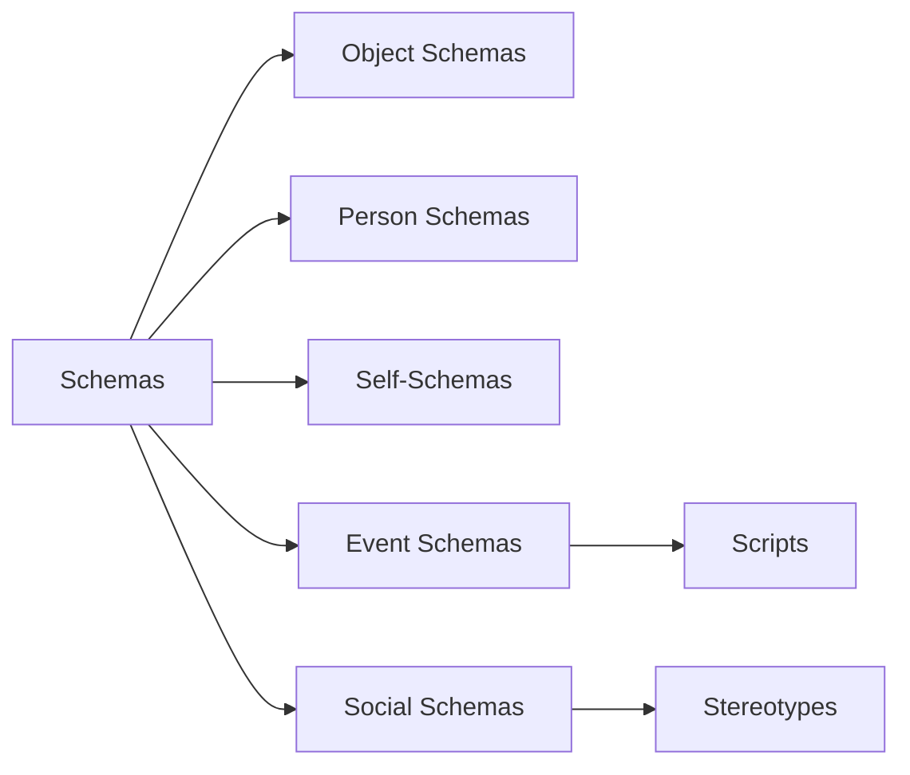
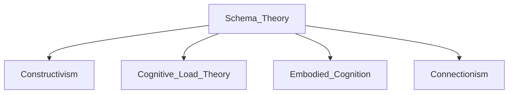

---
tags:
  schema_theory
  cognitive_psychology
  learning_frameworks
  knowledge_organization
  mental_models
aliases: [Schemas]
---

# Schemas: Cognitive Frameworks for Understanding the World

> **"Cognitive scientists think of deep learning as the ability to organize discrete pieces of knowledge into a larger schema of understanding"** - Meta & Fine (2019) as cited in Stern 

## Core Definition and Characteristics
A **schema** is a mental framework that helps us organize and interpret information. Think of it as a filing system for your brain that allows you to quickly understand new experiences by connecting them to existing knowledge structures . Schemas form through repeated experiences and create mental shortcuts for processing information efficiently.

**Key characteristics**:
-   **Dynamic and adaptable** through assimilation (adding new information) and accommodation (changing existing structures) 
-   **Influence attention and memory**: We notice schema-consistent information more readily 
-   **Can create biases**: May cause distortion of contradictory information 
-   **Operate at all knowledge levels**: From simple concepts to complex abstract ideas 

### Historical Development
 
[Piaget's Developmental Theory](https://www.youtube.com/watch?v=IhcgYgx7aAA)

| Theorist       | Contribution                                                                 | Era        |
| -------------- | ---------------------------------------------------------------------------- | ---------- |
| Frederic Bartlett | Demonstrated how schemas distort memory in "War of the Ghosts" experiment    | 1930s      |
| Jean Piaget    | Integrated schemas into cognitive development theory                         | 1920s-1970s|
| David Rumelhart | Developed modern schema theory for AI and education                          | 1980s      |

## Types of Schemas in Psychology


1.  **Event schemas (Scripts)**: Behavioral sequences for situations (e.g., restaurant script: sit → order → eat → pay) 
2.  **Self-schemas**: Beliefs about ourselves that shape identity ("I'm athletic," "I'm disorganized") 
3.  **Social schemas**: Expectations about groups and social roles (gender roles, professional expectations) 
4.  **Maladaptive schemas**: Deeply held negative self-beliefs ("I'm unlovable") that distort relationships 

## Practical Applications

### In Education

The **Wit & Wisdom** curriculum builds knowledge schemas through thematic modules. Grade 2 students studying nutrition read about digestion, community food traditions, and vegetable farming - all reinforcing the "Good Eating" schema . Teachers can activate prior knowledge with **anticipation guides** or **KWL charts** ([Printable Template](https://www.educationworld.com/tools_templates/kwl_chart_3.pdf)).

**Effective schema-building strategies**:
-   **Pre-reading activities**: Preview headings, images, and key vocabulary
-   **Analogies**: Connect new concepts to familiar experiences
-   **Concept mapping**: Visually organize relationships between ideas
-   **Spaced repetition**: Reinforce connections over multiple sessions

### In Database Design
Database schemas provide the structural blueprint for data organization. The **star schema** (denormalized) offers query efficiency, while the **snowflake schema** (normalized) reduces data redundancy .

![[https://www.ibm.com/content/dam/connectedassets-adobe-cms/worldwide-content/cdp/2.0/foundation/component/47/47dfe1e4-8f3b-487a-817e-5d9a7a4d3fcd.png|IBM Database Schema Example]]

### In Daily Life
**Schema-building habits**:
-   **Morning knowledge journaling**: Connect new learning to existing schemas
-   **Weekly relationship pattern tracking**: Identify triggered schemas ([Printable Tracker](https://www.therapistaid.com/worksheets/schema-diary))
-   **Media analysis**: Compare movie portrayals to your schemas (e.g., how "Good Will Hunting" portrays maladaptive schemas)

## Controversies and Limitations
> **"Schemas can contribute to stereotypes and make it difficult to retain new information"** - Kendra Cherry 

1.  **Reinforcement of biases**: Schemas can perpetuate stereotypes (e.g., children remembering gender-inconsistent images as consistent) 
2.  **Resistance to change**: Once established, schemas filter contradictory evidence (disconfirmation bias) 
3.  **Oversimplification risk**: May reduce complex realities to cognitive shortcuts
4.  **Cultural limitations**: Western-centric development ignores collectivist cognition patterns

## Related Concepts and Resources

### Connected Theories


**Further Exploration**:
-   **Books**: *Mind in Society* by Vygotsky (scaffolding), *The Body Keeps the Score* (embodied schemas)
-   **Movies**: *Inside Out* (mental models), *Inception* (schema manipulation)
-   **Courses**: [Coursera - Learning How to Learn](https://www.coursera.org/learn/learning-how-to-learn) (schema-building techniques)

### Free Learning Resources
| Resource Type | Description                                                                 | Link                                                                 |
| ------------- | --------------------------------------------------------------------------- | -------------------------------------------------------------------- |
| Video         | Schema Therapy Introduction                                                 | [YouTube: Schema Therapy](https://www.youtube.com/watch?v=0AzTwHrX2BE) |
| Article       | Database Schema Design Guide                                                | [IBM Database Schema Guide](https://www.ibm.com/think/topics/database-schema) |
| Tool          | Interactive Concept Mapping                                                 | [MindMup](https://www.mindmup.com/)                                  |

## Daily Schema Development Practice

```dataview
table without id file.name as Day, Schema_Focus, Activities
from "Daily Notes"
where contains(tags, "schema_practice")
sort file.name desc
limit 7
```

**Sample Routine**:
1.  **Morning (10 min)**: Review knowledge journal, identify schema connections
2.  **Midday (5 min)**: Notice schema-triggered reactions to situations
3.  **Evening (15 min)**: Record schema observations using [prompt template](https://cbtonline.com/schema-journal-prompts)

> **Key Insight**: "Schemas are active processes for solving problems, not just static frameworks" - Vygotskian perspective