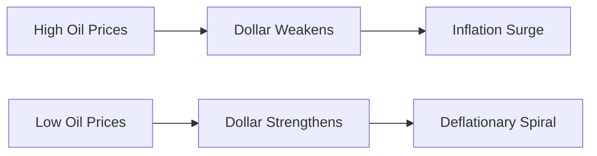

# Exchange-Based Economies: Principles, Practices, and Transitions  

> **"In a gift economy, wealth is understood as having enough to share... all flourishing is mutual."**  
> — Robin Wall Kimmerer, *Braiding Sweetgrass* 

## Introduction: Beyond Extraction  
Exchange-based economies prioritize **reciprocal value circulation** over resource depletion. Unlike extraction-based systems (e.g., colonial resource mining or shareholder-first capitalism), they operate through:  
- **Resource mutualism**: Value emerges through sharing, trading, or gifting  
- **Networked interdependence**: Participants thrive through collective well-being  
- **Regenerative design**: Transactions replenish social/ecological capital  

Historical example: The **Kula ring** among Pacific Islanders exchanged ceremonial shells to build inter-tribal trust, proving that "valuables move while relationships remain" .

  
*Market vendors exemplify direct exchange—value flows through relationships, not extraction.*  

---

## Key Theoretical Frameworks  
### 1. **Pure Exchange Economies**  
- **Definition**: Systems where agents trade existing endowments without production   
- **Mechanism**: Prices emerge via supply/demand dynamics (e.g., farmers’ markets)  
- **Pareto Optimality**: Ideal state where no one benefits without disadvantaging others  

### 2. **Gift Economies**  
- **Core Principle**: Non-quid-pro-quo giving that creates "positive debt"   
​**Reciprocity Types**: ​| **Type**         | **Time Lag** | **Value Measurement** | **Example**               |  
  |------------------|--------------|------------------------|---------------------------|  
  | Generalized      | Indefinite   | Not tracked           | Family caregiving         |  
  | Balanced         | Fixed        | Equivalent expected   | Potlatch ceremonies       |  
  | Negative         | Immediate    | Profit-maximizing     | Haggling in bazaars       |  

- **Key Insight**: Gifts carry "hau" (spirit of the giver), obligating receivers to reciprocate to maintain cosmic balance   

### 3. **Market Exchange Critiques**  
- **Strong Dollar Paradox**: While boosting import purchasing power, it devastates exporters and emerging economies   
- **Embeddedness Problem**: Markets weaken community ties by anonymizing transactions   

---

## Implementation Challenges & Debates  
### 🔄 **Scalability Issues**  
- Gift economies thrive in high-trust communities (villages, open-source teams) but struggle in urban anonymity   
- **Solution**: Digital platforms like Buy Nothing groups recreate village-scale reciprocity  

### 💰 **Currency Peg Dilemmas**  
Oil-exporting countries using **dollar pegs** face cyclical instability:  

*Norway avoided this via sovereign wealth funds and floating exchange rates*   

### ⚖️ **Exploitation Risks**  
- **Critique**: Unreciprocated giving enables free-riding   
- **Countermeasure**: Communities develop **reputation systems** (e.g., Kula traders blacklisting exploiters)  

---

## Practical Applications  
### 🌱 **Daily Habits for Exchange-Minded Living**  
1. **Reciprocity Practice**: Gift time/skills without contracts (e.g., teach free classes)  
2. **Conscious Consumption**: Buy from cooperatives using **local currencies**  
3. **Wealth Sharing**: Join **time banks** where 1 hour = 1 time-credit regardless of service type   

### 📊 Self-Assessment Tool  
```dataview  
table habit, weekly_frequency, reciprocity_score from "exchange-habits"  
where file.name = this.file.name  
```  

### 🏛️ Policy Innovations  
- **Barcelona Time Bank**: 3,000+ members exchange healthcare, tutoring, repairs  
- **Kerala’s Kudumbashree**: Women’s collective running 200,000+ micro-enterprises without external capital  

---

## Curated Learning Resources  
### 📚 Essential Readings  
1. *The Gift* by Marcel Mauss → Analyzes gift-giving as societal glue  
2. *Braiding Sweetgrass* by Robin Wall Kimmerer → Blends indigenous wisdom with ecological economics  
3. **"The Case for Exchange Rate Flexibility"** (Peterson Institute) → Technical fix for oil economies   

### 🎥 Multimedia  
- [The Gift Economy: An Alternative to Capitalism](https://www.youtube.com/watch?v=Etyhc1RQ5b4) (Documentary)  
- [Kula Ring: Circulating Power](https://www.youtube.com/watch?v=6p5P7pAXSds) (Anthropology visual essay)  
- [Open Source Revolution](https://www.youtube.com/watch?v=bwvXFlL4C4A) → How Linux models gift economics  

---

## Linked Concepts  
```mermaid  
mindmap  
  root((Exchange Economies))  
    --> Gift_Culture  
      --> Potlatch  
      --> Open_Source  
    --> Market_Exchange  
      --> Floating_Rates  
      --> Currency_Wars  
    --> Commons  
      --> Seed_Sharing_Libraries  
      --> Creative_Commons  
```  

---

> **"When the last tree is cut, the last fish eaten, the last river poisoned, you will realize you cannot eat money."**  
> — Cree Prophecy  
> **Action step**: Audit one extractive habit (e.g., Amazon reliance) and replace it with an exchange-based alternative (e.g., tool library).  
```