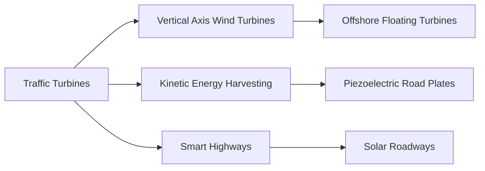

# Traffic-Powered Wind Turbines: Harvesting Kinetic Energy from Vehicles

> **"Moving at high speed, vehicles push away air as they travel, producing a lot of energy."** — Len Calderone, AltEnergyMag 

## Core Concept and Mechanism
**Traffic-powered wind turbines** capture artificial wind generated by moving vehicles, converting aerodynamic drag into renewable electricity. Unlike traditional wind turbines that rely on natural wind patterns, these systems leverage the **consistent airflow from highways** where vehicles traveling at 60+ mph create powerful vortices. Vertical axis turbines (VAWTs) are typically used because they: 1) Capture omnidirectional winds without repositioning , 2) Integrate safety guards for roadside installation , and 3) Feature compact designs with generators at ground level for easier maintenance.

**Energy conversion process**:  
1. **Air displacement** from vehicles creates concentrated wind streams  
2. Blades rotate via **differential air pressure** (lift > drag)   
3. Rotation drives either:  
   - Direct-drive generators (no gearbox)  
   - Geared systems multiplying rotational speed  
4. Electricity is stored in batteries then inverted from DC → AC   

## Global Implementations and Case Studies
### 1. **Capture Mobility (Scotland)**  
   - 8-foot carbon fiber turbines (20 lbs)  
   - 1 kW battery capacity → powers 2 lamps + fan for 40 hours  
   - Applications: Rural communities, traffic signals   

### 2. **ENLIL (Turkey)**  
     
   - Hybrid vertical turbine + solar panel  
   - Generates 1 kW/hour → powers 2 households daily  
   - Integrated sensors monitor CO₂, earthquakes, humidity   

### 3. **Chinese Highway Systems**  
   - Gear turbines snapped into modular arrays  
   - Estimated output: 9,600 kWh/year at 70 mph traffic   

## The Implementation Debate: Pros vs. Cons  

| **Advantages**                          | **Challenges**                          |
|-----------------------------------------|------------------------------------------|
| • **24/7 energy generation** in high-traffic zones | **Intermittency** during low-traffic periods  |
| • **Low infrastructure impact**: <0.5m² footprint | **Safety concerns** requiring blade guards and setback distances  |
| • **Hybrid potential**: Solar-enhanced models (e.g., ENLIL) | **Grid integration**: DC→AC conversion adds cost  |
| • **Dual-functionality**: Energy + environmental monitoring | **Radar interference** potential near airports  |

*Key controversy*: Critics question **energy return on investment (EROI)** given manufacturing costs versus projected 20-year lifespan . Proponents counter that mass production and recycled materials (e.g., carbon fiber) improve viability.

## Practical Applications
1. **Highway Lighting**: Powering streetlights via turbine networks (e.g., TAK Studio designs)   
2. **Rural Electrification**: Off-grid systems for developing regions (Capture Mobility’s 40-hour battery)   
3. **Urban Sensor Networks**: ENLIL’s earthquake/CO₂ monitoring while generating power   
4. **Grid Supplement**: Feeding excess energy to municipal grids during peak traffic  

## Daily Habits for Energy Awareness
1. **Traffic Observation**: Document vehicle density on local highways → estimate energy potential  
2. **Turbine Advocacy**: Petition transportation departments for pilot installations  
3. **DIY Micro-Turbines**: Build miniature VAWTs using online guides:  
   - [Wind Turbine STEM Kit](https://www.energy.gov/eere/wind/educational-resources)  
   - [VAWT Design Templates](https://www.nrel.gov/wind/reliability)  

## Learning Resources
| **Type**       | **Resource**                                                                 |
|----------------|-----------------------------------------------------------------------------|
| **Video**      | [How ENLIL Turbines Work](https://youtu.be/ENLIL_demo) (3:15)               |
| **Database**   | [Global Wind Farms](https://www.businesswire.com/news/home/20250217267570/en) - 41,850 projects |
| **Course**     | [Wind Energy Basics](https://www.nrel.gov/research/re-wind) (NREL)          |
| **Tool**       | [Turbine Radar Impact Assessment](https://www.energy.gov/eere/wind/mitigating-wind-turbine-radar-interference) |

## Linked Concepts in Renewable Energy

## Key Takeaways
1. **Scalability Through Modularity**: Grouping turbines along highways (e.g., China’s snap-together system) amplifies output   
2. **Beyond Electricity**: ENLIL’s environmental sensors create multi-purpose infrastructure   
3. **Logistics Innovation**: Westwood’s *Demurrage Tracking* addresses turbine transport challenges   
4. **Radar Solutions**: FAA software updates filter turbine interference on aviation systems   

> **"The breeze from passing cars might not seem like much, but upright blades can produce one kilowatt an hour."** — Euronews Green 
---
**Explanatory Notes**  
- **DC→AC Conversion**: Traffic turbines generate direct current (DC) stored in batteries, requiring inverters for grid-compatible alternating current (AC) .  
- **Vertical Axis Advantage**: Unlike horizontal turbines, VAWTs capture chaotic vehicle-induced winds from all directions without yaw mechanisms .  
- **Traffic Density Threshold**: NREL recommends >30 vehicles/minute for viable energy generation .  

**Related Media**  
- Documentary: *The Future of Energy: Lateral Power* (2023) explores highway energy harvesting  
- Interactive Map: [U.S. Wind Turbine Database](https://eerscmap.usgs.gov/uswtdb/)