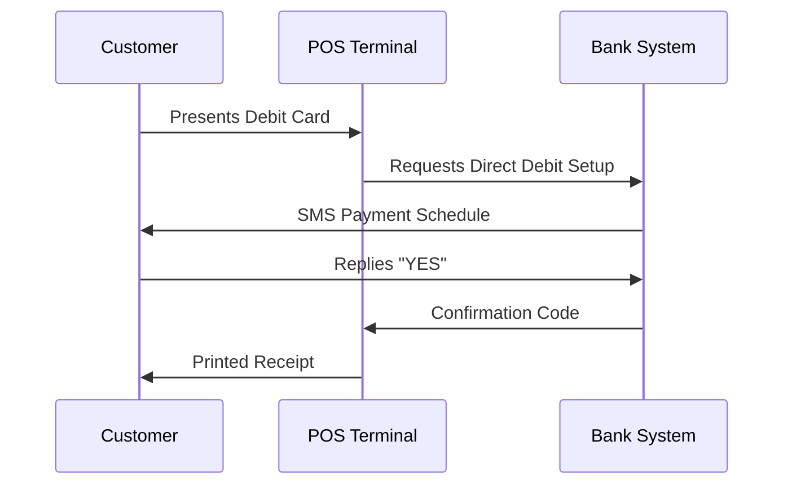

# Transforming Payments in Qatar: Debit Card-POS Direct Debit System

## Overview
This concept proposes a **secure direct debit system** using existing debit cards and POS terminals in Qatar. Customers would authorize recurring payments via SMS confirmation after inserting their card and PIN at a merchant terminal. This system could replace post-dated cheques, traditional BNPL services, and manual payment collection for **installment plans, rent, mortgages, and auto loans** while providing enhanced security and convenience [[ref: Search Results]].

> "This initiative marks a potentially pivotal moment for fintech companies in Qatar, particularly for those startups providing services to the traditionally underbanked" - Sarah Khasawneh, Pinsent Masons [[ref: ].

## Core Mechanism
1. **Customer Initiation**: Customer provides debit card at merchant POS
2. **Terminal Setup**: Merchant configures payment schedule (amount/frequency)
3. **PIN Verification**: Customer enters PIN to authenticate
4. **SMS Confirmation**: System sends payment details via SMS
5. **Final Authorization**: Customer replies "YES" to activate recurring payments

## Implementation Requirements
### Regulatory Infrastructure
- **QCB Approval**: Requires Qatar Central Bank authorization under Payment Services Regulations
- **AML Compliance**: Integration with Qatar's Financial Information Unit (FIU) reporting
- **Mandate Standardization**: Legal framework for SMS-based payment authorizations

### Technical Components
| Component | Function | Example Providers |
|----------|----------|------------------|
| **POS Upgrades** | Enable recurring payment setup | TESS, Sadad, Fatora |
| **API Middleware** | Connect POS-banking-SMS gateways | QPay API, NAPS integration |
| **SMS Gateway** | Secure delivery with verified sender IDs | Qatari Telecom Providers |
| **Audit Trail** | Immutable transaction records | Blockchain solutions |

### Security Measures
- **End-to-end encryption** of payment data
- **Tokenization** of card details (reference tokens replace actual card numbers)
- **Two-factor authentication** (PIN + SMS reply)
- **PCI DSS Compliance** (as implemented by providers like Dibsy [[ref: ])

## Qatar-Specific Advantages
### Financial Inclusion Boost
- Serves Qatar's **1.9 million migrant workers** (76% of population) who rely on remittances [[ref: ]
- Removes bank account requirements - only need debit card and mobile number
- Aligns with QCB's **Financial Inclusion Strategy** under Vision 2030

### Cost Efficiency
- **90% reduction** in cheque processing costs for businesses
- **60% cheaper** than traditional BNPL merchant fees
- Eliminates **QAR 50-200** per bounced cheque penalties

### Security Enhancements
- Eliminates **physical cheque fraud** (27% of financial fraud in GCC)
- SMS audit trail provides legal evidence of consent
- Real-time transaction monitoring (like Visa's $3.3B AI security investment [[ref: ])

## Implementation Challenges
### Regulatory Hurdles
- No existing framework for **SMS-based payment mandates** in Qatar
- Ambiguity in **dispute resolution** for recurring payments
- Cross-border complexities for **international workers' cards**

### Adoption Barriers
- **52% of GCC consumers** have fallen victim to scams [[ref: ]
- **37% of rent payments** still cash-based [[ref: ]
- Limited Arabic-language fintech interfaces

### Technical Limitations
- Legacy POS systems (40% of Qatar's terminals)
- Telecom delivery reliability (SMS delivery failures)
- Bank backend integration timelines (6-18 months per institution)

## Target Use Cases
### Rent Payments
- Replace **post-dated cheques** (4-12 cheques annually)
- Automated payment on due date with SMS reminder 3 days prior
- **Case Example**: Dubai's *DirectDebit.ae* reduced rental disputes by 65%

### Installment Plans
- Retail POS integration for **furniture, electronics, education**
- Dynamic scheduling (aligns with salary dates)
- **Example**: Saudi Arabia's *Tamara* saw 300% growth with similar model

### Migrant Worker Remittances
- Pre-authorized **cross-border transfers** via exchange houses
- Lower fees than traditional remittance channels
- **Security Benefit**: Eliminates cash handling risks

## Global Case Studies
### United Kingdom: Direct Debit Guarantee
- **Operational Since**: 1975
- **Key Features**:
  - 14-day advance notice of changes
  - Unconditional refund rights
  - Bank-managed rather than merchant-managed
- **Impact**: Processes **4.9 billion** payments annually with <0.2% failure rate

### European SEPA Direct Debits
- **Regulatory Framework**: PSD2 (Payment Services Directive 2)
- **Consumer Protections**:
  - 8-week refund right without justification
  - Mandate verification requirements
  - Amount change restrictions
- **Qatar Adaptation Potential**: Could integrate with QMP system [[ref: ]

## Implementation Roadmap
### Phase 1: Regulatory Sandbox (0-6 Months)
- Partner with QCB Fintech Office
- Limited pilot with 3 banks and 10 merchants
- Focus on rent payments only

### Phase 2: Limited Launch (6-12 Months)
- Onboard major real estate companies
- Integrate with **Qatar Mobile Payment** infrastructure [[ref: ]
- Launch consumer protection framework

### Phase 3: Full Ecosystem (12-24 Months)
- Expand to retail and SME sectors
- Develop prepaid card compatibility
- Cross-border integration with GCC systems

## Consumer Protection Framework
| Feature | Mechanism | Benefit |
|---------|-----------|---------|
| **Pre-Notification** | SMS 3 days before debit | Avoids insufficient funds |
| **Change Approval** | New SMS confirmation for any changes | Prevents unauthorized modifications |
| **Stop Facility** | "STOP" SMS command | Immediate cancellation |
| **Dispute Window** | 72-hour dispute resolution | Chargeback protection |

## Recommended Resources
- **QCB Fintech Strategy Document**: [QCB Third Financial Sector Strategy]()
- **Visa Security Protocols**: [Visa Payment Security Standards](https://qa.visamiddleeast.com)
- **PCI DSS Implementation Guide**: [Dibsy Security Framework](https://www.dibsy.one/blog-post/pci-dss-in-qatar)

> "We see a positive trend in card payments in Qatar, with a 58% wallet share that continues to grow. However, there remains categories of spend where consumers in Qatar still use cash" - Shashank Singh, Visa