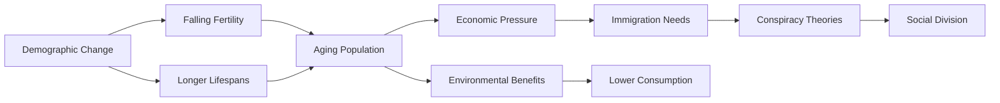

# Demographic Replacement: Myths, Realities, and Societal Impacts  

> **Demographic replacement** describes two distinct concepts:  
> 1. **Conspiracy Theory**: False claim that elites intentionally replace white populations with non-white immigrants   
> 2. **Demographic Reality**: Natural population changes due to falling birth rates and aging societies   

## Core Concepts Explained  

### The Conspiracy Theory  
- **Origin**: Popularized by French writer Renaud Camus' 2011 book *Le Grand Remplacement*, claiming Muslim immigrants seek to destroy European culture .  
- **Modern Spread**: Adopted by white supremacists (e.g., Buffalo shooter's manifesto) and mainstream figures like Tucker Carlson, who claims Democrats import "obedient voters from the Third World" .  
- **False Premise**: Assumes coordinated plot by Jews/liberals to replace white populations through immigration policies .  

### Actual Demographic Shifts  
- **Fertility Decline**: 2/3 of humanity lives in countries with birth rates below replacement level (2.1 children per woman). Germany's fertility rate has been below replacement since 1970s .  
- **Aging Populations**: By 2100, populations in major economies will decline 20-50%. Seniors will comprise 25% of global consumption by 2050 (double 1997's share) .  
- **Immigration's Role**: Maintains workforce as working-age populations shrink. Without immigration, U.S. working-age population would shrink 4% by 2035 .  

  
*Changing U.S. age structure (1980-2060) showing aging population* [Source: Pew Research]

---

## Key Insights and Debates  

### Issues with Conspiracy Theory  
- **Historical Roots**: Echoes Nazi ideology (William Pierce's *The Turner Diaries*) and 19th-century nativism against Irish/German Catholics .  
- **Violent Consequences**: Motivated mass shootings in Buffalo, El Paso, and Christchurch .  
- **Factual Errors**:  
  - White population decline occurs regardless of immigration (due to aging/low birth rates)  
  - Immigrants boost economies by supporting retirement systems   

### Real Demographic Challenges  
- **Economic Pressure**:  
  - Germany: 0.8 workers per retiree today → 0.6 by 2040   
  - U.S.: 27 seniors/100 workers today → 37/100 by 2050 even with immigration   
- **Environmental Benefits**: Older populations consume less, reducing CO2 emissions .  
- **Opportunities**:  
  - Increased intergenerational wealth transfers  
  - Gender equality improvements as women stay in workforce longer   

---

### Practical Applications  

#### Daily Demographic Literacy  
| **Habit**               | **Action**                                  | **Resource**                                  |  
|--------------------------|---------------------------------------------|----------------------------------------------|  
| Media Analysis           | Identify replacement theory rhetoric        | [ADL Hate Symbols Database](https://www.adl.org/resources/hate-symbols) |  
| Demographic Tracking     | Follow @UN_Population on Twitter            | [UN Population Division](https://twitter.com/UN_Population) |  
| Intergenerational Exchange | Monthly conversation with older/younger relative | [Conversation Starters](https://www.generationsunited.org/) |  

#### Community Engagement  
- **Activity**: Map local demographic shifts using Census data  
- **Objective**: Compare actual data vs. perceived changes  
- **Tool**: [Census Data Mapper](https://gis-portal.data.census.gov/)  

---

## Notable Quotes Explained  

> **"You have one people, and in the space of a generation, you have a different people"**  
> – Renaud Camus   
> *Meaning:* Foundation of replacement theory. Ignores natural demographic evolution and cultural integration.  

> **"We deserve our entitlements, but someone has to carry the load"**  
> – Demographer Dowell Myers   
> *Meaning:* Acknowledges tension between retirement benefits and shrinking workforces.  

---

## Connections to Other Concepts  

### Related Theories  
- **Thucydides Trap**: Historical pattern where rising powers challenge established ones, leading to conflict. Similar to "status threat" dynamics in replacement theory .  
- **Demographic Dividend**: Economic growth potential when working-age populations peak (opposite of current Western trends) .  

### Media Representations  
| **Format** | **Title**                          | **Key Perspective**                     |  
|------------|------------------------------------|-----------------------------------------|  
| Documentary | *Replacement* (2021)               | Examines conspiracy theory's spread    |  
| Podcast    | "The Great Replacement" (NYT Audio) | Investigates Buffalo shooter's motives |  
| Novel      | *The Turner Diaries* (1978)        | Nazi-inspired "race war" fiction       |  

---

## Critical Resources  

### Essential Reading  
1. [Le Grand Remplacement](https://archive.org/details/le-grand-remplacement) (Renaud Camus, 2011)  
   - Original conspiracy text  
2. [Empty Planet](https://www.penguinrandomhouse.com/books/232031/empty-planet-by-darrell-bricker-and-john-ibbitson/) (Bricker & Ibbitson, 2019)  
   - Research on global fertility decline  

### Data Tools  
- [UN Population Dashboard](https://population.un.org/wpp/)  
- [Global Fertility Tracker](https://www.prb.org/world-population-trends/)  

> ✏️ **Daily Reflection Prompt**  
> *Where have I encountered "replacement" rhetoric today? How did actual local demographics compare?*

📅 **Weekly Demographic Journal**  
| Date       | Observed Demographic Change | Media Narrative |  
|------------|------------------------------|-----------------|  
| 2025-06-23 | School diversity increased   | "Neighborhood transformed" |  

---

## Visual Summary  

*Interconnected impacts of demographic shifts*