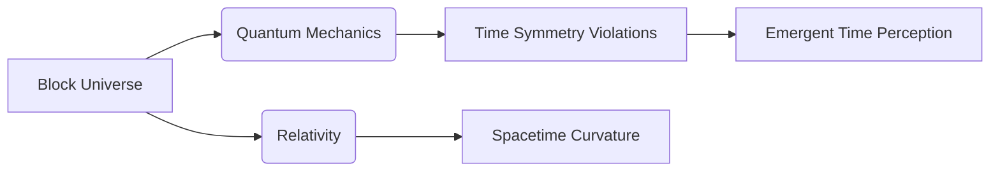

# The Block Universe: A Multidimensional Exploration

  
*Visual representation of 4D spacetime merging past/present/future [Wikimedia Commons]*

## Key Properties
- **Type**: Metaphysical/physical model of time  
- **Core Thesis**: All moments in time (past/present/future) coexist equally in a 4D "block" 
- **Contrasts With**: 
  - Growing Block Universe (only past/present exist) 
  - Presentism (only "now" exists)
  - Sequential Time Models

```dataview
TABLE WITHOUT ID
  file.link AS "Related Concepts",
  tags AS "Tags"
FROM #relativity OR #philosophy
SORT file.name
```

## Learning Objectives
1. **Conceptual**: Understand block universe as spacetime unification in relativity 
2. **Comparative**: Contrast with growing block/presentist models 
3. **Philosophical**: Analyze implications for free will/determinism 
4. **Scientific**: Connect to quantum mechanics' time symmetry violations 
5. **Pedagogical**: Develop teaching strategies for abstract temporal concepts 

---

## Core Activities & Resources

### 1. Conceptual Foundations
- **Interactive Simulation**: [PhET Spacetime Simulator](https://phet.colorado.edu/sims/html/gravity-and-orbits/latest/gravity-and-orbits_en.html)  
- **Video Resource**: [PBS Space Time: Is the Future Already Determined?](https://www.youtube.com/watch?v=nym1XFsoA6w)  
- **Reading**: [Stanford Encyclopedia of Philosophy: Time](https://plato.stanford.edu/entries/time/)

> [!NOTE] Thought Experiment  
> *"If you traveled at near-light speed to Alpha Centauri, Earth's timeline would continue aging normally while yours slows - both realities coexist in the block."* 

### 2. Comparative Analysis Activity
| Theory              | Past Exists? | Present Exists? | Future Exists? | Key Proponents          |
|---------------------|--------------|-----------------|----------------|-------------------------|
| Block Universe      | Yes          | Yes             | Yes            | Einstein, Minkowski  |
| Growing Block       | Yes          | Yes             | No             | C.D. Broad  |
| Presentism          | No           | Yes             | No             | Arthur Prior            |

**[Download Comparison Chart](https://edublocks.org/static/media/Time_Theories_Comparison.pdf)**

### 3. Quantum Connections
- **Video Lecture**: [Quantum Time Symmetry Violations](https://www.youtube.com/embed/Qt0vZ2DRaXg)  
- **Simulation Tool**: [Quantum Time Evolution Sandbox](https://quantum-computing.ibm.com/composer)



---

## Assessment Strategies 

### Formative Assessments
1. **Spacetime Journaling**: Daily reflections connecting personal experiences to block theory  
2. **Peer Debates**: "Can free will exist in a predetermined block?"  
3. **Concept Mapping**: Visualize relationships between time theories

### Summative Project
**4D Universe Model**  
- *Task*: Create interactive timeline showing coexisting events  
- *Tools*: [EduBlocks Timeline Builder](https://edublocks.org/projects/timeline)  
- *Criteria*:  
  - Accuracy of relativistic principles   
  - Integration of quantum time concepts  
  - Philosophical coherence 

**[Rubric Template](https://www.cmu.edu/teaching/assessment/examples/courselevel-bycollege/engineering/rubric-timeline.pdf)**

---

## Pedagogical Connections
- **Block Teaching Methods**: Intensive single-topic immersion   
- **STEM Integration**: Use building blocks to model spacetime layers   
- **Metacognitive Development**: Reflective assessments on time perception 

```dataview
LIST FROM #pedagogy AND #physics
```

---

## Controversies & Open Questions
1. **Temporal Experience Paradox**: Why do we perceive time flow if all moments exist? 
2. **Quantum Measurement Problem**: How do observations "collapse" reality in a fixed block? 
3. **Ethical Implications**: Moral responsibility in predetermined universe

> [!WARNING] Common Misconceptions  
> *"The block universe eliminates free will"* - While events are fixed geometrically, conscious agents still experience decision-making processes within their worldline .

---

## Extended Resources
- **YouTube Playlist**: [Time Philosophy Essentials](https://www.youtube.com/playlist?list=PLPOW4yzC55NkZ83EKx1kEOIGaapNtGG4u) 
- **Academic Paper**: [Quantum Theory of Time](https://www.ncbi.nlm.nih.gov/pmc/articles/PMC5990663/) 
- **Lesson Plans**: [Block Universe Teaching Kit](http://placeintheuniverse.weebly.com/assessment.html) 

```button
name Explore Timeline Simulations
type link
action https://edublocks.org/projects
```