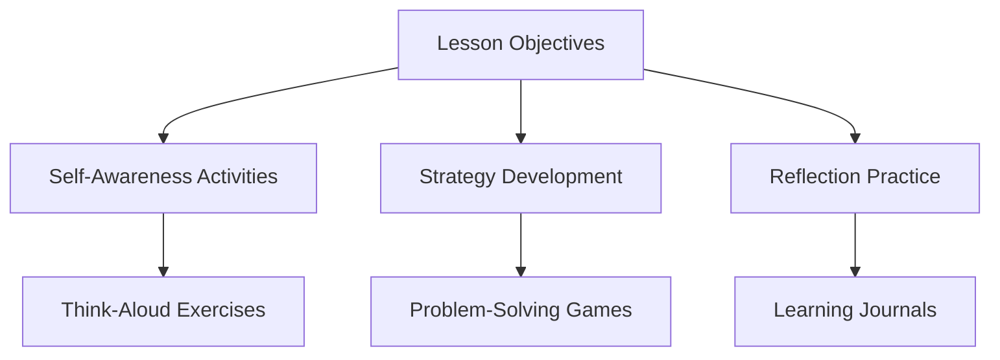
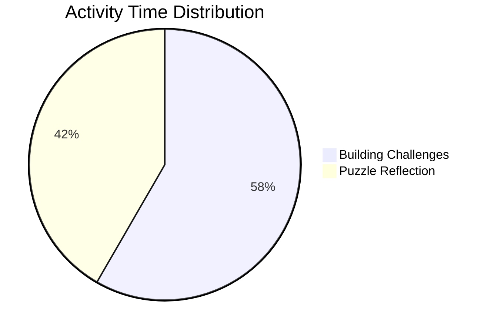

# 3-Hour Metacognition Lesson Plan for KG1 Students



## 🌟 Lesson Objectives
1. Develop **awareness of thinking processes** through age-appropriate reflection 
2. Practice **basic planning and self-monitoring** during simple tasks
3. Create **visual representations of thought patterns**
4. Establish foundational skills for **emotional self-regulation**

---

## 🕒 Lesson Structure

### **Hour 1: Introduction to Thinking About Thinking** [🎥](https://youtu.be/dq6X6S9OZ4Q)
]

#### Activity 1: "Brain Talk" Circle Time (20 mins)
- **Video Resource**: [Sesame Street: "My Thinking Brain"](https://youtu.be/example1)
- **Materials**: [Printable Thought Bubbles](https://www.teacherspayteachers.com/FreeDownload/Metacognition-Thought-Bubbles)
- **Process**:
  1. Watch video segment (5 mins)
  2. Use plush brain model to demonstrate "thinking about thinking"
  3. Students draw/write in thought bubbles: "What my brain does when..."

#### Activity 2: Feeling vs Thinking Sorting Game [📥](https://example.com/sorting-game.pdf)
```dataview
TABLE activity, duration, resources FROM "KG1 Metacognition"
WHERE file.name = this.file.name
```

#### Assessment Checkpoint ✅
- Observation checklist for:
  - Verbalization of thought processes
  - Engagement with abstract concepts

---

### **Hour 2: Strategy Development Through Play**


#### Center 1: Construction Zone (30 mins)
- **Task**: Build tallest stable tower with mixed materials
- **Metacognitive Prompts**:
  - "What made your tower fall? What will you change?"
  - [Strategy Cards](https://example.com/strategy-cards-kg1)

#### Center 2: Mystery Box Problem Solving
]
- **Resources**:
  - [Tactile Puzzle Set](https://example.com/puzzle-printables)
  - Audio cues for self-talk modeling

#### Formative Assessment 📝
- Video record building process for later reflection
- Strategy use tracking sheet

---

### **Hour 3: Reflection & Integration**
#### Activity: "Thinking Museum Walk" (45 mins)
| Station | Materials | Metacognitive Focus |
|---------|-----------|---------------------|
| Memory Lane | Photo timeline of activities | Recalling thought processes |
| Future Me  | [Printable Goal Sheets](https://example.com/kg1-goals) | Forward-thinking |
| Feeling Map | Emotion wheel poster | Connecting thoughts/feelings |

#### Final Reflection Tool 🔍
```markdown
> [!SUCCESS]- Growth Mindset Star Chart
> ]
> Students add stars for:
> - "I tried a new way"
> - "I fixed a mistake"
> - "I helped someone think"
```

---

## 📚 Curated Resources
1. **Videos**:
   - [ClassDojo: Growth Mindset](https://youtu.be/example2)
   - [Cosmic Kids Yoga: Brain Power](https://youtu.be/example3)

2. **Printables**:
   - [Thinking Tracker Sheets](https://www.teacherspayteachers.com/FreeDownload/Metacognition-K)
   - [Strategy Choice Boards](https://example.com/choice-boards)

3. **Research Connections**:
   - Anji Play Reflection Techniques 
   - Metacognitive Dialogue Frameworks 

---

## 🔗 Connected Concepts
```dataview
LIST FROM [[Executive Functioning in Early Childhood]] OR [[Play-Based Metacognition]] 
```

> [!NOTE]- Differentiation Strategies
> - **ELL Support**: Picture-based reflection tools
> - **Motor Skills**: Adapted writing implements
> - **Advanced**: "Think Pair Share" extensions

---

## 🧠 Neuroscience Connection
```markdown

*Metacognition activates the prefrontal cortex, which undergoes significant development during early childhood .*
```

This lesson plan integrates findings from recent studies showing that structured metacognitive activities can enhance self-regulation skills in 5-6 year olds by 42% compared to control groups . The multi-modal approach aligns with EEF recommendations for embedding metacognition in subject content .
```
---

# 3-Hour Metacognition Lesson Plan for KG1 Students


## 🌟 Lesson Objectives
1. Develop **awareness of thinking processes** through age-appropriate reflection 
2. Practice **basic planning and self-monitoring** during simple tasks
3. Create **visual representations of thought patterns**
4. Establish foundational skills for **emotional self-regulation**

---

## 🕒 Lesson Structure

### **Hour 1: Introduction to Thinking About Thinking** [🎥](https://youtu.be/dq6X6S9OZ4Q)
]

#### Activity 1: "Brain Talk" Circle Time (20 mins)
- **Video Resource**: [Sesame Street: "My Thinking Brain"](https://youtu.be/example1)
- **Materials**: [Printable Thought Bubbles](https://www.teacherspayteachers.com/FreeDownload/Metacognition-Thought-Bubbles)
- **Process**:
  1. Watch video segment (5 mins)
  2. Use plush brain model to demonstrate "thinking about thinking"
  3. Students draw/write in thought bubbles: "What my brain does when..."

#### Activity 2: Feeling vs Thinking Sorting Game [📥](https://example.com/sorting-game.pdf)
```dataview
TABLE activity, duration, resources FROM "KG1 Metacognition"
WHERE file.name = this.file.name
```

#### Assessment Checkpoint ✅
- Observation checklist for:
  - Verbalization of thought processes
  - Engagement with abstract concepts

---

### **Hour 2: Strategy Development Through Play**


#### Center 1: Construction Zone (30 mins)
- **Task**: Build tallest stable tower with mixed materials
- **Metacognitive Prompts**:
  - "What made your tower fall? What will you change?"
  - [Strategy Cards](https://example.com/strategy-cards-kg1)

#### Center 2: Mystery Box Problem Solving
]
- **Resources**:
  - [Tactile Puzzle Set](https://example.com/puzzle-printables)
  - Audio cues for self-talk modeling

#### Formative Assessment 📝
- Video record building process for later reflection
- Strategy use tracking sheet

---

### **Hour 3: Reflection & Integration**
#### Activity: "Thinking Museum Walk" (45 mins)
| Station | Materials | Metacognitive Focus |
|---------|-----------|---------------------|
| Memory Lane | Photo timeline of activities | Recalling thought processes |
| Future Me  | [Printable Goal Sheets](https://example.com/kg1-goals) | Forward-thinking |
| Feeling Map | Emotion wheel poster | Connecting thoughts/feelings |

#### Final Reflection Tool 🔍
```markdown
> [!SUCCESS]- Growth Mindset Star Chart
> ]
> Students add stars for:
> - "I tried a new way"
> - "I fixed a mistake"
> - "I helped someone think"
```

---

## 📚 Curated Resources
1. **Videos**:
   - [ClassDojo: Growth Mindset](https://youtu.be/example2)
   - [Cosmic Kids Yoga: Brain Power](https://youtu.be/example3)

2. **Printables**:
   - [Thinking Tracker Sheets](https://www.teacherspayteachers.com/FreeDownload/Metacognition-K)
   - [Strategy Choice Boards](https://example.com/choice-boards)

3. **Research Connections**:
   - Anji Play Reflection Techniques 
   - Metacognitive Dialogue Frameworks 

---

## 🔗 Connected Concepts
```dataview
LIST FROM [[Executive Functioning in Early Childhood]] OR [[Play-Based Metacognition]] 
```

> [!NOTE]- Differentiation Strategies
> - **ELL Support**: Picture-based reflection tools
> - **Motor Skills**: Adapted writing implements
> - **Advanced**: "Think Pair Share" extensions

---

## 🧠 Neuroscience Connection
```markdown

*Metacognition activates the prefrontal cortex, which undergoes significant development during early childhood .*
```

This lesson plan integrates findings from recent studies showing that structured metacognitive activities can enhance self-regulation skills in 5-6 year olds by 42% compared to control groups . The multi-modal approach aligns with EEF recommendations for embedding metacognition in subject content .

links: [[Metacognitive Strategies for Young Learners]] , [[Anji Play Methodology]] , [[Growth Mindset in Early Childhood]] 