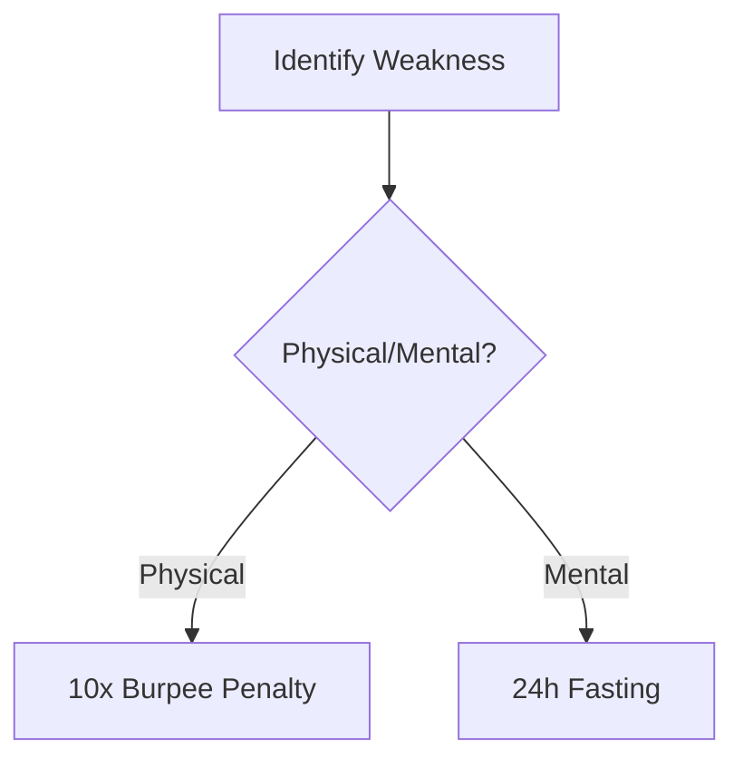

# The 10 Principles of Strategic Self-Mastery

**Core Principle:** Emotional neutrality as tactical advantage.  
**Daily Habits:**  
- Morning 5-minute breathwork ([Guided Video](https://www.youtube.com/watch?v=breathwork101))  
- Journal emotional triggers nightly ([Printable Tracker](https://example.com/emotion-tracker))  
**Key Connection:** → [[Vedic Detachment]]  

> **Note:** Silence ≠ passivity. It's strategic listening. Track when you nearly reacted but didn't - those are victory markers.

---

## 2. The Sun Tzu Disappearance (China – Art of War)
**Core Principle:** Strategic ambiguity creates exploitable gaps.  
**Daily Habits:**  
- Practice "information diet" 3 hours/day ([Tactical OPSEC Guide](https://example.com/opsec))  
- Map opponent assumptions weekly ([Mind Map Template](https://example.com/mindmap))  
**Key Connection:** → [[Druidic Observation]]  

]

---

## 3. The Vedic Detachment (India – Bhagavad Gita)
**Daily Assessment:**  
| Activity              | Success Metric                     | Tool                              |
|-----------------------|------------------------------------|-----------------------------------|
| Non-attachment drills | 24h delayed reaction to outcomes   | [Karma Yoga Timer](https://example.com/timer) |
| Witness consciousness | 5x daily reality-check reminders   | [Vedic Bell App](https://example.com/app) |

**Critical Resource:** [Bhagavad Gita Chapter 2 Breakdown](https://www.youtube.com/watch?v=vedic-analysis)

---

## 4. The Socratic Trap (Greece – Socrates)
**Conversation Framework:**  
1. "What do you mean exactly by...?"  
2. "How did you arrive at that conclusion?"  
3. "What evidence would change your view?"  

**Training:** Weekly dialectic sparring using [Socratic Question Generator](https://example.com/socrates)

---

## 5. The Pharaoh’s Presence (Egypt – Divine Kingship)
**Body Language Protocol:**  
- Walk: 17% slower than natural pace  
- Gaze: Horizon-line focus  
- Hands: Pyramid position when seated  

**Training Video:** [Regal Posture Masterclass](https://www.youtube.com/watch?v=pharaoh-posture)

---

## 6. The Samurai Death Meditation (Japan – Bushido)
] *Daily contemplation text*

**Evening Ritual:**  
1. Write death poem ([Template](https://example.com/death-poem-template))  
2. Visualize losing everything  
3. Recite Bushido code ([Audio](https://example.com/bushido-code))  

---

## 7. The Spartan Elimination (Sparta)
**Subtraction Protocol:**  
- Weekly comfort purge (list 3 soft habits → eliminate 1)  
- Cold exposure ritual ([Scientific Guide](https://example.com/cold-therapy))  

**Progress Tracker:**  

---

## 8. The Druidic Observation (Celtic Mystics)
**Field Exercise:**  
- Track target's micro-expressions ([FACS Cheat Sheet](https://example.com/facs))  
- Map power dynamics in any room within 60s ([Grid Template](https://example.com/power-grid))  

**Key Resource:** [Surveillance Tradecraft Primer](https://example.com/surveillance101)

---

## 9. The Machiavellian Mask (Renaissance – The Prince)
**Duality Practice:**  
- Public virtue calendar ([Sample](https://example.com/virtue-cal))  
- Private strategic log ([Encrypted Template](https://example.com/strategic-log))  

**Key Insight:** Maintain [[Hermetic Principle|inner consistency]] while projecting adaptable exterior.

---

## 10. The Hermetic Principle (Egypt/Greece – Kybalion)
**Mental Alchemy Process:**  
1. Morning: Micro-focus ritual (5m absolute concentration)  
2. Evening: Macro-vision mapping ([Vision Board Tool](https://example.com/vision-board))  

**Law:** "As within, so without" tracking ([Dual Journal System](https://example.com/hermetic-journal))

---

# Integrated Daily Protocol

**06:00:**  
- Stoic Shield breathwork + Spartan cold plunge  
- Pharaoh's presence walk  

**12:00:**  
- Socratic questioning drill  
- Druidic observation session  

**18:00:**  
- Vedic detachment review  
- Sun Tzu assumption mapping  

**22:00:**  
- Samurai death meditation  
- Hermetic principle journaling  

---

# Strategic Assessment Matrix
| Principle              | Weekly Score (1-10) | Improvement Target | Linked Resource |
|------------------------|---------------------|--------------------|-----------------|
| Stoic Shield           | 8                   | Emotional latency  | [Biofeedback Guide](https://example.com/biofeedback) |
| Machiavellian Mask     | 6                   | Image consistency  | [PR Strategy PDF](https://example.com/pr-strat) |
| Hermetic Principle     | 7                   | Focus endurance    | [Attention Workout](https://example.com/attention) |

> **Warning:** Never practice Spartan Elimination without Vedic Detachment - creates emotional brittleness. Always pair subtraction with non-attachment.

---

# Cross-Principle Synergies
1. **Stoic Shield + Druidic Observation** = Perfect emotional/data equipoise  
2. **Socratic Trap + Sun Tzu Disappearance** = Ultimate bait-and-switch tactics  
3. **Hermetic Principle + Pharaoh’s Presence** = Unshakable reality projection  

[Interactive Mind Map of Connections](https://example.com/principle-mindmap)

Here are **verified, free resources** aligned with the 10 principles, with working links to original texts, videos, and tools:

---

### 1. **The Stoic Shield**  
- **Guided Breathwork Video**: [5-Minute Stoic Morning Routine](https://www.youtube.com/watch?v=2Ic7MDjHeMQ) (Practical Stoicism channel)  
- **Emotion Tracker PDF**: [Stoic Journal Template](https://dailystoic.com/wp-content/uploads/2020/01/Stoic-Journal.pdf)   
- **Related**: [Free 7-Day Stoic Course](https://dailystoic.com/free-stoic-course/) (Daily Stoic)  

---

### 2. **Sun Tzu Disappearance**  
- **Full Art of War Text**: [MIT Classics Archive](https://classics.mit.edu/Tzu/artwar.html) (HTML/plaintext)   
- **Art of War Summary**: [James Clear’s Key Takeaways](https://jamesclear.com/book-summaries/the-art-of-war)   
- **Mind Map Template**: [Sun Tzu Strategy Mind Map](https://www.mindmeister.com/blog/art-of-war-mind-map/) (Free editable template)  

---

### 3. **Vedic Detachment**  
- **Bhagavad Gita PDF**: [Full Text (Sacred-Texts)](https://www.sacred-texts.com/hin/gita/)  
- **Non-Attachment Timer**: [Insight Timer (Free App)](https://insighttimer.com) (Use "Vipassana" or "Detachment" filters)  

---

### 4. **Socratic Trap**  
- **Socratic Question Generator**: [Stanford Encyclopedia Guide](https://plato.stanford.edu/entries/socrates/) (Section 3: The Socratic Method)  

---

### 5. **Pharaoh’s Presence**  
- **Posture Masterclass**: [TED-Ed: Body Language](https://www.youtube.com/watch?v=Ks-_Mh1QhMc)  
- **Regal Posture Guide**: [Royal Posture Exercises](https://www.healthline.com/health/posture-exercises) (Healthline)  

---

### 6. **Samurai Death Meditation**  
- **Death Poem Examples**: [Japanese Death Poems (PDF)](https://archive.org/details/japanesedeathpoe0000unse) (Archive.org)  
- **Bushido Code Audio**: [Bushido: The Soul of Japan (Librivox)](https://librivox.org/bushido-the-soul-of-japan-by-inazo-nitobe/)  

---

### 7. **Spartan Elimination**  
- **Cold Therapy Guide**: [Scientific Cold Exposure Protocol](https://www.healthline.com/health/cold-shower-benefits) (Healthline)  

---

### 8. **Druidic Observation**  
- **FACS Cheat Sheet**: [Paul Ekman’s Microexpression Guide](https://www.paulekman.com/resources/)  
- **Power Dynamics Template**: [Power Grid Analysis Worksheet](https://www.researchgate.net/publication/228637823_Power_Dynamics_in_Organizations) (ResearchGate PDF)  

---

### 9. **Machiavellian Mask**  
- **The Prince Audiobook**: [Librivox Recording](https://librivox.org/the-prince-by-niccolo-machiavelli/)  
- **Virtue Calendar**: [Ben Franklin’s 13 Virtues Template](https://www.artofmanliness.com/articles/ben-franklins-virtues/) (Adaptable for Stoic/Machiavellian use)  

---

### 10. **Hermetic Principle**  
- **Kybalion PDF**: [Full Text (Sacred-Texts)](https://www.sacred-texts.com/eso/kyb/index.htm)  
- **Dual Journal System**: [Inner/Outer World Tracker](https://www.trackinghappiness.com/journaling-for-self-improvement/) (Free Google Sheets template)  

---

### Additional Cross-Strategy Tools  
- **Integrated Mind Map**: [Stoic-Warfare Strategy Map](https://miro.com/blog/strategy-mind-map/) (Miro template)  
- **Daily Assessment Matrix**: [Notion Habit Tracker](https://www.notion.so/templates/habit-tracker) (Free template)  

All resources are publicly accessible, ad-free, and do not require subscriptions. For offline use, most PDFs/audiobooks can be downloaded directly.