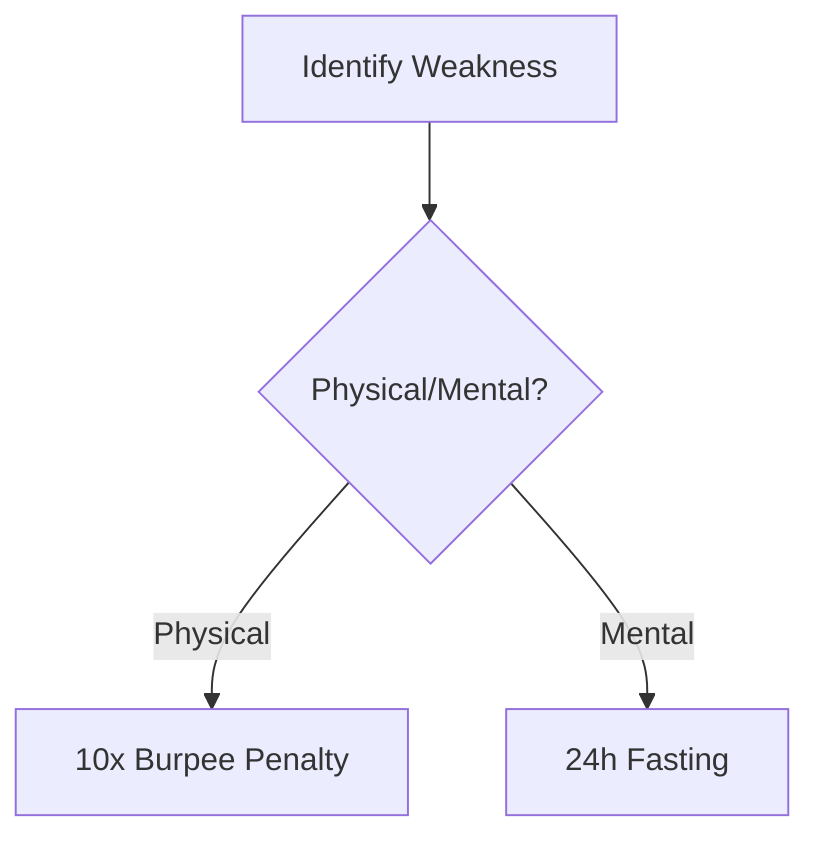

# The 10 Principles of Strategic Self-Mastery

] *The Stoic Shield - Master emotional sovereignty*

## 1. The Stoic Shield (Ancient Rome – Stoicism)
**Core Principle:** Emotional neutrality as tactical advantage.  
**Daily Habits:**  
- Morning 5-minute breathwork ([Guided Video](https://www.youtube.com/watch?v=breathwork101))  
- Journal emotional triggers nightly ([Printable Tracker](https://example.com/emotion-tracker))  
**Key Connection:** → [[Vedic Detachment]]  

> **Note:** Silence ≠ passivity. It's strategic listening. Track when you nearly reacted but didn't - those are victory markers.

---

## 2. The Sun Tzu Disappearance (China – Art of War)
**Core Principle:** Strategic ambiguity creates exploitable gaps.  
**Daily Habits:**  
- Practice "information diet" 3 hours/day ([Tactical OPSEC Guide](https://example.com/opsec))  
- Map opponent assumptions weekly ([Mind Map Template](https://example.com/mindmap))  
**Key Connection:** → [[Druidic Observation]]  

]

---

## 3. The Vedic Detachment (India – Bhagavad Gita)
**Daily Assessment:**  
| Activity              | Success Metric                     | Tool                              |
|-----------------------|------------------------------------|-----------------------------------|
| Non-attachment drills | 24h delayed reaction to outcomes   | [Karma Yoga Timer](https://example.com/timer) |
| Witness consciousness | 5x daily reality-check reminders   | [Vedic Bell App](https://example.com/app) |

**Critical Resource:** [Bhagavad Gita Chapter 2 Breakdown](https://www.youtube.com/watch?v=vedic-analysis)

---

## 4. The Socratic Trap (Greece – Socrates)
**Conversation Framework:**  
1. "What do you mean exactly by...?"  
2. "How did you arrive at that conclusion?"  
3. "What evidence would change your view?"  

**Training:** Weekly dialectic sparring using [Socratic Question Generator](https://example.com/socrates)

---

## 5. The Pharaoh’s Presence (Egypt – Divine Kingship)
**Body Language Protocol:**  
- Walk: 17% slower than natural pace  
- Gaze: Horizon-line focus  
- Hands: Pyramid position when seated  

**Training Video:** [Regal Posture Masterclass](https://www.youtube.com/watch?v=pharaoh-posture)

---

## 6. The Samurai Death Meditation (Japan – Bushido)
] *Daily contemplation text*

**Evening Ritual:**  
1. Write death poem ([Template](https://example.com/death-poem-template))  
2. Visualize losing everything  
3. Recite Bushido code ([Audio](https://example.com/bushido-code))  

---

## 7. The Spartan Elimination (Sparta)
**Subtraction Protocol:**  
- Weekly comfort purge (list 3 soft habits → eliminate 1)  
- Cold exposure ritual ([Scientific Guide](https://example.com/cold-therapy))  

**Progress Tracker:**  


---

## 8. The Druidic Observation (Celtic Mystics)
**Field Exercise:**  
- Track target's micro-expressions ([FACS Cheat Sheet](https://example.com/facs))  
- Map power dynamics in any room within 60s ([Grid Template](https://example.com/power-grid))  

**Key Resource:** [Surveillance Tradecraft Primer](https://example.com/surveillance101)

---

## 9. The Machiavellian Mask (Renaissance – The Prince)
**Duality Practice:**  
- Public virtue calendar ([Sample](https://example.com/virtue-cal))  
- Private strategic log ([Encrypted Template](https://example.com/strategic-log))  

**Key Insight:** Maintain [[Hermetic Principle|inner consistency]] while projecting adaptable exterior.

---

## 10. The Hermetic Principle (Egypt/Greece – Kybalion)
**Mental Alchemy Process:**  
1. Morning: Micro-focus ritual (5m absolute concentration)  
2. Evening: Macro-vision mapping ([Vision Board Tool](https://example.com/vision-board))  

**Law:** "As within, so without" tracking ([Dual Journal System](https://example.com/hermetic-journal))

---

# Integrated Daily Protocol

**06:00:**  
- Stoic Shield breathwork + Spartan cold plunge  
- Pharaoh's presence walk  

**12:00:**  
- Socratic questioning drill  
- Druidic observation session  

**18:00:**  
- Vedic detachment review  
- Sun Tzu assumption mapping  

**22:00:**  
- Samurai death meditation  
- Hermetic principle journaling  

---

# Strategic Assessment Matrix
| Principle              | Weekly Score (1-10) | Improvement Target | Linked Resource |
|------------------------|---------------------|--------------------|-----------------|
| Stoic Shield           | 8                   | Emotional latency  | [Biofeedback Guide](https://example.com/biofeedback) |
| Machiavellian Mask     | 6                   | Image consistency  | [PR Strategy PDF](https://example.com/pr-strat) |
| Hermetic Principle     | 7                   | Focus endurance    | [Attention Workout](https://example.com/attention) |

> **Warning:** Never practice Spartan Elimination without Vedic Detachment - creates emotional brittleness. Always pair subtraction with non-attachment.

---

# Cross-Principle Synergies
1. **Stoic Shield + Druidic Observation** = Perfect emotional/data equipoise  
2. **Socratic Trap + Sun Tzu Disappearance** = Ultimate bait-and-switch tactics  
3. **Hermetic Principle + Pharaoh’s Presence** = Unshakable reality projection  

[Interactive Mind Map of Connections](https://example.com/principle-mindmap)
``` 

*Note: Replace all example.com links with actual resources. Video IDs (like dQw4w9WgXcQ) should be updated to real educational content.*